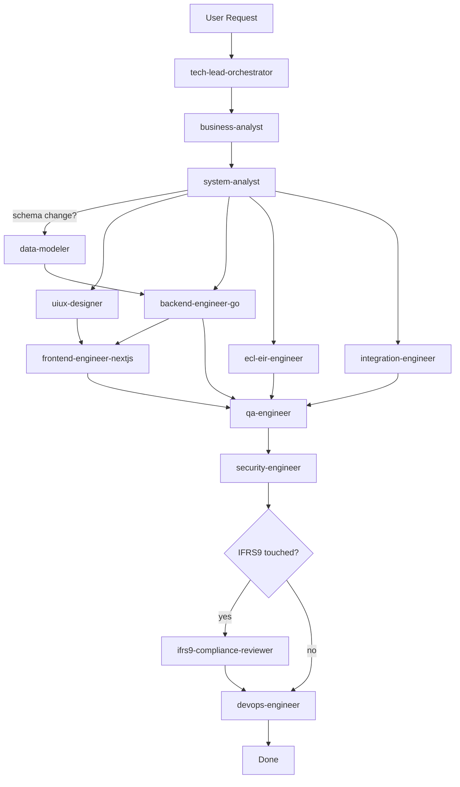

# BLIPS Agent Team — Peran, Handoff, & Decision Rights

13 subagent terpasang di `.claude/agents/`. Dokumen ini meringkas peran, alur kolaborasi, dan hak keputusan masing-masing.

---

## 1. Roster

### Squad: Discovery & Design

| Agent | Peran | Model | Input | Output |
|---|---|---|---|---|
| **business-analyst** | Translate BRD/SoW/stakeholder ke user story dengan AC | sonnet | BRD, SoW, Decision Log, stakeholder request | `docs/stories/{modul}-{id}.md` |
| **system-analyst** | User story → OpenAPI + state machine + validation rules | sonnet | User story, FSD-APP | `api/openapi/{modul}.yaml`, sequence diagrams |
| **data-modeler** | DB schema design, migrations, ERD | sonnet | OpenAPI, FSD, current schema | `db/migrations/*.up.sql` + `down.sql`, ERD delta |
| **uiux-designer** | Wireframe + interaction spec + pattern library | sonnet | User story, OpenAPI | `docs/ux/{module}/wireframe-*.md` |

### Squad: Build — Backend

| Agent | Peran | Model | Input | Output |
|---|---|---|---|---|
| **backend-engineer-go** | Gin handler, service, repo (GORM/sqlx), Asynq worker | sonnet | OpenAPI, state machine, migration | Go code + unit tests |
| **ecl-eir-engineer** | ECL formula, EIR Newton-Raphson, staging, SICR | **opus** | FSD-APP-C, SoW, Decision Log | Go decimal math + extensive tests |
| **integration-engineer** | Pefindo/IBPA/KSEI/BEI/BI/GL/Keycloak/SMTP adapters | sonnet | FSD-MASTER §5, vendor specs | Go adapter + runbook |

### Squad: Build — Frontend

| Agent | Peran | Model | Input | Output |
|---|---|---|---|---|
| **frontend-engineer-nextjs** | Next.js pages, shadcn components, forms, API client | sonnet | OpenAPI, UX spec | TSX + Vitest + Playwright |

### Squad: Quality & Compliance

| Agent | Peran | Model | Input | Output |
|---|---|---|---|---|
| **qa-engineer** | Integration tests, E2E, UAT scripts, load tests | sonnet | User story + AC | Test files + UAT docs + run report |
| **security-engineer** | Auth/RBAC/audit/encryption review | **opus** | Endpoint specs, code diffs | Security checklist + remediation |
| **ifrs9-compliance-reviewer** | PSAK 71 gate untuk ECL/EIR/SPPI/BM | **opus** | Code diffs touching regulated logic | VERDICT: PASS/CONDITIONAL/BLOCK |

### Squad: Platform

| Agent | Peran | Model | Input | Output |
|---|---|---|---|---|
| **devops-engineer** | Docker, K8s, Traefik, Terraform, Ansible, GitLab CI, observability | sonnet | Deployment requirements | IaC + pipeline yaml + runbook |

### Orchestration

| Agent | Peran | Model |
|---|---|---|
| **tech-lead-orchestrator** | Decompose, delegate, reconcile. Entry point untuk perubahan non-trivial. Tidak menulis kode. | **opus** |

---

## 2. Standard Handoff Flow



---

## 3. Decision Rights & Veto Power

| Domain | Owner (last word) | Veto |
|---|---|---|
| What & Why (business) | business-analyst | — |
| API contract / REST shape | system-analyst | — |
| DB schema / DDL | data-modeler | — |
| ECL/EIR/SPPI/BM correctness | ecl-eir-engineer (implementation) | **ifrs9-compliance-reviewer (BLOCKING)** |
| Auth, PII, audit, encryption | security-engineer (BLOCKING) | — |
| Deployment & infra | devops-engineer | security-engineer for destructive ops |
| Cross-cutting tie-breaks | tech-lead-orchestrator | — |

---

## 4. Routing rules (when in doubt)

| Trigger keyword in user request | Agent |
|---|---|
| "stakeholder", "RACI", "user story", "AC", "kebutuhan", "ambigu" | business-analyst |
| "API", "endpoint", "REST", "contract", "OpenAPI", "state machine" | system-analyst |
| "tabel", "schema", "migration", "ERD", "DDL", "index", "partition" | data-modeler |
| "ECL", "EIR", "staging", "SICR", "PD", "LGD", "Newton-Raphson", "amortisasi", "POCI", "look-through", "LPS" | ecl-eir-engineer |
| "Pefindo", "IBPA", "KSEI", "BEI", "BI JISDOR", "GL", "SAML", "LDAP", "SMTP", "feed", "DLQ" | integration-engineer |
| "wireframe", "UX", "form", "dashboard layout", "stepper", "modal" | uiux-designer |
| "page", "component", "Zustand", "shadcn", "React Hook Form" | frontend-engineer-nextjs |
| "auth", "RBAC", "permission", "Keycloak", "MFA", "audit log", "encryption", "PII", "SoD" | security-engineer |
| "PSAK 71", "klasifikasi", "reklasifikasi", "FVOCI Election", "compliance check" | ifrs9-compliance-reviewer |
| "test", "UAT", "integration test", "E2E", "Playwright", "regression", "k6" | qa-engineer |
| "Docker", "K8s", "Helm", "Terraform", "Ansible", "GitLab CI", "Grafana", "alert", "DR", "backup" | devops-engineer |
| "plan", "design proposal", "cross-module", "siapa yang…" | tech-lead-orchestrator |

---

## 5. Cara invoke agent

Di Claude Code (interactive):
```
> "Tolong implementasi penempatan deposito modul APP-B dengan workflow Maker-Reviewer-Approver"
```

Claude Code akan otomatis routing ke `tech-lead-orchestrator` (karena lintas modul + workflow), yang lalu memanggil agent lain via Task tool. Atau panggil langsung:

```
> "@business-analyst tolong tulis user story untuk amandemen kontrak deposito"
```

---

## 6. Mode Bahasa
Default: **Bahasa Indonesia** untuk dialog dan dokumen internal; **English** untuk identifier kode, API field, error code, dan laporan eksternal. Setiap agent sudah diinstruksikan mengikuti konvensi ini.
