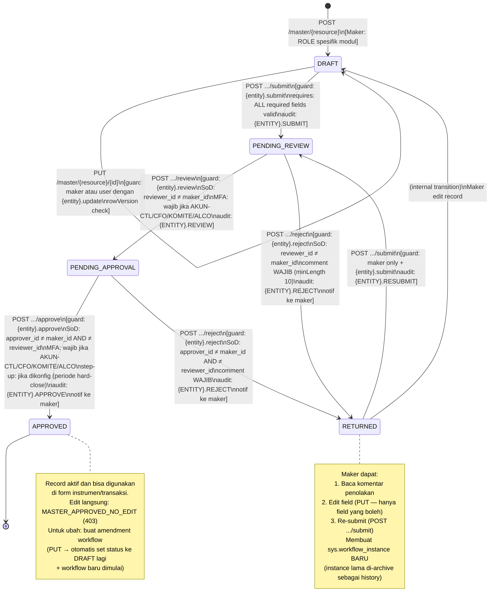
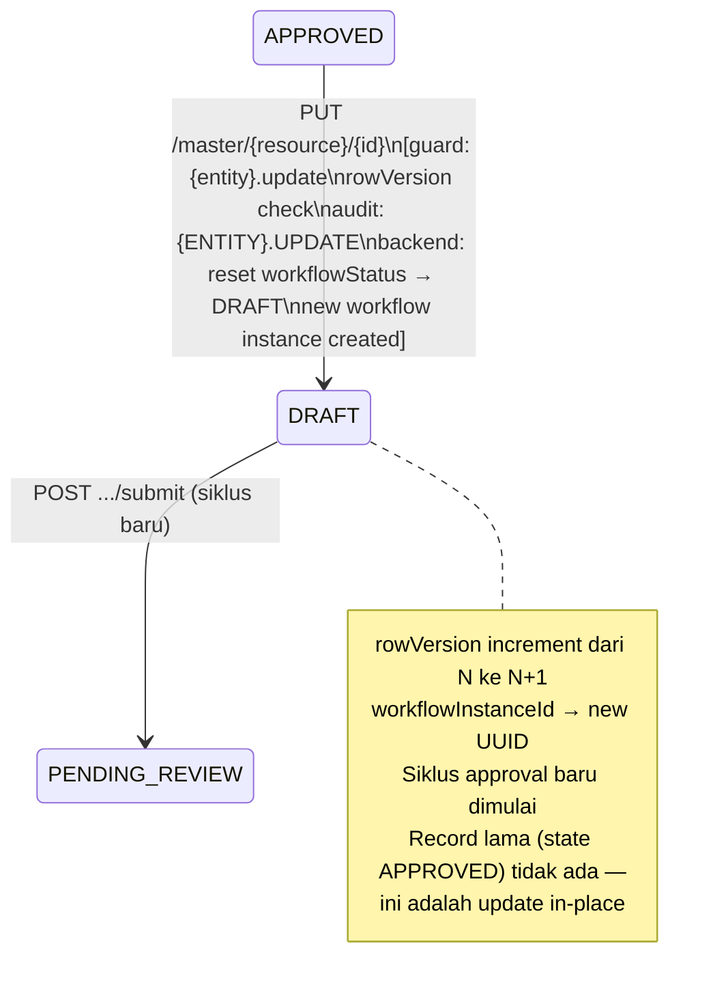
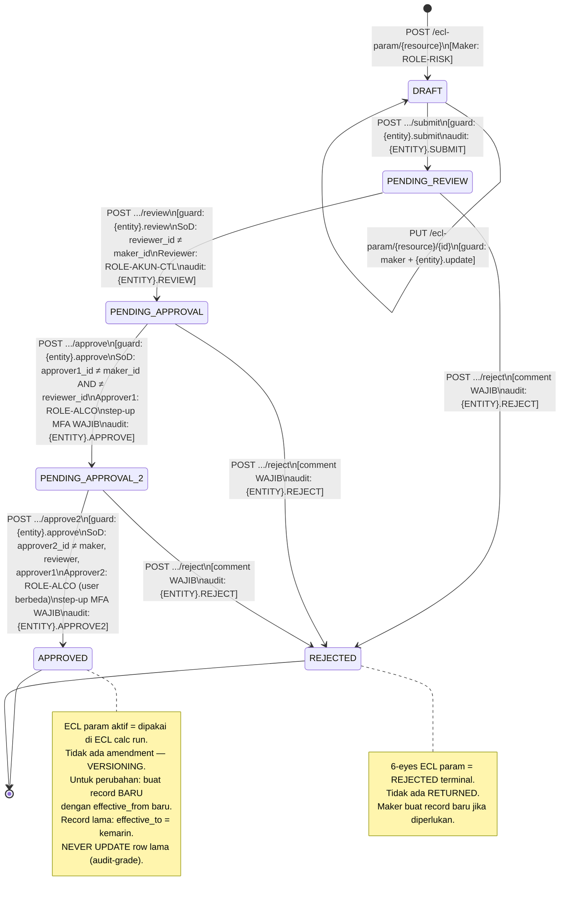

# Master Data State Machine — APP-A Phase 3

**Author**: system-analyst  
**Tanggal**: 2026-06-03  
**Status**: FINAL — prasyarat backend-engineer-go (feature/phase-3-master-data)  
**Referensi**: APP-A-MSTR-001, APP-A-MSTR-002, workflow-state-machine.md, DEC-017

---

## 1. Perbedaan State Machine Master Data vs Transaksi

Master data entities (`mst.*`) berbeda dari transaksi (penempatan, jurnal) dalam satu hal kritis:

| Aspek | Transaksi (penempatan, jurnal) | Master Data (mst.*) |
|---|---|---|
| Setelah reject | **REJECTED** (terminal, tidak bisa re-submit) | **RETURNED** (maker bisa edit + re-submit) |
| Alasan | Transaksi sudah "terjadi" di luar; batalkan lebih baik bikin ulang | Master data adalah reference; koreksi wajar |
| Implementasi DB | `current_state='REJECTED'`, `retractable=false` | `current_state='REJECTED'`, `retractable=true` |
| API response label | `workflowStatus: "REJECTED"` | `workflowStatus: "RETURNED"` |

Backend engine membaca `retractable` dari `sys.config WORKFLOW_CONFIG_{ENTITY}` untuk menentukan perilaku ini.

---

## 2. State Machine — 4-Eyes Master Data (Pilot: mata_uang)

Berlaku untuk: `mata_uang`, `portofolio`, `chart_of_accounts`, `mapping_jurnal_*`, `kurs`, `instrumen`, `counterparty`, `rating_history`.



---

## 3. Amendment Workflow (APPROVED → modifikasi)

Untuk master umum (non-ECL param), amendment setelah APPROVED mengikuti pola berikut:



**Catatan implementasi**: Backend service layer yang trigger workflow reset saat PUT pada APPROVED record. Bukan client yang explicitly reset — client cukup PUT seperti biasa, server yang handle transisi.

---

## 4. State Machine — 6-Eyes ECL Param Master (Varian A)

Berlaku untuk: `lgd_basel`, `bobot_skenario`, `lps_coverage`, `pd_pefindo`, `impact_mev_pd`, `impact_pd`.

Referensi: DEC-017 (6-eyes untuk parameter master), DEC-010 (ECL formula), DEC-027 (step-up MFA).



---

## 5. Mapping WorkflowConfig ke sys.config

Engine membaca konfigurasi ini dari `sys.config` saat startup:

```
WORKFLOW_CONFIG_MATA_UANG      → 4-eyes, retractable=true,  stepUp=false
WORKFLOW_CONFIG_PORTOFOLIO     → 4-eyes, retractable=true,  stepUp=false
WORKFLOW_CONFIG_CHART_OF_ACCOUNTS → 4-eyes, retractable=true, stepUp=false
WORKFLOW_CONFIG_KURS           → 4-eyes, retractable=true,  stepUp=false
WORKFLOW_CONFIG_INSTRUMEN      → 4-eyes, retractable=true,  stepUp=false
WORKFLOW_CONFIG_COUNTERPARTY   → 4-eyes, retractable=true,  stepUp=false
WORKFLOW_CONFIG_LGD_BASEL      → 6-eyes, retractable=false, stepUp=true (approve + approve2)
WORKFLOW_CONFIG_BOBOT_SKENARIO → 6-eyes, retractable=false, stepUp=true
WORKFLOW_CONFIG_LPS_COVERAGE   → 6-eyes, retractable=false, stepUp=true
WORKFLOW_CONFIG_PD_PEFINDO     → 6-eyes, retractable=false, stepUp=true
WORKFLOW_CONFIG_IMPACT_MEV_PD  → 6-eyes, retractable=false, stepUp=true
WORKFLOW_CONFIG_IMPACT_PD      → 6-eyes, retractable=false, stepUp=true
```

Semua config sudah di-seed di `db/migrations/000007_workflow_engine.up.sql`.

---

## 6. RETURNED State — Implementasi Detail

Backend service layer handle ini:

```go
// internal/workflow/engine.go
func (e *Engine) Reject(ctx context.Context, req RejectRequest) (*WorkflowResult, error) {
    instance := e.loadInstance(ctx, req.EntityType, req.EntityID)
    config := e.loadConfig(ctx, instance.WorkflowConfigKey)

    // Validate guard
    e.checkPermission(ctx, req.UserID, config.RequiredPermissions.Reject)
    e.checkSoD(ctx, req.UserID, instance)
    e.validateComment(req.Comment) // minLength 10

    if config.Retractable {
        // Master data → RETURNED (exposed as "RETURNED" in API, stored as "REJECTED" in DB)
        instance.CurrentState = "REJECTED"  // DB value
        // API response: map "REJECTED" + retractable=true → "RETURNED"
        result.CurrentState = "RETURNED"   // API value
    } else {
        // Transaksional entity → REJECTED terminal
        instance.CurrentState = "REJECTED"
        result.CurrentState = "REJECTED"
    }

    // Store reject_comment untuk notifikasi
    instance.RejectComment = req.Comment
    // ...
}

// State label mapping untuk API response
func toAPIState(dbState string, retractable bool) string {
    if dbState == "REJECTED" && retractable {
        return "RETURNED"
    }
    return dbState
}
```

---

## 7. SoD Enforcement Checklist per State

| Transisi | SoD Check | Error Code |
|---|---|---|
| DRAFT → PENDING_REVIEW (submit) | Tidak ada (Maker = submitter) | — |
| PENDING_REVIEW → PENDING_APPROVAL (review) | `reviewer_id ≠ maker_id` | `SOD_VIOLATION` |
| PENDING_APPROVAL → APPROVED (approve, 4-eyes) | `approver_id ≠ maker_id AND ≠ reviewer_id` | `SOD_VIOLATION` |
| PENDING_APPROVAL → PENDING_APPROVAL_2 (approve, 6-eyes) | `approver1_id ≠ maker_id AND ≠ reviewer_id` | `SOD_VIOLATION` |
| PENDING_APPROVAL_2 → APPROVED (approve2, 6-eyes) | `approver2_id ≠ maker_id AND ≠ reviewer_id AND ≠ approver1_id` | `SOD_APPROVER2_SAME_AS_REVIEWER` |
| ANY PENDING_* → RETURNED/REJECTED (reject) | Reviewer/Approver check berlaku (bukan maker) | `SOD_VIOLATION` |
| RETURNED → PENDING_REVIEW (resubmit) | Hanya maker yang bisa resubmit | `FORBIDDEN` |

---

## 8. Reuse Engine Phase 2

State machine ini REUSE engine yang sama dari Phase 2 (`sys.workflow_instance` + `sys.workflow_signature`). Yang berbeda hanya:

1. `entity_type = 'MATA_UANG'` (bukan `'PENEMPATAN'`)
2. `workflow_config_key = 'WORKFLOW_CONFIG_MATA_UANG'`
3. `retractable = true` → RETURNED state di API response
4. Path URL: `/api/v1/master/mata-uang/{kode}/submit` (bukan `/api/v1/penempatan/{id}/submit`)
5. Entity ID di workflow: UUID dari `mst.mata_uang` (perlu UUID surrogate — lihat schema change requirement)

**Schema note**: `mst.mata_uang` PK adalah `CHAR(3)` bukan UUID. `sys.workflow_instance.entity_id` adalah `UUID`. Solusi: tambah kolom `id UUID DEFAULT gen_random_uuid()` ke `mst.mata_uang` sebagai surrogate UUID, gunakan ini sebagai `entity_id` di workflow. URL tetap pakai `kode`. Data-modeler harus handle ini di migration 000008.

---

## 9. Handoff Notes

| Agent | Task |
|---|---|
| `data-modeler` | **STOP DULU** — migration 000008 wajib sebelum backend implement: (1) tambah kolom yang kurang di `mst.mata_uang` (lihat `mata-uang.yaml` description), (2) tambah `id UUID` surrogate untuk workflow integration, (3) seed mata uang standar |
| `backend-engineer-go` | Implementasi CRUD + workflow handler untuk `mata_uang`. Reuse `internal/workflow/engine.go` Phase 2. Map RETURNED state (retractable=true). Permission check: `mata_uang.*`. |
| `frontend-engineer-nextjs` | Screen `/master/mata-uang` — DataTable (sort/filter/export, UX §1). Form create/edit (notif UX §2). Workflow panel (submit/approve/reject). |
| `qa-engineer` | UAT script: create→submit→review→approve (happy path), SoD violation, RETURNED re-submit, export CSV, soft-delete. Data seed: test personas sesuai APP-A-MSTR-002. |
| `security-engineer` | Review endpoint baru (tidak ada PII di mata_uang — standard review saja). |
| `ifrs9-compliance-reviewer` | Tidak diperlukan untuk mata_uang. HARUS dipanggil untuk Varian A (ECL param masters). |
