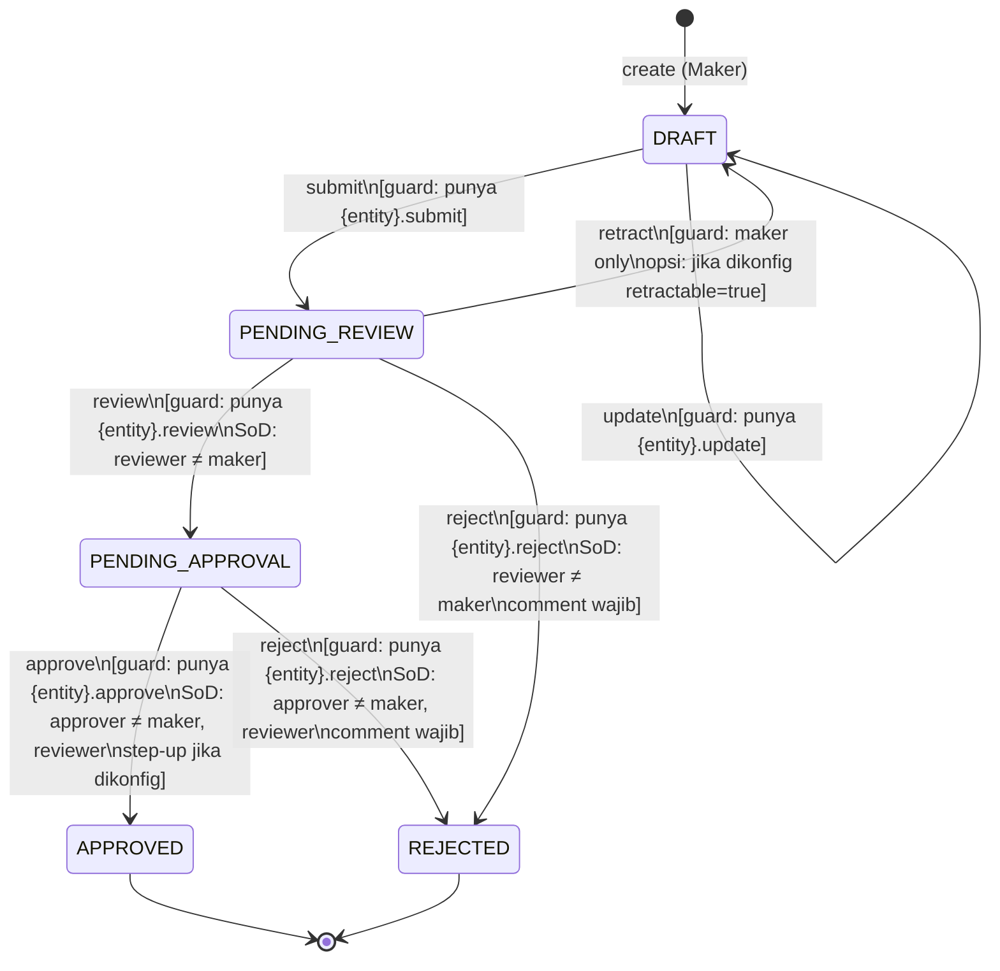
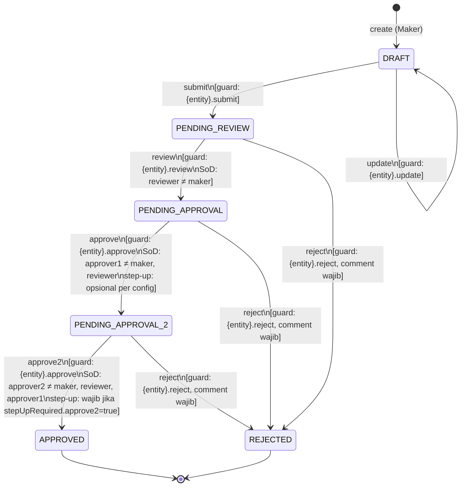

# BLIPS Workflow State Machine
## Generic Maker-Reviewer-Approver Engine — Phase 2 Foundation

**Referensi**: DEC-017 · FSD-BLIPS-MASTER-v1.1.docx §3.1 RBAC · api-conventions.md §"Workflow endpoints"  
**Author**: system-analyst  
**Tanggal**: 2026-06-02  
**Status**: FINAL — prasyarat backend-engineer-go (PR#4 feature/workflow-engine)

---

## 1. State Machine — 4-Eyes (Default)

Berlaku untuk: penempatan, jurnal, upload-batch, ecl-run, sppi-test, bm-assessment, periode (soft-close), dan semua entity yang tidak dikonfigurasi sebagai 6-eyes.



---

## 2. State Machine — 6-Eyes (Klasifikasi PSAK 71 + Parameter Master)

Berlaku untuk: klasifikasi (SPPI × BM → AC/FVOCI/FVTPL), ecl-parameter (PD curve, LGD pool, scenario weights, FL multiplier).

Entity dikonfigurasi 6-eyes via `WorkflowConfig.eyes = 6` di `sys.config`.



---

## 3. Tabel Transisi Lengkap

### 3.1 Transisi valid (all eyes)

| From State | Action | To State (4-eyes) | To State (6-eyes) | Actor | Permission |
|---|---|---|---|---|---|
| `DRAFT` | `submit` | `PENDING_REVIEW` | `PENDING_REVIEW` | Maker | `{entity}.submit` |
| `DRAFT` | `update` | `DRAFT` | `DRAFT` | Maker | `{entity}.update` |
| `PENDING_REVIEW` | `review` | `PENDING_APPROVAL` | `PENDING_APPROVAL` | Reviewer | `{entity}.review` |
| `PENDING_REVIEW` | `reject` | `REJECTED` | `REJECTED` | Reviewer | `{entity}.reject` |
| `PENDING_REVIEW` | `retract` | `DRAFT` | `DRAFT` | Maker | `{entity}.update` (config: retractable=true) |
| `PENDING_APPROVAL` | `approve` | `APPROVED` | `PENDING_APPROVAL_2` | Approver1 | `{entity}.approve` |
| `PENDING_APPROVAL` | `reject` | `REJECTED` | `REJECTED` | Approver1 | `{entity}.reject` |
| `PENDING_APPROVAL_2` | `approve2` | N/A | `APPROVED` | Approver2 | `{entity}.approve` |
| `PENDING_APPROVAL_2` | `reject` | N/A | `REJECTED` | Approver2 | `{entity}.reject` |

**State terminal**: `APPROVED`, `REJECTED` — tidak ada transisi keluar. Untuk membuat ulang, entity baru dibuat atau amendment workflow di-trigger (domain-specific, bukan generic engine).

### 3.2 Transisi tidak valid → `WORKFLOW_INVALID_TRANSITION` (422)

Semua transisi yang tidak ada di tabel 3.1 menghasilkan error ini. Contoh:
- `DRAFT → APPROVED` (skip review + approval)
- `REJECTED → PENDING_REVIEW` (tidak bisa re-submit entity rejected)
- `PENDING_APPROVAL_2 → approve` pada entity 4-eyes (state ini tidak exist)

---

## 4. Guard Conditions per Transisi

### 4.1 SoD Guards (server-side, DEC-017)

```
submit:   tidak ada SoD (Maker adalah submitter — baseline)
review:   reviewer_id ≠ maker_id
            → error: SOD_VIOLATION
approve:  approver1_id ≠ maker_id AND approver1_id ≠ reviewer_id
            → error: SOD_VIOLATION
approve2: approver2_id ≠ maker_id
          AND approver2_id ≠ reviewer_id
          AND approver2_id ≠ approver1_id
            → error: SOD_APPROVER2_SAME_AS_REVIEWER (bila approver2 = reviewer)
reject:   SoD sama dengan step yang sedang dilakukan
```

**WAJIB di service layer, bukan hanya di UI.** QA integration test wajib cover "Maker coba jadi Approver via API langsung" → expect `SOD_VIOLATION 403`.

### 4.2 Permission Guards

Setiap transisi: cek `{entity}.{action}` dari JWT claims.permissions.
- Jangan compare `roles[]` (dilarang — role-string comparison adalah anti-pattern).
- Entity type ditentukan dari path parameter `resource`.

### 4.3 Step-up MFA Guards (DEC-027)

Step-up MFA wajib bila `WorkflowConfig.stepUpRequired.{step} = true`:
1. `X-Step-Up-Token` header HARUS hadir
2. Token di-decode: verify `stepup_verified_at` claim
3. `now() - stepup_verified_at <= 5 menit` HARUS true
   - Jika tidak ada token: `STEP_UP_REQUIRED 403`
   - Jika token ada tapi expired: `STEP_UP_EXPIRED 403`

Default `stepUpRequired` per entity:
| Entity | approve | approve2 |
|---|---|---|
| `klasifikasi` | false | true |
| `ecl-parameter` | true | true |
| `periode` (hard-close) | true | N/A (4-eyes) |
| `penempatan` | false | N/A |
| `jurnal` | false | N/A |
| Semua lainnya | false | false |

### 4.4 Optimistic Lock Guard

Setiap mutating workflow action: cek `rowVersion` dari request body vs `row_version` di DB.
- Mismatch → `CONFLICT 409`
- Client wajib GET entity terbaru, baca `rowVersion`, retry.

---

## 5. Config-Driven Engine — Jawaban 4-Eyes vs 6-Eyes

### Pertanyaan kunci
> Bagaimana merepresentasikan 4-eyes vs 6-eyes dalam SATU config-driven state machine engine?

### Jawaban

Engine membaca konfigurasi dari `sys.config` pada startup (cached, di-refresh tiap 5 menit atau on-demand via cache invalidation).

**Config key**: `WORKFLOW_CONFIG_{ENTITY_TYPE_UPPER}` — contoh: `WORKFLOW_CONFIG_KLASIFIKASI`

**Config value** (JSON):
```json
{
  "entityType": "KLASIFIKASI",
  "eyes": 6,
  "retractable": false,
  "requiredPermissions": {
    "submit":   "klasifikasi.submit",
    "review":   "klasifikasi.review",
    "approve":  "klasifikasi.approve",
    "approve2": "klasifikasi.approve",
    "reject":   "klasifikasi.reject"
  },
  "stepUpRequired": {
    "approve":  false,
    "approve2": true
  },
  "sodRules": {
    "reviewerNotMaker":               true,
    "approverNotMakerOrReviewer":     true,
    "approver2NotAnyPrevious":        true
  }
}
```

**Logic di engine (Go)**:

```go
// WorkflowEngine adalah generic, tidak tahu tentang domain entity.
type WorkflowConfig struct {
    EntityType          string
    Eyes                int   // 4 atau 6
    Retractable         bool
    RequiredPermissions map[string]string  // action -> permission code
    StepUpRequired      map[string]bool    // action -> bool
    SoDRules            SoDConfig
}

type SoDConfig struct {
    ReviewerNotMaker             bool
    ApproverNotMakerOrReviewer   bool
    Approver2NotAnyPrevious      bool
}

// Transition table yang di-compute dari config:
func (c WorkflowConfig) ValidTransitions() map[State][]Transition {
    base := map[State][]Transition{
        DRAFT:           {{Action: SUBMIT, Target: PENDING_REVIEW}},
        PENDING_REVIEW:  {{Action: REVIEW, Target: PENDING_APPROVAL},
                          {Action: REJECT, Target: REJECTED}},
        PENDING_APPROVAL: {{Action: APPROVE, Target: c.approveTarget()},
                           {Action: REJECT, Target: REJECTED}},
        APPROVED:        {},
        REJECTED:        {},
    }
    if c.Retractable {
        base[PENDING_REVIEW] = append(base[PENDING_REVIEW],
            Transition{Action: RETRACT, Target: DRAFT})
    }
    if c.Eyes == 6 {
        base[PENDING_APPROVAL_2] = []Transition{
            {Action: APPROVE2, Target: APPROVED},
            {Action: REJECT, Target: REJECTED},
        }
    }
    return base
}

func (c WorkflowConfig) approveTarget() State {
    if c.Eyes == 6 {
        return PENDING_APPROVAL_2  // 6-eyes: lanjut ke approver2
    }
    return APPROVED               // 4-eyes: langsung approved
}
```

**Keuntungan design ini**:
1. Satu `WorkflowEngine` struct di `internal/workflow/engine.go` — tidak ada if-else domain.
2. Semua aturan 4-eyes vs 6-eyes di-encode dalam `WorkflowConfig.Eyes` + computed `approveTarget()`.
3. Menambah entity baru = tambah row di `sys.config`, tidak perlu code change.
4. SoD rules + step-up juga config-driven — compliance reviewer bisa verifikasi dari config, bukan dari code.

**Constraint yang TETAP hardcoded (tidak boleh di-config-override)**:
- `eyes` hanya boleh 4 atau 6 (tidak ada 3-eyes atau 5-eyes)
- `sodRules.reviewerNotMaker` dan `sodRules.approverNotMakerOrReviewer` default true dan tidak boleh di-set false (DEC-017)
- Reject wajib `comment` minimal 10 karakter (tidak bisa di-disable)
- Signature record wajib immutable (tidak boleh UPDATE)

---

## 6. Validation Rules Table

### 6.1 WorkflowActionRequest

| Field | Rule | Error Code | Message ID / Pesan |
|---|---|---|---|
| `signatureMethod` | required | `VALIDATION_FAILED` | "signatureMethod wajib diisi" |
| `signatureMethod` | enum: [JWT_STEP_UP, JWT_STANDARD] | `VALIDATION_FAILED` | "signatureMethod harus JWT_STEP_UP atau JWT_STANDARD" |
| `comment` | maxLength 1000 | `VALIDATION_FAILED` | "Komentar maksimal 1000 karakter" |
| `rowVersion` | int >= 1 jika hadir | `VALIDATION_FAILED` | "rowVersion harus bilangan positif" |

### 6.2 WorkflowRejectRequest

| Field | Rule | Error Code | Message ID / Pesan |
|---|---|---|---|
| `comment` | required | `VALIDATION_FAILED` | "Alasan penolakan wajib diisi" |
| `comment` | minLength 10 | `VALIDATION_FAILED` | "Alasan penolakan minimal 10 karakter" |
| `comment` | maxLength 1000 | `VALIDATION_FAILED` | "Alasan penolakan maksimal 1000 karakter" |
| `signatureMethod` | required, enum | sama dengan 6.1 | — |

### 6.3 Cross-field / Business Rules

| Rule | Trigger | Error Code | Pesan |
|---|---|---|---|
| State harus valid untuk action | setiap action | `WORKFLOW_INVALID_TRANSITION` | "Tidak bisa {action} dari state {current}. Transisi tidak valid." |
| reviewer_id ≠ maker_id | review | `SOD_VIOLATION` | "Anda tidak bisa mereview entity yang Anda buat sendiri" |
| approver_id ≠ maker_id AND ≠ reviewer_id | approve | `SOD_VIOLATION` | "Anda tidak bisa meng-approve entity yang Anda buat atau review sendiri" |
| approver2_id ≠ semua previous | approve2 | `SOD_APPROVER2_SAME_AS_REVIEWER` | "Approver kedua tidak bisa sama dengan maker, reviewer, atau approver pertama" |
| rowVersion cocok | semua mutating | `CONFLICT` | "Data sudah diubah oleh user lain. Refresh dan ulangi." |
| step-up token present & valid (bila config) | approve/approve2 | `STEP_UP_REQUIRED` atau `STEP_UP_EXPIRED` | (lihat §4.3) |
| entity tidak soft-deleted | semua action | `NOT_FOUND` | "Entity tidak ditemukan" |
| entity tidak di periode closed | submit/review/approve | `PERIODE_CLOSED` | "Periode buku sudah hard-closed, tidak bisa mutasi" |
| Idempotency-Key header hadir | semua POST | `VALIDATION_FAILED` | "Header Idempotency-Key wajib diisi" |

### 6.4 Zod Schema (untuk frontend consumption)

```typescript
// Konsumable oleh frontend-engineer-nextjs
import { z } from "zod";

export const WorkflowActionSchema = z.object({
  signatureMethod: z.enum(["JWT_STEP_UP", "JWT_STANDARD"]).default("JWT_STANDARD"),
  comment: z.string().max(1000).optional(),
  rowVersion: z.number().int().positive().optional(),
});

export const WorkflowRejectSchema = z.object({
  signatureMethod: z.enum(["JWT_STEP_UP", "JWT_STANDARD"]).default("JWT_STANDARD"),
  comment: z.string().min(10, "Alasan penolakan minimal 10 karakter").max(1000),
  rowVersion: z.number().int().positive().optional(),
});

export type WorkflowActionInput = z.infer<typeof WorkflowActionSchema>;
export type WorkflowRejectInput = z.infer<typeof WorkflowRejectSchema>;
```

### 6.5 Go Validation (untuk backend-engineer-go consumption)

```go
// internal/workflow/validation.go
type WorkflowActionRequest struct {
    Comment         *string `json:"comment"         validate:"omitempty,max=1000"`
    SignatureMethod  string  `json:"signatureMethod" validate:"required,oneof=JWT_STEP_UP JWT_STANDARD"`
    RowVersion      *int64  `json:"rowVersion"      validate:"omitempty,min=1"`
}

type WorkflowRejectRequest struct {
    Comment         string `json:"comment"         validate:"required,min=10,max=1000"`
    SignatureMethod  string `json:"signatureMethod" validate:"required,oneof=JWT_STEP_UP JWT_STANDARD"`
    RowVersion      *int64 `json:"rowVersion"      validate:"omitempty,min=1"`
}

// Cross-field + business rules:
// Implementasi di WorkflowEngine.Transition() — bukan di validator struct tag.
// Urutan: validate struct → check entity exists → check state transition →
//          check SoD → check step-up → check optimistic lock → execute.
```

---

## 7. Workflow Instance DB Schema (untuk data-modeler)

Setiap entity workflow-bearing HARUS punya kolom-kolom berikut (atau join ke tabel `workflow_instance`). Rekomendasi: gunakan tabel terpisah `{schema}.{entity}_workflow` yang join ke entity utama.

```sql
-- Template kolom workflow instance (tambahkan ke tabel entity atau buat join table)
-- Rekomendasi: tabel terpisah agar entity table tidak terlalu wide

CREATE TABLE {schema}.{entity}_workflow (
    id                  UUID PRIMARY KEY DEFAULT gen_random_uuid(),
    entity_id           UUID NOT NULL REFERENCES {schema}.{entity}(id),
    entity_type         TEXT NOT NULL,                    -- 'KLASIFIKASI', 'PENEMPATAN', etc.
    workflow_config_key TEXT NOT NULL,                    -- key di sys.config
    current_state       TEXT NOT NULL DEFAULT 'DRAFT',   -- WorkflowState enum
    eyes                SMALLINT NOT NULL DEFAULT 4,      -- 4 atau 6

    -- Aktor per step (UUID ke sec.user)
    maker_id            UUID REFERENCES sec.user(id),
    reviewer_id         UUID REFERENCES sec.user(id),
    approver1_id        UUID REFERENCES sec.user(id),
    approver2_id        UUID REFERENCES sec.user(id),     -- 6-eyes only

    -- Signing timestamps (immutable setelah diisi)
    submitted_at        TIMESTAMPTZ,
    reviewed_at         TIMESTAMPTZ,
    approved1_at        TIMESTAMPTZ,
    approved2_at        TIMESTAMPTZ,
    rejected_at         TIMESTAMPTZ,

    -- Signature hashes (immutable, SHA-256)
    submit_sig_hash     TEXT,
    review_sig_hash     TEXT,
    approve1_sig_hash   TEXT,
    approve2_sig_hash   TEXT,
    reject_sig_hash     TEXT,

    -- Reject info
    rejected_by         UUID REFERENCES sec.user(id),
    reject_comment      TEXT,
    reject_step         TEXT,                             -- step mana yang reject

    -- Standard audit cols
    created_at          TIMESTAMPTZ NOT NULL DEFAULT now(),
    created_by          UUID NOT NULL,
    updated_at          TIMESTAMPTZ NOT NULL DEFAULT now(),
    updated_by          UUID NOT NULL,
    row_version         BIGINT NOT NULL DEFAULT 1,
    tenant_id           TEXT NOT NULL DEFAULT 'TUGURE',

    CONSTRAINT ck_{entity}_wf_state CHECK (
        current_state IN ('DRAFT','PENDING_REVIEW','PENDING_APPROVAL',
                          'PENDING_APPROVAL_2','APPROVED','REJECTED')
    ),
    CONSTRAINT ck_{entity}_wf_eyes CHECK (eyes IN (4, 6)),
    CONSTRAINT uq_{entity}_wf_entity UNIQUE (entity_id)  -- 1 workflow per entity
);

-- Signature history (append-only, TIDAK boleh UPDATE atau DELETE)
CREATE TABLE {schema}.{entity}_workflow_signature (
    id                  UUID PRIMARY KEY DEFAULT gen_random_uuid(),
    workflow_id         UUID NOT NULL REFERENCES {schema}.{entity}_workflow(id),
    action              TEXT NOT NULL,   -- SUBMIT|REVIEW|APPROVE|APPROVE2|REJECT
    user_id             UUID NOT NULL REFERENCES sec.user(id),
    role_at_time        TEXT NOT NULL,   -- snapshot role saat signing
    signed_at           TIMESTAMPTZ NOT NULL DEFAULT now(),
    signature_hash      TEXT NOT NULL,   -- SHA-256(userId||action||entityId||signedAt||comment)
    signature_method    TEXT NOT NULL,   -- JWT_STEP_UP|JWT_STANDARD
    comment             TEXT,
    tenant_id           TEXT NOT NULL DEFAULT 'TUGURE'
    -- TIDAK ada audit cols updated_at/deleted_at — record ini IMMUTABLE
);

CREATE INDEX ix_{entity}_wf_sig_workflow ON {schema}.{entity}_workflow_signature(workflow_id);
CREATE INDEX ix_{entity}_wf_sig_user ON {schema}.{entity}_workflow_signature(user_id);
```

**Catatan untuk data-modeler**: template ini harus di-instantiate per entity saat migration, atau bisa dibuat sebagai shared `workflow_instance` + `workflow_signature` tabel di schema `sys` dengan `entity_type` + `entity_id` composite key. Pilihan arsitektur ini di-delegate ke `data-modeler` + `backend-engineer-go` — system-analyst tidak menentukan mana yang lebih performant.

---

## 8. Hand-off Notes

### Agents yang harus pick up setelah ini

| Agent | Deliverable dari dokumen ini |
|---|---|
| `backend-engineer-go` | Implementasi `WorkflowEngine` generic di `internal/workflow/engine.go`. Baca `WorkflowConfig` dari `sys.config`. Semua guard di §4 wajib diimplementasi. Unit test WAJIB cover semua transition + SoD bypass attempt. |
| `data-modeler` | Schema `workflow_instance` + `workflow_signature` per §7. Migration golang-migrate. Perhatikan: signature table harus append-only (add constraint `NO DELETE NO UPDATE` via trigger atau policy). |
| `qa-engineer` | Integration test wajib: (1) Maker coba jadi Reviewer via API → `SOD_VIOLATION`; (2) Skip review lalu approve → `WORKFLOW_INVALID_TRANSITION`; (3) 6-eyes: approver2 = approver1 → `SOD_APPROVER2_SAME_AS_REVIEWER`; (4) approve tanpa step-up (entity yang require) → `STEP_UP_REQUIRED`; (5) Replay Idempotency-Key → original response. |
| `frontend-engineer-nextjs` | Zod schema di §6.4. State machine states untuk UI disable/enable button per state. |
| `security-engineer` | Review §4 (SoD + step-up implementation) sebelum merge PR#4. BLOCKING gate. |

### Schema changes diperlukan

**STOP** — sebelum `backend-engineer-go` implementasi engine, `data-modeler` harus:
1. Create migration untuk `workflow_instance` + `workflow_signature` table template
2. Seed `sys.config` dengan `WORKFLOW_CONFIG_*` untuk semua entity (minimal: KLASIFIKASI, ECL_PARAMETER, PENEMPATAN, PERIODE, JURNAL)

Rekomendasi ke `tech-lead-orchestrator`: `data-modeler` run SEBELUM PR#4 (workflow engine). Ini blocking dependency.

### IFRS9 compliance note

Workflow ini TIDAK menyentuh ECL/EIR/SPPI/BM math — hanya scaffolding governance. `ifrs9-compliance-reviewer` TIDAK perlu dipanggil untuk dokumen ini. Akan aktif saat APP-A/C mulai (Phase 3+).
