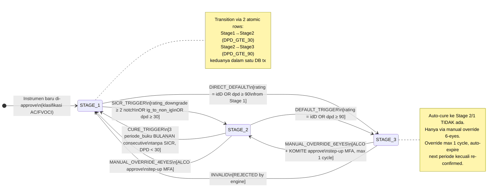
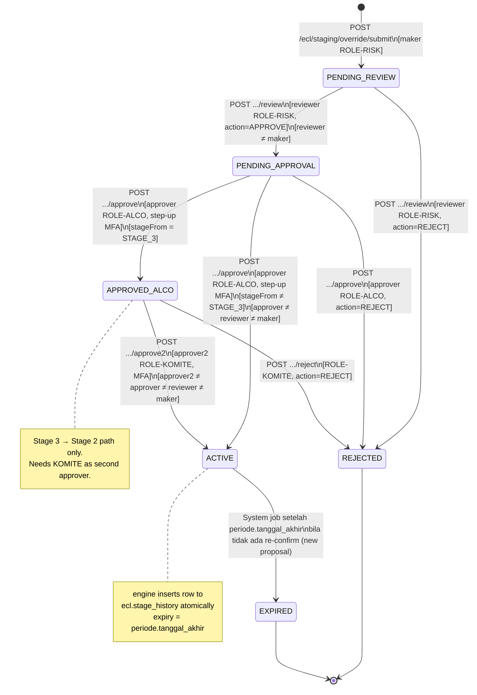

# P4-M1 — State Machine: Staging Engine + Override Workflow

**Modul**: APP-C — ECL Engine
**Story Set**: APP-C-STG-001..005
**FSD Ref**: FSD-APP-C-ECL-EIR-v1.0.docx §3
**Decisions**: DEC-010, DEC-011, DEC-012, DEC-017, DEC-018, DEC-021, DEC-022
**Author**: system-analyst
**Tanggal**: 2026-06-11
**Status**: DRAFT — review-required tag: `ifrs9-compliance-reviewer` (BLOCKING gate)

---

## 1. Staging Lifecycle State Machine

### 1.1 State Diagram



### 1.2 Valid Transitions

| From    | To      | Trigger Type              | Approval    | Guard                                                       |
|---------|---------|--------------------------|-------------|-------------------------------------------------------------|
| STAGE_1 | STAGE_2 | RATING_DOWNGRADE         | AUTO        | delta_notch_from_origination >= 2                           |
| STAGE_1 | STAGE_2 | IG_TO_NON_IG             | AUTO        | rating sebelumnya IG (≥ idBBB-), rating baru non-IG (< idBBB-) |
| STAGE_1 | STAGE_2 | DPD_GTE_30               | AUTO        | dpd_hari >= 30 AND dpd_hari < 90                            |
| STAGE_1 | STAGE_3 | RATING_DEFAULT           | AUTO        | default_triggered = TRUE (rating = idD)                     |
| STAGE_1 | STAGE_3 | DPD_GTE_90 (atomic 2-row)| AUTO        | dpd_hari >= 90 (insert 2 rows in one DB tx: 1→2 then 2→3)   |
| STAGE_2 | STAGE_1 | CURE_3_PERIODE_BULANAN   | AUTO        | 3 consecutive BULANAN periods: no SICR, DPD < 30           |
| STAGE_2 | STAGE_3 | RATING_DEFAULT           | AUTO        | default_triggered = TRUE                                     |
| STAGE_2 | STAGE_3 | DPD_GTE_90               | AUTO        | dpd_hari >= 90                                              |
| STAGE_2 | STAGE_1 | MANUAL_OVERRIDE          | 4-eyes ALCO | reviewer ≠ maker; ALCO step-up MFA; periode not HARD_CLOSED |
| STAGE_3 | STAGE_2 | MANUAL_OVERRIDE          | 6-eyes ALCO+KOMITE | dokumen_pendukung required; ALCO+KOMITE step-up MFA; max 1 cycle; auto-expire next periode |
| ANY     | ANY     | INVALID (same stage)     | -           | REJECTED — no-op, log ECL_STAGING.NO_CHANGE                 |
| STAGE_3 | STAGE_1 | -                        | -           | REJECTED — engine error STAGING_OVERRIDE_INVALID_TRANSITION |

### 1.3 Notch Baseline

Delta notch dihitung dari **rating saat tanggal_penempatan instrumen** (fixed baseline — per OQ-STG-1a, sesuai IFRS9 §5.5.11 "since initial recognition"). Bukan rolling.

Skala Pefindo (ascending risk):
`idAAA → idAA+ → idAA → idAA- → idA+ → idA → idA- → idBBB+ → idBBB → idBBB- → idBB+ → idBB → idBB- → idB+ → idB → idB- → idCCC → idD`

**Investment Grade (IG)**: idAAA s.d. idBBB- (inklusif)
**Non-IG**: idBB+ ke bawah s.d. idD

---

## 2. Override Proposal Workflow State Machine

### 2.1 State Diagram



### 2.2 Override Workflow State Transitions

| From State      | To State        | Actor       | Endpoint                  | Guard                                                  | Audit Event                    |
|----------------|----------------|-------------|--------------------------|--------------------------------------------------------|-------------------------------|
| -               | PENDING_REVIEW  | ROLE-RISK   | POST .../submit           | instrumen AKTIF; no active proposal; periode not HARD_CLOSED | ECL_STAGING.OVERRIDE_PROPOSED |
| PENDING_REVIEW  | PENDING_APPROVAL| ROLE-RISK   | POST .../review (APPROVE) | reviewer_id ≠ maker_id (SoD)                          | ECL_STAGING.OVERRIDE_REVIEWED |
| PENDING_REVIEW  | REJECTED        | ROLE-RISK   | POST .../review (REJECT)  | reviewer_id ≠ maker_id; comment required              | ECL_STAGING.OVERRIDE_REJECTED |
| PENDING_APPROVAL| ACTIVE          | ROLE-ALCO   | POST .../approve          | step-up MFA; SoD (≠ maker, ≠ reviewer); stageFrom ≠ STAGE_3 | ECL_STAGING.OVERRIDE_APPROVED |
| PENDING_APPROVAL| APPROVED_ALCO   | ROLE-ALCO   | POST .../approve          | step-up MFA; SoD; stageFrom = STAGE_3                | ECL_STAGING.OVERRIDE_APPROVED |
| PENDING_APPROVAL| REJECTED        | ROLE-ALCO   | POST .../approve (REJECT) | comment required                                       | ECL_STAGING.OVERRIDE_REJECTED |
| APPROVED_ALCO   | ACTIVE          | ROLE-KOMITE | POST .../approve2         | MFA; approver2 ≠ all previous; stageFrom = STAGE_3    | ECL_STAGING.OVERRIDE_APPROVED (step=APPROVE2) |
| APPROVED_ALCO   | REJECTED        | ROLE-KOMITE | POST .../reject           | comment required                                       | ECL_STAGING.OVERRIDE_REJECTED |
| ACTIVE          | EXPIRED         | System      | (no endpoint — scheduled job) | periode.tanggal_akhir < today AND no re-confirm    | ECL_STAGING.OVERRIDE_EXPIRED  |

---

## 3. Trigger Event Table

| Event Name                    | Source                                   | Transition           | Guard                                         | Side-Effects                                                                                |
|-------------------------------|------------------------------------------|----------------------|-----------------------------------------------|---------------------------------------------------------------------------------------------|
| `RATING_APPROVAL_COMMITTED`   | mst.rating_history_counterparty.workflow_status → APPROVED | Stage 1→2 (if SICR) | klasifikasi AC/FVOCI; rating_at_origination exists | Asynq job: ECL_STAGING_EVALUATE; insert stage_history; audit ECL_STAGING.SICR_TRIGGERED; notify ROLE-RISK |
| `PEFINDO_BATCH_IMPORT`        | Pefindo feed committed                   | Stage 1→2 or 1→3     | Sama dengan atas                               | Sama dengan atas, batch scope (semua instrumen counterparty)                                |
| `DPD_DAILY_JOB`               | Asynq cron 01:00 WIB daily               | Stage 1→2 (DPD≥30), Stage X→3 (DPD≥90) | trx.dpd_record exists untuk instrumen+hari ini | insert stage_history; audit DPD_SICR_TRIGGERED atau DPD_DEFAULT_TRIGGERED                  |
| `PERIODE_BUKU_SOFT_CLOSED`    | mst.periode_buku.status_periode → SOFT_CLOSED | Stage 2→1 (cure) | 3 consecutive bulanan tanpa SICR; DPD < 30    | Asynq job: ECL_CURE_ASSESSMENT; insert stage_history; audit CURE_TRANSITION; notify ROLE-RISK |
| `OVERRIDE_APPROVED`           | ROLE-ALCO (atau KOMITE untuk Stage 3)    | Per proposal stageTo | 6-eyes selesai; step-up MFA verified           | insert stage_history (trigger_type=MANUAL_OVERRIDE); signature_hash recorded; notify maker |
| `PERIODE_AKHIR_PASSED`        | Scheduled job nightly                    | ACTIVE→EXPIRED       | override.periodeAkhir < today AND no re-confirm | update proposal status=EXPIRED; insert stage_history (trigger_type=OVERRIDE_EXPIRED); notify ROLE-RISK |

---

## 4. Idempotency Rules

### 4.1 Staging Evaluation

Duplikat run **tidak boleh** menghasilkan duplikat `ecl.stage_history` row.

**Composite unique key untuk idempotency check (soft, via job dedup)**:
`(instrumen_id, tanggal_migrasi, trigger_type)`

Jika baris dengan kombinasi ini sudah ada → worker log `ECL_STAGING.NO_CHANGE` dan skip insert.

Untuk `POST /ecl/staging/evaluate`:
- Idempotency-Key di header di-check di `sys.idempotency_key`.
- Duplikat key + same payload dalam 24 jam → `IDEMPOTENCY_REPLAY` 200 (return original job response).
- Same key + different payload → `IDEMPOTENCY_MISMATCH` 422.

### 4.2 Override Submit

`POST /ecl/staging/override/submit` dengan Idempotency-Key duplikat → return proposal yang sudah ada (tidak create baru).

### 4.3 DPD Record Upsert

`POST /ecl/dpd/record` dengan `(instrumenId, periode)` yang sudah ada → **upsert** (update nilai + recordedAt). Idempotency-Key duplikat → IDEMPOTENCY_REPLAY (return existing record). No duplicate rows.

---

## 5. Cure Assessment Job Spec

### 5.1 Trigger

Job `ECL_CURE_ASSESSMENT` di-enqueue oleh Asynq **setelah** `mst.periode_buku` berhasil pindah ke status `SOFT_CLOSED` untuk tipe `BULANAN`.

Trigger: event dari workflow handler periode_buku (bukan cron — event-driven).

### 5.2 Scope

Semua instrumen yang memenuhi:
- `mst.instrumen.status = 'AKTIF'`
- `klasifikasi_psak71 IN ('AC', 'FVOCI')`
- Current stage = `STAGE_2` (berdasarkan `MAX(tanggal_migrasi)` di `ecl.stage_history`)

SKIP: Stage 1, Stage 3, FVTPL, FVOCI_ELECTION.

### 5.3 Algoritma "3 Consecutive Periode Bulanan"

```
Untuk setiap instrumen in scope:

1. Ambil tanggal SICR trigger terakhir (MAX tanggal_migrasi untuk stage_sesudah IN ('STAGE_2','STAGE_3'))
   → T_sicr

2. Ambil 3 periode_buku BULANAN yang:
   - status_periode IN ('SOFT_CLOSED', 'HARD_CLOSED')
   - tanggal_awal > T_sicr  (periode penuh setelah SICR trigger, per OQ-STG-3b)
   - Diurutkan tanggal_awal ASC
   - Ambil 3 terbaru (atau lebih jika ada)

3. Periksa apakah ADA 3 consecutive (berurutan, tidak ada gap, per urutan ordinal periode_buku):
   - Tidak ada stage_history row dengan stage_sesudah IN ('STAGE_2','STAGE_3')
     dan tanggal_migrasi BETWEEN periode.tanggal_awal AND periode.tanggal_akhir
   - Tidak ada trx.dpd_record dengan dpd_hari >= 30
     dan periode = periode yang diperiksa

4. Jika 3 consecutive terpenuhi:
   → INSERT ecl.stage_history (stage_sebelum=STAGE_2, stage_sesudah=STAGE_1, trigger_type=CURE_3_PERIODE_BULANAN)
   → Audit ECL_STAGING.CURE_TRANSITION

5. Jika tidak terpenuhi:
   → Audit ECL_STAGING.CURE_INELIGIBLE dengan detail (berapa periode valid, kapan counter di-reset)
```

**Counter reset rule**: Jika ada SICR baru muncul di tengah periode yang dihitung, counter dimulai dari 0 sejak tanggal SICR baru tersebut.

### 5.4 Abort Condition

Jika periode buku yang menjadi trigger (`mst.periode_buku` saat ini) belum `SOFT_CLOSED` saat job jalan:
- Job abort dengan `sys.job.status = 'FAILED'`
- Error message: `STAGING_CURE_PERIODE_INSUFFICIENT — periode belum di-close`
- Notifikasi ke ROLE-RISK

### 5.5 Concurrency

Satu job `ECL_CURE_ASSESSMENT` per `periode_id` per waktu. Duplicate job untuk `periode_id` yang sama → IDEMPOTENCY_REPLAY (Asynq unique job ID).

---

## 6. Error Code Catalog (P4-M1 New Codes)

| Error Code | HTTP Status | Kondisi | Detail |
|---|---|---|---|
| `STAGING_EVAL_INSTRUMEN_NOT_FOUND` | 404 | instrumenId dalam request tidak ada di mst.instrumen atau sudah soft-deleted (non-AUDIT caller) | Field: body.instrumenIds[n] |
| `STAGING_OVERRIDE_INVALID_TRANSITION` | 422 | Transisi stage yang diinginkan tidak diizinkan: (1) Stage 3 → Stage 1 langsung, (2) override ke stage yang sama, (3) approve2 untuk non-Stage3 proposal | Field: body.stageTarget |
| `STAGING_DPD_MISSING` | 422 | Evaluasi DPD diminta untuk instrumen, tapi tidak ada row di trx.dpd_record untuk instrumen+periode | Field: body.periodeId atau periode harian |
| `STAGING_CURE_PERIODE_INSUFFICIENT` | 422 | Job cure assessment dipanggil tapi periode_buku belum SOFT_CLOSED, atau baru kurang dari 3 periode consecutive terpenuhi saat di-assert via API | Field: periodeId |
| `STAGING_OVERRIDE_EXPIRED` | 410 | Proposal override yang dimaksud sudah kadaluarsa (status=EXPIRED). Tidak bisa dilanjutkan workflow-nya. | - |
| `STAGING_RATING_BASELINE_MISSING` | 422 | Engine evaluasi SICR untuk instrumen, tapi rating pada tanggal_penempatan tidak ditemukan di mst.rating_history_counterparty | Field: instrumenId, detail: tanggal_penempatan |
| `STAGING_CALC_RUN_SEALED` | 423 | ECL calc run untuk periode ini sudah di-seal. Override baru tidak bisa diajukan karena akan mengubah basis kalkulasi yang sudah final. | Analog ECL_PARAM_FROZEN |

---

## 7. Validation Rules Table

### 7.1 POST /ecl/staging/evaluate

| Field | Rule | Error Code | Message ID |
|---|---|---|---|
| instrumenIds[n] | exists in mst.instrumen (if provided) | STAGING_EVAL_INSTRUMEN_NOT_FOUND | instrumen_tidak_ditemukan |
| instrumenIds[n] | deleted_at IS NULL (non-AUDIT) | NOT_FOUND | instrumen_tidak_ditemukan |
| triggerType | enum: RATING, DPD, ALL | VALIDATION_FAILED | trigger_type_invalid |
| periodeId | exists in mst.periode_buku (if provided) | NOT_FOUND | periode_tidak_ditemukan |
| instrumenIds size | maxItems: 500 | VALIDATION_FAILED | max_500_instrumen |

### 7.2 POST /ecl/staging/override/submit

| Field | Rule | Error Code | Message ID |
|---|---|---|---|
| instrumenId | required, exists, status=AKTIF | VALIDATION_FAILED / STAGING_EVAL_INSTRUMEN_NOT_FOUND | instrumen_wajib |
| instrumenId | memiliki >= 1 row stage_history | VALIDATION_FAILED | instrumen_belum_pernah_dievaluasi |
| stageTarget | required, enum valid | VALIDATION_FAILED | stage_target_wajib |
| stageTarget | stageTarget ≠ current stage | STAGING_OVERRIDE_INVALID_TRANSITION | transisi_sama_ditolak |
| stageTarget | STAGE_3 → STAGE_1 tidak valid | STAGING_OVERRIDE_INVALID_TRANSITION | stage3_ke_stage1_tidak_valid |
| dokumenPendukungId | required IF current stage = STAGE_3 | VALIDATION_FAILED | dokumen_wajib_stage3 |
| dokumenPendukungId | exists in doc.upload (if provided) | NOT_FOUND | dokumen_tidak_ditemukan |
| alasan | minLength: 10 | VALIDATION_FAILED | alasan_terlalu_pendek |
| alasan | maxLength: 2000 | VALIDATION_FAILED | alasan_terlalu_panjang |
| periodeId | exists, status NOT HARD_CLOSED | PERIODE_CLOSED / NOT_FOUND | periode_tidak_valid |
| (cross-field) | tidak ada proposal PENDING_REVIEW atau PENDING_APPROVAL untuk instrumen yang sama | CONFLICT | proposal_aktif_sudah_ada |
| (cross-field) | ECL calc run periode belum sealed | STAGING_CALC_RUN_SEALED | calc_run_sealed |

### 7.3 POST .../review dan .../approve

| Field | Rule | Error Code | Message ID |
|---|---|---|---|
| action | required, enum: APPROVE, REJECT | VALIDATION_FAILED | action_wajib |
| comment | required IF action=REJECT | VALIDATION_FAILED | komentar_penolakan_wajib |
| (header) | reviewer_id ≠ maker_id | SOD_VIOLATION | sod_review_maker |
| (header) | approver_id ≠ maker_id AND approver_id ≠ reviewer_id | SOD_VIOLATION | sod_approve |
| (header) | X-Step-Up-Token valid (approve endpoint) | STEP_UP_REQUIRED / STEP_UP_EXPIRED | step_up_wajib |
| (state) | proposal status sesuai (PENDING_REVIEW untuk review, PENDING_APPROVAL untuk approve) | WORKFLOW_INVALID_TRANSITION | state_tidak_sesuai |
| (state) | proposal status ≠ EXPIRED | STAGING_OVERRIDE_EXPIRED | proposal_kadaluarsa |

### 7.4 POST /ecl/dpd/record

| Field | Rule | Error Code | Message ID |
|---|---|---|---|
| instrumenId | required, exists, status=AKTIF | VALIDATION_FAILED / STAGING_EVAL_INSTRUMEN_NOT_FOUND | instrumen_wajib |
| periode | required, format: YYYY-MM-01 | VALIDATION_FAILED | periode_format_invalid |
| dpdValue | required, integer, >= 0, <= 3650 | VALIDATION_FAILED | dpd_value_invalid |
| source | required, value must be MANUAL | VALIDATION_FAILED | source_hanya_manual |
| (cross-field) | periode_buku untuk tanggal ini belum HARD_CLOSED | PERIODE_CLOSED | periode_closed |

---

## 8. Hand-Off Notes

### data-modeler (migration 000022)

Diperlukan:
1. Tabel `trx.dpd_record` (GAP-DPD Option A) dengan kolom:
   - `id UUID PK DEFAULT gen_random_uuid()`
   - `instrumen_id UUID NOT NULL FK → mst.instrumen(id)`
   - `periode DATE NOT NULL` (truncated to YYYY-MM-01)
   - `dpd_value INT NOT NULL CHECK (dpd_value >= 0)`
   - `source TEXT NOT NULL CHECK (source IN ('MANUAL','APP_B'))`
   - `catatan TEXT`
   - `recorded_by UUID NOT NULL FK → sec.user(id)`
   - `recorded_at TIMESTAMPTZ NOT NULL DEFAULT now()`
   - Standard audit columns
   - UNIQUE constraint: `(instrumen_id, periode)`
   - Index: `(instrumen_id, periode DESC)`, `(periode)` partial WHERE source='MANUAL'

2. Tabel `ecl.staging_override_proposal` (baru) dengan kolom:
   - `id UUID PK`
   - `instrumen_id UUID NOT NULL FK → mst.instrumen(id)`
   - `stage_from VARCHAR(10) NOT NULL` — stage sebelum override
   - `stage_to VARCHAR(10) NOT NULL` — stage target
   - `alasan TEXT NOT NULL`
   - `dokumen_pendukung_id UUID FK → doc.upload(id)`
   - `status VARCHAR(20) NOT NULL DEFAULT 'PENDING_REVIEW'`
   - `periode_id UUID NOT NULL FK → mst.periode_buku(id)`
   - `periode_akhir DATE NOT NULL` — tanggal_akhir dari periode_buku (denormalized untuk query efficiency)
   - `maker_id UUID NOT NULL FK → sec.user(id)`
   - `reviewer_id UUID FK → sec.user(id)`
   - `reviewed_at TIMESTAMPTZ`
   - `reviewer_comment TEXT`
   - `reviewer_signature_hash BYTEA`
   - `approver_id UUID FK → sec.user(id)` — ROLE-ALCO
   - `approved_at TIMESTAMPTZ`
   - `approver_comment TEXT`
   - `approver_signature_hash BYTEA`
   - `approver2_id UUID FK → sec.user(id)` — ROLE-KOMITE (Stage 3 path)
   - `approved2_at TIMESTAMPTZ`
   - `approver2_comment TEXT`
   - `approver2_signature_hash BYTEA`
   - `rejection_comment TEXT`
   - `stage_history_row_id UUID FK → ecl.stage_history(id)` — diisi saat ACTIVE
   - Standard audit columns
   - Index: `(instrumen_id, status)`, `(status, periode_id)`, `(maker_id)`, `(periode_akhir) WHERE status='ACTIVE'`

3. Kolom tambahan ke `ecl.stage_history` (jika belum ada):
   - Verifikasi kolom `status_approval VARCHAR(30)` sudah ada dan constraint memuat `'OVERRIDE_EXPIRED'`
   - `override_proposal_id UUID FK → ecl.staging_override_proposal(id)` (optional, untuk backreference)

4. Index tambahan ke `ecl.stage_history`:
   - `(instrumen_id, stage_sesudah, tanggal_migrasi DESC)` — untuk cure assessment query

### ecl-eir-engineer

Diperlukan implementasi di `backend/internal/ecl/staging/`:
1. `service.go: StagingService` interface:
   ```go
   type StagingService interface {
       EvaluateSICR(ctx context.Context, instrumenID uuid.UUID, ratingEvent RatingEvent) (*EvaluationResult, error)
       EvaluateDPD(ctx context.Context, instrumenID uuid.UUID, periodeDate time.Time) (*EvaluationResult, error)
       GetCurrentStage(ctx context.Context, instrumenID uuid.UUID) (*StageStatus, error)
       GetHistory(ctx context.Context, instrumenID uuid.UUID, q listquery.Query) ([]StageHistoryRow, Pagination, error)
       RunCureAssessment(ctx context.Context, periodeID uuid.UUID) (*CureResult, error)
       ProposeOverride(ctx context.Context, req OverrideProposalRequest) (*OverrideProposal, error)
       ReviewOverride(ctx context.Context, id uuid.UUID, action WorkflowAction) (*OverrideProposal, error)
       ApproveOverride(ctx context.Context, id uuid.UUID, action WorkflowAction, stepUpToken string) (*OverrideProposal, error)
       Approve2Override(ctx context.Context, id uuid.UUID, action WorkflowAction, stepUpToken string) (*OverrideProposal, error)
       RejectOverride(ctx context.Context, id uuid.UUID, comment string) (*OverrideProposal, error)
   }
   ```
2. Notch calculation: fungsi `DeltaNotch(ratingFrom, ratingTo string) int` berdasarkan skala Pefindo Section 1.3
3. Cure assessment query: cek 3 consecutive periode bulanan (lihat Section 5.3)
4. Atomic 2-row insert: saat DPD ≥ 90 dari Stage 1 (insert Stage1→2 dan Stage2→3 dalam satu DB tx)
5. FVTPL/FVOCI_ELECTION skip logic
6. stage_history append-only enforcement (DB trigger sudah ada: `tg_ecl_stage_history_no_delete`)
7. Worker: `ECL_STAGING_EVALUATE` Asynq task (concurrency 50 goroutine per batch)
8. Worker: `ECL_CURE_ASSESSMENT` Asynq task (event-driven oleh periode soft-close)
9. Worker: `ECL_OVERRIDE_EXPIRY_CHECK` nightly Asynq task (cek overrides yang expired)

Key decimal precision: DPD = INT (bukan decimal). Notch delta = INT. EAD/ECL = `shopspring/decimal`.

### ifrs9-compliance-reviewer (BLOCKING gate)

Verify before merge:
- [ ] SICR trigger 3-conditions sesuai IFRS9 §5.5.7 + DEC-011
- [ ] Rating baseline = origination date (fixed, bukan rolling) — sesuai IFRS9 §5.5.11
- [ ] Cure criteria 3 periode_buku BULANAN (bukan 3 calendar months) — konfirmasi dengan FSD-APP-C §3.2
- [ ] Stage 3 PD = 1.0 enforced saat calc run
- [ ] Stage 3 auto-cure via job = TIDAK ADA (hanya manual override 6-eyes) — konfirmasi OQ-STG-3a
- [ ] DPD ≥ 90 proxy untuk default — konfirmasi IFRS9 §B5.5.37 + OQ-STG-2a
- [ ] Atomic 2-row insert untuk DPD ≥ 90 dari Stage 1 — compliance dengan staging sequence
- [ ] Stage 3 → Stage 2 max 1 cycle + auto-expire — konfirmasi OQ-STG-4a
- [ ] ecl.stage_history append-only enforcement

### backend-engineer-go

Diperlukan:
1. HTTP handlers + Gin routing untuk semua 11 endpoint
2. Asynq task registration: `ECL_STAGING_EVALUATE`, `ECL_CURE_ASSESSMENT`, `ECL_OVERRIDE_EXPIRY_CHECK`
3. Idempotency-Key middleware untuk semua POST endpoints
4. SoD enforcement middleware untuk override workflow
5. Step-up MFA validation untuk approve endpoint
6. Export handler (CSV/XLSX inline) untuk history list dan override list
7. SSE job stream integration (via jobs.yaml pattern)
8. Notification dispatch setelah SICR, cure, override events

### frontend-engineer-nextjs

Screen diperlukan:
1. `/ecl/staging/instrumen/[id]` — current stage card + history DataTable
2. `/ecl/staging/overrides` — DataTable list semua override proposals
3. `/ecl/staging/override/new` — form submit proposal (ROLE-RISK)
4. `/ecl/staging/override/[id]` — detail + workflow action panel (review/approve/reject)
5. `/ecl/dpd/instrumen/[id]` — DPD history DataTable + form input manual
6. `<JobProgressPanel>` untuk ECL_STAGING_EVALUATE job (UX §3)
