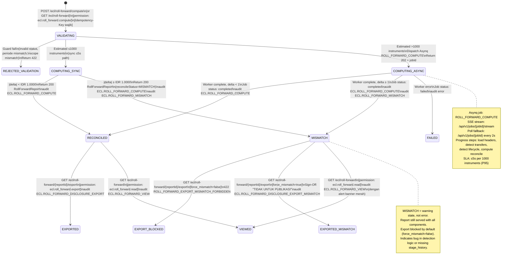

# P4-M11 Roll-Forward CKPN — State Machines, Algorithms, Validation Rules, Hand-off Notes

**Story Set**: APP-C-M11-001..006
**Module**: APP-C — Roll-Forward CKPN (Phase 4, Sprint 4)
**Author**: system-analyst
**Date**: 2026-06-13
**Branch**: feature/phase-4-m11-roll-forward-contracts
**OpenAPI**: `api/openapi/app-c-roll-forward.yaml`
**Depends on**: P4-M7 (ecl.calc_header, ecl.stage_history), P4-M8 (ecl.calc_run sealing)

---

## 1. Compute Path — Decision Tree

```mermaid
flowchart TD
    A([POST /ecl/roll-forward/compute]) --> B{currentCalcRunId\nstatus?}
    B -->|DRAFT| E1[422 ROLL_FORWARD_CURRENT_INVALID_STATE]
    B -->|COMPLETED\nor SEALED| C{priorCalcRunId\nprovided?}

    C -->|null| D1[Opening = 0\nAll instruments = originations\nAll transfers = 0\nAll derecognitions = 0\nRemeasurements = 0]

    C -->|provided| D2{priorCalcRunId\nstatus?}
    D2 -->|DRAFT| W1[Warning: ROLL_FORWARD_PRIOR_NOT_SEALED_PREVIEW\nAllow preview — not for disclosure]
    D2 -->|COMPLETED| W1
    D2 -->|SEALED| D3{Periode prior\n< periode current?}
    W1 --> D3
    D3 -->|No\nor same| E2[422 ROLL_FORWARD_PERIODE_MISMATCH]
    D3 -->|Yes| D4{Scope match?\ncurrent vs prior\ninstrument universe}
    D4 -->|Partial mismatch\ndetected| E3[422 ROLL_FORWARD_SCOPE_MISMATCH]
    D4 -->|Match or\nindeterminate| COMP

    D1 --> RECONCILE
    COMP([Run Detection Algorithms]) --> TRANS[Stage Transfer Detection\nsee §2]
    TRANS --> LIFE[Lifecycle Detection\nsee §3]
    LIFE --> REMES[Remeasurement = Residual\nsee §4]
    REMES --> RECONCILE

    RECONCILE{|closing − Σ ecl_fl_idr|\n< IDR 1.0000?}
    RECONCILE -->|Yes| REC[reconcileStatus = RECONCILED]
    RECONCILE -->|No| MIS[reconcileStatus = MISMATCH\naudit ECL.ROLL_FORWARD_MISMATCH]

    REC --> SIZE{Estimated instruments\n≤ 1000?}
    MIS --> SIZE
    SIZE -->|Yes, sync ≤5s| R200[200 RollForwardReport\naudit ECL.ROLL_FORWARD_COMPUTE]
    SIZE -->|No, async| R202[202 Accepted + jobId\nAsynq ROLL_FORWARD_COMPUTE\nSSE stream]
```

---

## 2. Stage Transfer Detection Algorithm (M11-002)

```
Input:  priorRunID, currentRunID
Output: TransferBuckets (6 directional), StageSamePool

Algorithm BASIC_STATUS_DIFF stage transfer:

1. Load prior_headers  = SELECT instrumen_id, stage, ecl_fl_idr
                         FROM ecl.calc_header WHERE calc_run_id = priorRunID

2. Load current_headers = SELECT instrumen_id, stage, ecl_fl_idr
                          FROM ecl.calc_header WHERE calc_run_id = currentRunID

3. instruments_in_both = prior_headers ∩ current_headers (by instrumen_id)

4. For each instrumen_id in instruments_in_both:
   prior_stage   = prior_headers[instrumen_id].stage
   current_stage = current_headers[instrumen_id].stage
   ecl_prior     = prior_headers[instrumen_id].ecl_fl_idr
   ecl_current   = current_headers[instrumen_id].ecl_fl_idr
   ecl_movement  = ecl_current − ecl_prior   ← signed

   if prior_stage == current_stage:
     add to stage_same_pool with ecl_movement
   else:
     bucket = lookup_bucket(prior_stage, current_stage)
     add (instrumen_id, ecl_movement, override_flag) to bucket

     # Lookup override_flag
     stage_hist = ecl.stage_history WHERE instrumen_id AND calc_run_id = currentRunID
                  ORDER BY created_at DESC LIMIT 1
     if stage_hist.trigger_type = "MANAGEMENT_OVERRIDE":
       override_flag = true
     elif stage_hist IS NULL:
       override_flag = false
       add DataQualityWarning: STAGE_HISTORY_MISSING_FALLBACK_CALC_HEADER
     else:
       override_flag = false

5. Aggregate per bucket:
   bucket.count          = count(instrumen_id in bucket)
   bucket.eclMovementIdr = Σ(ecl_movement per instrumen in bucket)  ← signed
   bucket.countOverride  = count(instrumen_id where override_flag=true)

Bucket mapping (prior_stage → current_stage):
  STAGE_1 → STAGE_2 : stage1To2   (SICR)
  STAGE_2 → STAGE_1 : stage2To1   (Cure)
  STAGE_2 → STAGE_3 : stage2To3   (Default)
  STAGE_1 → STAGE_3 : stage1To3   (Rare direct default)
  STAGE_3 → STAGE_2 : stage3To2   (Override reverse)
  STAGE_3 → STAGE_1 : stage3To1   (Override only — countOverride MUST = count)

Note: Stage 3→1 ALWAYS management override per OQ-M11-002-B.
      System-generated auto-cure cannot skip Stage 3→1 directly.
```

---

## 3. Lifecycle Detection Algorithm (M11-003)

```
Input:  priorRunID, currentRunID
Output: NewOriginations (list), Derecognitions (list)

Algorithm BASIC_STATUS_DIFF lifecycle:

1. prior_ids   = SELECT instrumen_id FROM ecl.calc_header WHERE calc_run_id = priorRunID
2. current_ids = SELECT instrumen_id FROM ecl.calc_header WHERE calc_run_id = currentRunID

3. origination_ids   = current_ids − prior_ids   (set difference: in current NOT in prior)
4. derecognition_ids = prior_ids − current_ids   (set difference: in prior NOT in current)

For each instrumen_id in origination_ids:
  ecl_current = current_headers[instrumen_id].ecl_fl_idr
  add to NewOriginations: { instrumenId, eclCurrentIdr = ecl_current }
  # Note: FVTPL→AC reklasifikasi = origination (OQ-M11-003-B locked)

new_originations_idr = Σ(eclCurrentIdr for all originations)

For each instrumen_id in derecognition_ids:
  ecl_prior = prior_headers[instrumen_id].ecl_fl_idr
  inst = mst.instrumen WHERE id = instrumen_id
  reason = classify_reason(inst)
  add to Derecognitions: { instrumenId, priorEclIdr = ecl_prior, derecognitionReason = reason }

  if reason = UNKNOWN AND inst.status = 'AKTIF':
    add DataQualityWarning: INSTRUMEN_AKTIF_NOT_IN_CURRENT_RUN

derecognitions_idr = Σ(priorEclIdr for all derecognitions)

classify_reason(inst):
  if inst.status = 'JATUH_TEMPO'         → MATURED
  elif inst.status = 'DIJUAL'            → SOLD
  elif inst.tanggal_jatuh_tempo ≤ today  → MATURED
  else                                    → UNKNOWN

Limitation (Phase 4):
  detection_method = "BASIC_STATUS_DIFF"
  phase5_limitation_note = "Deteksi origination/derecognition menggunakan perubahan
  status instrumen dan kehadiran di calc_run result. Untuk deteksi berbasis
  transaction lifecycle events (penempatan, penjualan, jatuh tempo), update ke
  Phase 5 (APP-B integration)."
```

---

## 4. Reconcile Invariant + Remeasurement Formula

```
Reconcile invariant (DEC-010 downstream read):
  sum_ecl_fl_idr = Σ ecl.calc_header.ecl_fl_idr WHERE calc_run_id = currentRunID
                   (excludes POCI_DEFERRED rows where ecl_fl_idr IS NULL)

  closing_ecl_idr  = sum_ecl_fl_idr   ← by definition

  reconcile_delta  = closing_ecl_idr
                   − opening_ecl_idr
                   − Σ(transfers.*.eclMovementIdr)  ← all 6 buckets, signed
                   − new_originations_idr
                   + derecognitions_idr              ← reversed sign (removed from portfolio)
                   − remeasurements_idr              ← residual, solved last

  Therefore solve for remeasurements_idr:
  remeasurements_idr = closing_ecl_idr
                     − opening_ecl_idr
                     − Σ(transfers.*.eclMovementIdr)
                     − new_originations_idr
                     + derecognitions_idr

  reconcile_check:
    reconcile_delta should = 0 by construction (remeasurements absorbs residual)
    BUT: floating point → use shopspring/decimal throughout
    reconcile_delta = closing_ecl_idr
                    − (opening_ecl_idr + Σtransfers + new_originations - derecognitions + remeasurements)
    |reconcile_delta| < IDR 1.0000  →  RECONCILED
    |reconcile_delta| ≥ IDR 1.0000  →  MISMATCH (indicates bug in detection logic)

Tolerance: IDR 1.0000 absolute (OQ-M11-001-C locked, production).

Sign convention (OQ-M11-002-A locked):
  Positive value = INCREASE in ECL allowance (loss booked)
    Examples: stage1To2 (SICR), stage2To3, stage1To3, new_originations
  Negative value = DECREASE in ECL allowance (cure/recovery/release)
    Examples: stage2To1, stage3To2, stage3To1, derecognitions subtracted

  In remeasurements: positive = ECL increased without stage change (parameter shift, EAD change)
                     negative = ECL decreased without stage change (portfolio shrinks)
```

---

## 5. Validation Rules Table

### 5.1 POST /ecl/roll-forward/compute

| Field | Rule | Error Code | HTTP | Message-id |
|---|---|---|---|---|
| `currentCalcRunId` | required, valid UUID | `VALIDATION_FAILED` | 400 | field.required |
| `currentCalcRunId` | must exist in ecl.calc_run | `NOT_FOUND` | 404 | entity.not_found |
| `currentCalcRunId` | status must be COMPLETED or SEALED | `ROLL_FORWARD_CURRENT_INVALID_STATE` | 422 | roll_forward.current_invalid_state |
| `priorCalcRunId` | optional, valid UUID if provided | `VALIDATION_FAILED` | 400 | field.format.uuid |
| `priorCalcRunId` | must exist in ecl.calc_run if provided | `ROLL_FORWARD_PRIOR_NOT_FOUND` | 404 | roll_forward.prior_not_found |
| `priorCalcRunId` | periode must be strictly before current.periode | `ROLL_FORWARD_PERIODE_MISMATCH` | 422 | roll_forward.periode_mismatch |
| `priorCalcRunId` | status SEALED (DRAFT/COMPLETED allowed with warning) | `ROLL_FORWARD_PRIOR_NOT_SEALED` | 422 (hard) or 200+warning (soft) | roll_forward.prior_not_sealed |
| `options.detectionMethod` | enum: [BASIC_STATUS_DIFF] | `ROLL_FORWARD_DETECTION_METHOD_INVALID` | 422 | roll_forward.detection_method_invalid |
| Cross-field | Scope of current and prior run must be compatible | `ROLL_FORWARD_SCOPE_MISMATCH` | 422 | roll_forward.scope_mismatch |
| Header | `Idempotency-Key` required (UUID v4) | `VALIDATION_FAILED` | 400 | header.idempotency_key.required |
| Auth | `ecl.roll_forward.compute` permission | `FORBIDDEN` | 403 | permission.denied |

### 5.2 GET /ecl/roll-forward

| Field | Rule | Error Code | HTTP | Message-id |
|---|---|---|---|---|
| `currentCalcRunId` | required in query, valid UUID | `VALIDATION_FAILED` | 400 | field.required |
| `currentCalcRunId` | must exist, status COMPLETED or SEALED | `ROLL_FORWARD_CURRENT_INVALID_STATE` | 422 | roll_forward.current_invalid_state |
| `priorCalcRunId` | optional; if provided same rules as POST | see POST rules | — | — |
| Auth | `ecl.roll_forward.read` permission | `FORBIDDEN` | 403 | permission.denied |

### 5.3 GET /ecl/roll-forward/{reportId}/export

| Field | Rule | Error Code | HTTP | Message-id |
|---|---|---|---|---|
| `reportId` | must map to a valid computed roll-forward | `NOT_FOUND` | 404 | entity.not_found |
| `format` | enum: [xlsx, csv, pdf]; pdf reserved Phase 5 | `VALIDATION_FAILED` | 400 | field.enum |
| `force_mismatch` | boolean; default false | `VALIDATION_FAILED` | 400 | field.boolean |
| Cross-field | `reconcileStatus = MISMATCH` AND `force_mismatch = false` | `ROLL_FORWARD_EXPORT_MISMATCH_FORBIDDEN` | 422 | roll_forward.export_mismatch_forbidden |
| Auth | `ecl.roll_forward.export` permission | `FORBIDDEN` | 403 | permission.denied |

### 5.4 GET /ecl/roll-forward/portfolios/{portofolioId}

| Field | Rule | Error Code | HTTP | Message-id |
|---|---|---|---|---|
| `portofolioId` | valid UUID, must exist | `ROLL_FORWARD_PORTFOLIO_NOT_FOUND` | 404 | roll_forward.portfolio_not_found |
| `currentCalcRunId` | required, COMPLETED or SEALED | `ROLL_FORWARD_CURRENT_INVALID_STATE` | 422 | — |
| `priorCalcRunId` | optional; same rules as POST | see POST | — | — |
| Auth | `ecl.roll_forward.read` permission | `FORBIDDEN` | 403 | — |

### 5.5 GET /dashboard/ckpn-trend

| Field | Rule | Error Code | HTTP | Message-id |
|---|---|---|---|---|
| `periods` | integer, min 2, max 24, default 12 | `VALIDATION_FAILED` | 400 | field.range |
| Business | At least 2 SEALED calc_run must exist | `ROLL_FORWARD_TREND_INSUFFICIENT_DATA` | 422 | roll_forward.trend_insufficient_data |
| `filter[portofolio_id]` | valid UUID if provided | `VALIDATION_FAILED` | 400 | field.format.uuid |
| Auth | `ecl.roll_forward.read` + `ecl.portfolio_aggregate.read` | `FORBIDDEN` | 403 | — |

---

## 6. State Diagram — Roll-Forward Compute Lifecycle



---

## 7. Performance SLA

| Operation | Instrument Count | Mode | SLA (P95) |
|---|---|---|---|
| Sync compute | ≤ 1000 | 200 response | ≤ 5s |
| Async compute | > 1000 | 202 + Asynq | ≤ 5s per 1000 instruments |
| Export inline | ≤ 10k rows | streaming | ≤ 10s |
| Export async | > 10k rows | 202 + MinIO | ≤ 60s |
| Trend dashboard | N/A (SEALED runs only) | 200 | ≤ 500ms |
| Per-portfolio breakdown | per portfolio | 200 | ≤ 1s |

---

## 8. Error Code Additions to `_common.yaml`

New error codes to be appended to the `ErrorCode` enum in `api/openapi/_common.yaml`:

```yaml
# Roll-Forward CKPN (APP-C, P4-M11)
- ROLL_FORWARD_PRIOR_NOT_FOUND          # 404 — priorCalcRunId tidak ada di ecl.calc_run
- ROLL_FORWARD_PRIOR_NOT_SEALED         # 422 — prior bukan SEALED (DRAFT OK untuk preview tapi warning)
- ROLL_FORWARD_CURRENT_INVALID_STATE    # 422 — current harus COMPLETED atau SEALED
- ROLL_FORWARD_PERIODE_MISMATCH         # 422 — current periode harus setelah prior periode
- ROLL_FORWARD_DETECTION_METHOD_INVALID # 422 — detectionMethod bukan nilai valid enum
- ROLL_FORWARD_EXPORT_MISMATCH_FORBIDDEN # 422 — block export jika MISMATCH dan force_mismatch=false
- ROLL_FORWARD_PORTFOLIO_NOT_FOUND      # 404 — portofolioId tidak ditemukan di mst.portofolio
- ROLL_FORWARD_TREND_INSUFFICIENT_DATA  # 422 — butuh ≥ 2 SEALED calc run untuk tren
- ROLL_FORWARD_SCOPE_MISMATCH           # 422 — scope run partial vs all-active tidak kompatibel
- ROLL_FORWARD_INVALID_CALC_RUN_STATUS  # 422 — alias spesifik untuk current status tidak valid (UI validation)
- ROLL_FORWARD_INVALID_PRIOR_PERIOD     # 422 — alias spesifik untuk periode mismatch (UI validation)
# Warning codes (non-error, returned in warnings[] field of HTTP 200 response)
# ROLL_FORWARD_FIRST_PERIOD_OPENING_ZERO — priorCalcRunId = null, opening = 0
# ROLL_FORWARD_MISMATCH_DETECTED — reconcileStatus = MISMATCH
# ROLL_FORWARD_PRIOR_NOT_SEALED_PREVIEW — prior bukan SEALED (preview only)
# ROLL_FORWARD_HAS_DATA_QUALITY_WARNINGS — ada instrumen dengan data quality issues
```

---

## 9. Audit Events Summary

| Event | Trigger | Actor | Entity |
|---|---|---|---|
| `ECL.ROLL_FORWARD_COMPUTE` | Compute berhasil (RECONCILED atau MISMATCH) | RISK, AKUN-CTL | ecl.calc_run (currentCalcRunId) |
| `ECL.ROLL_FORWARD_MISMATCH` | reconcileStatus = MISMATCH | System | ecl.calc_run |
| `ECL.ROLL_FORWARD_VIEW` | GET /ecl/roll-forward berhasil | RISK, AKUN-CTL, CFO, AUDIT, ALCO | ecl.calc_run |
| `ECL.ROLL_FORWARD_DISCLOSURE_EXPORT` | Export disclosure berhasil (RECONCILED) | AKUN-CTL, CFO, AUDIT | ecl.calc_run |
| `ECL.ROLL_FORWARD_DISCLOSURE_EXPORT_MISMATCH` | Export dengan force_mismatch=true | AKUN-CTL, CFO | ecl.calc_run |

Audit log entries untuk export wajib menyertakan:
```json
{
  "after_jsonb": {
    "format": "xlsx",
    "periode_id": "JUNI-2026",
    "calc_run_id": "...",
    "prior_calc_run_id": "...",
    "reconcile_status": "RECONCILED",
    "row_count": 850,
    "filename": "ckpn-roll-forward-JUNI-2026-20260613.xlsx",
    "detection_method": "BASIC_STATUS_DIFF",
    "force_mismatch": false
  }
}
```

---

## 10. Hand-off Notes

### Picks up next:

**`backend-engineer-go`**:
- Implement `internal/ecl/rollforward/transfer_detector.go`: algorithm §2
- Implement `internal/ecl/rollforward/lifecycle_detector.go`: algorithm §3
- Implement `internal/ecl/rollforward/service.go`: orchestrate algorithms, reconcile formula §4
- Implement `internal/ecl/rollforward/handler.go`: REST handler for 5 endpoints
- Asynq worker `internal/worker/roll_forward_compute.go` (UX §3 pattern)
- Repository: read-only from `ecl.calc_header`, `ecl.stage_history`, `mst.instrumen`
- Export: `excelize` XLSX (3 sheets), CSV (UTF-8 BOM), async MinIO upload
- SSE stream reuse pattern from M7/M8 job stream
- SoD: no SoD for read/compute (no workflow); export permission check only
- Idempotency: POST compute wajib check `sys.idempotency_key`
- Precision: `shopspring/decimal` throughout, no float64

**`frontend-engineer-nextjs`** (after `uiux-designer` specs):
- Page `/ecl/roll-forward`: waterfall card + reconcile badge + drill-down slide panel
- Tab "Per Portofolio": DataTable UX §1 (sort + cursor + filter + export)
- `<JobProgressPanel>` for async compute (UX §3)
- Dashboard `/dashboard/ckpn-trend`: Recharts LineChart + BarChart + DataTable
- Deep-link URL state via nuqs (currentCalcRunId + priorCalcRunId in URL)
- Export trigger: inline ≤10k, async 202+jobId + progress for >10k
- `<DestructiveActionDialog>` for MISMATCH export override
- Notification UX §2: reconcile MISMATCH = toast error persistent + delta amount

**`data-modeler`**: No schema changes needed for M11.
- All reads from existing tables: `ecl.calc_header`, `ecl.stage_history`, `ecl.calc_run`, `mst.instrumen`, `mst.portofolio`
- `aud.audit_log` writes (existing schema, append-only)
- No new tables needed (no cache table per OQ-M11-001-A resolution)

**`ifrs9-compliance-reviewer`** (BLOCKING gate):
- Verify reconcile invariant formula (§4) matches PSAK 71 §5.5
- Confirm sign convention (positive = increase) aligns with PSAK 71 presentation
- Confirm Stage 3→1 only via management override (OQ-M11-002-B)
- Confirm FVTPL→AC = origination in ECL roll-forward (OQ-M11-003-B)
- Confirm ead_idr as proxy for gross_carrying Phase 4 (OQ-M11-005-A)
- Verify XLSX disclosure format (3 sheets) sufficient for PSAK 71 §5.5
- Confirm reconcile tolerance IDR 1.0000 production-grade (OQ-M11-001-C)

**`qa-engineer`**:
- UAT: reconcile check happy path (RECONCILED)
- UAT: opening = 0 (periode pertama)
- UAT: MISMATCH scenario (delta > 1.0000)
- UAT: stage transfer detection accuracy (6 buckets, sign verification)
- UAT: origination/derecognition detection with BASIC_STATUS_DIFF
- UAT: FVTPL→AC treated as origination
- UAT: Stage 3→1 only via management override flag
- UAT: export MISMATCH block + force_mismatch=true override
- UAT: permission enforcement (ROLE-AKUN cannot compute; ROLE-AUDIT can read + export)
- UAT: SoD not applicable (no workflow on roll-forward)
- UAT: Idempotency-Key replay on POST compute
- UAT: async path (>1000 instruments) + SSE progress

### Tags:
- `review-required` — BLOCKING from `ifrs9-compliance-reviewer`
- Phase 4 deliverable (M11 completes Phase 4 for APP-C)
