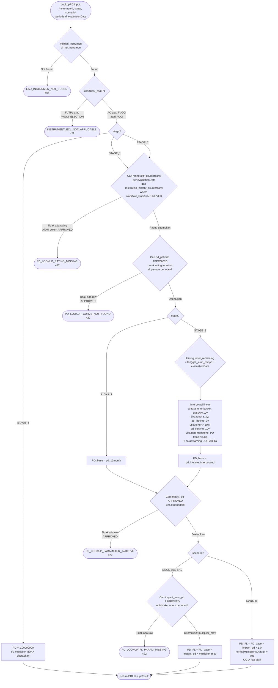
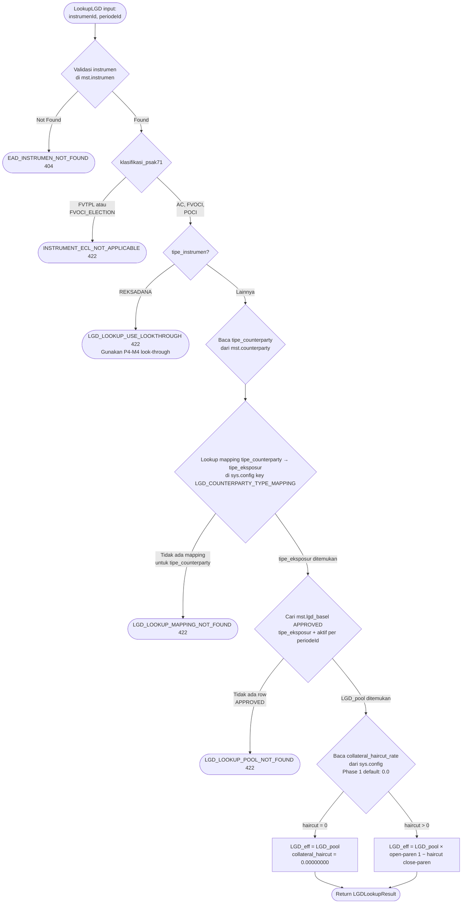
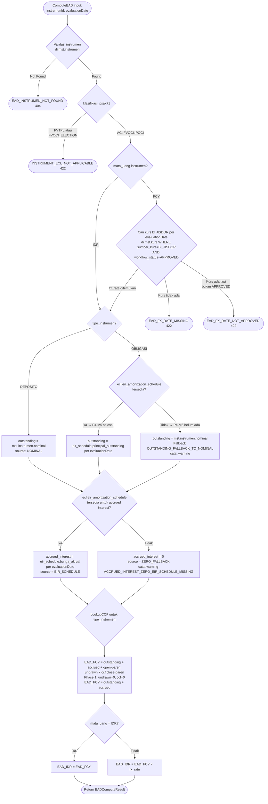

# P4-M2 — ECL Helpers: Decision Trees, Error Catalog, Performance SLA, Hand-off Spec

**Modul**: APP-C — ECL Engine
**Story Set**: APP-C-PAR-001..006
**FSD Ref**: FSD-APP-C-ECL-EIR-v1.0.docx §3 (ECL Parameters), §4 (EAD computation)
**Decisions**: DEC-010, DEC-011, DEC-016, DEC-017, DEC-021, DEC-022
**Author**: system-analyst
**Tanggal**: 2026-06-11
**Status**: DRAFT — review-required tag: `ifrs9-compliance-reviewer` (BLOCKING gate)

> **Catatan**: M2 adalah modul read-only stateless. Tidak ada state machine workflow.
> File ini mendokumentasikan decision trees per helper, error catalog, performance
> contracts, audit policy, dan hand-off spec untuk data-modeler + ecl-eir-engineer.

---

## 1. Decision Trees per Helper

### 1.1 PD Lookup (Story APP-C-PAR-001)



### 1.2 LGD Lookup (Story APP-C-PAR-002)



### 1.3 EAD Computation (Story APP-C-PAR-003)



### 1.4 CCF Lookup (Story APP-C-PAR-004)

```mermaid
flowchart TD
    A([LookupCCF input:\ntipeInstrumen]) --> B{Enum valid?}
    B -- Tidak ada di\nTipeInstrumen enum --> ERR1([CCF_INSTRUMEN_TYPE_UNKNOWN 422])
    B -- Valid --> C{Baca sys.config\nkey CCF_TABLE\nWHERE config_key = CCF_TABLE}
    C -- Tidak ada config --> ERR2([CCF_CONFIG_MISSING 422])
    C -- Config ditemukan --> D{tipeInstrumen ada\ndi JSONB CCF_TABLE?}
    D -- Tidak ada --> E[CCF = 0.0000\nDefault fallback\ncatat warning CCF_TYPE_NOT_IN_CONFIG_USING_DEFAULT\nsource = SYS_CONFIG]
    D -- Ada --> F[CCF = CCF_TABLE[tipeInstrumen]\nPhase 1: semua = 0.0000\nsource = PHASE_1_HARDCODED]
    E --> OK([Return CCFLookupResult])
    F --> OK
```

### 1.5 Bulk Combined Lookup (Story APP-C-PAR-006)

```mermaid
flowchart TD
    A([BulkLookup input:\nrequests array, periodeId, evaluationDate]) --> B{len requests == 0?}
    B -- Ya --> OK1([Return summary total=0, empty results])
    B -- Tidak --> C{len requests > 1000?}
    C -- Ya --> ERR1([HELPERS_BULK_TOO_LARGE 413])
    C -- Tidak --> D[BATCH LOAD semua parameter\nmaks 10 DB round-trips:\n1 ratings map\n2 pd_pefindo map\n3 lgd_basel map\n4 bobot_skenario\n5 impact_pd\n6 impact_mev_pd\n7 kurs map\n8 EIR schedule batch\n9 instrumen batch\n10 counterparty batch]

    D --> E[Loop instrumen O-paren 1 close-paren lookup dari in-memory maps]
    E --> F{klasifikasi_psak71}
    F -- FVTPL atau FVOCI_ELECTION --> G[Tambah ke skipped array\nINSTRUMENT_ECL_NOT_APPLICABLE]
    F -- AC, FVOCI, POCI --> H{PD lookup sukses?}
    H -- Error --> I[Tambah ke errors array\npartial failure — lanjut ke instrumen berikutnya]
    H -- OK --> J{LGD lookup sukses?}
    J -- Error --> I
    J -- OK --> K{EAD computation sukses?}
    K -- Error --> I
    K -- OK dengan warning --> L[Tambah ke results\nwarnings[] terisi]
    K -- OK tanpa warning --> M[Tambah ke results\nwarnings empty]
    L --> E
    M --> E
    G --> E
    I --> E

    E -- Semua selesai --> N[Hitung summary:\ntotal, success, warning, skipped\nexecutionMs]
    N --> OK2([Return BulkLookupResponse])
```

---

## 2. Error Catalog — P4-M2 Baru

Semua error code ini STABIL (tidak pernah diubah tanpa MAJOR version bump, DEC-020).
Error code harus ditambahkan ke `_common.yaml#/components/schemas/ErrorCode` enum.

| Error Code | HTTP Status | Story | Trigger | Pesan Template |
|---|---|---|---|---|
| `PD_LOOKUP_RATING_MISSING` | 422 | PAR-001 | Rating aktif counterparty tidak ada per evaluationDate | "Rating aktif untuk counterparty {cpId} tidak ditemukan per tanggal {date}. Perlu upload rating Pefindo terbaru." |
| `PD_LOOKUP_CURVE_NOT_FOUND` | 422 | PAR-001 | Rating tersedia tapi tidak ada pd_pefindo APPROVED | "Kurva PD tidak ditemukan untuk rating {rating} per periode {periodeId}. Pastikan mst.pd_pefindo sudah diisi dan di-approve." |
| `PD_LOOKUP_PARAMETER_INACTIVE` | 422 | PAR-001 | impact_pd tidak ada row APPROVED untuk periodeId | "Forward-looking multiplier (impact_pd) tidak ditemukan untuk periode {periodeId}. Parameter ECL belum disetujui ALCO." |
| `PD_LOOKUP_FL_PARAM_MISSING` | 422 | PAR-001 | impact_mev_pd (GOOD/BAD) tidak ada row APPROVED | "Forward-looking MEV multiplier tidak ditemukan untuk skenario {scenario} periode {periodeId}." |
| `PD_LOOKUP_TENOR_OUT_OF_RANGE` | 422 | PAR-001 | tenor_remaining negatif (instrumen sudah jatuh tempo tapi masih aktif) | "Instrumen {instrumenId} memiliki tanggal_jatuh_tempo di masa lalu ({date}). Anomali — verifikasi status instrumen." |
| `LGD_LOOKUP_POOL_NOT_FOUND` | 422 | PAR-002 | Tidak ada row APPROVED di mst.lgd_basel untuk tipe_eksposur | "LGD pool untuk tipe_eksposur {tipeEksposur} tidak ditemukan atau belum di-approve ALCO untuk periode {periodeId}." |
| `LGD_LOOKUP_MAPPING_NOT_FOUND` | 422 | PAR-002 | tipe_counterparty tidak ada di sys.config LGD_COUNTERPARTY_TYPE_MAPPING | "Tipe counterparty '{tipeCounterparty}' tidak memiliki mapping LGD pool. Konfigurasikan di sys.config LGD_COUNTERPARTY_TYPE_MAPPING." |
| `LGD_COLLATERAL_HAIRCUT_INVALID` | 422 | PAR-002 | Nilai collateral haircut di luar range [0, 1) | "Collateral haircut untuk tipe {tipeKolateral} tidak valid: {nilai}. Harus antara 0 dan 1 (eksklusif)." |
| `LGD_LOOKUP_USE_LOOKTHROUGH` | 422 | PAR-002 | Instrumen REKSADANA coba di-lookup via pool tunggal | "Instrumen REKSADANA menggunakan mekanisme look-through ECL (P4-M4). LGD tidak di-lookup per pool tunggal." |
| `EAD_FX_RATE_MISSING` | 422 | PAR-003 | Kurs BI JISDOR tidak tersedia per evaluationDate | "Kurs BI JISDOR untuk {currency} tidak tersedia per {date}. Upload kurs manual atau tunggu feed BI." |
| `EAD_FX_RATE_NOT_APPROVED` | 422 | PAR-003 | Kurs ada tapi workflow_status bukan APPROVED | "Kurs {currency} per {date} belum di-approve (status: {status}). Kurs harus APPROVED sebelum dipakai ECL." |
| `EAD_INSTRUMEN_NOT_FOUND` | 404 | PAR-001,003 | instrumenId tidak ada di mst.instrumen | "Instrumen {instrumenId} tidak ditemukan di mst.instrumen." |
| `CCF_CONFIG_MISSING` | 422 | PAR-004 | sys.config CCF_TABLE tidak ada | "sys.config 'CCF_TABLE' tidak ditemukan. Pastikan seed data config sudah dijalankan." |
| `CCF_INSTRUMEN_TYPE_UNKNOWN` | 422 | PAR-004 | tipe_instrumen bukan nilai enum yang valid | "Tipe instrumen '{tipeInstrumen}' tidak dikenali. Pastikan nilai berasal dari enum TipeInstrumen." |
| `HELPERS_BULK_TOO_LARGE` | 413 | PAR-001,002,003,006 | Request array > 1000 item | "Request melebihi batas 1000 instrumen per batch. Gunakan beberapa request." |
| `HELPERS_PARAMETER_SNAPSHOT_MISMATCH` | 409 | PAR-006 | Calc run sealed pakai snapshot lama, request pakai snapshot baru | "Calc run {calcRunId} sealed menggunakan snapshot parameter lama. Gunakan parameter snapshot yang sama untuk konsistensi." |
| `INSTRUMENT_ECL_NOT_APPLICABLE` | 422 | PAR-001,002,003 | Instrumen FVTPL atau FVOCI_ELECTION tidak butuh ECL | "Instrumen {instrumenId} klasifikasi {klasifikasi} tidak memerlukan ECL (IFRS9 §5.5.1)." |
| `ECL_PARAM_NOT_READY` | 422 | PAR-005 | Parameter belum semua APPROVED untuk periode | "Parameter ECL untuk periode {periodeId} belum lengkap atau belum di-approve ALCO. Pastikan semua parameter master sudah APPROVED." |

**Catatan**:
- `HELPERS_PARAMETER_SNAPSHOT_MISMATCH` digunakan saat P4-M7 calc_run sealing tersedia. M2 mendokumentasikan kode ini tapi belum memicunya (defer ke M7).
- Error codes lama dari P4-M1 (`STAGING_*`) tetap berlaku dan tidak digantikan.
- Error codes di atas harus ditambahkan ke `api/openapi/_common.yaml` enum `ErrorCode` oleh `backend-engineer-go`.

---

## 3. Validation Rules Table

| Field | Rule | Error Code | HTTP | Pesan |
|---|---|---|---|---|
| `instrumenId` (query/body) | format uuid, required | `VALIDATION_FAILED` | 400 | "instrumenId harus berformat UUID v4" |
| `stage` | enum STAGE_1/STAGE_2/STAGE_3 | `VALIDATION_FAILED` | 400 | "stage harus salah satu dari: STAGE_1, STAGE_2, STAGE_3" |
| `scenario` | enum GOOD/NORMAL/BAD | `VALIDATION_FAILED` | 400 | "scenario harus salah satu dari: GOOD, NORMAL, BAD" |
| `evaluationDate` | format date ISO 8601, required | `VALIDATION_FAILED` | 400 | "evaluationDate harus format YYYY-MM-DD" |
| `evaluationDate` | tidak boleh di masa depan (> today) | `VALIDATION_FAILED` | 400 | "evaluationDate tidak boleh di masa depan" |
| `periodeId` | non-empty string, required | `VALIDATION_FAILED` | 400 | "periodeId wajib diisi" |
| `instrumenType` (CCF) | enum TipeInstrumen | `CCF_INSTRUMEN_TYPE_UNKNOWN` | 422 | "Tipe instrumen tidak dikenali" |
| `requests` (bulk) | minItems=1, maxItems=1000 (untuk bulk PD/LGD/EAD) | `HELPERS_BULK_TOO_LARGE` | 413 | "Melebihi batas 1000 instrumen per batch" |
| `requests` (bulk-lookup) | minItems=0, maxItems=1000 | `HELPERS_BULK_TOO_LARGE` | 413 | "Melebihi batas 1000 instrumen per batch" |
| `format` (export) | enum csv/xlsx | `VALIDATION_FAILED` | 400 | "format harus csv atau xlsx" |
| `sort` (preview) | pattern `^[a-z_]+(:(asc|desc))?` | `INVALID_SORT_COL` | 400 | "Kolom sort tidak valid atau tidak diizinkan" |
| `limit` (preview) | integer 1-200 | `VALIDATION_FAILED` | 400 | "limit harus antara 1 dan 200" |

**Cross-field rules**:
- Jika `stage = STAGE_3`, `scenario` diabaikan (PD = 1.0 fixed) — tidak error, tapi `scenario` di response tetap disertakan untuk traceability.
- Jika `mata_uang = 'IDR'`, `fxRate` di response = null (tidak ada konversi) — tidak error.
- `evaluationDate` untuk preview endpoint default ke hari ini jika tidak disertakan (karena periodeId sudah cukup untuk resolusi kurs) — didokumentasikan di endpoint description.

---

## 4. Performance Contracts (SLA)

| Endpoint | Skenario | Target SLA | Metode Pengukuran |
|---|---|---|---|
| `GET /ecl/helpers/pd` | Single lookup, cold cache | ≤ 100ms p99 | Integration test timing |
| `GET /ecl/helpers/lgd` | Single lookup | ≤ 50ms p99 | Integration test timing |
| `GET /ecl/helpers/ead` | Single lookup, IDR instrument | ≤ 50ms p99 | Integration test timing |
| `GET /ecl/helpers/ccf` | Single lookup, sys.config cached | ≤ 20ms p99 | Integration test timing |
| `POST /ecl/helpers/pd/bulk` | 1000 instrumen, cold cache | ≤ 500ms p99 | Benchmark test wajib |
| `POST /ecl/helpers/lgd/bulk` | 1000 instrumen | ≤ 500ms p99 | Benchmark test wajib |
| `POST /ecl/helpers/ead/bulk` | 1000 instrumen | ≤ 500ms p99 | Benchmark test wajib |
| `POST /ecl/helpers/bulk-lookup` | 1000 instrumen, cold Redis | ≤ 500ms p99 | Benchmark test wajib |
| `POST /ecl/helpers/bulk-lookup` | 1000 instrumen, warm Redis | ≤ 100ms p99 | Benchmark test wajib |
| `GET /ecl/helpers/preview` | 50 instrumen, cursor page 1 | ≤ 200ms p99 | Integration test timing |
| `GET /ecl/helpers/preview/export` | 1000 instrumen inline CSV | ≤ 2 detik | Integration test timing |
| `GET /ecl/helpers/preview/export` | > 10.000 instrumen async | 202 dalam ≤ 200ms | Integration test timing |

**Anti-N+1 enforcement**:
- Bulk endpoints wajib diverifikasi via integration test yang menghitung jumlah DB round-trips.
- Target: ≤ 10 DB round-trips untuk bulk-lookup 1000 instrumen (lihat Story 6 logika performa).
- ecl-eir-engineer wajib menulis `TestBulkLookupDBRoundTrips` menggunakan `pgxmock` atau SQL query counter.

**Redis caching**:
- `ecl:params:bulk:{periode_id}:{evaluation_date}` — TTL 2 jam, invalidate on parameter master update.
- `ecl:params:ccf_table` — TTL 1 jam (sys.config jarang berubah).
- Cache miss: compute dan store; cache hit: return langsung.

---

## 5. Audit Policy

### 5.1 Yang TIDAK di-audit (high-volume read)

Endpoint single-lookup (Stories 1–4) dan preview GET **tidak** menulis `aud.audit_log` per panggilan.
Justifikasi: frekuensi sangat tinggi (dipanggil dalam loop instrumen saat calc run), menulis audit per call
akan membuat tabel `aud.audit_log` membengkak dan memperlambat operasi.

### 5.2 Yang DI-audit

| Event | Kapan | Tabel Target | Data yang Di-catat |
|---|---|---|---|
| `ECL_PARAM.PREVIEW_EXPORT` | ROLE-RISK klik Export | `aud.audit_log` | filter aktif, format, row_count, filename |
| `ECL_PARAM.BULK_LOOKUP_COMPLETE` | Setelah bulk-lookup selesai (per calc run) | `aud.audit_log` | periodeId, evaluationDate, total, success, warning, skipped, executionMs |
| `ECL_PARAM.PD_LOOKUP_SNAPSHOT` | Saat M7 calc run dimulai | `aud.audit_log` | Snapshot seluruh PD + FL parameter aktif |
| `ECL_PARAM.LGD_LOOKUP_SNAPSHOT` | Saat M7 calc run dimulai | `aud.audit_log` | Snapshot seluruh LGD parameter aktif |
| `ECL_PARAM.EAD_SNAPSHOT` | Saat M7 calc run dimulai | `aud.audit_log` | Kurs aktif yang digunakan |

### 5.3 Parameter snapshot untuk calc run (M7/M8 responsibility)

Saat P4-M7 ECL Engine menjalankan calc run, parameter snapshot dilakukan **sekali** per run:
- Snapshot disimpan di `ecl.calc_header.parameter_snapshot_jsonb` (atau referencing tabel terpisah — keputusan data-modeler).
- M2 helpers hanya **menyediakan data**. M2 tidak membuat snapshot.
- `HELPERS_PARAMETER_SNAPSHOT_MISMATCH` error digunakan M7/M8 saat mendeteksi inkonsistensi snapshot.
- OQ-M2-5: schema `ecl.calc_header.parameter_snapshot_id` — data-modeler perlu decide apakah JSONB blob di-inline atau tabel terpisah `ecl.parameter_snapshot`.

---

## 6. Hand-off Spec

### 6.1 Untuk `data-modeler`

#### Tabel yang sudah ada (Phase 3, gunakan as-is)

| Tabel | Migration | Status | Catatan |
|---|---|---|---|
| `mst.pd_pefindo` | 0013, 0014 | Tersedia | Kolom: rating, pd_12month, pd_lifetime_3y/5y/7y/10y, workflow_status, periode_berlaku_dari/sampai |
| `mst.lgd_basel` | 0010 | Tersedia | Kolom: tipe_eksposur, lgd, karakteristik, workflow_status |
| `mst.bobot_skenario` | 0011 | Tersedia | Kolom: skenario GOOD/NORMAL/BAD, bobot, periode_berlaku_dari/sampai |
| `mst.impact_mev_pd` | 0015 | Tersedia | Kolom: skenario IN('GOOD','BAD'), impact_multiplier, periode_id |
| `mst.impact_pd` | 0015 | Tersedia | Kolom: impact_multiplier (flat per periode), periode_id |
| `mst.kurs` | 0020 | Tersedia | Kolom: kode_mata_uang, nilai_kurs, sumber_kurs='BI_JISDOR', tanggal_berlaku, workflow_status |
| `mst.instrumen` | 0001, 0019 | Tersedia | Kolom: tipe_instrumen, mata_uang, nominal, klasifikasi_psak71, counterparty_id, tanggal_jatuh_tempo |
| `mst.counterparty` | 0001 | Tersedia | Perlu konfirmasi: apakah `tipe_counterparty` ada dan terisi konsisten? (OQ-M2-2) |
| `ecl.stage_history` | 0001, 0022 | Tersedia | P4-M1 output. Kolom: instrumen_id, stage_sesudah, tanggal_migrasi |

#### Tabel baru yang POTENTIALLY diperlukan (data-modeler decide)

| Tabel | Prioritas | Keterangan |
|---|---|---|
| `mst.ccf_table` | RENDAH — defer | Phase 1 pakai sys.config JSONB. Tabel terpisah hanya jika CCF perlu workflow approval (Phase 2+). |
| `mst.collateral_haircut` | RENDAH — defer | Phase 1 tidak ada collateral. Haircut via sys.config sudah cukup untuk saat ini. |

#### Pertanyaan untuk data-modeler (perlu konfirmasi sebelum ecl-eir-engineer mulai)

1. **OQ-M2-2**: Apakah `mst.counterparty.tipe_counterparty` kolom sudah ada di schema 0001?
   Nilai-nilai yang valid: `BANK`, `KORPORASI`, `PEMERINTAH`, `ASURANSI`, `REKSADANA`.
   Jika belum ada, perlu migration baru dengan ALTER TABLE + backfill plan.

2. **OQ-M2-5**: Schema untuk parameter snapshot calc run — apakah:
   - Option A: `ecl.calc_header.parameter_snapshot_jsonb JSONB` (inline JSONB blob, sederhana)
   - Option B: Tabel terpisah `ecl.parameter_snapshot` dengan referencing via `parameter_snapshot_id UUID`
   Rekomendasi: Option A untuk Phase 4; Option B jika diff/compare snapshot diperlukan di UI.

3. **Konfirmasi**: Apakah `mst.rating_history_counterparty` sudah ada dengan kolom
   `counterparty_id, rating_pefindo, tanggal_berlaku, workflow_status`?
   Ini adalah prerequisite kritis untuk PD lookup (Story 1).

4. **Konfirmasi**: Apakah `sys.config` tabel sudah ada dengan kolom
   `config_key TEXT, config_value JSONB`? Seed data wajib mencakup:
   - `CCF_TABLE` JSONB
   - `LGD_COUNTERPARTY_TYPE_MAPPING` JSONB
   - `LGD_COLLATERAL_HAIRCUT_*` JSONB entries

### 6.2 Untuk `ecl-eir-engineer`

Package target: `backend/internal/ecl/helpers/`

#### Go Service Interfaces (wajib exact signature)

```go
// Package: backend/internal/ecl/helpers

import (
    "context"
    "time"

    "github.com/google/uuid"
    "github.com/shopspring/decimal"
)

// --- Enums ---

type EclStage string
const (
    Stage1 EclStage = "STAGE_1"
    Stage2 EclStage = "STAGE_2"
    Stage3 EclStage = "STAGE_3"
)

type EclScenario string
const (
    ScenarioGood   EclScenario = "GOOD"
    ScenarioNormal EclScenario = "NORMAL"
    ScenarioBad    EclScenario = "BAD"
)

// --- PD ---

type PDDetail struct {
    Stage                    EclStage
    Scenario                 EclScenario
    PD                       decimal.Decimal // NUMERIC(10,8)
    PDBase                   decimal.Decimal
    RatingUsed               string
    TenorMonthsUsed          *int
    ImpactPDMultiplier       decimal.Decimal
    ImpactMevPDMultiplier    decimal.Decimal
    NormalMultiplierIsDefault bool            // OQ-A flag
    SourcePD12M              *decimal.Decimal
    SourcePDLifetime         *decimal.Decimal
    Warnings                 []HelperWarning
}

type PDLookupService interface {
    // GetPD mengembalikan PD untuk satu instrumen, stage, skenario, dan periode.
    // Stage3: PD = 1.0 fixed, FL tidak diterapkan.
    // No float64. Semua decimal.Decimal.
    GetPD(ctx context.Context, instrumenID uuid.UUID, stage EclStage, scenario EclScenario,
        periodeID string, evaluationDate time.Time) (decimal.Decimal, PDDetail, error)
}

// --- LGD ---

type LGDDetail struct {
    LGD               decimal.Decimal // NUMERIC(10,8)
    PoolUsed          string
    BaseLGD           decimal.Decimal
    CollateralHaircut decimal.Decimal
    LGDEffective      decimal.Decimal
    TipeCounterparty  string
    Warnings          []HelperWarning
}

type LGDLookupService interface {
    GetLGD(ctx context.Context, instrumenID uuid.UUID, periodeID string) (decimal.Decimal, LGDDetail, error)
}

// --- EAD ---

type EADBreakdown struct {
    OutstandingPrincipalFCY decimal.Decimal // NUMERIC(20,4)
    AccruedInterestFCY      decimal.Decimal
    CommittedUndrawnFCY     decimal.Decimal
    CCF                     decimal.Decimal // NUMERIC(7,4)
    EADFCY                  decimal.Decimal
    EADIDR                  decimal.Decimal
    FXRate                  *decimal.Decimal // NUMERIC(20,8); nil jika IDR
    FXSource                string
    AccruedInterestSource   string // "EIR_SCHEDULE" atau "ZERO_FALLBACK"
    Warnings                []HelperWarning
}

type EADService interface {
    ComputeEAD(ctx context.Context, instrumenID uuid.UUID, evaluationDate time.Time) (decimal.Decimal, EADBreakdown, error)
}

// --- CCF ---

type CCFDetail struct {
    CCF          decimal.Decimal // NUMERIC(7,4)
    Source       string          // "PHASE_1_HARDCODED" atau "SYS_CONFIG"
    Warnings     []HelperWarning
}

type CCFLookupService interface {
    GetCCF(ctx context.Context, instrumenType string) (decimal.Decimal, CCFDetail, error)
}

// --- Bulk ---

type BulkRequest struct {
    InstrumenID    uuid.UUID
    // PD-specific (opsional untuk bulk-lookup, engine resolve sendiri dari stage_history)
    Stage          *EclStage
    Scenario       *EclScenario
}

type BulkResult struct {
    InstrumenID uuid.UUID
    PDGood      decimal.Decimal
    PDNormal    decimal.Decimal
    PDBAd       decimal.Decimal
    LGD         decimal.Decimal
    EADIDR      decimal.Decimal
    EADBreakdown EADBreakdown
    CCF         decimal.Decimal
    Warnings    []HelperWarning
}

type BulkSummary struct {
    Total       int
    Success     int
    Warning     int
    Skipped     int
    ExecutionMs int64
}

type BulkError struct {
    InstrumenID uuid.UUID
    ErrorCode   string
    Message     string
}

type BulkSkipped struct {
    InstrumenID       uuid.UUID
    Reason            string
    KlasifikasiPsak71 string
}

type BulkHelperService interface {
    // BulkLookup returns PD+LGD+EAD+CCF untuk seluruh daftar instrumen sekaligus.
    // Anti-N+1: semua parameter di-batch load sebelum loop.
    // Partial failure: error instrumen masuk errors slice, tidak abort entire batch.
    // SLA: ≤ 500ms untuk 1000 instrumen cold cache, ≤ 100ms warm cache.
    BulkLookup(ctx context.Context, requests []BulkRequest, periodeID string,
        evaluationDate time.Time) ([]BulkResult, BulkSummary, []BulkError, []BulkSkipped, error)
}

// --- Warning ---

type HelperWarning struct {
    Code    string
    Message string
}
```

#### Implementasi yang harus dibuat ecl-eir-engineer

1. `PDLookupService` di `backend/internal/ecl/helpers/pd_service.go`:
   - Linear interpolation lifetime PD antar tenor bucket
   - Dual FL multiplier (OQ-A default: NORMAL multiplier = 1.0)
   - Stage 3: hardcode PD = 1.0, skip FL
   - FVTPL/FVOCI_ELECTION: return `INSTRUMENT_ECL_NOT_APPLICABLE`

2. `LGDLookupService` di `backend/internal/ecl/helpers/lgd_service.go`:
   - Mapping tipe_counterparty → tipe_eksposur via sys.config
   - REKSADANA: return `LGD_LOOKUP_USE_LOOKTHROUGH`
   - Collateral haircut (Phase 1: default 0)

3. `EADService` di `backend/internal/ecl/helpers/ead_service.go`:
   - EIR schedule lookup dengan fallback graceful (warning, bukan error)
   - Multi-currency: kurs BI JISDOR per evaluationDate dari mst.kurs
   - CCF via `CCFLookupService.GetCCF`

4. `CCFLookupService` di `backend/internal/ecl/helpers/ccf_service.go`:
   - Baca sys.config CCF_TABLE
   - Default fallback = 0.0000 jika tipe tidak ada di JSONB
   - Cache TTL 1 jam di Redis

5. `BulkHelperService` di `backend/internal/ecl/helpers/bulk_service.go`:
   - Batch load semua parameter dalam ≤ 10 round-trips
   - O(1) lookup dari in-memory maps
   - Redis cache `ecl:params:bulk:{periode_id}:{evaluation_date}` TTL 2 jam
   - Test wajib: `TestBulkLookupDBRoundTrips` memverifikasi ≤ 10 round-trips

6. HTTP handler di `backend/internal/api/handlers/ecl_helpers_handler.go`:
   - Gin routing untuk semua 9 endpoints
   - Permission check: `ecl_helpers.read` dan `ecl_helpers.preview`
   - Audit log untuk PREVIEW_EXPORT dan BULK_LOOKUP_COMPLETE

#### Testing requirements untuk ecl-eir-engineer

- Unit test per service function dengan `testify/mock`
- Integration test dengan real PostgreSQL (testcontainers)
- Benchmark test `BenchmarkBulkLookup1000` memverifikasi ≤ 500ms
- Test `TestBulkLookupPartialFailure` memverifikasi partial failure tidak abort batch
- Test `TestPDInterpolationLinear` dengan data: tenor 4y antara 3y dan 5y
- Test `TestStage3PDFixed` memverifikasi PD = 1.0 dan FL tidak diterapkan
- Test `TestFVTPLExclusion` memverifikasi INSTRUMENT_ECL_NOT_APPLICABLE

---

## 7. Open Questions Terbuka (perlu konfirmasi sebelum P4-M7)

| ID | Pertanyaan | Asumsi Default Aktif | Perlu Konfirmasi Dari |
|---|---|---|---|
| OQ-A | FL multiplier NORMAL skenario: apakah ada row di mst.impact_mev_pd untuk NORMAL? | NORMAL multiplier = 1.0 (tidak ada row). `normalMultiplierIsDefault = true` di response. | ifrs9-compliance-reviewer + ALCO |
| OQ-M2-1 | PD Lifetime interpolasi: linear vs bucket terdekat? | Linear interpolasi berdasarkan tenor_remaining | FSD-APP-C §3 + ecl-eir-engineer |
| OQ-M2-2 | Sumber tipe_eksposur LGD: kolom tipe_counterparty di mst.counterparty sudah ada? | Derive dari tipe_counterparty via sys.config mapping | data-modeler |
| OQ-M2-3 | Outstanding Principal untuk EAD: nominal vs EIR schedule? | Nominal untuk deposito; EIR schedule untuk obligasi jika P4-M5 selesai | FSD-APP-C §4 + ecl-eir-engineer |
| OQ-M2-5 | Schema parameter snapshot: JSONB inline vs tabel terpisah? | JSONB inline di ecl.calc_header | data-modeler |
| OQ-M2-6 | Kurs EAD: evaluationDate vs tanggal_penempatan? | evaluationDate per IFRS9 §B5.5.44 | SUDAH RESOLVE: evaluationDate. Dokumen ifrs9-compliance-reviewer. |
| OQ-PAR-1a | PD interpolasi non-monotone: error atau warning? | Warning, interpolasi tetap jalan | ecl-eir-engineer + ifrs9-compliance-reviewer |
| OQ-PAR-1b | Instrumen sudah jatuh tempo tapi belum dererecognize: PD berapa? | Anomali flag ke ROLE-RISK via error PD_LOOKUP_TENOR_OUT_OF_RANGE | ecl-eir-engineer |

---

## 8. Cross-reference

- OpenAPI contract: `api/openapi/app-c-helpers.yaml`
- Stories sumber: `docs/stories/phase-4/M2-pd-lgd-ead-helpers.md`
- Upstream (dikonsumsi M2): P4-M1 staging → `ecl.stage_history`
- Downstream (mengkonsumsi M2): P4-M3 LPS, P4-M4 Look-through, P4-M7 ECL Engine
- _common.yaml error codes: tambahkan 18 error codes baru ke `ErrorCode` enum
- DB migrations yang relevan: 0010 (lgd_basel), 0011 (bobot_skenario), 0013-0014 (pd_pefindo),
  0015 (impact_pd/mev), 0020 (kurs), 0022 (stage_history P4-M1)
