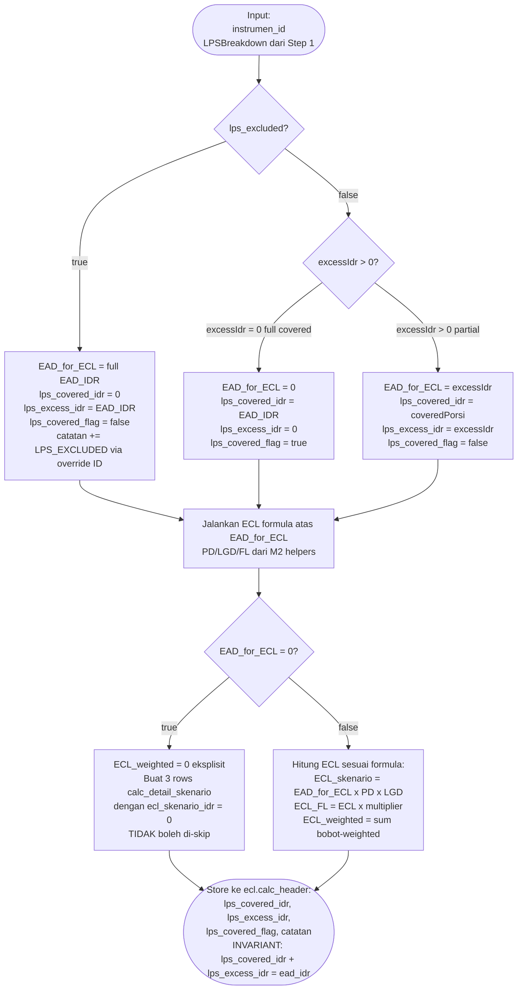
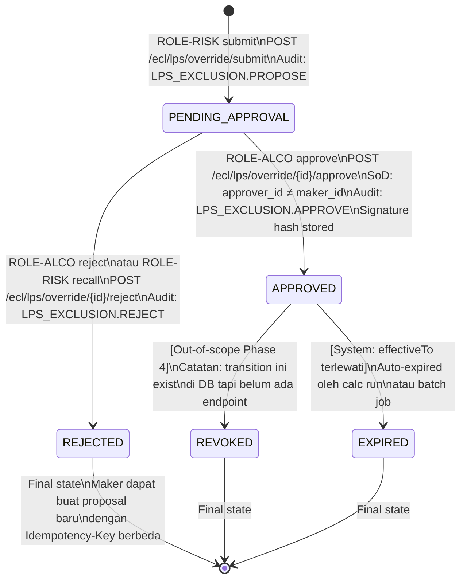

# P4-M3 — LPS Aggregator: Decision Tree, State Machine, Error Catalog, Hand-off Spec

**Modul**: APP-C — ECL Engine
**Story Set**: APP-C-LPS-001..005
**FSD Ref**: FSD-APP-C-ECL-EIR-v1.0.docx §3 (LPS Aggregator), §4 (EAD pre-processing)
**Decisions**: DEC-010 (ECL hanya excess), DEC-014 (cap IDR 2M per nasabah per bank),
               DEC-016 (decimal precision), DEC-017 (4-eyes workflow), DEC-018 (audit trail),
               DEC-021 (Idempotency-Key), DEC-022 (cursor pagination)
**Author**: system-analyst
**Tanggal**: 2026-06-11
**Status**: DRAFT — `review-required` tag: `ifrs9-compliance-reviewer` (BLOCKING gate)

> **Scope note**: Phase 4 = DEPOSITO only. CASH defer ke Phase 5 (OQ-M3-1 resolved).
> Aggregator adalah stateless compute — tidak ada tabel result tersendiri.
> Override exclusion adalah satu-satunya workflow-bearing entity di M3.

---

## 1. Decision Tree — LPS Allocation per Pasangan (Nasabah, Bank)

### 1.1 Single Pair Aggregate

```mermaid
flowchart TD
    A([Input:\nnasabahId, bankId,\nevaluationDate,\ninstrumenIDs]) --> B{Validasi input\nnasabahId & bankId\nexist di mst.counterparty}

    B -- bankId tidak ada\natau bukan BANK\natau eligible_lps_flag=FALSE --> ERR1([NOT_FOUND 404\nbank tidak ada atau\ntidak eligible LPS])

    B -- Valid --> C{Cari mst.lps_coverage\nAPPROVED berlaku\npada evaluationDate}

    C -- Tidak ada record\nAPPROVED --> ERR2([LPS_COVERAGE_NO_ACTIVE_PARAM 422\ncalc run GAGAL])

    C -- Ditemukan: cap = X --> D[Fetch semua instrumen DEPOSITO\nstatus=AKTIF, is_deleted=FALSE\nworkflow_status=APPROVED\nclasifikasi IN AC, FVOCI_DEBT\ncounterparty_id = nasabahId\nbank_counterparty_id = bankId]

    D --> E{Ada instrumen FCY?}
    E -- Ya --> F{Kurs BI JISDOR tersedia\nuntuk evaluationDate?}
    F -- Tidak ada kurs --> ERR3([FX_RATE_NOT_FOUND 422\nblocking untuk semua FCY])
    F -- Tersedia: rate = R --> G[Konversi EAD_FCY × rate\n→ EAD_IDR per instrumen]
    E -- Semua IDR --> G

    G --> H{Ada instrumen dengan\necl.lps_exclusion_override\nAPPROVED aktif?\neffective_from <= evaluationDate\nAND effective_to IS NULL\nOR effective_to >= evaluationDate}

    H -- Ada excluded instruments --> I[Tandai lps_excluded=true\nBreakdown: allocatedToCovered=0\nallocatedToExcess=EAD_IDR\nSkip dari pool coverage]
    H -- Tidak ada --> J

    I --> J[Sort instrumen yang TIDAK excluded\nURUT: tanggal_penempatan ASC\nTiebreak: instrumen_id ASC\n= FIFO rank assignment]

    J --> K[Hitung totalExposureIDR\n= sum semua EAD_IDR\ntermasuk excluded instruments]

    K --> L[Alokasi FIFO:\nremaining_cap = cap\nFor each instrumen FIFO order:\n  covered = min EAD_IDR, remaining_cap\n  excess = EAD_IDR - covered\n  remaining_cap -= covered]

    L --> M[Hitung summary:\ncoveredIDR = sum allocatedToCovered\nexcessIDR = totalExposureIDR - coveredIDR\n covered includes only non-excluded]

    M --> N([Return PairAggregation:\ntotalExposureIDR, coveredIDR,\nexcessIDR, instrumenBreakdown[]\nfifoRank, warnings[]])
```

### 1.2 Bulk Aggregate (Story APP-C-LPS-005)

```mermaid
flowchart TD
    A([BulkAggregate input:\nperiodeId, evaluationDate]) --> B{Validasi periodeId\nexist di mst.periode_buku\nstatus != HARD_CLOSED}

    B -- Tidak ada / HARD_CLOSED --> ERR1([NOT_FOUND 404\natau PERIODE_CLOSED 423])

    B -- Valid --> C{Hitung jumlah instrumen\nDEPOSITO AKTIF dalam scope}
    C -- jumlah > 50000 --> ERR2([LPS_AGGREGATE_BULK_TOO_LARGE 413])
    C -- jumlah = 0 --> D([Return empty map{}\nLog: 0 DEPOSITO in scope])

    C -- 1 <= jumlah <= 50000 --> E[Single batch JOIN query:\nSELECT instrumen + counterparty\n+ lps_coverage + kurs\n+ lps_exclusion_override\nJOIN ke mst.instrumen\nWHERE tipe=DEPOSITO, status=AKTIF\nklasifikasi IN AC FVOCI_DEBT\nperiodeId context]

    E --> F{Semua kurs FCY tersedia?}
    F -- Ada FCY instrument tanpa kurs --> ERR3([FX_RATE_NOT_FOUND 422\nfail-fast, list max 10 terdampak])
    F -- Semua kurs OK --> G[Group by nasabah+bank pair]

    G --> H[For each pair:\nJalankan logic alokasi FIFO\n= sama dengan Single Pair flow\nParallelizable per pair]

    H --> I{Performance check\n≤ 1 detik P95?}
    I -- Exceeded --> WARN[Log slow query warning\nPrometheus metric ecl_lps_bulk_duration_ms\nTetap return hasil]
    I -- OK --> J

    WARN --> J([Return map instrumen_id → LPSBreakdown\nTotal instrumen processed\nDurasi eksekusi])
```

### 1.3 ECL on Excess Only (Story APP-C-LPS-002)



---

## 2. State Machine — LPS Exclusion Override

### 2.1 State Diagram



### 2.2 Transition Table

| From State | To State | Trigger | Actor | Condition | Error jika gagal |
|---|---|---|---|---|---|
| `PENDING_APPROVAL` | `APPROVED` | POST approve | ROLE-ALCO | approver_id ≠ maker_id; mfa_verified=true | `LPS_OVERRIDE_SOD_VIOLATION` jika sama; `MFA_REQUIRED` jika mfa_verified=false |
| `PENDING_APPROVAL` | `REJECTED` | POST reject | ROLE-ALCO atau ROLE-RISK (recall) | Proposal belum expired | `LPS_OVERRIDE_INVALID_TRANSITION` jika state bukan PENDING_APPROVAL |
| `APPROVED` | `EXPIRED` | System / batch | Worker | effectiveTo < sysdate OR instrumen deactivated | Auto — tidak ada API endpoint |
| `APPROVED` | `REVOKED` | POST revoke (OOS) | ROLE-RISK + ROLE-ALCO | Out-of-scope Phase 4 | - |
| Apapun | Apapun | Submit duplicate | ROLE-RISK | Override APPROVED/PENDING sudah ada + periode overlap | `CONFLICT` 409 |

### 2.3 SoD Rules

```
maker_id (JWT sub dari submit) ≠ approver_id (JWT sub dari approve)
```

- Service layer check **sebelum** DB write:
  ```go
  if override.MakerID == currentUser.ID {
      return ErrLPSOverrideSoDViolation("maker tidak dapat menjadi approver")
  }
  ```
- DB level constraint: `CONSTRAINT chk_lps_override_sod CHECK (maker_id <> approver_id)`
- Error code: `LPS_OVERRIDE_SOD_VIOLATION` (403) — bukan generic `SOD_VIOLATION` untuk distinguishability

### 2.4 Trigger Events & Cache Invalidation

| Event | Action | Effect pada Calc Run |
|---|---|---|
| Override APPROVED | Emit event: `LPS_OVERRIDE.APPROVED` | ECL calc-run cache untuk affected (nasabah, bank) pair di-invalidate. Next calc run akan exclude instrumen tersebut. |
| Override REJECTED | Emit event: `LPS_OVERRIDE.REJECTED` | Tidak ada — instrumen tetap masuk pool. |
| Override EXPIRED | Emit event: `LPS_OVERRIDE.EXPIRED` | Instrumen kembali masuk pool. Next calc run tanpa exclusion benefit. |
| Bulk compute selesai | Emit event: `LPS_BULK.COMPLETE` | Tulis satu audit log summary ke aud.audit_log. |

Cache invalidation mechanism: Redis key `lps:pair:{nasabahId}:{bankId}:*` di-delete saat override APPROVED. Tidak ada in-memory cache di Go service — invalidasi di-handle di layer API gateway / TanStack Query frontend.

---

## 3. Validation Rules

### 3.1 POST /ecl/lps/aggregate (Single)

| Field | Rule | Error Code | Message-id |
|---|---|---|---|
| `nasabahId` | required, UUID v4 | `VALIDATION_FAILED` | field.nasabahId.required |
| `bankId` | required, UUID v4 | `VALIDATION_FAILED` | field.bankId.required |
| `bankId` | counterparty.tipe='BANK' AND eligible_lps_flag=TRUE | `NOT_FOUND` | field.bankId.not_eligible_lps_bank |
| `evaluationDate` | required, ISO date YYYY-MM-DD | `VALIDATION_FAILED` | field.evaluationDate.required |
| `evaluationDate` | tidak di masa depan > T+1 | `VALIDATION_FAILED` | field.evaluationDate.future_date |
| domain | mst.lps_coverage APPROVED aktif untuk evaluationDate | `LPS_COVERAGE_NO_ACTIVE_PARAM` | domain.lps.no_active_param |
| domain | kurs BI JISDOR tersedia untuk semua FCY | `FX_RATE_NOT_FOUND` | domain.fx.rate_not_found |

### 3.2 POST /ecl/lps/aggregate/bulk

| Field | Rule | Error Code | Message-id |
|---|---|---|---|
| `periodeId` | required, UUID v4 | `VALIDATION_FAILED` | field.periodeId.required |
| `periodeId` | exists di mst.periode_buku | `NOT_FOUND` | field.periodeId.not_found |
| `evaluationDate` | required, ISO date | `VALIDATION_FAILED` | field.evaluationDate.required |
| domain | instrumen scope ≤ 50.000 | `LPS_AGGREGATE_BULK_TOO_LARGE` | domain.lps.bulk_too_large |
| domain | kurs FCY semua tersedia (fail-fast) | `FX_RATE_NOT_FOUND` | domain.fx.rate_not_found_bulk |

### 3.3 POST /ecl/lps/override/submit

| Field | Rule | Error Code | Message-id |
|---|---|---|---|
| `instrumenId` | required, UUID v4 | `VALIDATION_FAILED` | field.instrumenId.required |
| `instrumenId` | exists di mst.instrumen | `LPS_OVERRIDE_INSTRUMEN_NOT_FOUND` | field.instrumenId.not_found |
| `instrumenId` | tipe_instrumen = 'DEPOSITO' | `LPS_AGGREGATE_INSTRUMEN_NOT_DEPOSITO` | field.instrumenId.not_deposito |
| `instrumenId` | status = 'AKTIF' | `VALIDATION_FAILED` | field.instrumenId.not_aktif |
| `instrumenId` | bank instrumen eligible_lps_flag=TRUE (jika false, exclusion tidak diperlukan) | `VALIDATION_FAILED` | field.instrumenId.bank_not_eligible_lps |
| `alasan` | required | `VALIDATION_FAILED` | field.alasan.required |
| `alasan` | length >= 30 | `LPS_OVERRIDE_REASON_TOO_SHORT` | field.alasan.min_length_30 |
| `alasan` | length <= 2000 | `VALIDATION_FAILED` | field.alasan.max_length_2000 |
| `effectiveFrom` | required, ISO date | `VALIDATION_FAILED` | field.effectiveFrom.required |
| `effectiveFrom` | format YYYY-MM-DD | `VALIDATION_FAILED` | field.effectiveFrom.date_format |
| `effectiveTo` | nullable; jika diisi: format YYYY-MM-DD | `VALIDATION_FAILED` | field.effectiveTo.date_format |
| cross-field | effectiveTo >= effectiveFrom (jika effectiveTo diisi) | `LPS_OVERRIDE_PERIODE_INVALID` | cross.effectiveTo_gte_effectiveFrom |
| cross-field | tidak ada exclusion APPROVED/PENDING aktif yang overlap pada periode [effectiveFrom, effectiveTo] untuk instrumenId yang sama | `CONFLICT` | cross.override_already_active |

### 3.4 POST /ecl/lps/override/{id}/approve

| Field | Rule | Error Code | Message-id |
|---|---|---|---|
| `{id}` | exists di ecl.lps_exclusion_override | `NOT_FOUND` | path.id.not_found |
| `comment` | required, maxLength 2000 | `VALIDATION_FAILED` | field.comment.required |
| `signatureMethod` | required, enum JWT_STANDARD | `VALIDATION_FAILED` | field.signatureMethod.invalid |
| workflow | status HARUS PENDING_APPROVAL | `LPS_OVERRIDE_INVALID_TRANSITION` | workflow.invalid_transition |
| workflow | effectiveTo belum terlewati (jika ada) | `LPS_OVERRIDE_EXPIRED` | workflow.override_expired |
| SoD | approver_id (JWT sub) ≠ maker_id | `LPS_OVERRIDE_SOD_VIOLATION` | sod.approver_not_maker |
| auth | mfa_verified = true di JWT claims | `MFA_REQUIRED` | auth.mfa_required |

### 3.5 POST /ecl/lps/override/{id}/reject

| Field | Rule | Error Code | Message-id |
|---|---|---|---|
| `{id}` | exists di ecl.lps_exclusion_override | `NOT_FOUND` | path.id.not_found |
| `comment` | maxLength 2000 (opsional tapi dianjurkan) | `VALIDATION_FAILED` | field.comment.max_length |
| workflow | status HARUS PENDING_APPROVAL | `LPS_OVERRIDE_INVALID_TRANSITION` | workflow.invalid_transition |
| auth | ROLE-ALCO ATAU maker itu sendiri (recall) | `FORBIDDEN` | auth.forbidden |

---

## 4. Error Catalog Baru (P4-M3)

Tambahkan ke `api/openapi/_common.yaml` enum `ErrorCode`:

| Error Code | HTTP Status | When | Pesan Contoh |
|---|---|---|---|
| `LPS_COVERAGE_NO_ACTIVE_PARAM` | 422 | mst.lps_coverage tidak ada record APPROVED berlaku pada evaluationDate | "Tidak ditemukan LPS coverage parameter yang APPROVED untuk tanggal {date}" |
| `LPS_OVERRIDE_INSTRUMEN_NOT_FOUND` | 404 | instrumenId tidak ada di mst.instrumen (atau soft-deleted) | "Instrumen tidak ditemukan atau sudah dihapus" |
| `LPS_OVERRIDE_REASON_TOO_SHORT` | 422 | alasan < 30 karakter | "Alasan exclusion minimal 30 karakter (saat ini {n} karakter)" |
| `LPS_OVERRIDE_INVALID_TRANSITION` | 422 | Transisi workflow tidak valid untuk state saat ini | "Tidak bisa approve dari state {state}" |
| `LPS_OVERRIDE_EXPIRED` | 410 | effectiveTo sudah terlewati atau periode sudah closed | "Proposal override ini sudah kadaluarsa" |
| `LPS_OVERRIDE_SOD_VIOLATION` | 403 | approver_id = maker_id di LPS exclusion override | "Maker tidak dapat menjadi approver untuk proposal exclusion yang sama" |
| `LPS_OVERRIDE_PERIODE_INVALID` | 422 | effectiveFrom > effectiveTo | "effectiveTo tidak boleh lebih awal dari effectiveFrom" |
| `LPS_AGGREGATE_INSTRUMEN_NOT_DEPOSITO` | 422 | instrumen bukan tipe DEPOSITO (scope Phase 4) | "LPS Aggregator hanya berlaku untuk instrumen tipe DEPOSITO" |
| `LPS_AGGREGATE_BULK_TOO_LARGE` | 413 | scope instrumen > 50.000 untuk bulk | "Jumlah instrumen DEPOSITO dalam scope melebihi 50.000. Hubungi IT-Admin untuk mempartisi." |

**Catatan**: `FX_RATE_NOT_FOUND` sudah ada di _common.yaml sebagai `EAD_FX_RATE_MISSING` (M2). Tambahkan alias `FX_RATE_NOT_FOUND` sebagai stable code M3+ untuk backward compat atau gunakan `EAD_FX_RATE_MISSING` secara konsisten (sesuaikan dengan ecl-eir-engineer).

---

## 5. Performance SLA

| Operation | Target P95 | Measurement | Alert Threshold |
|---|---|---|---|
| Single Aggregate (GET via POST) | ≤ 100ms | Prometheus: `ecl_lps_single_duration_ms` | > 200ms |
| Bulk Aggregate (5.000 instrumen) | ≤ 1 detik | Prometheus: `ecl_lps_bulk_duration_ms` | > 2 detik |
| Preview list (first page, 50 rows) | ≤ 200ms | Prometheus: `ecl_lps_preview_duration_ms` | > 500ms |
| Override submit | ≤ 300ms | Standard API metric | > 1 detik |

Implementasi bulk WAJIB menggunakan single/batch JOIN query. N+1 query per instrumen otomatis REJECTED di code review.

```sql
-- Contoh query pattern bulk (pseudo-SQL):
SELECT
    i.id                AS instrumen_id,
    i.tanggal_penempatan,
    i.counterparty_id   AS nasabah_id,
    cp_bank.id          AS bank_id,
    i.nominal,
    i.mata_uang,
    COALESCE(k.nilai_kurs, 1.0) AS fx_rate,
    l.coverage_amount   AS lps_cap,
    ov.id               AS override_id
FROM mst.instrumen i
JOIN mst.counterparty cp_nasabah ON cp_nasabah.id = i.counterparty_id
JOIN mst.counterparty cp_bank    ON cp_bank.id = i.bank_counterparty_id
                                 AND cp_bank.eligible_lps_flag = TRUE
                                 AND cp_bank.tipe = 'BANK'
LEFT JOIN mst.kurs k             ON k.kode_mata_uang = i.mata_uang
                                 AND k.tanggal_berlaku = $evaluationDate
                                 AND k.sumber_kurs = 'BI_JISDOR'
CROSS JOIN LATERAL (
    SELECT coverage_amount FROM mst.lps_coverage
    WHERE workflow_status = 'APPROVED'
      AND $evaluationDate BETWEEN periode_berlaku_dari AND COALESCE(periode_berlaku_sampai, '9999-12-31')
    ORDER BY periode_berlaku_dari DESC
    LIMIT 1
) l
LEFT JOIN LATERAL (
    SELECT id FROM ecl.lps_exclusion_override ov
    WHERE ov.instrumen_id = i.id
      AND ov.workflow_status = 'APPROVED'
      AND ov.effective_from <= $evaluationDate
      AND (ov.effective_to IS NULL OR ov.effective_to >= $evaluationDate)
      AND ov.deleted_at IS NULL
    LIMIT 1
) ov ON TRUE
WHERE i.tipe_instrumen = 'DEPOSITO'
  AND i.status = 'AKTIF'
  AND i.deleted_at IS NULL
  AND i.workflow_status = 'APPROVED'
  AND i.klasifikasi_psak71 IN ('AC', 'FVOCI_DEBT')
  AND i.tenant_id = $tenantId
ORDER BY i.counterparty_id, cp_bank.id, i.tanggal_penempatan ASC, i.id ASC
```

---

## 6. Audit Policy

| Event | Audit Level | Actor | aud.audit_log Entry |
|---|---|---|---|
| Single Aggregate compute | NOT audited | System/ROLE-RISK | Tidak ada entry individual |
| Bulk Aggregate compute | ONCE per job completion | System worker | action=`LPS_AGGREGATOR.BULK_COMPLETE`, after={instrumen_count, pairs_count, duration_ms} |
| Preview list | AUDITED per call | ROLE-RISK | action=`LPS_AGGREGATOR.PREVIEW`, after={evaluation_date, filters} |
| Preview export | AUDITED per export | ROLE-RISK | action=`LPS_AGGREGATOR.EXPORT`, after={format, row_count, evaluation_date, filters, filename} |
| Override submit | AUDITED in-transaction | ROLE-RISK | action=`LPS_EXCLUSION.PROPOSE`, entity_type=`ecl.lps_exclusion_override`, entity_id=override_id |
| Override approve | AUDITED in-transaction | ROLE-ALCO | action=`LPS_EXCLUSION.APPROVE`, before={old state}, after={new state + signature_hash} |
| Override reject | AUDITED in-transaction | ROLE-ALCO / ROLE-RISK | action=`LPS_EXCLUSION.REJECT`, after={rejection_reason} |
| Override revoke (OOS) | AUDITED in-transaction | ROLE-RISK / ROLE-ALCO | action=`LPS_EXCLUSION.REVOKE` |

---

## 7. Hand-off Spec

### 7.1 Untuk ecl-eir-engineer

**Package**: `backend/internal/ecl/lps/` (baru)

**Go interface yang diperlukan** (`internal/ecl/lps/service.go`):

```go
package lps

import (
    "context"
    "time"

    "github.com/google/uuid"
    "github.com/shopspring/decimal"
)

// LPSAggregatorService — stateless compute, no DB write
type LPSAggregatorService interface {
    // Aggregate per pasangan (nasabahID, bankID) untuk list instrumen
    Aggregate(ctx context.Context, evaluationDate time.Time, instrumenIDs []uuid.UUID) ([]PairAggregation, error)

    // BulkAggregate — satu call untuk semua instrumen DEPOSITO aktif dalam periode
    // Returns map[instrumenID]LPSBreakdown — konsisten dengan Aggregate (deterministic)
    BulkAggregate(ctx context.Context, periodeID uuid.UUID, evaluationDate time.Time) (map[uuid.UUID]LPSBreakdown, error)
}

// OverrideService — workflow 4-eyes untuk LPS exclusion
type OverrideService interface {
    Submit(ctx context.Context, req SubmitOverrideRequest, makerID uuid.UUID) (LPSExclusionOverride, error)
    Approve(ctx context.Context, overrideID uuid.UUID, approverID uuid.UUID, comment string) (LPSExclusionOverride, error)
    Reject(ctx context.Context, overrideID uuid.UUID, actorID uuid.UUID, comment string) (LPSExclusionOverride, error)
}

// --- Domain types ---

type PairAggregation struct {
    CounterpartyID   uuid.UUID
    BankID           uuid.UUID
    TotalExposureIDR decimal.Decimal  // NUMERIC(20,4)
    CoveredIDR       decimal.Decimal  // NUMERIC(20,4)
    ExcessIDR        decimal.Decimal  // NUMERIC(20,4)
    LPSCapIDR        decimal.Decimal  // NUMERIC(20,4) dari mst.lps_coverage
    LPSCoverageParamID uuid.UUID
    Breakdown        []InstrumenBreakdown
    Warnings         []AggregationWarning
}

type InstrumenBreakdown struct {
    InstrumenID         uuid.UUID
    KodeInstrumen       string
    EAD_IDR             decimal.Decimal  // NUMERIC(20,4) setelah konversi kurs
    FIFORank            int
    TanggalPenempatan   time.Time
    AllocatedToCovered  decimal.Decimal  // NUMERIC(20,4)
    AllocatedToExcess   decimal.Decimal  // NUMERIC(20,4)
    LPSExcluded         bool
    ExclusionReason     string           // kosong jika tidak excluded
    LPSFullCovered      bool             // true jika AllocatedToExcess = 0 AND NOT LPSExcluded
}

type LPSBreakdown struct {
    EAD_IDR        decimal.Decimal  // NUMERIC(20,4)
    CoveredIDR     decimal.Decimal  // NUMERIC(20,4)
    ExcessIDR      decimal.Decimal  // NUMERIC(20,4)
    LPSExcluded    bool
    LPSFullCovered bool
}

type AggregationWarning struct {
    Code        string
    Message     string
    InstrumenID uuid.UUID
}

type SubmitOverrideRequest struct {
    InstrumenID   uuid.UUID
    Alasan        string
    EffectiveFrom time.Time
    EffectiveTo   *time.Time  // pointer, nullable
}

// INVARIANT yang harus di-enforce di service layer:
// AllocatedToCovered + AllocatedToExcess == EAD_IDR (setiap InstrumenBreakdown)
// sum(Breakdown.EAD_IDR) == TotalExposureIDR (setiap PairAggregation)
```

**Repo yang dikonsumsi** (read-only):

| Repo method | Tabel | Notes |
|---|---|---|
| `LPSCoverageRepo.GetActive(ctx, evaluationDate)` | `mst.lps_coverage` | WHERE workflow_status=APPROVED AND date BETWEEN |
| `InstrumenRepo.ListDepositoAktif(ctx, nasabahID, bankID)` | `mst.instrumen` | filter tipe=DEPOSITO, status=AKTIF, klasifikasi IN (AC, FVOCI_DEBT) |
| `InstrumenRepo.ListDepositoAktifBulk(ctx, periodeID)` | `mst.instrumen` JOIN `mst.counterparty` | bulk version, return grouped by (nasabah, bank) |
| `KursRepo.GetByMataUangAndDate(ctx, kode, date)` | `mst.kurs` | sumber_kurs=BI_JISDOR |
| `LPSOverrideRepo.GetActiveForInstrumen(ctx, instrumenID, evalDate)` | `ecl.lps_exclusion_override` | status=APPROVED, effective_from<=date, effective_to IS NULL OR >=date |

**Writer repo** (hanya untuk override workflow):

| Repo method | Tabel | Notes |
|---|---|---|
| `LPSOverrideRepo.Create(ctx, override)` | `ecl.lps_exclusion_override` | INSERT, status=PENDING_APPROVAL |
| `LPSOverrideRepo.Approve(ctx, id, approverID, comment, signatureHash)` | `ecl.lps_exclusion_override` | UPDATE status=APPROVED, set approver fields |
| `LPSOverrideRepo.Reject(ctx, id, actorID, comment)` | `ecl.lps_exclusion_override` | UPDATE status=REJECTED |

**Error packages** (tambah ke `internal/errors/lps_errors.go`):

```go
var (
    ErrLPSCoverageNoActiveParam         = errors.New("LPS_COVERAGE_NO_ACTIVE_PARAM")
    ErrLPSOverrideInstrumenNotFound     = errors.New("LPS_OVERRIDE_INSTRUMEN_NOT_FOUND")
    ErrLPSOverrideReasonTooShort        = errors.New("LPS_OVERRIDE_REASON_TOO_SHORT")
    ErrLPSOverrideInvalidTransition     = errors.New("LPS_OVERRIDE_INVALID_TRANSITION")
    ErrLPSOverrideExpired               = errors.New("LPS_OVERRIDE_EXPIRED")
    ErrLPSOverrideSoDViolation          = errors.New("LPS_OVERRIDE_SOD_VIOLATION")
    ErrLPSOverridePeriodeInvalid        = errors.New("LPS_OVERRIDE_PERIODE_INVALID")
    ErrLPSAggregateInstrumenNotDeposito = errors.New("LPS_AGGREGATE_INSTRUMEN_NOT_DEPOSITO")
    ErrLPSAggregateBulkTooLarge         = errors.New("LPS_AGGREGATE_BULK_TOO_LARGE")
)
```

**Asynq job types** (tambah ke worker registry):

```go
const (
    TypeLPSAggregateBulk = "lps:aggregate:bulk"
    TypeLPSExportPreview = "lps:export:preview"
)
```

### 7.2 Untuk data-modeler

**Migration diperlukan: 000023** (dua concerns, satu migration file):

**1. CREATE TABLE `ecl.lps_exclusion_override`**:

```sql
-- migration: 000023 lps-exclusion-override-and-calc-header-lps-cols
-- author: data-modeler
-- requires: 000019 (instrumen migration), 000020 (kurs migration)

CREATE TABLE ecl.lps_exclusion_override (
    id               UUID PRIMARY KEY DEFAULT gen_random_uuid(),
    instrumen_id     UUID NOT NULL REFERENCES mst.instrumen(id),
    alasan           TEXT NOT NULL,
    effective_from   DATE NOT NULL,
    effective_to     DATE,           -- NULL = berlaku selamanya
    workflow_status  VARCHAR(30) NOT NULL DEFAULT 'PENDING_APPROVAL',
    maker_id         UUID NOT NULL REFERENCES sec.user(id),
    approver_id      UUID REFERENCES sec.user(id),
    approved_at      TIMESTAMPTZ,
    rejected_at      TIMESTAMPTZ,
    rejection_reason TEXT,
    signature_hash   TEXT,           -- SHA-256(approver||APPROVE||id||approved_at||comment)
    -- audit cols
    created_at   TIMESTAMPTZ NOT NULL DEFAULT now(),
    created_by   UUID        NOT NULL,
    updated_at   TIMESTAMPTZ NOT NULL DEFAULT now(),
    updated_by   UUID        NOT NULL,
    deleted_at   TIMESTAMPTZ,
    deleted_by   UUID,
    row_version  BIGINT      NOT NULL DEFAULT 1,
    tenant_id    TEXT        NOT NULL DEFAULT 'TUGURE',
    CONSTRAINT chk_lps_override_alasan_min_len
        CHECK (length(alasan) >= 30),
    CONSTRAINT chk_lps_override_sod
        CHECK (maker_id <> approver_id),
    CONSTRAINT chk_lps_override_workflow
        CHECK (workflow_status IN ('DRAFT','PENDING_APPROVAL','APPROVED','REJECTED','REVOKED')),
    CONSTRAINT chk_lps_override_effective_dates
        CHECK (effective_to IS NULL OR effective_to >= effective_from)
);

-- Indexes
CREATE INDEX idx_lps_exclusion_instrumen
    ON ecl.lps_exclusion_override(instrumen_id)
    WHERE deleted_at IS NULL;

CREATE INDEX idx_lps_exclusion_active
    ON ecl.lps_exclusion_override(instrumen_id, effective_from)
    WHERE workflow_status = 'APPROVED' AND deleted_at IS NULL;

CREATE INDEX idx_lps_exclusion_status
    ON ecl.lps_exclusion_override(workflow_status, created_at DESC)
    WHERE deleted_at IS NULL;

CREATE INDEX idx_lps_exclusion_tenant
    ON ecl.lps_exclusion_override(tenant_id, created_at DESC)
    WHERE deleted_at IS NULL;
```

**2. ALTER TABLE `ecl.calc_header` — tambah kolom LPS**:

```sql
ALTER TABLE ecl.calc_header
    ADD COLUMN IF NOT EXISTS lps_covered_idr  NUMERIC(20,4),
    ADD COLUMN IF NOT EXISTS lps_excess_idr   NUMERIC(20,4),
    ADD COLUMN IF NOT EXISTS lps_covered_flag BOOLEAN;

-- Partial index untuk validasi integrity
-- INVARIANT: untuk instrumen DEPOSITO yang sudah di-LPS-processed,
-- lps_covered_idr + lps_excess_idr harus = ead_idr
-- (divalidasi di application layer, tidak enforced via CHECK karena butuh JOIN ke mst.instrumen)

COMMENT ON COLUMN ecl.calc_header.lps_covered_idr IS
    'Porsi EAD yang dijamin LPS (NUMERIC(20,4)). NULL jika instrumen bukan DEPOSITO atau belum di-LPS-process.';
COMMENT ON COLUMN ecl.calc_header.lps_excess_idr IS
    'Porsi EAD yang melebihi cap LPS — ini yang masuk ECL pipeline (NUMERIC(20,4)).';
COMMENT ON COLUMN ecl.calc_header.lps_covered_flag IS
    'true = instrumen full covered (lps_excess_idr = 0 AND tidak excluded). false = partial atau excluded.';
```

**3. Precision check `ecl.calc_header`**:

Periksa apakah kolom `ead_idr` sudah `NUMERIC(20,4)` per DEC-016. Jika masih `NUMERIC(20,2)` dari init schema 0001:

```sql
-- Hanya jika kolom masih NUMERIC(20,2):
ALTER TABLE ecl.calc_header
    ALTER COLUMN ead_idr TYPE NUMERIC(20,4);
-- (PostgreSQL ALTER TYPE kompatibel NUMERIC(20,2) → NUMERIC(20,4) tanpa data loss)
```

**Down migration** (`000023.down.sql`):

```sql
ALTER TABLE ecl.calc_header
    DROP COLUMN IF EXISTS lps_covered_idr,
    DROP COLUMN IF EXISTS lps_excess_idr,
    DROP COLUMN IF EXISTS lps_covered_flag;

DROP TABLE IF EXISTS ecl.lps_exclusion_override;
```

### 7.3 Untuk frontend-engineer-nextjs

**Screens baru**:

1. `/ecl/lps/preview` — DataTable LPS coverage utilization
   - Komponen `<DataTable>` standard dengan sort+filter+export
   - Filter: date picker evaluation_date (wajib), bank selector, nasabah selector, excess range slider
   - Default sort: excess_idr DESC
   - Export button: CSV + XLSX

2. `/ecl/lps/overrides` — DataTable exclusion overrides
   - Filter: workflow_status chip, instrumen search, date range
   - Action per row: View Detail, Approve (ROLE-ALCO only), Reject

3. `/ecl/lps/overrides/new` — Form submit exclusion override
   - Field: instrumen picker (autocomplete DEPOSITO aktif), alasan textarea (min 30 char, counter), effectiveFrom date, effectiveTo date (optional)
   - Validation: real-time char count untuk alasan, date range cross-field validation

4. `/ecl/lps/overrides/[id]` — Detail override + approve/reject panel
   - Panel ALCO: comment textarea + MFA verification status indicator + Approve/Reject buttons
   - Toast: spesifik per action (LPS exclusion approved/rejected for DEPOSITO-XXX)

**Permission gates**:
```tsx
// Preview: ROLE-RISK, ROLE-AUDIT
<PermissionGate permission="lps_aggregator.preview">
// Override form: ROLE-RISK
<PermissionGate permission="lps_aggregator.override">
// Approve button: ROLE-ALCO, mfa_verified=true
<PermissionGate permission="lps_aggregator.override.approve" requireMFA>
```

---

## 8. Open Questions Resolved (M3)

| ID | Pertanyaan | Resolusi |
|---|---|---|
| OQ-M3-1 | Cash scope LPS | **Resolved**: Phase 4 = DEPOSITO only. Cash masuk Phase 5. CHECK constraint tidak perlu diubah. |
| OQ-M3-2 | Bank-only LPS | **Resolved**: Ya, hanya `counterparty.tipe = 'BANK' AND eligible_lps_flag = TRUE`. |
| OQ-M3-3 | FCY cap apply | **Resolved**: Setelah konversi ke IDR (kurs BI JISDOR evaluationDate). |
| OQ-M3-4 | FVTPL scope | **Resolved**: FVTPL skip LPS aggregation (konsisten dengan ECL skip FVTPL). Hanya AC + FVOCI_DEBT. |
| OQ-M3-5 | Step-up MFA untuk ALCO approve override | **Resolved**: Tidak perlu step-up MFA. MFA wajib ALCO (DEC-026) sudah sufficient. Step-up reserved DEC-027. |
| OQ-M3-6 | Satu counterparty banyak bank | **Resolved**: Ya, looping per (counterparty_id, bank_counterparty_id) pair. Cap independen per pair. |
| OQ-M3-7 | FIFO ordering | **Resolved**: tanggal_penempatan ASC, tiebreak instrumen_id ASC (deterministic). |

---

## 9. Tagging: review-required

**`ifrs9-compliance-reviewer` BLOCKING gate** diperlukan untuk:

1. Konfirmasi bahwa alokasi FIFO (tanggal_penempatan ASC) sesuai FSD-APP-C §3 — atau FSD menentukan proporsional allocation.
2. Konfirmasi bahwa instrumen FVOCI_DEBT (bukan hanya AC) memang masuk scope LPS aggregation (OQ-M3-4 diatas diasumsi ya, tapi perlu konfirmasi final).
3. Konfirmasi bahwa ECL = 0 untuk covered portion adalah **explicit compute** (bukan skip) — sudah di-spec di AC-002 Scenario 2 tapi perlu compliance sign-off.
4. Konfirmasi presisi NUMERIC(20,4) untuk semua intermediate computation — tidak ada rounding intermediate yang berubah.
