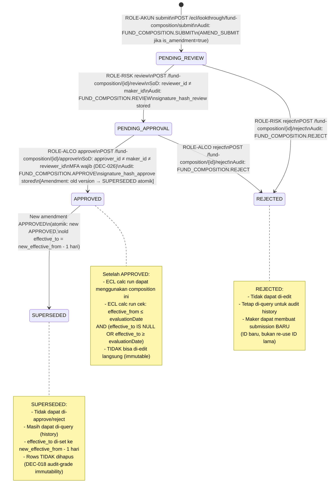
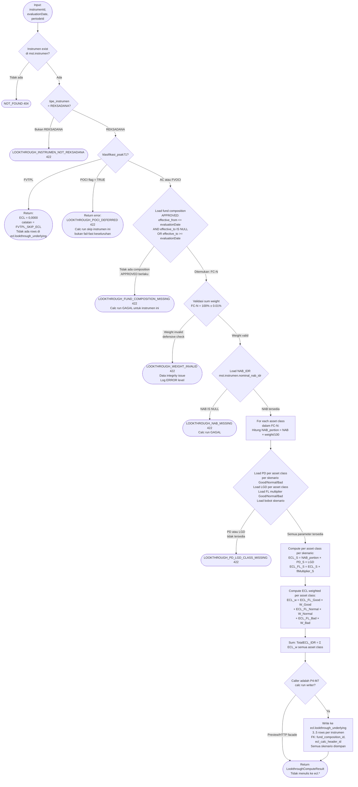
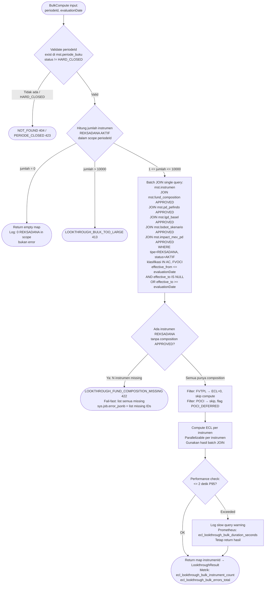

# P4-M4 — Look-through ECL Reksadana: State Machine, Decision Tree, Error Catalog, Hand-off Spec

**Modul**: APP-C — ECL Engine
**Story Set**: APP-C-LKT-001..005
**FSD Ref**: FSD-APP-C-ECL-EIR-v1.0.docx §3 (Look-through ECL), §4 (EAD)
**Decisions**: DEC-010 (3-skenario × dual FL), DEC-015 (look-through decompose by asset class),
               DEC-016 (decimal precision), DEC-017 (6-eyes untuk fund composition),
               DEC-018 (audit trail), DEC-021 (Idempotency-Key), DEC-022 (cursor pagination)
**Author**: system-analyst
**Tanggal**: 2026-06-11
**Status**: DRAFT — `review-required` tag: `ifrs9-compliance-reviewer` (BLOCKING gate)

> **Scope note**: P4-M4 = Reksadana look-through ECL. Fund composition adalah parameter master
> yang mempengaruhi ECL secara langsung → 6-eyes workflow (DEC-017).
> FVTPL Reksadana di-skip (ECL=0, bukan error). POCI Reksadana defer ke M7.
> NAB source: `mst.instrumen.nominal_nab_idr` (OQ-M4-2 — pending konfirmasi tabel NAB harian).

---

## 1. State Machine — Fund Composition Workflow

### 1.1 State Diagram (6-eyes: AKUN → RISK → ALCO)



### 1.2 Tabel Transisi Valid

| State Saat Ini | Aksi | State Baru | Actor | SoD Check | MFA |
|---|---|---|---|---|---|
| `PENDING_REVIEW` | review | `PENDING_APPROVAL` | ROLE-RISK | reviewer ≠ maker | Tidak |
| `PENDING_REVIEW` | reject | `REJECTED` | ROLE-RISK | reviewer ≠ maker | Tidak |
| `PENDING_APPROVAL` | approve | `APPROVED` | ROLE-ALCO | approver ≠ maker, approver ≠ reviewer | Wajib (standard MFA) |
| `PENDING_APPROVAL` | reject | `REJECTED` | ROLE-ALCO | approver ≠ maker | Tidak |
| `APPROVED` | (amendment approve) | `SUPERSEDED` | System (atomik saat new APPROVED) | — | — |

**Transisi yang TIDAK valid** (→ error `LOOKTHROUGH_COMPOSITION_REVIEW_INVALID_TRANSITION` 422):
- `DRAFT` → apapun (state DRAFT tidak ada di API flow; composition langsung PENDING_REVIEW saat submit)
- `APPROVED` → apapun via API (hanya bisa di-supersede by amendment approve)
- `REJECTED` → apapun (tidak bisa transition dari final state)
- `SUPERSEDED` → apapun
- Skip step: `PENDING_REVIEW` → `APPROVED` langsung (harus lewat PENDING_APPROVAL dulu)

### 1.3 Validasi Tambahan saat Approve (Amendment atomik)

Saat ROLE-ALCO approve composition dengan `is_amendment=true`:

```
BEGIN TRANSACTION
  1. Validate compositionId dalam PENDING_APPROVAL
  2. Validate SoD: approver ≠ maker ≠ reviewer
  3. Validate MFA: mfa_verified=true di JWT
  4. Load supersedesCompositionId (old version)
  5. Validate old version masih workflow_status=APPROVED (tidak boleh sudah SUPERSEDED oleh yang lain)
  6. UPDATE old version rows:
       workflow_status = 'SUPERSEDED'
       effective_to = new_effective_from - 1 hari
       updated_by = approver_id, updated_at = now()
  7. UPDATE new version rows:
       workflow_status = 'APPROVED'
       approver_id = current_user
       signed_at_approve = now()
       signature_hash_approve = SHA256(userId || APPROVE || compositionId || signedAt || comment)
       updated_by = approver_id, updated_at = now()
  8. Write aud.audit_log: FUND_COMPOSITION.AMEND_APPROVE
     after_jsonb = { supersedes: old_id, new_effective_from: date, old_effective_to: date }
COMMIT TRANSACTION  -- atomik: kedua update atau keduanya rollback
```

---

## 2. Decision Tree — Look-through ECL Compute

### 2.1 Single Instrument Compute (Story APP-C-LKT-002)



### 2.2 Bulk Compute (Story APP-C-LKT-004)



### 2.3 PD/LGD per Asset Class Mapping

| Asset Class | PD Source | PD Note | LGD Pool (mst.lgd_basel.tipe_eksposur) |
|---|---|---|---|
| `GOVT_BOND` | Hard-coded: 0,00000000 | Sovereign IDR; Pemerintah RI tidak punya default rating Pefindo (OQ-M4-4) | `SOVEREIGN` |
| `CORP_BOND` | `mst.pd_pefindo` per rating issuer underlying (average atau conservative worst) | Rating dari underlying portfolio; jika tidak ada → `LOOKTHROUGH_PD_LGD_CLASS_MISSING` | `UNSECURED_CORP` |
| `CASH` | `mst.pd_pefindo` per bank counterparty rating | Rating dari bank pengelola rekening pasar uang fund | `DEPOSITO` |
| `EQUITY` | `mst.pd_pefindo` sektor average | Sektor dari mst.counterparty underlying | `EQUITY` |
| `OTHER` | `mst.pd_pefindo` bucket konservatif (highest default bucket `C` Pefindo) | Conservative default; di-flag warning untuk manual review | Tertinggi dari available: `UNSECURED_CORP` atau `EQUITY` |

> **BLOCKING — OQ-M4-4**: Mapping di atas adalah asumsi default. `ifrs9-compliance-reviewer` HARUS
> konfirmasi bahwa mapping ini sesuai dengan FSD-APP-C sebelum merge. Khususnya untuk CORP_BOND
> (bagaimana menentukan rating underlying average), EQUITY (sektor mapping), dan OTHER (conservative default).

FL multiplier (dual): per skenario × per asset class, dari `mst.impact_mev_pd`.
Bobot skenario: dari `mst.bobot_skenario` (default Good=0.25, Normal=0.50, Bad=0.25 per DEC-010).

---

## 3. Versioning — Fund Composition Immutable

Pola sama dengan `ecl.amortisasi_schedule` (P4-M5/M6):

```
State sebelum amend approve:
  FC-001: effective_from=2026-04-01, effective_to=NULL, workflow_status=APPROVED
  FC-002: effective_from=2026-07-01, effective_to=NULL, workflow_status=PENDING_APPROVAL

State setelah amend approve (atomik dalam satu TX):
  FC-001: effective_from=2026-04-01, effective_to=2026-06-30, workflow_status=SUPERSEDED
  FC-002: effective_from=2026-07-01, effective_to=NULL, workflow_status=APPROVED

Query untuk evaluationDate = 2026-06-30:
  → FC-001 berlaku (effective_from <= 2026-06-30 <= effective_to=2026-06-30)

Query untuk evaluationDate = 2026-07-01:
  → FC-002 berlaku (effective_from <= 2026-07-01, effective_to IS NULL)

INVARIANT: Tidak ada gap antara versi (effective_to FC-N = effective_from FC-N+1 - 1 hari)
INVARIANT: Tidak ada rows yang di-UPDATE atau di-DELETE setelah APPROVED
```

---

## 4. Error Catalog (P4-M4)

| Error Code | HTTP | Kapan | Field (jika validasi) | Contoh Message |
|---|---|---|---|---|
| `LOOKTHROUGH_FUND_COMPOSITION_MISSING` | 422 | Tidak ada composition APPROVED berlaku pada evaluationDate untuk instrumen | instrumenId | "Tidak ditemukan fund composition APPROVED untuk instrumen RKD-002 per tanggal 2026-06-30." |
| `LOOKTHROUGH_NAB_MISSING` | 422 | NAB instrumen = NULL di mst.instrumen.nominal_nab_idr | instrumenId | "NAB untuk instrumen RKD-003 tidak tersedia per 2026-06-30. Pastikan feed NAB harian KSEI/MI telah diupload." |
| `LOOKTHROUGH_WEIGHT_INVALID` | 422 | Sum weight_pct semua lines ≠ 100% ± 0.01% — saat submit ATAU defensive runtime check | body.lines | "Total weight_pct harus 100% ± 0.01%. Saat ini: 85.0000%" |
| `LOOKTHROUGH_INSTRUMEN_NOT_REKSADANA` | 422 | instrumenId ada di mst.instrumen tapi tipe_instrumen ≠ REKSADANA | body.instrumenId | "Fund composition hanya berlaku untuk instrumen tipe REKSADANA. Instrumen DEPOSITO-001 bertipe DEPOSITO." |
| `LOOKTHROUGH_ASSET_CLASS_UNKNOWN` | 422 | asset_class bukan salah satu dari: GOVT_BOND, CORP_BOND, CASH, EQUITY, OTHER | body.lines[N].assetClass | "Asset class CRYPTO tidak valid. Nilai yang diterima: GOVT_BOND, CORP_BOND, CASH, EQUITY, OTHER" |
| `LOOKTHROUGH_PD_LGD_CLASS_MISSING` | 422 | PD atau LGD tidak tersedia di mst.pd_pefindo/mst.lgd_basel untuk asset class + periodeId | assetClass | "PD/LGD lookup gagal untuk asset class CORP_BOND — tidak ada parameter APPROVED untuk periodeId JUNI-2026." |
| `LOOKTHROUGH_COMPOSITION_REVIEW_INVALID_TRANSITION` | 422 | Transisi workflow tidak sesuai state machine (mis. approve dari PENDING_REVIEW) | workflowStatus | "Tidak bisa approve dari state PENDING_REVIEW. Harus melalui review terlebih dahulu." |
| `LOOKTHROUGH_COMPOSITION_SOD_VIOLATION` | 403 | reviewer = maker, atau approver = maker atau reviewer | reviewer/approver | "Maker tidak dapat menjadi reviewer. maker_id = reviewer_id untuk composition FC-001." |
| `LOOKTHROUGH_BULK_TOO_LARGE` | 413 | Jumlah instrumen REKSADANA aktif dalam scope > 10.000 | — | "Jumlah instrumen REKSADANA aktif dalam scope (12.500) melebihi batas 10.000. Hubungi IT Admin." |
| `LOOKTHROUGH_POCI_DEFERRED` | 422 | instrumen Reksadana dengan poci_flag=TRUE — di-skip dari compute, bukan fatal error pada run | instrumenId | "Instrumen RKD-005 adalah POCI. Look-through ECL untuk POCI Reksadana di-defer ke Phase 5." |

**Catatan**: `LOOKTHROUGH_POCI_DEFERRED` adalah skip non-fatal per instrumen — calc run TIDAK gagal,
instrumen ini di-skip dengan catatan. Berbeda dengan `LOOKTHROUGH_FUND_COMPOSITION_MISSING` yang
fail-fast untuk instrumen tersebut (dan memblok bulk run jika ada missing composition).

---

## 5. Validation Rules Table

### 5.1 Fund Composition Submit (POST /ecl/lookthrough/fund-composition/submit)

| Field | Rule | Error Code | Message (id-ID) |
|---|---|---|---|
| `instrumenId` | required | `VALIDATION_FAILED` | "instrumenId wajib diisi" |
| `instrumenId` | exists in mst.instrumen AND deleted_at IS NULL | `NOT_FOUND` | "Instrumen tidak ditemukan atau sudah dihapus" |
| `instrumenId` | tipe_instrumen = REKSADANA | `LOOKTHROUGH_INSTRUMEN_NOT_REKSADANA` | "Fund composition hanya berlaku untuk instrumen tipe REKSADANA" |
| `instrumenId` | status = AKTIF AND workflow_status = APPROVED | `VALIDATION_FAILED` | "Instrumen tidak AKTIF atau belum final disetujui" |
| `instrumenId` | (jika !isAmendment) tidak ada composition APPROVED aktif dengan effective_to IS NULL | `CONFLICT` | "Instrumen sudah punya composition aktif. Gunakan fitur Amend." |
| `effectiveFrom` | required | `VALIDATION_FAILED` | "effectiveFrom wajib diisi" |
| `effectiveFrom` | format DATE YYYY-MM-DD | `VALIDATION_FAILED` | "effectiveFrom harus format YYYY-MM-DD" |
| `effectiveFrom` | tidak lebih dari 30 hari ke depan dari today | `VALIDATION_FAILED` | "effectiveFrom tidak boleh lebih dari 30 hari ke depan" |
| `sourceDocId` | (jika diisi) exists in doc.upload | `NOT_FOUND` | "sourceDocId tidak ditemukan di doc.upload" |
| `isAmendment` | boolean | `VALIDATION_FAILED` | "isAmendment harus boolean" |
| `supersedesCompositionId` | required jika isAmendment=true | `VALIDATION_FAILED` | "supersedesCompositionId wajib saat isAmendment = true" |
| `supersedesCompositionId` | (jika diisi) exists AND workflow_status=APPROVED | `CONFLICT` | "Target composition FC-N belum APPROVED atau sudah final (REJECTED/SUPERSEDED)" |
| `supersedesCompositionId` | (jika diisi) workflow_status ≠ PENDING_* | `CONFLICT` | "Target composition FC-N masih dalam proses persetujuan. Tunggu hingga final." |
| `effectiveFrom` | (jika amendment) > superseded composition effective_from | `VALIDATION_FAILED` | "effectiveFrom baru harus setelah effectiveFrom yang digantikan" |
| `lines` | required AND minItems 1 | `VALIDATION_FAILED` | "Minimal 1 line asset class diperlukan" |
| `lines` | maxItems 5 (satu per enum) | `VALIDATION_FAILED` | "Maksimal 5 lines (satu per asset class)" |
| `lines[N].assetClass` | enum: GOVT_BOND, CORP_BOND, CASH, EQUITY, OTHER | `LOOKTHROUGH_ASSET_CLASS_UNKNOWN` | "Asset class {X} tidak valid" |
| `lines[N].assetClass` | unik dalam satu group (tidak duplikat) | `VALIDATION_FAILED` | "Asset class {X} duplikat dalam submission yang sama" |
| `lines[N].weightPct` | required AND > 0 | `VALIDATION_FAILED` | "weightPct harus > 0" |
| `lines[N].weightPct` | NUMERIC(7,4) — max 4 desimal | `VALIDATION_FAILED` | "weightPct maksimal 4 desimal" |
| `Σ lines[].weightPct` | = 100% ± 0.01% (toleransi floating-point input UI) | `LOOKTHROUGH_WEIGHT_INVALID` | "Total weight_pct harus 100% ± 0.01%. Saat ini: {X}%" |
| `catatan` | maxLength 2000 | `VALIDATION_FAILED` | "Catatan maksimal 2000 karakter" |

### 5.2 Workflow Action (review/approve/reject)

| Field | Rule | Error Code | Message |
|---|---|---|---|
| `compositionId` (path) | exists AND not deleted | `NOT_FOUND` | "Composition tidak ditemukan" |
| `signatureMethod` | required AND enum: JWT_STEP_UP, JWT_STANDARD | `VALIDATION_FAILED` | "signatureMethod wajib diisi" |
| `comment` | maxLength 1000 | `VALIDATION_FAILED` | "Comment maksimal 1000 karakter" |
| state machine | transisi valid per tabel §1.2 | `LOOKTHROUGH_COMPOSITION_REVIEW_INVALID_TRANSITION` | "Transisi workflow tidak valid" |
| reviewer SoD | reviewer_id ≠ maker_id | `LOOKTHROUGH_COMPOSITION_SOD_VIOLATION` | "Maker tidak dapat menjadi reviewer" |
| approver SoD | approver_id ≠ maker_id AND approver_id ≠ reviewer_id | `LOOKTHROUGH_COMPOSITION_SOD_VIOLATION` | "Approver tidak bisa sama dengan Maker atau Reviewer" |
| MFA (approve) | JWT claim mfa_verified = true (ROLE-ALCO, DEC-026) | `MFA_REQUIRED` | "ROLE-ALCO wajib MFA. Pastikan mfa_verified=true di token." |

### 5.3 Compute (POST /ecl/lookthrough/compute)

| Field | Rule | Error Code | Message |
|---|---|---|---|
| `instrumenId` | required AND exists | `NOT_FOUND` | "Instrumen tidak ditemukan" |
| `instrumenId` | tipe_instrumen = REKSADANA | `LOOKTHROUGH_INSTRUMEN_NOT_REKSADANA` | "Instrumen bukan tipe REKSADANA" |
| `instrumenId` | poci_flag = FALSE (jika TRUE → POCI_DEFERRED non-fatal) | `LOOKTHROUGH_POCI_DEFERRED` | "POCI Reksadana defer ke Phase 5" |
| `evaluationDate` | required AND format DATE | `VALIDATION_FAILED` | "evaluationDate wajib format YYYY-MM-DD" |
| fund composition | APPROVED active per evaluationDate | `LOOKTHROUGH_FUND_COMPOSITION_MISSING` | "Fund composition APPROVED tidak ditemukan per tanggal ini" |
| NAB | nominal_nab_idr IS NOT NULL | `LOOKTHROUGH_NAB_MISSING` | "NAB instrumen tidak tersedia" |
| weight sum | defensive check: Σ = 100% ± 0.01% | `LOOKTHROUGH_WEIGHT_INVALID` | "Fund composition weight sum integrity issue" |
| PD/LGD | tersedia per asset class + periodeId | `LOOKTHROUGH_PD_LGD_CLASS_MISSING` | "PD/LGD lookup gagal untuk asset class {X}" |

---

## 6. Performance SLA & Observability

| Operasi | SLA | Prometheus Metric |
|---|---|---|
| Single compute (HTTP facade) | ≤ 200ms P95 | `ecl_lookthrough_single_duration_seconds` |
| Bulk compute (500 Reksadana) | ≤ 2 detik P95 | `ecl_lookthrough_bulk_duration_seconds{percentile="p95"}` |
| Preview per instrumen | ≤ 500ms P95 | `ecl_lookthrough_preview_duration_seconds` |
| Fund composition list (DataTable) | ≤ 200ms P95 | — (standard API latency) |

**Metrik wajib** (Story LKT-004 Scenario 5):
```
ecl_lookthrough_bulk_duration_seconds{percentile="p95"} <= 2.0
ecl_lookthrough_bulk_instrument_count{periode="JUNI-2026"} = 500
ecl_lookthrough_bulk_errors_total{periode="JUNI-2026"} = 0
```

Grafana alert: threshold P95 > 2 detik → level WARNING. Threshold > 5 detik → CRITICAL.

**Anti N+1 enforcement**: BulkCompute HARUS menggunakan batch JOIN.
Implementasi yang menggunakan loop dengan individual query per instrumen = CI fail (query count assertion test).

---

## 7. Audit Policy

| Event | Dipicu oleh | Timing | Data yang disimpan |
|---|---|---|---|
| `FUND_COMPOSITION.SUBMIT` | POST .../submit (new) | In-transaction | entity_id=compositionId, after=lines+header |
| `FUND_COMPOSITION.AMEND_SUBMIT` | POST .../submit (amendment) | In-transaction | entity_id=compositionId, after=lines+header+supersedesId |
| `FUND_COMPOSITION.REVIEW` | POST .../review | In-transaction | entity_id=compositionId, after={reviewer, signedAt, comment} |
| `FUND_COMPOSITION.AMEND_REVIEW` | POST .../review pada amend | In-transaction | Sama |
| `FUND_COMPOSITION.APPROVE` | POST .../approve | In-transaction | entity_id=compositionId, after={approver, signedAt, comment} |
| `FUND_COMPOSITION.AMEND_APPROVE` | POST .../approve pada amend | In-transaction | after={supersedes: old_id, new_effective_from, old_effective_to} |
| `FUND_COMPOSITION.REJECT` | POST .../reject | In-transaction | entity_id=compositionId, after={actor, reason} |
| `LOOKTHROUGH.PREVIEW` | GET /ecl/lookthrough/preview/... | Async (setelah response) | entity_id=instrumenId, after={evaluation_date, periode_id} |
| `LOOKTHROUGH.EXPORT` | GET .../export | In-transaction | entity_id=instrumenId, after={format, row_count, evaluation_date} |

**Audit trail**: append-only, hash-chain, retention 10+10 tahun (DEC-018).
`ecl.lookthrough_underlying` rows: TIDAK ada UPDATE/DELETE setelah calc run sealed (DEC-018).

---

## 8. Hand-off Spec

### data-modeler

**Migration 000024** — BLOCKER untuk P4-M4:

1. `CREATE TABLE mst.fund_composition` — DDL lengkap di LKT-001 story file §DDL Gap 1.
   Constraints: `chk_fc_asset_class`, `chk_fc_weight_positive`, `chk_fc_workflow_status`,
   SoD: `chk_fc_sod_rev`, `chk_fc_sod_appr`, `chk_fc_sod_rev_appr`.
   Indexes: `uq_fc_instrumen_effective`, `idx_fc_instrumen_status`, `idx_fc_active_approved`, `idx_fc_tenant_created`.

2. `ALTER TABLE ecl.lookthrough_underlying`:
   - `ead_underlying_idr NUMERIC(20,2)` → `NUMERIC(20,4)` (DEC-016 fix)
   - `pd_normal NUMERIC(8,4)` → `NUMERIC(10,8)` (DEC-016 fix)
   - `lgd NUMERIC(8,4)` → `NUMERIC(10,8)` (DEC-016 fix)
   - `ecl_weighted_idr NUMERIC(20,2)` → `NUMERIC(20,4)` (DEC-016 fix)
   - ADD `fund_composition_id UUID REFERENCES mst.fund_composition(id)` — FK ke versi yang dipakai
   - ADD `underlying_kategori` rename ke `asset_class TEXT` (atau keep alias + migration note)
   - ADD `pd_good NUMERIC(10,8)`, `pd_bad NUMERIC(10,8)` — PD per skenario
   - ADD `ecl_skenario_good_idr NUMERIC(20,4)`, `ecl_skenario_normal_idr NUMERIC(20,4)`, `ecl_skenario_bad_idr NUMERIC(20,4)` — ECL skenario sebelum FL
   - ADD `ecl_fl_good_idr NUMERIC(20,4)`, `ecl_fl_normal_idr NUMERIC(20,4)`, `ecl_fl_bad_idr NUMERIC(20,4)` — ECL setelah FL
   - ADD audit cols: `created_at TIMESTAMPTZ DEFAULT now()`, `created_by UUID`, `updated_at TIMESTAMPTZ DEFAULT now()`, `updated_by UUID`, `deleted_at TIMESTAMPTZ`, `deleted_by UUID`, `row_version BIGINT DEFAULT 1`, `tenant_id TEXT DEFAULT 'TUGURE'`
   - ADD trigger: no hard-delete policy (ecl schema, DEC-018)

3. Seed data dev: minimal 1 Reksadana aktif (status=AKTIF, workflow_status=APPROVED) dengan
   fund composition APPROVED (minimal 2 asset class, sum=100%) untuk integration test.

4. No hard delete trigger pada `ecl.lookthrough_underlying` (ecl schema rule, DEC-018).

### backend-engineer-go

Go interface contract (dari story LKT handoff notes):

```go
// internal/ecl/lookthrough/service.go

type LookThroughService interface {
    // Single — dipanggil M7 ECL engine untuk satu instrumen
    // SLA: ≤ 200ms P95
    Compute(ctx context.Context, instrumenID uuid.UUID, evaluationDate time.Time, periodeID uuid.UUID) (LookThroughResult, error)

    // Bulk — dipanggil sekali per calc run untuk semua Reksadana aktif
    // SLA: ≤ 2 detik P95 untuk 500 instrumen
    // HARUS batch JOIN — tidak boleh N+1
    BulkCompute(ctx context.Context, periodeID uuid.UUID, evaluationDate time.Time) (map[uuid.UUID]LookThroughResult, error)

    // Preview — tanpa menulis ke ecl.* (untuk UI Story 3)
    Preview(ctx context.Context, instrumenID uuid.UUID, evaluationDate time.Time, periodeID uuid.UUID) (LookThroughResult, error)
}

type FundCompositionService interface {
    Submit(ctx context.Context, req SubmitCompositionRequest) (CompositionGroup, error)
    Review(ctx context.Context, compositionID uuid.UUID, reviewerID uuid.UUID, comment string, signatureMethod string) error
    Approve(ctx context.Context, compositionID uuid.UUID, approverID uuid.UUID, comment string, signatureMethod string) error
    Reject(ctx context.Context, compositionID uuid.UUID, actorID uuid.UUID, reason string) error
    GetActive(ctx context.Context, instrumenID uuid.UUID, asOfDate time.Time) ([]FundCompositionLine, CompositionGroup, error)
    ListHistory(ctx context.Context, q listquery.Query) ([]CompositionGroup, listquery.Pagination, error)
}

// Decimal precision rules (DEC-016):
// - All IDR amounts: decimal.Decimal (stored NUMERIC(20,4))
// - PD, LGD, FL multiplier, bobot: decimal.Decimal (stored NUMERIC(10,8))
// - weightPct: decimal.Decimal (stored NUMERIC(7,4))
// - NEVER float64 for any monetary or rate value
```

Endpoint handler paths:
- `POST /api/v1/ecl/lookthrough/fund-composition/submit`
- `POST /api/v1/ecl/lookthrough/fund-composition/{id}/review`
- `POST /api/v1/ecl/lookthrough/fund-composition/{id}/approve`
- `POST /api/v1/ecl/lookthrough/fund-composition/{id}/reject`
- `GET  /api/v1/ecl/lookthrough/fund-composition`
- `GET  /api/v1/ecl/lookthrough/fund-composition/{id}`
- `GET  /api/v1/ecl/lookthrough/fund-composition/instrumen/{instrumenId}`
- `POST /api/v1/ecl/lookthrough/compute`
- `POST /api/v1/ecl/lookthrough/compute/bulk` (202 + Asynq job)
- `GET  /api/v1/ecl/lookthrough/preview`
- `GET  /api/v1/ecl/lookthrough/preview/{instrumenId}`
- `GET  /api/v1/ecl/lookthrough/preview/{instrumenId}/export`

Repo query penting:
```sql
-- Get active composition per instrumen per date (index: idx_fc_active_approved)
SELECT * FROM mst.fund_composition
WHERE instrumen_id = $1
  AND workflow_status = 'APPROVED'
  AND effective_from <= $2
  AND (effective_to IS NULL OR effective_to >= $2)
  AND deleted_at IS NULL
ORDER BY effective_from DESC
LIMIT 1;

-- Bulk compute: single JOIN (no N+1)
SELECT i.id, i.nominal_nab_idr, i.klasifikasi_psak71, i.poci_flag,
       fc.id AS composition_id, fc.asset_class, fc.weight_pct, fc.effective_from,
       pd.pd_good, pd.pd_normal, pd.pd_bad,
       lgd.lgd,
       fl_good.impact_multiplier AS fl_good, fl_normal.impact_multiplier AS fl_normal, fl_bad.impact_multiplier AS fl_bad,
       bs.bobot_good, bs.bobot_normal, bs.bobot_bad
FROM mst.instrumen i
JOIN mst.fund_composition fc ON fc.instrumen_id = i.id
  AND fc.workflow_status = 'APPROVED'
  AND fc.effective_from <= $evaluationDate
  AND (fc.effective_to IS NULL OR fc.effective_to >= $evaluationDate)
  AND fc.deleted_at IS NULL
JOIN mst.pd_pefindo pd ON pd.tipe_eksposur = map_asset_class_to_pd_type(fc.asset_class)
  AND pd.periode_id = $periodeId AND pd.workflow_status = 'APPROVED'
JOIN mst.lgd_basel lgd ON lgd.tipe_eksposur = map_asset_class_to_lgd_type(fc.asset_class)
  AND lgd.periode_id = $periodeId AND lgd.workflow_status = 'APPROVED'
JOIN mst.impact_mev_pd fl_good ON fl_good.skenario = 'GOOD' AND fl_good.periode_id = $periodeId AND fl_good.workflow_status = 'APPROVED'
JOIN mst.impact_mev_pd fl_normal ON fl_normal.skenario = 'NORMAL' AND fl_normal.periode_id = $periodeId AND fl_normal.workflow_status = 'APPROVED'
JOIN mst.impact_mev_pd fl_bad ON fl_bad.skenario = 'BAD' AND fl_bad.periode_id = $periodeId AND fl_bad.workflow_status = 'APPROVED'
CROSS JOIN mst.bobot_skenario bs WHERE bs.periode_id = $periodeId AND bs.workflow_status = 'APPROVED'
WHERE i.tipe_instrumen = 'REKSADANA'
  AND i.status = 'AKTIF'
  AND i.deleted_at IS NULL
  AND i.workflow_status = 'APPROVED'
  AND i.klasifikasi_psak71 IN ('AC', 'FVOCI')
  AND i.tenant_id = $tenantId;
```

### frontend-engineer-nextjs

Screens yang diperlukan (lihat `uiux-designer` untuk wireframe):

1. **Fund Composition List** `/ecl/lookthrough/compositions` — DataTable (sort+filter+export+pagination per UX §1)
   - Filter: instrumen_id, workflow_status, effective_from, include_superseded
   - Action column: Review (ROLE-RISK), Approve (ROLE-ALCO), Reject, View History

2. **Fund Composition Detail** `/ecl/lookthrough/compositions/{id}` — Card header + lines table + workflow timeline

3. **Fund Composition Submit Form** — Modal atau full page
   - Instrumen picker (type-ahead, filter REKSADANA only)
   - Lines builder: add/remove rows, asset class dropdown, weight input, live sum-% indicator
   - Validation inline: sum % real-time feedback
   - Amendment toggle: saat is_amendment=true, tampilkan picker composition yang akan di-supersede

4. **Look-through Preview List** `/ecl/lookthrough/preview` — DataTable (ROLE-RISK)
   - Input: evaluation_date (wajib), periode_id (opsional)
   - Filter: klasifikasi, has_composition, nab_idr
   - Row click → drill-down ke breakdown per asset class

5. **Look-through Preview Detail** `/ecl/lookthrough/preview/{instrumenId}` — Card summary + breakdown table
   - Card: NAB IDR, Total ECL Estimasi, Jumlah Asset Class, Versi Komposisi
   - Pie chart: weight_pct per asset class (Recharts)
   - DataTable breakdown: expandable row per asset class → detail skenario GOOD/NORMAL/BAD
   - Badge "Estimasi — Bukan hasil calc run resmi"
   - Export button: CSV/XLSX

Component reuse: `<DataTable>`, `<JobProgressPanel>`, `<DestructiveActionDialog>`, `notify.*` sesuai ux-patterns.md.

### ifrs9-compliance-reviewer (BLOCKING gate)

Wajib verifikasi sebelum merge feature branch ini:

1. **DEC-015**: ECL formula look-through = `Σ(NAB × %class × PD_class × LGD_class × FL_skenario × bobot_skenario)`. Cek LookthroughBreakdownLine fields semua ada.
2. **DEC-010**: 3-skenario × dual FL berlaku untuk SETIAP asset class. Tidak ada simplifikasi (mis. only NORMAL skenario).
3. **DEC-016**: Semua IDR = NUMERIC(20,4), PD/LGD = NUMERIC(10,8), no float64 di response/request spec.
4. **OQ-M4-3**: Konfirmasi FVTPL Reksadana = ECL 0 (skip), bukan error. Apakah perlu ALCO sign-off?
5. **OQ-M4-4**: BLOCKING — mapping asset class → PD/LGD sesuai FSD-APP-C. Khususnya: CORP_BOND PD source, EQUITY PD source, OTHER conservative default. Verifikasi §2.3 tabel di atas.
6. **DEC-018**: `ecl.lookthrough_underlying` append-only post-seal. Pastikan migration 000024 include no-hard-delete trigger.
7. Verifikasi bahwa `fund_composition.approve` tidak memerlukan step-up MFA (DEC-027 hanya sebutkan ECL parameter approve, calc-run seal, hard-close, klasifikasi — bukan fund composition).

### ecl-eir-engineer

Implementasi di `backend/internal/ecl/lookthrough/`:
- `service.go` — interface LookThroughService + FundCompositionService
- `compute.go` — logic Compute + BulkCompute (batch JOIN, no N+1)
- `preview.go` — Preview tanpa write ke ecl.*
- `repository.go` — query layer (GetActive, BatchLoad)
- `decimal.go` — semua kalkulasi pakai shopspring/decimal (DEC-016)
- Unit test: Story 2 Scenario 1 (numerik terverifikasi), Story 4 Scenario 2 (bulk == single)
- Integration test: SoD enforcement, amendment atomik, FVTPL skip
