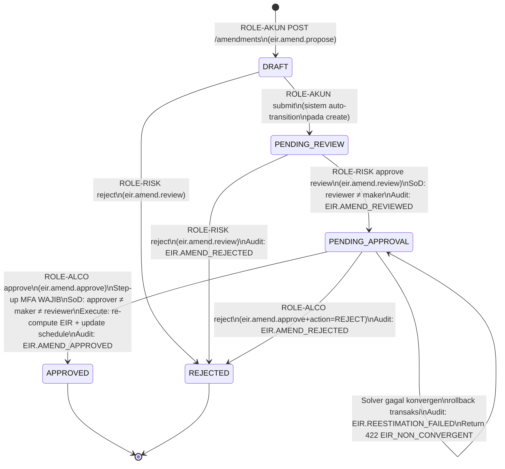

# P4-M5 EIR State Machines + Technical Specs

**Story Set**: APP-C-EIR-001..005
**Module**: APP-C — ECL Engine
**Author**: system-analyst
**Date**: 2026-06-12
**Branch**: feature/phase-4-m5-eir-contracts

---

## 1. Newton-Raphson Convergence Flowchart

```mermaid
flowchart TD
    A([Start: cashflowProjection, r_seed]) --> B{cashflowProjection valid?\ncf[0] < 0,\nlen >= 2,\nno nulls}
    B -- No --> ERR_CF[Return EIR_CASHFLOW_INVALID\nor EIR_CASHFLOW_SIGN_MISMATCH]
    B -- Yes --> C[r_0 = couponRate if provided\nelse r_0 = 0.10\niter = 0]
    C --> D["f(r_n) = Σ CF_t / (1+r_n)^t\nf'(r_n) = -Σ t×CF_t / (1+r_n)^(t+1)"]
    D --> E{f'(r_n) ≈ 0?\ndivision by zero}
    E -- Yes --> ERR_DIV[Return EIR_DIVERGENT\n'f prime near zero']
    E -- No --> F["r_{n+1} = r_n - f(r_n) / f'(r_n)"]
    F --> G{|f(r_{n+1})| < 1e-10\nOR |r_{n+1} - r_n| < 1e-10?}
    G -- Yes --> H[CONVERGED\nreturn r_{n+1}, iterations_used,\nconvergence_residual]
    G -- No --> I{iter >= 100?}
    I -- No --> J[iter++\nr_n = r_{n+1}]
    J --> K{|residual| growing\n> 10× previous?}
    K -- Yes --> ERR_DIV2[Return EIR_DIVERGENT\n'residual growing']
    K -- No --> D
    I -- Yes --> ERR_CONV[Return EIR_NON_CONVERGENT\niterations_used = 100\nresidual = last |f(r)|]
```

### Implementasi notes (untuk ecl-eir-engineer)

```go
// Package: backend/internal/ecl/eir/
// File: solver.go

// CashflowItem — input unit
type CashflowItem struct {
    Date      time.Time
    AmountIDR decimal.Decimal // shopspring/decimal, NEVER float64
}

// SolveDetail — metadata konvergensi
type SolveDetail struct {
    IterationsUsed      int
    ConvergenceResidual decimal.Decimal
    Converged           bool
}

// EIRSolver — pure function, no DB access
type EIRSolver interface {
    // Solve mencari r (EIR per periode) dari cashflow array.
    // CF[0] harus negatif (initial outflow).
    // Tolerance: 1e-10, MaxIter: 100 (DEC-013).
    // Seed: couponRate jika != nil, else 0.10.
    // Return: (eirPerPeriod, SolveDetail, error)
    // Error codes: EIR_NON_CONVERGENT, EIR_DIVERGENT, EIR_CASHFLOW_INVALID,
    //              EIR_CASHFLOW_SIGN_MISMATCH
    Solve(cashflows []CashflowItem, seed *decimal.Decimal) (decimal.Decimal, SolveDetail, error)
}
```

**Validasi cashflow sebelum solver dipanggil:**

| Field | Rule | Error Code |
|---|---|---|
| `cashflowProjection` | tidak null, len >= 2 | `EIR_CASHFLOW_INVALID` |
| `cashflowProjection[i].amountIdr` | tidak null, bukan NaN/Inf | `EIR_CASHFLOW_INVALID` |
| `cashflowProjection[0].amountIdr` | harus < 0 (outflow) | `EIR_CASHFLOW_SIGN_MISMATCH` |
| `Σ CF_t` | harus > 0 (total inflow > outflow untuk instrumen normal) | `EIR_CASHFLOW_INVALID` |
| `instrumen.klasifikasi_psak71` | harus `'AC'` atau `'FVOCI'` | `EIR_INSTRUMEN_FVTPL_NO_EIR` |
| `instrumen.eir_method_flag` | harus `TRUE` | `EIR_INSTRUMEN_FVTPL_NO_EIR` |
| POCI: `pociMode=true` tapi `flag_poci=false` | konsistensi flag | `EIR_POCI_REQUIRES_PD_ADJUSTED_CF` |
| POCI: `pociMode=false` tapi `flag_poci=true` | CF harus PD-adjusted | `EIR_POCI_REQUIRES_PD_ADJUSTED_CF` |

**Precision enforcement (WAJIB — DEC-016):**
- Semua compute menggunakan `shopspring/decimal.Decimal`
- Rounding: `HALF_EVEN` (banker's rounding) di setiap langkah
- `f(r)` dan `f'(r)` compute dalam decimal, bukan float64
- Tolerance `1e-10` direpresentasikan sebagai `decimal.NewFromString("0.0000000001")`
- Golangci-lint `forbidigo` harus block `float64` di semua file dalam package `ecl/eir/`

---

## 2. Schedule Generation Flowchart

```mermaid
flowchart TD
    A([Start: instrumenId, eirPerPeriod]) --> B{instrumen.eir_awal\nIS NULL?}
    B -- Yes --> ERR_EIR[Return EIR_NOT_YET_COMPUTED\nCompute EIR terlebih dahulu]
    B -- No --> C{Ada rows aktif?\nrecomputed_from_seq IS NULL}
    C -- Yes --> D{forceRegenerate=true?}
    D -- No --> ERR_DUP[Return EIR_DUPLICATE_SCHEDULE_VERSION\nGunakan amendment flow]
    D -- Yes --> E[Lanjut: initial origination ulang]
    C -- No --> F[Load instrumen:\nnominal, kupon, frekuensi,\ntanggal_penempatan, tanggal_jatuh_tempo,\nbiaya_transaksi_capitalized]
    E --> F
    F --> G["opening_carrying_1 = nominal + biaya_transaksi\nperiode_seq = 1\nrows = []"]
    G --> H{Masih ada periode\nsebelum jatuh tempo?}
    H -- No --> I{closing_carrying_last ≈ 0?\ndelta ≤ IDR 1}
    I -- No --> ERR_BAL[Log WARNING: Rounding delta > IDR 1\nPersist dengan catatan di\nschedule_id_kode]
    I -- Yes --> J[BEGIN TRANSACTION\nINSERT all rows ke\necl.eir_amortization_schedule\nrecomputed_from_seq = NULL\nstatus_posting = 'PROYEKSI']
    J --> K[WRITE EIR.SCHEDULE_GENERATED\nke aud.audit_log IN SAME TX]
    K --> L[COMMIT]
    L --> M([Return EIRScheduleGenerateResponse])
    H -- Yes --> N["pendapatan_bunga_eir = opening_carrying × eir_per_periode\ncash_inflow = kupon_kontraktual_t\namortisasi_p_d = pendapatan_bunga_eir - cash_inflow\npelunasan_pokok = pokok jika last periode else 0\nclosing_carrying = opening_carrying + amortisasi_p_d - pelunasan_pokok"]
    N --> O[Append row dengan\nHALF_EVEN rounding\nper field NUMERIC(20,4)]
    O --> P[opening_carrying_{t+1} = closing_carrying_t\nperiode_seq++]
    P --> H
```

### Schedule row formula (per periode t)

```
opening_carrying_{1} = nominal + biaya_transaksi_capitalized

Untuk t = 1..N:
  pendapatan_bunga_eir_t = opening_carrying_{t-1} × eir_per_periode
                           [HALF_EVEN round ke 4 desimal]
  
  cash_inflow_t          = kupon_kontraktual_t
                           [per schedule kupon dari instrumen]
  
  amortisasi_p_d_t       = pendapatan_bunga_eir_t - cash_inflow_t
                           [positif = diskonto amortisasi naik ke par]
                           [negatif = premium amortisasi turun ke par]
  
  pelunasan_pokok_t      = nominal jika t = N, else 0
                           [untuk bullet bond; amortizing bond berbeda]
  
  closing_carrying_t     = opening_carrying_{t-1} + amortisasi_p_d_t - pelunasan_pokok_t
                           [HALF_EVEN round ke 4 desimal]

Invariant terakhir:
  closing_carrying_N ≈ 0, delta ≤ IDR 1 (HALF_EVEN rounding tolerance)
  Jika delta > IDR 1: warning log, persist tetap, catat closingRoundingDelta di response
```

### Schedule ScheduleService interface

```go
// File: backend/internal/ecl/eir/schedule_service.go

type ScheduleRow struct {
    PeriodeSeq           int
    TanggalPosting       time.Time
    OpeningCarrying      decimal.Decimal
    CashInflow           decimal.Decimal
    PendapatanBungaEIR   decimal.Decimal
    AmortisasiPD         decimal.Decimal
    PelunasanPokok       decimal.Decimal
    ClosingCarrying      decimal.Decimal
    EIRPeriode           decimal.Decimal
    StageSaatPosting     string
    StatusPosting        string
    RecomputedFromSeq    *int // nil = aktif
}

type ScheduleService interface {
    // Generate builds schedule dan persist ke ecl.eir_amortization_schedule.
    // Tulis EIR.SCHEDULE_GENERATED ke aud.audit_log dalam transaksi yang sama.
    Generate(ctx context.Context, instrumenID uuid.UUID, eirPerPeriod decimal.Decimal) ([]ScheduleRow, error)

    // GetActiveAtPeriode mengembalikan row aktif yang tanggal_posting-nya
    // jatuh dalam periode tertentu. Return nil, nil jika tidak ada (graceful).
    GetActiveAtPeriode(ctx context.Context, instrumenID uuid.UUID, periode time.Time) (*ScheduleRow, error)

    // ListActive mengembalikan semua rows aktif (recomputed_from_seq IS NULL).
    // Cursor-paginated per ListQuery.
    ListActive(ctx context.Context, instrumenID uuid.UUID, q listquery.Query) ([]ScheduleRow, listquery.Pagination, error)

    // ListAll termasuk superseded rows. Hanya ROLE-RISK dan ROLE-AUDIT.
    ListAll(ctx context.Context, instrumenID uuid.UUID, q listquery.Query) ([]ScheduleRow, listquery.Pagination, error)
}
```

---

## 3. EIR Amendment Workflow State Machine



### SoD enforcement matrix (amendment)

| Step | Actor | Constraint | Error jika dilanggar |
|---|---|---|---|
| Propose | ROLE-AKUN (maker) | — | — |
| Review | ROLE-RISK (reviewer) | reviewer_id ≠ maker_id | `SOD_VIOLATION` 403 |
| Approve | ROLE-ALCO (approver) | approver_id ≠ maker_id AND approver_id ≠ reviewer_id | `SOD_VIOLATION` 403 |
| Approve | ROLE-ALCO | Step-up MFA token valid dan < 5 menit | `STEP_UP_REQUIRED` 403 atau `STEP_UP_EXPIRED` 403 |

### AmendmentService interface

```go
// File: backend/internal/ecl/eir/amendment_service.go

type AmendmentService interface {
    // Propose: ROLE-AKUN mengajukan proposal. Membuat row di ecl.eir_reestimation_log.
    // workflow_status = 'DRAFT' → 'PENDING_REVIEW' (auto, satu step karena create=submit).
    Propose(ctx context.Context, req ProposeRequest, actorID uuid.UUID) (EIRAmendmentProposal, error)

    // Review: ROLE-RISK sign-off. PENDING_REVIEW → PENDING_APPROVAL atau REJECTED.
    // SoD check: reviewer_id ≠ maker_id.
    Review(ctx context.Context, proposalID uuid.UUID, action WorkflowAction, actorID uuid.UUID) (EIRAmendmentProposal, error)

    // Approve: ROLE-ALCO final approve. PENDING_APPROVAL → APPROVED.
    // Step-up MFA token di-validate. SoD check: approver ≠ maker ≠ reviewer.
    // Eksekusi re-compute + update schedule dalam satu transaksi.
    // Jika solver gagal: rollback, kembali ke PENDING_APPROVAL, return EIR_NON_CONVERGENT.
    Approve(ctx context.Context, proposalID uuid.UUID, action WorkflowAction, actorID uuid.UUID, stepUpToken string) (EIRAmendmentProposal, error)

    // Reject: ROLE-RISK atau ROLE-ALCO menolak dari state manapun yang valid.
    Reject(ctx context.Context, proposalID uuid.UUID, comment string, actorID uuid.UUID) (EIRAmendmentProposal, error)
}
```

### Amendment execution (setelah APPROVED)

```
DALAM SATU DATABASE TRANSACTION:

1. Load instrumen + proposal (LOCK FOR UPDATE)

2. Re-run Newton-Raphson:
   seed = eir_reestimation_log.eir_sebelum
   cashflows = proposal.revisedCashflows
   → hasilkan eir_baru

   Jika gagal: ROLLBACK, return EIR_NON_CONVERGENT

3. UPDATE ecl.eir_amortization_schedule
   SET recomputed_from_seq = first_new_periode_seq
   WHERE instrumen_id = X
     AND periode_seq >= amendment_periode_seq_start
     AND recomputed_from_seq IS NULL
   RULES:
   - HANYA kolom recomputed_from_seq yang di-update
   - opening_carrying, pendapatan_bunga_eir, amortisasi_p_d, pelunasan_pokok,
     closing_carrying, eir_periode TIDAK BOLEH DIUBAH
   - DB trigger EnforceScheduleAmountsImmutable harus menolak UPDATE pada kolom amounts

4. INSERT rows baru (sisa tenor mulai amendment_date)
   recomputed_from_seq = NULL
   eir_periode = eir_baru

5. UPDATE mst.instrumen
   SET eir_awal = eir_baru,
       tanggal_eir_computed = now()

6. UPDATE ecl.eir_reestimation_log
   SET workflow_status = 'APPROVED',
       eir_sesudah = eir_baru,
       catch_up_adjustment = NPV_difference,
       approved_at = now(),
       approver_id = actorID,
       -- signature_hash kolom di migration 000026
       

7. INSERT aud.audit_log (EIR.AMEND_APPROVED)
   before_jsonb: {eir_awal: eir_lama}
   after_jsonb: {eir_awal: eir_baru, catch_up_adjustment: X}

8. COMMIT
```

---

## 4. Bulk Re-compute Job Flowchart

```mermaid
flowchart TD
    A([ROLE-RISK POST /bulk-recompute]) --> B{Job EIR_BULK_RECOMPUTE\nsedang berjalan\nuntuk tenant ini?}
    B -- Yes --> ERR_409[Return 409 CONFLICT\n'Job sedang berjalan']
    B -- No --> C[Return 202 { jobId, statusUrl, streamUrl }]
    C --> D[Asynq enqueue: EIR_BULK_RECOMPUTE]
    D --> E[Worker start:\nQuery instrumen aktif\neir_method_flag=TRUE\nklasifikasi IN AC/FVOCI]
    E --> F[total = COUNT instrumen\ndrift_report = []\nschedule_missing = []\nerrors = []]
    F --> G{ctx cancelled?\nstatus = cancelled?}
    G -- Yes --> CANCEL[status = cancelled\nAudit: EIR.BULK_RECOMPUTE_CANCELLED\nReturn partial result]
    G -- No --> H{Lebih banyak\ninstrumen?}
    H -- No --> DONE
    H -- Yes --> I[Load instrumen (stream 1 by 1)\n≤ 10KB per instrument di memory]
    I --> J[Re-compute EIR dari cashflow]
    J --> K{Solver error?}
    K -- Yes --> L[errors.append\n{instrumenId, error_code}]
    L --> M
    K -- No --> M{|eir_computed - eir_awal|\n> 1e-6?}
    M -- Yes --> N[drift_report.append\n{instrumenId, eir_stored, eir_computed, delta}]
    N --> O
    M -- No --> O{Rows aktif ada?\nrecomputed_from_seq IS NULL}
    O -- No --> P[schedule_missing.append\n{instrumenId, 'ACTION_REQUIRED: generate schedule'}]
    P --> Q
    O -- Yes --> Q{closing_carrying_last ≈ 0?\ndelta ≤ IDR 1}
    Q -- No --> R[schedule_missing.append\n{instrumenId, 'SCHEDULE_BROKEN: closing delta > IDR 1'}]
    R --> S
    Q -- Yes --> S[processed++\nReport progress setiap 100 instrumen:\nredis HSET job:{jobId}\nredis PUBLISH job-events:{jobId}]
    S --> G

    DONE --> T[status = completed\natau completed_with_errors jika errors > 0\nSimapan di sys.job.result_jsonb:\n{total, valid, driftCount, scheduleMissing, totalErrors, ...}\nAudit: EIR.BULK_RECOMPUTE summary\nNotifikasi ROLE-RISK jika driftCount > 0]
    T --> U([End])
```

### BulkService interface

```go
// File: backend/internal/ecl/eir/bulk_service.go

type BulkRecomputeResult struct {
    Total                    int
    Valid                    int
    DriftCount               int
    ScheduleMissing          int
    TotalErrors              int
    CompletedWithErrors      bool
    DriftInstruments         []DriftEntry
    ScheduleMissingItems     []MissingScheduleEntry
    Errors                   []BulkErrorEntry
}

type BulkService interface {
    // Recompute trigger dari Asynq worker.
    // Tidak memodifikasi DB (report-only, DEC-013).
    // SLA: ≤ 5 detik untuk 1000 instrumen (DEC-013 via SoW_v1.4).
    // Memory: streaming per instrument, ≤ 10KB per instrument.
    Recompute(ctx context.Context, jobID string, scope BulkScope) (BulkRecomputeResult, error)
}
```

---

## 5. Error Catalog — Tambahkan ke `_common.yaml`

Tambahkan ke `api/openapi/_common.yaml` `components.schemas.ErrorCode.enum`:

| Error Code | HTTP | Trigger | Message (Bahasa Indonesia) |
|---|---|---|---|
| `EIR_NON_CONVERGENT` | 422 | Newton-Raphson melebihi max 100 iterasi | "Newton-Raphson tidak konvergen dalam 100 iterasi. Periksa cashflow projection." |
| `EIR_DIVERGENT` | 422 | Residual bertumbuh antar iterasi / f'(r) ≈ 0 | "Solver EIR divergen. f'(r) mendekati nol atau residual bertumbuh." |
| `EIR_CASHFLOW_INVALID` | 422 | CF null/kosong/negatif/missing tanggal jatuh tempo | "cashflowProjection tidak valid: {detail}" |
| `EIR_CASHFLOW_SIGN_MISMATCH` | 422 | CF[0] bukan negatif | "cashflowProjection[0].amountIdr harus negatif (initial outflow/investment)" |
| `EIR_INSTRUMEN_FVTPL_NO_EIR` | 422 | Instrumen FVTPL atau FVOCI_ELECTION | "EIR tidak berlaku untuk instrumen {klasifikasi}. Hanya AC dan FVOCI debt yang menggunakan amortized cost." |
| `EIR_SCHEDULE_NOT_FOUND` | 404 | GET schedule tapi tidak ada rows | "Schedule EIR tidak ditemukan untuk instrumen ini" |
| `EIR_SCHEDULE_PERIODE_OUT_OF_RANGE` | 422 | Periode melewati jatuh tempo instrumen | "Periode {date} melewati tanggal jatuh tempo instrumen ({maturity})" |
| `EIR_DUPLICATE_SCHEDULE_VERSION` | 409 | Schedule aktif sudah ada saat generate | "Instrumen sudah punya schedule aktif. Gunakan amendment workflow untuk re-estimasi." |
| `EIR_POCI_REQUIRES_PD_ADJUSTED_CF` | 422 | Instrumen POCI tapi CF tidak PD-adjusted | "Instrumen POCI membutuhkan cashflow yang sudah PD-adjusted. Set pociMode=true dan sediakan cashflow PD-adjusted." |
| `EIR_BULK_RECOMPUTE_INVALID_SCOPE` | 400 | Scope parameter tidak valid | "scope harus ALL_ACTIVE atau SUBSET dengan instrumenIds yang valid" |
| `EIR_INSTRUMEN_NOT_FOUND` | 404 | instrumenId tidak ada di mst.instrumen | "Instrumen tidak ditemukan atau sudah dihapus" |
| `EIR_ALREADY_COMPUTED` | 409 | eir_awal sudah terisi tanpa forceRecompute | "EIR sudah dihitung. Gunakan amendment flow untuk re-estimasi, atau set forceRecompute=true untuk koreksi origination." |
| `EIR_NOT_YET_COMPUTED` | 422 | Generate schedule sebelum EIR dihitung | "mst.instrumen.eir_awal IS NULL. Compute EIR terlebih dahulu sebelum generate schedule." |

---

## 6. Validation Rules Table

### EIR Compute (POST /ecl/eir/compute)

| Field | Rule | Error Code | Message-ID |
|---|---|---|---|
| `instrumenId` | UUID v4, exists di mst.instrumen | `EIR_INSTRUMEN_NOT_FOUND` | eir.instrumen.not_found |
| `instrumenId` | instrumen.deleted_at IS NULL | `EIR_INSTRUMEN_NOT_FOUND` | eir.instrumen.deleted |
| `instrumen.klasifikasi_psak71` | IN ('AC', 'FVOCI') | `EIR_INSTRUMEN_FVTPL_NO_EIR` | eir.instrumen.fvtpl_no_eir |
| `instrumen.eir_method_flag` | = TRUE | `EIR_INSTRUMEN_FVTPL_NO_EIR` | eir.instrumen.method_flag_false |
| `instrumen.eir_awal` | IS NULL jika persistResult=true dan forceRecompute=false | `EIR_ALREADY_COMPUTED` | eir.already_computed |
| `cashflowProjection` | tidak null, len >= 2 | `EIR_CASHFLOW_INVALID` | eir.cashflow.empty |
| `cashflowProjection[i].amountIdr` | tidak null, bukan NaN/Inf, NUMERIC(20,4) representable | `EIR_CASHFLOW_INVALID` | eir.cashflow.amount_invalid |
| `cashflowProjection[0].amountIdr` | < 0 (strict) | `EIR_CASHFLOW_SIGN_MISMATCH` | eir.cashflow.sign_mismatch |
| `initialPrincipalIdr` | > 0 | `VALIDATION_FAILED` | eir.initial_principal.positive |
| `couponRate` | jika provided: 0 < couponRate < 1 | `VALIDATION_FAILED` | eir.coupon_rate.range |
| POCI cross-field | pociMode=true XOR flag_poci=true (harus konsisten) | `EIR_POCI_REQUIRES_PD_ADJUSTED_CF` | eir.poci.mode_mismatch |

### EIR Generate Schedule (POST /ecl/eir/generate-schedule)

| Field | Rule | Error Code | Message-ID |
|---|---|---|---|
| `instrumenId` | exists + not deleted | `EIR_INSTRUMEN_NOT_FOUND` | eir.instrumen.not_found |
| `instrumen.eir_awal` | IS NOT NULL | `EIR_NOT_YET_COMPUTED` | eir.not_yet_computed |
| `instrumen` dalam periode hard-closed | tanggal_penempatan tidak dalam hard-closed periode | `PERIODE_CLOSED` | periode.closed |
| Rows aktif exist | recomputed_from_seq IS NULL COUNT = 0 jika forceRegenerate=false | `EIR_DUPLICATE_SCHEDULE_VERSION` | eir.schedule.duplicate |
| Balance check | closing_carrying_N ≤ IDR 1 dari 0 | WARNING (bukan error) | eir.schedule.balance_warning |

### EIR Amendment Propose (POST /ecl/eir/amendments)

| Field | Rule | Error Code | Message-ID |
|---|---|---|---|
| `instrumenId` | exists + AKTIF + eir_awal NOT NULL | `EIR_INSTRUMEN_NOT_FOUND` / `EIR_NOT_YET_COMPUTED` | eir.instrumen.not_found |
| `amendmentDate` | tidak dalam periode hard-closed | `PERIODE_CLOSED` | periode.closed |
| `amendmentDate` | > last POSTED row tanggal_posting | `VALIDATION_FAILED` | eir.amendment.date_before_posted |
| `revisedCashflows` | len >= 2, CF[0] < 0 | `EIR_CASHFLOW_INVALID` / `EIR_CASHFLOW_SIGN_MISMATCH` | eir.cashflow.* |
| `alasan` | len >= 30 chars | `VALIDATION_FAILED` | eir.amendment.alasan_too_short |
| `dokumenPendukungId` | tidak null, exists di doc.upload | `VALIDATION_FAILED` | eir.amendment.dokumen_required |
| Unique active proposal | Tidak ada proposal DRAFT/PENDING_REVIEW/PENDING_APPROVAL untuk instrumen ini | `CONFLICT` | eir.amendment.active_exists |

### EIR Amendment Review (POST /ecl/eir/amendments/{id}/review)

| Field | Rule | Error Code | Message-ID |
|---|---|---|---|
| `proposal.workflow_status` | = 'PENDING_REVIEW' | `WORKFLOW_INVALID_TRANSITION` | workflow.invalid_transition |
| Actor permission | `eir.amend.review` | `FORBIDDEN` | auth.forbidden |
| SoD | reviewer_id ≠ maker_id | `SOD_VIOLATION` | sod.reviewer_is_maker |
| `comment` | required jika action=REJECT | `VALIDATION_FAILED` | eir.review.comment_required_on_reject |

### EIR Amendment Approve (POST /ecl/eir/amendments/{id}/approve)

| Field | Rule | Error Code | Message-ID |
|---|---|---|---|
| `proposal.workflow_status` | = 'PENDING_APPROVAL' | `WORKFLOW_INVALID_TRANSITION` | workflow.invalid_transition |
| Actor permission | `eir.amend.approve` | `FORBIDDEN` | auth.forbidden |
| SoD | approver_id ≠ maker_id AND approver_id ≠ reviewer_id | `SOD_VIOLATION` | sod.approver_is_maker_or_reviewer |
| Step-up MFA | X-Step-Up-Token valid dan ≤ 5 menit | `STEP_UP_REQUIRED` / `STEP_UP_EXPIRED` | auth.step_up_required |
| Solver result | EIR konvergen | `EIR_NON_CONVERGENT` → rollback | eir.reestimation.non_convergent |

---

## 7. Performance SLA

| Operation | SLA | Method |
|---|---|---|
| Single EIR compute | ≤ 200ms P99 | Pure Newton-Raphson in-process, no external call |
| Single schedule generate (100 periods) | ≤ 200ms P99 | Single bulk INSERT |
| Schedule lookup per periode | ≤ 20ms P99 | Index: `(instrumen_id, periode_seq) WHERE recomputed_from_seq IS NULL` |
| Bulk re-compute 1000 instruments | ≤ 5s total | Streaming, no bulk load, Asynq worker |
| Amendment approve (re-compute + schedule update) | ≤ 2s | Single DB transaction |

---

## 8. Audit Policy

| Event | Trigger | Scope | Level |
|---|---|---|---|
| `EIR.COMPUTE` | persistResult=true, solver sukses | Per instrumen | In-transaction |
| `EIR.COMPUTE_FAILED` | solver gagal konvergen | Per instrumen | In-transaction |
| `EIR.SCHEDULE_GENERATED` | generate-schedule sukses | Per instrumen | In-transaction |
| `EIR.SCHEDULE_EXPORT` | export CSV/XLSX | Per export action | In-transaction |
| `EIR.AMEND_PROPOSED` | proposal dibuat | Per proposal | In-transaction |
| `EIR.AMEND_REVIEWED` | ROLE-RISK sign-off | Per proposal | In-transaction |
| `EIR.AMEND_APPROVED` | ROLE-ALCO approve + execution sukses | Per proposal | In-transaction |
| `EIR.AMEND_REJECTED` | reject dari state manapun | Per proposal | In-transaction |
| `EIR.REESTIMATION_FAILED` | solver gagal saat approve | Per proposal | In-transaction (rollback, audit tetap ditulis) |
| `EIR.BULK_RECOMPUTE` | bulk job complete | Summary per job (1 row) | Post-job |
| `EIR.BULK_RECOMPUTE_CANCELLED` | user cancel job | Per job | Post-cancel |

**Catatan audit `EIR.REESTIMATION_FAILED`**: ditulis dalam transaksi terpisah setelah rollback proposal karena transaksi utama di-rollback. Gunakan `database/sql` dengan `BEGIN` terpisah hanya untuk audit entry ini.

---

## 9. POCI Test Vectors (dokumentasi untuk M7)

POCI full logic deferred ke M7. M5 hanya:
1. Menerima `pociMode=true` pada request
2. Mem-flag response dengan `eirType = "CREDIT_ADJUSTED"`
3. Menyimpan note di `aud.audit_log.after_jsonb`: `{"eir_type": "CREDIT_ADJUSTED", "poci_mode": true}`

**Test vectors yang harus di-validasi M7 compliance review:**

```
TC-POCI-001:
  instrumen: OBLIGASI korporat, flag_poci=true
  CF tanpa PD-adjustment → EIR_POCI_REQUIRES_PD_ADJUSTED_CF

TC-POCI-002:
  instrumen: OBLIGASI korporat, flag_poci=true
  CF = PD-adjusted (expected cashflows, bukan kontraktual)
  pociMode=true
  Expected: solver berjalan, eirType=CREDIT_ADJUSTED
  Note: credit-adjusted EIR < kontraktual EIR (CF lebih kecil karena PD)

TC-POCI-003:
  Non-POCI instrumen, pociMode=true → EIR_POCI_REQUIRES_PD_ADJUSTED_CF
  (flag_poci=false di instrumen tapi pociMode=true di request → mismatch)
```

---

## 10. Hand-off Spec — `ecl-eir-engineer`

### Package structure

```
backend/internal/ecl/eir/
├── solver.go              — EIRSolver.Solve() pure Newton-Raphson
├── solver_test.go         — unit tests: convergence, edge cases, POCI vectors
├── schedule_service.go    — ScheduleService.Generate(), GetActiveAtPeriode(), ListActive(), ListAll()
├── schedule_service_test.go
├── eir_service.go         — EIRService.Compute() — orchestrate solver + persist
├── amendment_service.go   — AmendmentService.Propose(), Review(), Approve(), Reject()
├── bulk_service.go        — BulkService.Recompute() — Asynq worker handler
├── errors.go              — domain errors mapping ke HTTP error codes
└── handler.go             — HTTP handlers (Gin) per endpoint
```

### Key services

```go
// EIRService — orchestrate solver + persist
type EIRService interface {
    // Compute: validate instrumen, run solver, optionally persist.
    // Permission: eir.compute
    Compute(ctx context.Context, req EIRComputeRequest, actorID uuid.UUID) (EIRComputeResponse, error)
}
```

### Migration hand-off — `data-modeler`

**Migration 000026** (karena 000025 mungkin sudah exist — verify dengan `ls db/migrations/`):

Perlu di-assess:

1. `ecl.eir_amortization_schedule`:
   - ADD audit cols: `created_by UUID NOT NULL`, `updated_at TIMESTAMPTZ NOT NULL DEFAULT now()`, `updated_by UUID NOT NULL`, `deleted_at TIMESTAMPTZ`, `deleted_by UUID`, `row_version BIGINT NOT NULL DEFAULT 1`, `tenant_id TEXT NOT NULL DEFAULT 'TUGURE'`
   - ALTER `eir_periode NUMERIC(12,8)` → `NUMERIC(10,8)` (DEC-016 conflict)
   - ALTER `opening_carrying`, `cash_inflow`, `pendapatan_bunga_eir`, `amortisasi_p_d`, `pelunasan_pokok`, `closing_carrying`: `NUMERIC(20,2)` → `NUMERIC(20,4)` (DEC-016)
   - ADD trigger `EnforceScheduleAmountsImmutable`: BEFORE UPDATE ON ecl.eir_amortization_schedule — tolak UPDATE pada kolom amounts finansial, hanya izinkan UPDATE pada `recomputed_from_seq` (untuk marking superseded rows)
   - ADD trigger `trg_set_updated_at` + `trg_increment_row_version`

2. `ecl.eir_reestimation_log`:
   - ADD audit cols: `updated_at`, `updated_by`, `deleted_at`, `deleted_by`, `row_version`, `tenant_id`, `created_by`
   - ALTER `eir_sebelum`, `eir_sesudah NUMERIC(12,8)` → `NUMERIC(10,8)` (DEC-016)
   - ALTER `carrying_sebelum`, `carrying_sesudah`, `catch_up_adjustment NUMERIC(20,2)` → `NUMERIC(20,4)` (DEC-016)
   - ADD `rejected_at TIMESTAMPTZ`
   - ADD `reject_reason TEXT`
   - ADD `reviewer_comment TEXT`
   - ADD `approver_comment TEXT`
   - ADD `reviewer_signature_hash TEXT` — SHA-256(reviewer||action||proposalId||at||comment)
   - ADD `approver_signature_hash TEXT` — SHA-256(approver||action||proposalId||at||comment)
   - ADD CONSTRAINT `chk_workflow_status CHECK (workflow_status IN ('DRAFT','PENDING_REVIEW','PENDING_APPROVAL','APPROVED','REJECTED'))`
   - ADD CONSTRAINT `chk_eir_sod CHECK (reviewer_id IS NULL OR reviewer_id ≠ maker_id)`
   - ADD trigger `trg_set_updated_at` + `trg_increment_row_version`

3. `trx.amortisasi`:
   - ADD audit cols: `created_by UUID NOT NULL`, `updated_at TIMESTAMPTZ NOT NULL DEFAULT now()`, `updated_by UUID NOT NULL`, `deleted_at TIMESTAMPTZ`, `deleted_by UUID`, `row_version BIGINT NOT NULL DEFAULT 1`, `tenant_id TEXT NOT NULL DEFAULT 'TUGURE'`
   - ALTER `amortisasi_premium_diskonto_idr NUMERIC(20,2)` → `NUMERIC(20,4)` (DEC-016)
   - ADD trigger `trg_set_updated_at` + `trg_increment_row_version`

4. `mst.instrumen`:
   - ALTER `eir_awal NUMERIC(12,8)` → `NUMERIC(10,8)` (DEC-016)
   - ADD `flag_poci BOOLEAN NOT NULL DEFAULT FALSE` (OQ-M5-3 forward-compat)

5. Verify: `ls db/migrations/` untuk nomor migration berikutnya yang tersedia. Jika 000025 belum ada, gunakan 000025. Jika sudah, gunakan 000026.

### Asynq job type

```go
const TypeEIRBulkRecompute = "eir:bulk_recompute"

type EIRBulkRecomputePayload struct {
    JobID     string    `json:"job_id"`
    Scope     string    `json:"scope"` // ALL_ACTIVE | SUBSET
    InstrumenIDs []uuid.UUID `json:"instrumen_ids,omitempty"`
    PeriodeID *uuid.UUID `json:"periode_id,omitempty"`
    Reason    string    `json:"reason,omitempty"`
    TenantID  string    `json:"tenant_id"`
    ActorID   uuid.UUID `json:"actor_id"`
}
```

---

## 11. Hand-off — `frontend-engineer-nextjs`

Screens yang perlu diimplementasikan:

| Screen | Route | Komponen | Permission |
|---|---|---|---|
| EIR Compute Preview | `/ecl/eir/compute` | Form + result panel | `eir.preview` |
| Schedule View | `/ecl/eir/instrumen/{id}/schedule` | DataTable + export | `eir.preview` |
| Schedule History | `/ecl/eir/instrumen/{id}/schedule/history` | DataTable + export | `eir.preview` (ROLE-RISK + AUDIT) |
| Amendment List | `/ecl/eir/amendments` | DataTable queue | `eir.preview` |
| Amendment Detail | `/ecl/eir/amendments/{id}` | Workflow panel + sign | `eir.amend.*` |
| Amendment Propose | `/ecl/eir/amendments/new` | Form + cashflow editor | `eir.amend.propose` |
| Bulk Recompute | `/ecl/eir/bulk-recompute` | Trigger button + JobProgressPanel | `eir.bulk_recompute` |

**Catatan UX:**
- `<JobProgressPanel>` SSE untuk bulk-recompute (UX §3)
- Toast notifikasi success/fail per UX §2
- DataTable dengan sort+page+filter+export per UX §1
- EIR amounts ditampilkan sebagai string dari API (bukan number) untuk preserve presisi 8 desimal
- `eir_per_period: "0.04200000"` → display sebagai `4.2000000%` (multiply × 100, 7 desimal)
- Confirm dialog untuk amendment propose + approve (UX §2 destructive)

---

## 12. Hand-off — `ifrs9-compliance-reviewer` (BLOCKING gate)

Sebelum merge PR P4-M5, review wajib:

1. **DEC-013 verification**: Newton-Raphson tolerance `1e-10`, max `100` iter, seed = couponRate atau `0.10`
2. **DEC-016 verification**: Tidak ada `float64` di computation path. `NUMERIC(10,8)` untuk EIR, `NUMERIC(20,4)` untuk IDR amounts
3. **Immutability**: Rows lama di `ecl.eir_amortization_schedule` — hanya `recomputed_from_seq` yang di-UPDATE, amounts finansial tidak boleh berubah
4. **OQ-M5-6 verification (FVOCI amortisasi direction)**: Konfirmasi bahwa `amortisasi_p_d` untuk FVOCI debt dialokasikan ke P&L (sama dengan AC, per IFRS 9 §5.7.11), bukan ke OCI. Jika butuh flag terpisah di schedule row, minta data-modeler tambah kolom `jurnal_target VARCHAR(10) CHECK IN ('PL', 'OCI')` di migration
5. **POCI stub**: Verifikasi bahwa POCI flag di response dan audit log cukup untuk M5, dan M7 akan mengambil alih full POCI logic tanpa schema change
6. **SoD enforcement**: Verify 3-actor chain (AKUN ≠ RISK ≠ ALCO) di-enforce server-side, bukan hanya di UI
