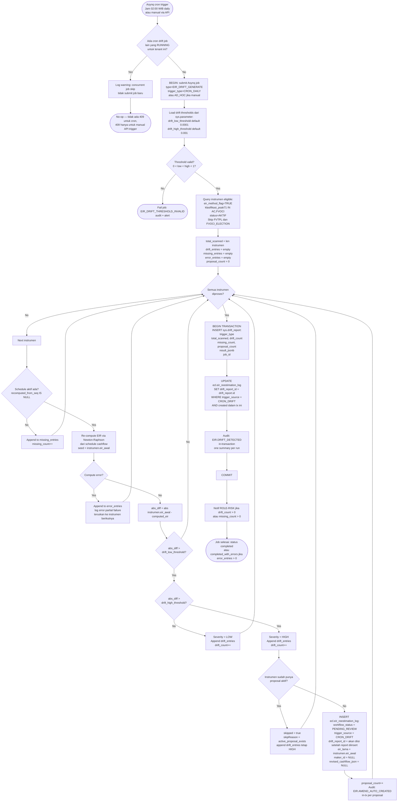
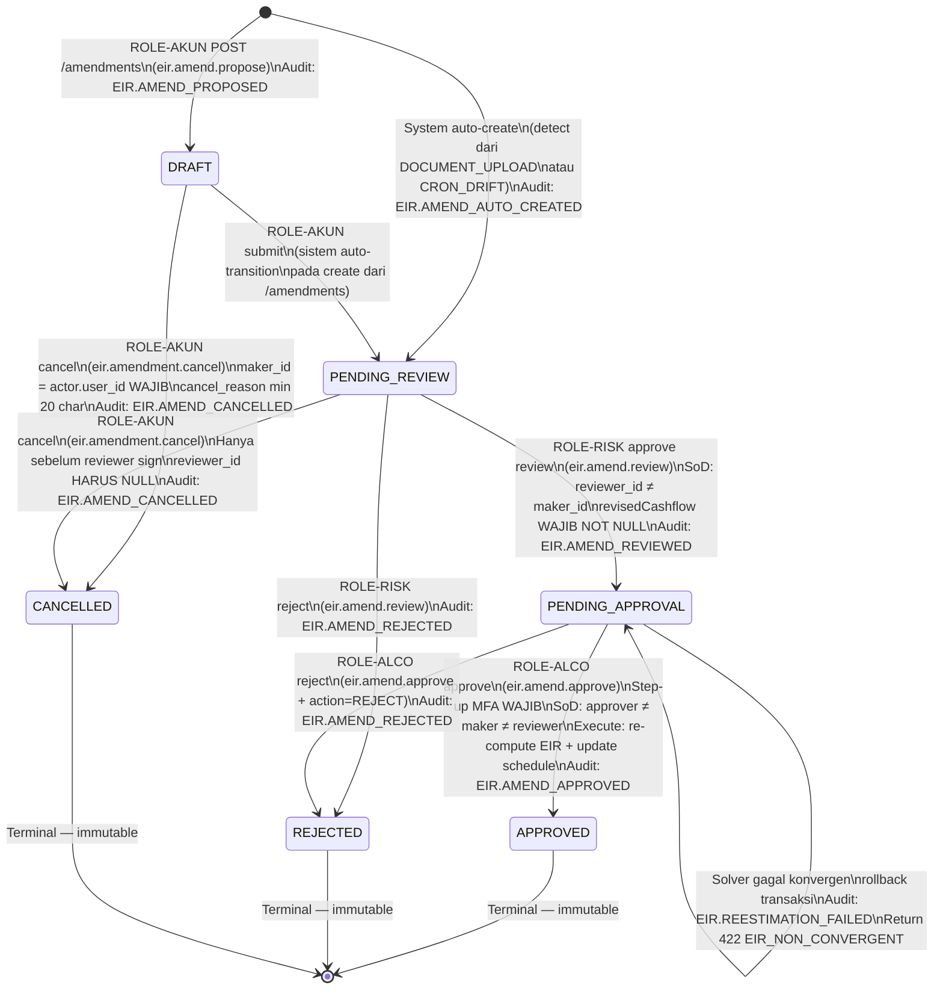

# P4-M6 EIR Amendment Lifecycle — State Machines + Technical Specs

**Story Set**: APP-C-M6-001..005
**Module**: APP-C — ECL Engine
**Author**: system-analyst
**Date**: 2026-06-12
**Branch**: feature/phase-4-m6-amendment-contracts
**Depends on**: P4-M5 (PR #60) — amendment CRUD, BulkService, ecl.eir_reestimation_log

---

## 1. Document Upload Detection Flowchart (M6-001)

```mermaid
flowchart TD
    A([doc.document inserted with status=APPROVED]) --> B{document_type IN\nAMENDMENT_KONTRAK_DEPOSITO\nAMENDMENT_KONTRAK_OBLIGASI?}
    B -- No --> LOG_SKIP[Log info: document_type tidak relevan\nbukan event amandemen EIR\nbukan audit event]
    B -- Yes --> C{entity_type =\nmst.instrumen?}
    C -- No --> LOG_SKIP
    C -- Yes --> D[Load instrumen via entity_id]
    D --> E{instrumen.status = AKTIF\nAND eir_method_flag = TRUE\nAND klasifikasi_psak71 IN\nAC, FVOCI?}
    E -- No --> LOG_SKIP2[Log info: instrumen tidak eligible\nmisal FVTPL - skip]
    E -- Yes --> F{instrumen.eir_awal\nIS NOT NULL?}
    F -- No --> AUDIT_FAIL[Audit: EIR.AMEND_AUTO_FAILED\nalasan: eir_not_computed\nNotif ROLE-AKUN: EIR belum dihitung]
    AUDIT_FAIL --> END_FAIL([Return 422 EIR_AMENDMENT_DETECTION_NO_MATCH])
    F -- Yes --> G{Ada proposal aktif?\nworkflow_status NOT IN\nAPPROVED, REJECTED, CANCELLED}
    G -- Yes --> AUDIT_SKIP[Audit: EIR.AMEND_AUTO_SKIPPED\nalasan: active_proposal_exists\nNotif ROLE-RISK: proposal aktif sudah ada]
    AUDIT_SKIP --> END_SKIP([Return 422 EIR_AMENDMENT_DETECTION_NO_MATCH])
    G -- No --> H[BEGIN TRANSACTION\nINSERT ecl.eir_reestimation_log dengan:\n workflow_status = PENDING_REVIEW\n trigger_source = DOCUMENT_UPLOAD\n document_id = doc.id\n eir_lama = instrumen.eir_awal\n revised_cashflow_json = NULL\n maker_id = NULL (auto-created)]
    H --> I[Audit: EIR.AMEND_AUTO_CREATED\nin-transaction]
    I --> J[COMMIT]
    J --> K[Notif in-app ke semua ROLE-RISK:\nProposal amandemen EIR otomatis dibuat\nuntuk instrumen_kode. Harap review.]
    K --> L([Return 201 dengan amendmentId, status=PENDING_REVIEW\ncashflowRevisiRequired=true])
```

### Notes implementasi DetectionService

- Dipanggil sebagai event listener setelah `doc.document.status` berubah ke `APPROVED`.
- Gunakan DB trigger atau application-level event dari document approval workflow.
- Jika pipeline upload memanggil `POST /ecl/eir/amendments/detect` secara eksplisit:
  `Idempotency-Key = documentId` — cegah double-create jika pipeline retry.
- `actor_role = 'SYSTEM'` di aud.audit_log untuk auto-created proposals.
- revised_cashflow_json = NULL saat created — ROLE-AKUN wajib melengkapi via
  `PATCH /ecl/eir/amendments/{id}/cashflows` sebelum reviewer bisa forward.

---

## 2. Daily Cron Drift Detection Flowchart (M6-002)



### Cron schedule config (Asynq)

```go
// File: backend/internal/worker/cron_config.go
scheduler.Register("0 19 * * *", // 02:00 WIB = 19:00 UTC
    asynq.NewTask("EIR_DRIFT_CRON", nil),
    asynq.MaxRetry(0),              // no retry untuk cron — next run = besok
    asynq.Timeout(10 * time.Minute),
)
```

**Concurrency guard:**
```go
// Sebelum submit job baru, cek sys.job:
// SELECT id FROM sys.job
// WHERE type = 'EIR_DRIFT_GENERATE'
//   AND status IN ('queued', 'running')
//   AND tenant_id = $tenant
// LIMIT 1
// Jika ada: skip (cron) atau return 409 (manual API)
```

---

## 3. Amendment Workflow State Machine — Extended dengan CANCELLED (M6-005)



### Cancel — aturan transisi

| Status awal | Actor | Kondisi | Hasil |
|---|---|---|---|
| `DRAFT` | ROLE-AKUN (maker) | cancel_reason ≥ 20 char | → `CANCELLED` |
| `PENDING_REVIEW` | ROLE-AKUN (maker) | `reviewer_id IS NULL` (belum sign) | → `CANCELLED` |
| `PENDING_REVIEW` | ROLE-AKUN (maker) | `reviewer_id IS NOT NULL` (sudah sign) | 403 `EIR_AMENDMENT_CANCEL_FORBIDDEN` |
| `PENDING_APPROVAL` | ROLE-AKUN (maker) | Apapun | 422 `EIR_AMENDMENT_INVALID_TRANSITION` |
| `APPROVED` | Siapapun | Apapun | 422 `EIR_AMENDMENT_INVALID_TRANSITION` |
| `REJECTED` | Siapapun | Apapun | 422 `EIR_AMENDMENT_INVALID_TRANSITION` |
| `CANCELLED` | Idempotency-Key sama | — | 200 `IDEMPOTENCY_REPLAY` |
| `CANCELLED` | Idempotency-Key baru | — | 422 `EIR_AMENDMENT_INVALID_TRANSITION` |

### SoD enforcement (extended dari M5)

```go
// Cancel — ownership check (BUKAN SoD, tapi check berbeda)
if proposal.MakerID != nil && *proposal.MakerID != currentUser.ID {
    return ErrAmendmentCancelForbidden("Hanya maker proposal yang boleh membatalkan proposal ini.")
}

// Reviewer sudah sign — tidak bisa cancel
if proposal.ReviewerID != nil && proposal.WorkflowStatus == "PENDING_REVIEW" {
    return ErrAmendmentCancelForbidden("Reviewer sudah menandatangani proposal. Tidak bisa di-cancel oleh maker.")
}
```

---

## 4. Drift Threshold Matrix

| Range `abs_diff` | Severity | Tindakan sistem | Tindakan reviewer |
|---|---|---|---|
| 0 ≤ abs_diff ≤ `drift_low_threshold` (0.0001) | — | Tidak masuk drift report | Tidak perlu |
| `drift_low_threshold` < abs_diff ≤ `drift_high_threshold` (0.001) | **LOW** | Masuk drift report, flag `REVIEW_RECOMMENDED` | Disarankan review, tidak wajib |
| abs_diff > `drift_high_threshold` (0.001) | **HIGH** | Auto-create proposal amandemen jika tidak ada proposal aktif | Wajib review (proposal masuk queue) |
| Schedule rows tidak ada | **MISSING_SCHEDULE** | Masuk `missing_entries` drift report | Wajib: generate schedule |

**Catatan penting:**
- `drift_low_threshold` = 0.0001 (1 bp) — dikonfirmasi dari M5 `bulk_service.go:75`
- `drift_high_threshold` = 0.001 (10 bp) — **[NEEDS ALCO SIGN-OFF: OQ-M6-3]** default sementara
- Keduanya dibaca dari `sys.parameter` saat runtime, bukan hardcoded (kecuali fallback jika parameter tidak ada)
- Pre-ECL gate: jika trigger_source = PRE_ECL_CALC, mode advisory — warning saja, tidak blok calc run (OQ-M6-6 resolved: advisory)

---

## 5. Validation Rules Table

### POST /ecl/eir/amendments/detect

| Field | Rule | Error Code | Message |
|---|---|---|---|
| `documentId` | required, UUID v4 | `VALIDATION_FAILED` | documentId wajib diisi |
| `instrumenId` | required, UUID v4 | `VALIDATION_FAILED` | instrumenId wajib diisi |
| `detectedAt` | required, ISO 8601 datetime | `VALIDATION_FAILED` | detectedAt harus berformat ISO 8601 dengan timezone |
| `instrumen.status` | harus `AKTIF` | `EIR_AMENDMENT_DETECTION_NO_MATCH` | Instrumen tidak aktif |
| `instrumen.eir_method_flag` | harus `TRUE` | `EIR_AMENDMENT_DETECTION_NO_MATCH` | Instrumen tidak menggunakan metode EIR |
| `instrumen.klasifikasi_psak71` | harus `AC` atau `FVOCI` | `EIR_AMENDMENT_DETECTION_NO_MATCH` | EIR tidak berlaku untuk instrumen non-AC/FVOCI |
| `instrumen.eir_awal` | harus NOT NULL | `EIR_AMENDMENT_DETECTION_NO_MATCH` | EIR belum pernah dihitung untuk instrumen ini |
| Active proposal check | `NOT EXISTS` proposal aktif | `EIR_AMENDMENT_DETECTION_NO_MATCH` | Sudah ada proposal amandemen aktif |
| `doc.document_type` | harus `AMENDMENT_KONTRAK_DEPOSITO` atau `AMENDMENT_KONTRAK_OBLIGASI` | `EIR_AMENDMENT_DETECTION_NO_MATCH` | document_type tidak memicu auto-amendment |

### POST /ecl/eir/amendments/{id}/cancel

| Field | Rule | Error Code | Message |
|---|---|---|---|
| `cancelReason` | required | `VALIDATION_FAILED` | cancel_reason wajib diisi |
| `cancelReason` | len ≥ 20 char | `EIR_AMENDMENT_CANCEL_REASON_TOO_SHORT` | cancel_reason harus minimal 20 karakter |
| `cancelReason` | len ≤ 2000 char | `VALIDATION_FAILED` | cancel_reason maksimal 2000 karakter |
| `proposal.maker_id` | harus = `actor.user_id` | `EIR_AMENDMENT_CANCEL_FORBIDDEN` | Hanya maker proposal yang boleh membatalkan |
| `proposal.workflow_status` | harus `DRAFT` atau `PENDING_REVIEW` | `EIR_AMENDMENT_INVALID_TRANSITION` | Proposal tidak bisa di-cancel dari status ini |
| `proposal.reviewer_id` | harus NULL (belum sign) | `EIR_AMENDMENT_CANCEL_FORBIDDEN` | Reviewer sudah menandatangani proposal |

### POST /ecl/eir/drift-reports/generate

| Field | Rule | Error Code | Message |
|---|---|---|---|
| `scope` | enum: `ALL_ACTIVE`, `SUBSET` | `VALIDATION_FAILED` | scope harus ALL_ACTIVE atau SUBSET |
| `instrumenIds` | required jika scope=SUBSET dan portofolioId null | `VALIDATION_FAILED` | instrumenIds wajib jika scope=SUBSET |
| `instrumenIds` | max 500 items | `VALIDATION_FAILED` | Maximum 500 instrumen per request |
| `instrumenIds[i]` | valid UUID v4 | `VALIDATION_FAILED` | instrumenIds berisi UUID tidak valid |
| `triggerSource` | enum: `AD_HOC`, `PRE_ECL_CALC` | `VALIDATION_FAILED` | triggerSource harus AD_HOC atau PRE_ECL_CALC |
| Concurrent job check | harus tidak ada job running | `EIR_DRIFT_GENERATION_IN_PROGRESS` | Drift detection job sudah berjalan |
| `sys.parameter.drift_high_threshold` | 0 < low < high < 1 | `EIR_DRIFT_THRESHOLD_INVALID` | drift threshold di sys.parameter tidak valid |

### PATCH /ecl/eir/amendments/{id}/cashflows

| Field | Rule | Error Code | Message |
|---|---|---|---|
| `amendmentDate` | required, ISO 8601 date | `VALIDATION_FAILED` | amendmentDate wajib diisi |
| `revisedCashflows` | required, min 2 items | `EIR_CASHFLOW_INVALID` | revisedCashflows tidak boleh kosong, minimal 2 items |
| `revisedCashflows[0].amountIdr` | harus < 0 (outflow) | `EIR_CASHFLOW_SIGN_MISMATCH` | CF[0] harus negatif (initial outflow) |
| `proposal.workflowStatus` | harus `DRAFT` atau `PENDING_REVIEW` | `EIR_AMENDMENT_INVALID_TRANSITION` | Cashflow hanya bisa diubah pada status DRAFT atau PENDING_REVIEW |
| `proposal.revised_cashflow_json` | harus NULL (belum terisi) | `CONFLICT` | revised_cashflow_json sudah terisi |
| Ownership | actor = maker_id atau ROLE-RISK | `EIR_AMENDMENT_CANCEL_FORBIDDEN` | Hanya maker atau reviewer yang boleh mengisi cashflow |

---

## 6. Error Catalog M6

| Error Code | HTTP | Trigger | Message template |
|---|---|---|---|
| `EIR_AMENDMENT_DETECTION_NO_MATCH` | 422 | detect endpoint — instrumen tidak eligible, proposal aktif, atau document_type salah | "Dokumen tidak memicu pembuatan proposal amandemen EIR. {detail}" |
| `EIR_AMENDMENT_CANCEL_FORBIDDEN` | 403 | cancel — caller bukan maker, atau reviewer sudah sign | "Hanya maker proposal yang boleh membatalkan proposal ini." / "Reviewer sudah menandatangani proposal." |
| `EIR_AMENDMENT_CANCEL_REASON_TOO_SHORT` | 422 | cancel — cancelReason < 20 char | "cancel_reason harus minimal 20 karakter. Saat ini: {n} karakter." |
| `EIR_AMENDMENT_INVALID_TRANSITION` | 422 | cancel dari state terlarang (PENDING_APPROVAL, APPROVED, REJECTED, CANCELLED-baru) | "Proposal dalam status {status} tidak bisa di-cancel oleh maker. {instruksi}" |
| `EIR_DRIFT_REPORT_NOT_FOUND` | 404 | GET /drift-reports/{id} — id tidak ada di sys.drift_report | "Drift report tidak ditemukan." |
| `EIR_DRIFT_REPORT_PERIODE_OUT_OF_RANGE` | 422 | GET /drift-reports?periode= — periode di luar rentang data | "Periode {date} berada di luar rentang data yang tersedia." |
| `EIR_DRIFT_GENERATION_IN_PROGRESS` | 409 | POST /drift-reports/generate — ada job aktif | "Drift detection job sudah berjalan (jobId: {id}). Tunggu hingga selesai." |
| `EIR_DRIFT_THRESHOLD_INVALID` | 422 | generate — sys.parameter berisi nilai threshold tidak valid | "drift_high_threshold di sys.parameter harus antara 0.0000000001 dan 1.0." |

---

## 7. Audit Policy M6

| Event | Trigger | in-transaction? | Actor | Entity |
|---|---|---|---|---|
| `EIR.AMEND_AUTO_CREATED` | Proposal auto-created dari DOCUMENT_UPLOAD atau CRON_DRIFT | Ya | SYSTEM | `ecl.eir_reestimation_log` |
| `EIR.AMEND_AUTO_SKIPPED` | Instrumen eligible tapi proposal aktif sudah ada | Ya | SYSTEM | `ecl.eir_reestimation_log` (entity = existing proposal) |
| `EIR.AMEND_AUTO_FAILED` | Instrumen tidak eligible (eir_awal NULL, dll) | Ya | SYSTEM | `mst.instrumen` |
| `EIR.AMEND_CANCELLED` | Proposal di-cancel oleh maker | Ya | ROLE-AKUN (maker) | `ecl.eir_reestimation_log` |
| `EIR.AMENDMENT_EXPORT` | Export queue CSV/XLSX | Ya (setelah file dibuat) | Caller | bulk (entity_id = null) |
| `EIR.DRIFT_DETECTED` | Satu summary per cron/ad-hoc run selesai | Ya (in job finish tx) | SYSTEM | `sys.drift_report` |
| `EIR.BULK_RECOMPUTE_STARTED` | Job drift generate dimulai | Ya | Caller / SYSTEM | `sys.job` |
| `EIR.BULK_RECOMPUTE_COMPLETED` | Job drift generate selesai | Ya | Caller / SYSTEM | `sys.drift_report` |
| `EIR.BULK_RECOMPUTE_CANCELLED` | Job drift generate di-cancel user | Ya | Caller | `sys.job` |
| `EIR.AMEND_CF_UPDATED` | PATCH /amendments/{id}/cashflows — cashflow revisi diisi | Ya | ROLE-AKUN / ROLE-RISK | `ecl.eir_reestimation_log` |

**Aturan audit:**
- Semua event ditulis ke `aud.audit_log` IN-TRANSACTION dengan entitas yang berubah.
- CRON runs: `actor_role = 'SYSTEM'`, `actor_user_id = system_service_account_uuid`.
- Drift generation audit: SATU row summary per run (bukan per instrumen) — untuk mencegah audit log flooding.
  Per-instrumen auto-created proposal tetap punya audit row masing-masing (EIR.AMEND_AUTO_CREATED).
- Export audit: `after_jsonb` berisi `{format, row_count, filters, filename}`.

---

## 8. Performance SLA

| Endpoint / Operasi | SLA | Notes |
|---|---|---|
| `POST /ecl/eir/amendments/detect` | ≤ 200ms P99 | Sinkron — 1 instrumen, 1 dokumen check |
| `POST /ecl/eir/amendments/{id}/cancel` | ≤ 100ms P99 | Simple state update + audit |
| `PATCH /ecl/eir/amendments/{id}/cashflows` | ≤ 100ms P99 | Simple JSON store + audit |
| `GET /ecl/eir/amendments/queue` | ≤ 300ms P99 | DataTable query dengan index pada (instrumen_id, workflow_status) |
| `GET /ecl/eir/drift-reports` (list) | ≤ 300ms P99 | Index pada run_at DESC |
| `GET /ecl/eir/drift-reports/{id}` | ≤ 500ms P99 | Termasuk JSONB deserialisasi result_jsonb |
| `POST /ecl/eir/drift-reports/generate` | ≤ 200ms | Submit job saja (202) — komputasi async |
| Drift generation job — 1000 instrumen | ≤ 5 detik | Compute + validate + INSERT (sama dengan M5 SLA) |
| SSE progress event interval | ≤ setiap 50 instrumen | Atau setiap 2 detik, mana yang lebih sering |

---

## 9. Hand-off Notes

### data-modeler — migration 000027 WAJIB sebelum backend implementasi

Schema changes yang dibutuhkan M6:

**CREATE TABLE sys.drift_report** (tabel baru):
```sql
-- migration: 000027 create-sys-drift-report-alter-eir-reestimation-log
-- author: data-modeler
-- requires: 000026

CREATE TABLE sys.drift_report (
    id                     UUID PRIMARY KEY DEFAULT gen_random_uuid(),
    run_at                 TIMESTAMPTZ NOT NULL DEFAULT now(),
    trigger_type           TEXT NOT NULL CHECK (trigger_type IN ('CRON_DAILY','AD_HOC','PRE_ECL_CALC')),
    total_scanned          INT NOT NULL DEFAULT 0,
    drift_count            INT NOT NULL DEFAULT 0,
    missing_count          INT NOT NULL DEFAULT 0,
    proposal_auto_created  INT NOT NULL DEFAULT 0,
    result_jsonb           JSONB,
    job_id                 TEXT REFERENCES sys.job(id),
    -- audit cols standar
    created_at             TIMESTAMPTZ NOT NULL DEFAULT now(),
    created_by             UUID NOT NULL,
    updated_at             TIMESTAMPTZ NOT NULL DEFAULT now(),
    updated_by             UUID NOT NULL,
    deleted_at             TIMESTAMPTZ,
    deleted_by             UUID,
    row_version            BIGINT NOT NULL DEFAULT 1,
    tenant_id              TEXT NOT NULL DEFAULT 'TUGURE'
);

CREATE INDEX idx_drift_report_run_at ON sys.drift_report (run_at DESC) WHERE deleted_at IS NULL;
CREATE INDEX idx_drift_report_trigger_type ON sys.drift_report (trigger_type, run_at DESC);
CREATE INDEX idx_drift_report_tenant ON sys.drift_report (tenant_id, run_at DESC);
-- GIN index untuk query result_jsonb
CREATE INDEX idx_drift_report_result_gin ON sys.drift_report USING GIN (result_jsonb);
```

**ALTER TABLE ecl.eir_reestimation_log** — tambah kolom M6:
```sql
ALTER TABLE ecl.eir_reestimation_log
    ADD COLUMN IF NOT EXISTS cancelled_at      TIMESTAMPTZ,
    ADD COLUMN IF NOT EXISTS cancel_reason     TEXT,
    ADD COLUMN IF NOT EXISTS trigger_source    TEXT DEFAULT 'MANUAL'
                             CHECK (trigger_source IN ('MANUAL','DOCUMENT_UPLOAD','CRON_DRIFT','AD_HOC_BULK')),
    ADD COLUMN IF NOT EXISTS drift_report_id   UUID REFERENCES sys.drift_report(id),
    ADD COLUMN IF NOT EXISTS document_id       UUID REFERENCES doc.document(id);

-- CHECK constraint cancel_reason length (enforced di service, backup di DB)
ALTER TABLE ecl.eir_reestimation_log
    ADD CONSTRAINT chk_eir_reestimation_cancel_reason_len
    CHECK (cancel_reason IS NULL OR length(cancel_reason) >= 20);

-- Index untuk query partial aktif (cegah duplikasi proposal)
CREATE INDEX idx_eir_reestimation_instrumen_status_active
    ON ecl.eir_reestimation_log (instrumen_id, workflow_status)
    WHERE workflow_status NOT IN ('APPROVED', 'REJECTED', 'CANCELLED')
    AND deleted_at IS NULL;

-- Index untuk drift report queries
CREATE INDEX idx_eir_reestimation_drift_report_id
    ON ecl.eir_reestimation_log (drift_report_id)
    WHERE drift_report_id IS NOT NULL;

-- Index untuk document lookup
CREATE INDEX idx_eir_reestimation_document_id
    ON ecl.eir_reestimation_log (document_id)
    WHERE document_id IS NOT NULL;
```

**sys.parameter — tambah rows default** (sebaiknya via migration seed atau separate config):
```sql
INSERT INTO sys.parameter (key, value, description, tenant_id, created_by, updated_by)
VALUES
    ('drift_low_threshold',  '0.0001', 'EIR drift flag threshold (1 bp). Instrument flagged REVIEW_RECOMMENDED.', 'TUGURE', '{system_uuid}', '{system_uuid}'),
    ('drift_high_threshold', '0.001',  'EIR drift auto-proposal threshold (10 bp). [NEEDS ALCO SIGN-OFF: OQ-M6-3]', 'TUGURE', '{system_uuid}', '{system_uuid}'),
    ('run_eir_drift_check_before_ecl', 'false', 'Advisory pre-ECL drift gate. true = jalankan drift check sebelum ECL run (non-blocking per OQ-M6-6).', 'TUGURE', '{system_uuid}', '{system_uuid}')
ON CONFLICT (key, tenant_id) DO NOTHING;
```

### ecl-eir-engineer — implementasi services M6

Services yang perlu dibuat/diperluas di `backend/internal/ecl/eir/`:

**1. DetectionService (baru)**
```go
// File: backend/internal/ecl/eir/detection_service.go
type DetectionService interface {
    // DetectFromDocument dipanggil setelah doc.document approved.
    // Idempotent via Idempotency-Key = documentId.
    // Return: (proposal, alreadyExists, error)
    DetectFromDocument(ctx context.Context, req DetectRequest) (*ReestimationLog, bool, error)
}
```

**2. DriftReportService (baru)**
```go
// File: backend/internal/ecl/eir/drift_report_service.go
type DriftReportService interface {
    // Generate trigger async job. Concurrency guard via sys.job check.
    Generate(ctx context.Context, req DriftGenerateRequest, actorID uuid.UUID) (*JobAccepted, error)

    // GetByID baca sys.drift_report termasuk result_jsonb.
    GetByID(ctx context.Context, id uuid.UUID) (*DriftReport, error)

    // List cursor-paginated list dari sys.drift_report.
    List(ctx context.Context, q listquery.Query) ([]DriftReportSummary, listquery.Pagination, error)
}
```

**3. AmendmentService — tambah methods (extend M5)**
```go
// Tambah ke: backend/internal/ecl/eir/amendment_service.go
type AmendmentService interface {
    // ... existing M5 methods (Propose, Review, Approve, Reject) ...

    // Cancel mengubah status DRAFT/PENDING_REVIEW → CANCELLED.
    // Ownership check: actor = maker_id.
    // Reviewer sudah sign → ErrAmendmentCancelForbidden.
    Cancel(ctx context.Context, amendmentID uuid.UUID, req CancelRequest, actor Actor) (*ReestimationLog, error)

    // UpdateCashflows mengisi revised_cashflow_json untuk proposal auto-created.
    // Hanya jika revised_cashflow_json IS NULL.
    UpdateCashflows(ctx context.Context, amendmentID uuid.UUID, req CashflowUpdateRequest, actor Actor) (*ReestimationLog, error)

    // ListQueue returns DataTable-friendly list untuk review queue.
    // Visibility filter diterapkan berdasarkan actor.role.
    ListQueue(ctx context.Context, q listquery.Query, actor Actor) ([]QueueRow, listquery.Pagination, error)
}
```

**4. DriftCronHandler (baru)**
```go
// File: backend/internal/worker/drift_cron_handler.go
func (h *DriftCronHandler) HandleCronDrift(ctx context.Context, t *asynq.Task) error {
    // 1. Concurrency guard: cek sys.job running
    // 2. Load thresholds dari sys.parameter (fallback ke default)
    // 3. Query instrumen eligible
    // 4. Per instrumen: BulkService.RecomputeSingle (streaming, ≤10KB/instrumen)
    // 5. Classify drift severity per threshold matrix
    // 6. Untuk HIGH: auto-create proposal jika tidak ada aktif
    // 7. Persist sys.drift_report (one INSERT, tidak per instrumen)
    // 8. Update drift_report_id di proposals yang baru dibuat
    // 9. Audit EIR.DRIFT_DETECTED (satu row summary)
    // 10. Notif ROLE-RISK jika drift_count > 0
}
```

**5. Queue export (extend existing list handler)**
- Gunakan pattern async export dari ux-patterns.md §1.4.
- Threshold: > 10k rows → async ke MinIO, return 202.
- Audit `EIR.AMENDMENT_EXPORT` setiap request export.

---

## 10. Open Questions — Status untuk M6

| OQ | Pertanyaan | Status | Resolusi |
|---|---|---|---|
| OQ-M6-1 | Notifikasi channel | Resolved | In-app + audit log only. Email defer Phase 5. |
| OQ-M6-2 | Siapa isi revised_cashflow_json? | Resolved | ROLE-AKUN via PATCH /amendments/{id}/cashflows. |
| OQ-M6-3 | drift_high_threshold nilai? | **BLOCKING — ALCO sign-off** | Default 0.001 sementara di sys.parameter |
| OQ-M6-4 | Frekuensi cron: daily atau weekly? | Resolved | Daily 02:00 WIB (Asynq cron) |
| OQ-M6-5 | Threshold global atau per periode? | Resolved | Global di sys.parameter (Phase 5 jika perlu per periode) |
| OQ-M6-6 | Pre-ECL gate: mandatory atau advisory? | Resolved | Advisory (warning, user bisa lanjut) |
| OQ-M6-7 | Scope SUBSET: manual UUID atau filter portofolio? | Resolved | Keduanya: instrumenIds array ATAU portofolioId |
