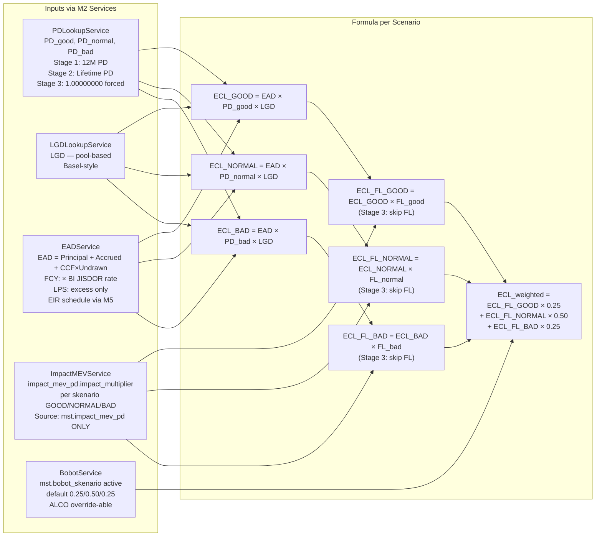
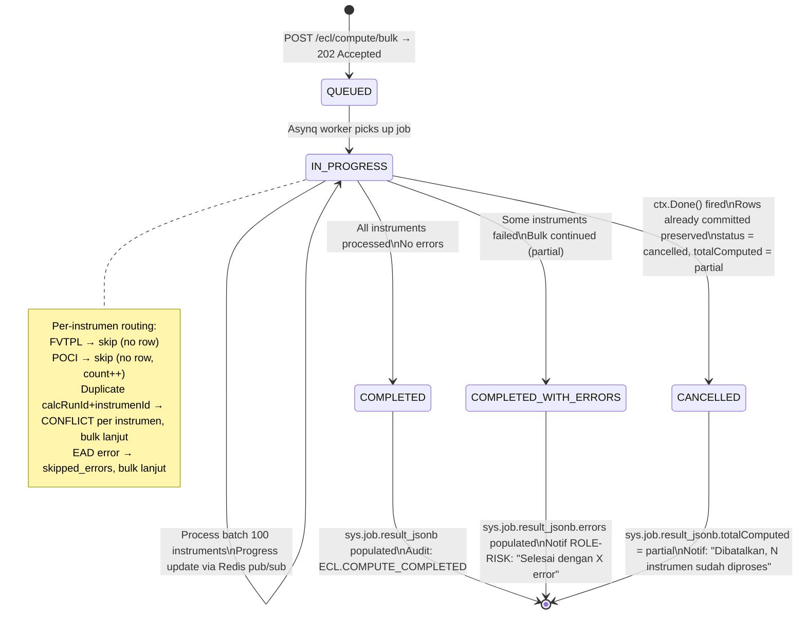
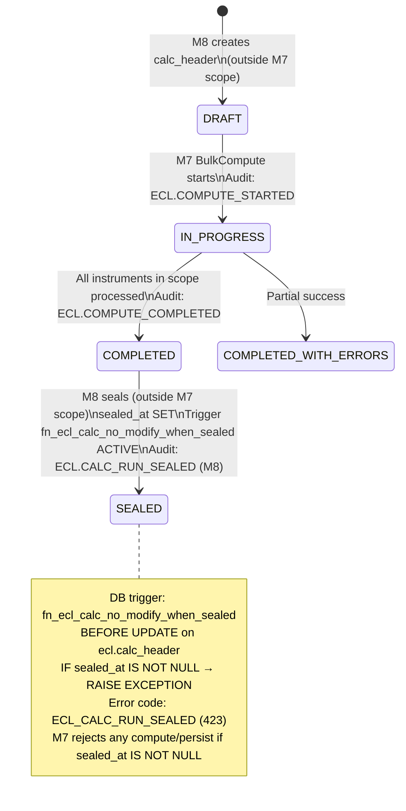

# P4-M7 ECL Core — State Machines + Technical Specs

**Story Set**: APP-C-ECL-M7-001..006
**Module**: APP-C — ECL Core Calculation Engine
**Author**: system-analyst
**Date**: 2026-06-12
**Branch**: feature/phase-4-m7-ecl-core-contracts
**OpenAPI**: `api/openapi/app-c-ecl-core.yaml`
**Depends on**: P4-M1 (staging), P4-M2 (helpers), P4-M3 (LPS), P4-M4 (lookthrough), P4-M5 (EIR schedule), P4-M6 (amendment lifecycle)

---

## 1. Per-Instrumen Routing Decision Tree (M7-001)

```mermaid
flowchart TD
    START([ECLOrchestrator.ComputeSingle\ninstrumenId, evaluationDate, periodeId]) --> A

    A{klasifikasi_psak71\n= FVTPL\nOR FVOCI_ELECTION?}
    A -- Yes --> SKIP_FVTPL[routingPath = SKIP_FVTPL\neclWeightedIdr = 0\nwarnings = FVTPL_SKIP\nNo ecl.calc_header row written\nAudit: none]
    SKIP_FVTPL --> END_SKIP([Return ECLResult\nroutingPath=SKIP_FVTPL])

    A -- No --> B{mst.instrumen.flag_poci\n= TRUE?}
    B -- Yes --> POCI_CHECK{eir_amortization_schedule\n.flag_poci = TRUE?}
    POCI_CHECK -- Mismatch --> POCI_WARN[log WARNING: POCI_FLAG_MISMATCH\nAudit: ECL.POCI_FLAG_MISMATCH\nUse mst.instrumen.flag_poci as source of truth]
    POCI_WARN --> POCI_DEFER
    POCI_CHECK -- Match --> POCI_DEFER[routingPath = POCI_DEFERRED\neclWeightedIdr = NULL\nnot 0 — semantics differ\nwarnings = ECL_POCI_REQUIRES_FULL_CREDIT_ADJUSTED_EIR\nNo ecl.calc_header row\nAudit: ECL.POCI_DEFERRED]
    POCI_DEFER --> END_POCI([Return ECLResult\nroutingPath=POCI_DEFERRED])

    B -- No --> C{tipe_instrumen\n= REKSADANA?}
    C -- Yes --> LOOKTHROUGH[Call M4:\nLookThroughService.Compute\ninstrumenId, evalDate, periodeId\nroutingPath = LOOKTHROUGH\nResult comes from M4 directly\n— not duplicated in M7]
    LOOKTHROUGH --> PERSIST_CHECK

    C -- No --> D{tipe_instrumen\nIN CASH, DEPOSITO?}
    D -- Yes --> LPS[Call M3:\nLPSService.AggregateExcess\nnasabahId, bankId, evalDate\nECL computed on excess EAD only\nroutingPath = LPS\nEAD_used = excess_ead_idr]
    LPS --> FORMULA

    D -- No --> STANDARD[routingPath = STANDARD\nCall M2 helpers:\n PD via PDLookupService\n LGD via LGDLookupService\n EAD via EADService\n FL via ImpactMEVService\n Bobot via BobotService]
    STANDARD --> FORMULA

    FORMULA[Get stage from M1 StagingService\nCheck: stage IN 1,2,3\nGet bobot snapshot from mst.bobot_skenario\nGet EIR schedule via M5\nEIRService.GetActiveSchedule\nfor accrued interest in EAD] --> STAGE_CHECK

    STAGE_CHECK{stage = STAGE_3?}
    STAGE_CHECK -- Yes --> STAGE3[Override PD_all_scenarios = 1.00000000\nFL multiplier NOT applied\nGet prior_sealed_ecl from ecl.calc_header\nWHERE instrumen_id = X\nAND sealed_at IS NOT NULL\nORDER BY evaluation_date DESC LIMIT 1\nnetCarryingIdr = eadIdr - prior_sealed_ecl\nIF no prior sealed: netCarrying = eadIdr\n  + warning STAGE_3_NET_CARRYING_FIRST_RUN]
    STAGE3 --> ECL_FORMULA

    STAGE_CHECK -- No --> ECL_FORMULA[Compute per skenario:\nECL_skenario = EAD × PD_skenario × LGD\nECL_FL_skenario = ECL_skenario × impact_mev_pd[skenario].impact_multiplier\n\nECL_weighted = sum ECL_FL_skenario × bobot_skenario\n\nFL source: mst.impact_mev_pd ONLY\nNo double-multiply\nAll decimal: shopspring.Decimal\nNo float64]

    ECL_FORMULA --> PERSIST_CHECK

    PERSIST_CHECK{persist = true\nAND calcRunId supplied?}
    PERSIST_CHECK -- No --> PREVIEW[Preview mode\nAudit: ECL.COMPUTE_PREVIEW\nReturn ECLResult]
    PERSIST_CHECK -- Yes --> CHECK_DUP{Row exists in\necl.calc_header for\ncalcRunId + instrumenId?}
    CHECK_DUP -- Yes --> DUP_SKIP[Audit: ECL.COMPUTE_DUPLICATE_SKIP\nReturn CONFLICT 409]
    CHECK_DUP -- No --> DB_WRITE[BEGIN TRANSACTION\nINSERT ecl.calc_header\nINSERT ecl.calc_detail_skenario x3\nIf LOOKTHROUGH: M4 writes\n  ecl.lookthrough_underlying\nAudit: ECL.RESULT_PERSISTED\nCOMMIT]
    DB_WRITE --> END_WORKER([Return ECLResult with calcRunId])
```

---

## 2. Formula Application per Scenario (M7-001, M7-002)



**Presisi wajib (DEC-016):**
- IDR amounts: `NUMERIC(20,4)` — `shopspring/decimal.NewFromString` dengan presisi 4
- PD, LGD, FL multiplier: `NUMERIC(10,8)`
- Bobot: `NUMERIC(7,4)`
- Rounding: `HALF_EVEN` (banker's rounding) per setiap langkah intermediate
- **No float64** di mana pun di formula path

---

## 3. Bulk ECL Compute State Machine (M7-002)



**Idempotency bulk:**
- UNIQUE constraint pada `(calc_run_id, instrumen_id)` di `ecl.calc_result_line`
- Re-run dengan calcRunId yang sama → per-instrumen CONFLICT 409 di-skip (tidak fail bulk)
- `sys.job.result_jsonb.skipped_duplicate` count tracking

**Performance SLA:**
- Single compute: ≤ 100ms
- Bulk 1.000 instrumen: ≤ 30 detik (P95)
- Portfolio summary: ≤ 500ms
- Batch size: 100 instrumen per DB transaction
- Progress report: setiap 100 instrumen atau setiap 10 detik

---

## 4. calc_run Header State Machine (M7 scope only — M8 extends)



**Note:** M7 handles DRAFT → IN_PROGRESS → COMPLETED only. COMPLETED → SEALED is M8 scope.

---

## 5. Validation Rules Table

### 5.1 POST /ecl/compute (ComputeSingleRequest)

| Field | Rule | Error Code | Message-ID |
|---|---|---|---|
| `instrumenId` | required, UUID format | `VALIDATION_FAILED` | `ecl.compute.instrumen_id.required` |
| `instrumenId` | exists in `mst.instrumen`, `deleted_at IS NULL` | `ECL_INSTRUMEN_NOT_FOUND` | `ecl.instrumen.not_found` |
| `instrumenId` | `workflow_status = 'APPROVED'` | `ECL_INSTRUMEN_NOT_ELIGIBLE` | `ecl.instrumen.not_approved` |
| `evaluationDate` | required, ISO 8601 date | `VALIDATION_FAILED` | `ecl.compute.eval_date.format` |
| `evaluationDate` | ≤ today (no future ECL) | `VALIDATION_FAILED` | `ecl.compute.eval_date.future` |
| `periodeId` | required, non-empty string | `VALIDATION_FAILED` | `ecl.compute.periode_id.required` |
| `periodeId` | exists in `sys.periode`, not hard-closed | `PERIODE_CLOSED` | `ecl.periode.closed` |
| `calcRunId` | if persist=true, required | `VALIDATION_FAILED` | `ecl.compute.calc_run_id.required_for_persist` |
| `calcRunId` | if supplied: exists in `ecl.calc_header`, `sealed_at IS NULL` | `ECL_CALC_RUN_SEALED` | `ecl.calc_run.sealed` |
| `mst.bobot_skenario` (cross-field) | active record exists for periodeId | `ECL_PARAMETER_INACTIVE` | `ecl.param.bobot.inactive` |
| `mst.impact_mev_pd` (cross-field) | active record exists for periodeId | `ECL_PARAMETER_INACTIVE` | `ecl.param.fl.inactive` |
| `ecl.stage_history` (cross-field) | at least 1 row for instrumenId | `ECL_STAGING_NOT_FOUND` | `ecl.staging.not_found` |
| bobot_good + bobot_normal + bobot_bad (cross-field) | must sum to 1.0 (tolerance 1e-8) | `ECL_PARAMETER_INACTIVE` | `ecl.param.bobot.sum_invalid` |

### 5.2 POST /ecl/compute/bulk (ComputeBulkRequest)

| Field | Rule | Error Code | Message-ID |
|---|---|---|---|
| `calcRunId` | required, UUID | `VALIDATION_FAILED` | `ecl.bulk.calc_run_id.required` |
| `calcRunId` | not sealed | `ECL_CALC_RUN_SEALED` | `ecl.calc_run.sealed` |
| `evaluationDate` | required, ISO 8601 date, ≤ today | `VALIDATION_FAILED` | `ecl.bulk.eval_date.invalid` |
| `periodeId` | required, exists, not hard-closed | `PERIODE_CLOSED` | `ecl.periode.closed` |
| `scope.instrumenIds` | if supplied: length ≤ 10.000 | `ECL_BULK_TOO_LARGE` | `ecl.bulk.scope.too_large` |
| Parameter ECL (cross-field) | bobot + pd + lgd + FL all active for periodeId | `ECL_PARAMETER_INACTIVE` | `ecl.param.inactive` |
| Idempotency-Key header | required UUID v4 | `VALIDATION_FAILED` | `idempotency.key.required` |

### 5.3 POST /ecl/recompute/ad-hoc (RecomputeAdHocRequest)

| Field | Rule | Error Code | Message-ID |
|---|---|---|---|
| `instrumenId` | required, UUID, exists | `ECL_INSTRUMEN_NOT_FOUND` | `ecl.instrumen.not_found` |
| `evaluationDate` | required, ISO 8601 date | `VALIDATION_FAILED` | `ecl.recompute.eval_date.format` |
| `periodeId` | required, exists | `VALIDATION_FAILED` | `ecl.recompute.periode_id.required` |
| Permission | caller has `ecl.recompute_adhoc` | `FORBIDDEN` | `ecl.recompute.permission.denied` |
| Note | POCI instrumen: not an error (200 + warning) | — | — |
| Note | Sealed calc run stored: not an error (200 + warning in delta) | — | — |

### 5.4 Business rules (cross-cutting)

| Rule | Where Enforced | Error Code |
|---|---|---|
| `mst.instrumen.flag_poci = true` → never call LookupPD/ComputeEAD | ECLOrchestrator.ComputeSingle Go | `ECL_POCI_FULL_CAEIR_DEFERRED` (warning) |
| Stage 3: FL multiplier NOT applied | formula.go | — (internal logic) |
| Stage 3: PD must equal exactly `decimal.NewFromString("1.00000000")` | formula.go | — (invariant assertion) |
| bobot sum must be 1.0 (tolerance 1e-8) before applying | service.go | `ECL_PARAMETER_INACTIVE` |
| `net_carrying_idr = ead_idr` if no prior sealed ECL | service.go | warning: `STAGE_3_NET_CARRYING_FIRST_RUN` |
| FVTPL skip: ECL = 0.0000 (not null), no DB row | routing.go | — |
| POCI: ecl_weighted_idr = NULL (not 0 — different semantics) | domain.go | — |
| Hard delete on `ecl.calc_header` / `ecl.calc_detail_skenario` → REJECT | DB trigger + service layer | `ECL_PARAM_FROZEN` (DEC-018) |
| `sealed_at IS NOT NULL` → reject any UPDATE | DB trigger `fn_ecl_calc_no_modify_when_sealed` | `ECL_CALC_RUN_SEALED` |
| SoD: not applicable to M7 (computation, not workflow approval) | — | — |

---

## 6. Persistence Schema — data-modeler Hand-off (Migration 000029)

### 6.1 `ecl.calc_result_line` — PRIMARY table untuk M7 (new or fix existing)

**Note OQ-M7-2:** Story doc menggunakan nama campuran (`calc_header` + `calc_detail_skenario`).
Deliverable ini menetapkan `ecl.calc_result_line` sebagai tabel utama per spec di prompt
(consolidated: 1 row per instrumen per run dengan semua kolom inline + 3 skenario flatten).
`ecl.calc_detail_skenario` (3 baris per instrumen) tetap ada sebagai child table jika
`data-modeler` memilih normalisasi. Konfirmasi desain dengan `data-modeler`.

```sql
-- Migration 000029: ecl_calc_result_line + ecl_calc_header schema fix
-- Author: data-modeler
-- Requires: 000028

CREATE TABLE IF NOT EXISTS ecl.calc_result_line (
    id                      UUID PRIMARY KEY DEFAULT gen_random_uuid(),
    calc_run_id             UUID NOT NULL,   -- FK → ecl.calc_header.calc_run_id (or sys.job.id)
    instrumen_id            UUID NOT NULL REFERENCES mst.instrumen(id),
    evaluation_date         DATE NOT NULL,
    periode_id              TEXT NOT NULL,

    -- Staging
    stage                   SMALLINT NOT NULL CHECK (stage IN (1, 2, 3)),

    -- Routing
    routing_path            TEXT NOT NULL,   -- STANDARD|LPS|LOOKTHROUGH|SKIP_FVTPL|POCI_DEFERRED

    -- EAD
    ead_idr                 NUMERIC(20,4),   -- post-LPS excess if LPS routing

    -- PD used (snapshot at compute time)
    pd_used_good            NUMERIC(10,8),
    pd_used_normal          NUMERIC(10,8),
    pd_used_bad             NUMERIC(10,8),

    -- LGD used
    lgd_used                NUMERIC(10,8),

    -- FL multipliers (Stage 3: NULL — not applied)
    fl_multiplier_good      NUMERIC(10,8),
    fl_multiplier_normal    NUMERIC(10,8),
    fl_multiplier_bad       NUMERIC(10,8),

    -- ECL per scenario before FL
    ecl_good_idr            NUMERIC(20,4),
    ecl_normal_idr          NUMERIC(20,4),
    ecl_bad_idr             NUMERIC(20,4),

    -- ECL per scenario after FL (Stage 3 = same as before FL)
    ecl_fl_good_idr         NUMERIC(20,4),
    ecl_fl_normal_idr       NUMERIC(20,4),
    ecl_fl_bad_idr          NUMERIC(20,4),

    -- Weighted ECL (NULL for POCI_DEFERRED — not 0)
    ecl_weighted_idr        NUMERIC(20,4),

    -- Bobot snapshot
    bobot_good              NUMERIC(7,4)    NOT NULL DEFAULT 0.2500,
    bobot_normal            NUMERIC(7,4)    NOT NULL DEFAULT 0.5000,
    bobot_bad               NUMERIC(7,4)    NOT NULL DEFAULT 0.2500,

    -- Stage 3 net carrying
    net_carrying_idr        NUMERIC(20,4),  -- NULL for Stage 1/2

    -- POCI flag
    flag_poci               BOOLEAN         NOT NULL DEFAULT FALSE,

    -- Parameter snapshot ref
    parameter_snapshot_id   UUID,

    -- Warnings (JSON array of warning codes)
    warnings_json           JSONB           NOT NULL DEFAULT '[]',

    -- Audit (immutable — no UPDATE after sealed; see trigger on ecl.calc_header)
    created_at              TIMESTAMPTZ     NOT NULL DEFAULT now(),
    created_by              UUID            NOT NULL,
    updated_at              TIMESTAMPTZ     NOT NULL DEFAULT now(),
    updated_by              UUID            NOT NULL,
    deleted_at              TIMESTAMPTZ,    -- soft delete only (DEC-018: no hard delete on ecl.*)
    deleted_by              UUID,
    row_version             BIGINT          NOT NULL DEFAULT 1,
    tenant_id               TEXT            NOT NULL DEFAULT 'TUGURE',

    CONSTRAINT uq_ecl_calc_result_instrumen UNIQUE (calc_run_id, instrumen_id)
);

-- Indexes
CREATE INDEX idx_ecl_calc_result_calc_run_id
    ON ecl.calc_result_line (calc_run_id);

CREATE INDEX idx_ecl_calc_result_instrumen_eval_date
    ON ecl.calc_result_line (instrumen_id, evaluation_date DESC);

CREATE INDEX idx_ecl_calc_result_stage
    ON ecl.calc_result_line (stage)
    WHERE deleted_at IS NULL;

CREATE INDEX idx_ecl_calc_result_routing_path
    ON ecl.calc_result_line (routing_path)
    WHERE deleted_at IS NULL;

CREATE INDEX idx_ecl_calc_result_flag_poci
    ON ecl.calc_result_line (flag_poci)
    WHERE flag_poci = TRUE AND deleted_at IS NULL;

-- Partitioning by created_at month (pg_partman)
-- ecl.calc_result_line PARTITION BY RANGE (created_at)
-- Partition naming: ecl_calc_result_line_y2026m06 etc.
-- Partition management via pg_partman + maintenance job
```

### 6.2 `ecl.calc_header` — Schema-fix kolom (ALTER TABLE, migration 000029)

Kolom yang perlu di-fix/add dari existing 000001 schema:

```sql
-- Precision fixes
ALTER TABLE ecl.calc_header
    ALTER COLUMN ecl_weighted_idr    TYPE NUMERIC(20,4),
    ALTER COLUMN ecl_fl_idr          TYPE NUMERIC(20,4),
    ALTER COLUMN delta_ecl_fl_idr    TYPE NUMERIC(20,4);

-- Rate field precision fixes
ALTER TABLE ecl.calc_header
    ALTER COLUMN impact_mev_good     TYPE NUMERIC(10,8),
    ALTER COLUMN impact_mev_bad      TYPE NUMERIC(10,8),
    ALTER COLUMN impact_pd           TYPE NUMERIC(10,8),
    ALTER COLUMN w_good              TYPE NUMERIC(10,8),
    ALTER COLUMN w_normal            TYPE NUMERIC(10,8),
    ALTER COLUMN w_bad               TYPE NUMERIC(10,8);

-- New columns
ALTER TABLE ecl.calc_header
    ADD COLUMN IF NOT EXISTS routing_path       TEXT,
    ADD COLUMN IF NOT EXISTS flag_poci          BOOLEAN NOT NULL DEFAULT FALSE,
    ADD COLUMN IF NOT EXISTS ead_idr            NUMERIC(20,4),
    ADD COLUMN IF NOT EXISTS pd_used            NUMERIC(10,8),
    ADD COLUMN IF NOT EXISTS lgd_used           NUMERIC(10,8),
    ADD COLUMN IF NOT EXISTS net_carrying_idr   NUMERIC(20,4),
    ADD COLUMN IF NOT EXISTS sealed_at          TIMESTAMPTZ,
    ADD COLUMN IF NOT EXISTS catatan            TEXT,
    -- Audit cols (if not already present from 000001)
    ADD COLUMN IF NOT EXISTS created_by         UUID,
    ADD COLUMN IF NOT EXISTS updated_at         TIMESTAMPTZ NOT NULL DEFAULT now(),
    ADD COLUMN IF NOT EXISTS updated_by         UUID,
    ADD COLUMN IF NOT EXISTS deleted_at         TIMESTAMPTZ,
    ADD COLUMN IF NOT EXISTS deleted_by         UUID,
    ADD COLUMN IF NOT EXISTS row_version        BIGINT NOT NULL DEFAULT 1,
    ADD COLUMN IF NOT EXISTS tenant_id          TEXT NOT NULL DEFAULT 'TUGURE';

-- Sealed trigger
CREATE OR REPLACE FUNCTION fn_ecl_calc_no_modify_when_sealed()
RETURNS TRIGGER AS $$
BEGIN
    IF OLD.sealed_at IS NOT NULL THEN
        RAISE EXCEPTION 'ECL_CALC_RUN_SEALED: calc_header id=% sealed_at=%. No modifications allowed.',
            OLD.id, OLD.sealed_at;
    END IF;
    RETURN NEW;
END;
$$ LANGUAGE plpgsql;

CREATE TRIGGER trg_ecl_calc_no_modify_when_sealed
    BEFORE UPDATE ON ecl.calc_header
    FOR EACH ROW EXECUTE FUNCTION fn_ecl_calc_no_modify_when_sealed();
```

### 6.3 `ecl.calc_detail_skenario` — Schema-fix (migration 000029)

```sql
-- Precision fixes
ALTER TABLE ecl.calc_detail_skenario
    ALTER COLUMN pd_skenario          TYPE NUMERIC(10,8),
    ALTER COLUMN bobot                TYPE NUMERIC(10,8),
    ALTER COLUMN ecl_skenario_idr     TYPE NUMERIC(20,4);

-- New columns
ALTER TABLE ecl.calc_detail_skenario
    ADD COLUMN IF NOT EXISTS fl_multiplier      NUMERIC(10,8),   -- NULL for Stage 3
    ADD COLUMN IF NOT EXISTS ecl_fl_idr         NUMERIC(20,4),
    ADD COLUMN IF NOT EXISTS ead_skenario_idr   NUMERIC(20,4),
    -- Audit cols
    ADD COLUMN IF NOT EXISTS created_by         UUID,
    ADD COLUMN IF NOT EXISTS updated_at         TIMESTAMPTZ NOT NULL DEFAULT now(),
    ADD COLUMN IF NOT EXISTS updated_by         UUID,
    ADD COLUMN IF NOT EXISTS deleted_at         TIMESTAMPTZ,
    ADD COLUMN IF NOT EXISTS deleted_by         UUID,
    ADD COLUMN IF NOT EXISTS row_version        BIGINT NOT NULL DEFAULT 1,
    ADD COLUMN IF NOT EXISTS tenant_id          TEXT NOT NULL DEFAULT 'TUGURE';
```

### 6.4 `ecl.calc_header` — FK OQ-M7-2 resolution

**OQ-M7-2 resolved**: `calc_run_id` harus FK ke `sys.job(id)` (bukan `sys.job_run_history`).
`data-modeler` harus verify 000001 schema FK chain + add FK jika belum ada.

---

## 7. Error Catalog (Stable Strings)

| Error Code | HTTP | Kapan | Message Template |
|---|---|---|---|
| `ECL_INSTRUMEN_NOT_FOUND` | 404 | instrumenId tidak ada atau deleted | "Instrumen {id} tidak ditemukan atau sudah dihapus." |
| `ECL_INSTRUMEN_NOT_ELIGIBLE` | 422 | FVTPL/POCI tanpa path yang valid untuk compute | "Instrumen {id} tidak eligible untuk ECL computation (routing: {path})." |
| `ECL_STAGING_NOT_FOUND` | 422 | Tidak ada stage record di ecl.stage_history | "Stage history tidak tersedia untuk instrumen {id}. Jalankan M1 staging evaluation terlebih dahulu." |
| `ECL_PARAMETER_INACTIVE` | 422 | bobot/pd/lgd/FL belum APPROVED untuk periodeId | "Parameter ECL ({param_type}) tidak aktif untuk periode {periodeId}. Pastikan ALCO telah menyetujui parameter." |
| `ECL_PARAM_NOT_FOUND` | 422 | bobot_skenario tidak ditemukan sama sekali | "Parameter ECL (bobot skenario) tidak tersedia untuk periode {periodeId}. Pastikan ALCO telah menyetujui parameter." |
| `ECL_POCI_FULL_CAEIR_DEFERRED` | — | Warning dalam warnings array | "Instrumen {id} adalah POCI. Perhitungan ECL penuh (credit-adjusted EIR) di-defer ke Phase 5." |
| `ECL_BULK_TOO_LARGE` | 413 | scope > 10.000 instrumen | "Scope bulk compute melebihi batas 10.000 instrumen. Batasi dengan portofolioIds atau instrumenIds." |
| `ECL_CALC_RUN_SEALED` | 423 | calc run sudah sealed (M8) | "Calc run {calcRunId} sudah sealed pada {sealedAt}. Tidak ada modifikasi yang diizinkan." |
| `ECL_PRIOR_RUN_NOT_FOUND` | 422 | roll-forward butuh prior run tapi tidak ada | "Prior calc run tidak ditemukan untuk portofolio {portofolioId}. Roll-forward membutuhkan prior run yang sudah COMPLETED atau SEALED." |
| `ECL_BULK_RUNNING` | 409 | Bulk job lain masih berjalan untuk calcRunId yang sama | "Bulk compute job sudah berjalan untuk calcRunId {id}. Tunggu hingga selesai." |

---

## 8. Audit Policy

| Event | Trigger | Actor | Persisted to |
|---|---|---|---|
| `ECL.COMPUTE_PREVIEW` | Single compute preview (tidak persist) | ROLE-RISK | `aud.audit_log` per call |
| `ECL.RESULT_PERSISTED` | Batch insert ecl.calc_header (per 100 instrumen) | System (Asynq worker) | `aud.audit_log` — dalam transaksi yang sama dengan DB write |
| `ECL.COMPUTE_STARTED` | BulkCompute Asynq job mulai | System | `aud.audit_log` |
| `ECL.COMPUTE_COMPLETED` | BulkCompute job selesai | System | `aud.audit_log` |
| `ECL.COMPUTE_DUPLICATE_SKIP` | instrumen sudah punya result di calcRunId | System | `aud.audit_log` |
| `ECL.POCI_DEFERRED` | Setiap instrumen POCI yang di-skip | System | `aud.audit_log` per instrumen |
| `ECL.POCI_FLAG_MISMATCH` | flag_poci inconsistency antara instrumen + schedule | System | `aud.audit_log` |
| `ECL.RECOMPUTE_AD_HOC` | ROLE-RISK trigger recompute ad-hoc | ROLE-RISK | `aud.audit_log` always (regulatory drill-down) |
| `ECL.RESULT_EXPORT` | Export CSV/XLSX result | ROLE-RISK / ROLE-AUDIT | `aud.audit_log` dengan after_jsonb.row_count + after_jsonb.filters |
| `ECL.PORTFOLIO_AGGREGATE_READ` | Akses portfolio summary | ROLE-RISK / ROLE-CFO | `aud.audit_log` per call |
| `ECL.PORTFOLIO_AGGREGATE_EXPORT` | Export portfolio summary | ROLE-RISK / ROLE-CFO | `aud.audit_log` |

**Audit write rules (DEC-018):**
- `ECL.RESULT_PERSISTED` harus ditulis **dalam transaksi yang sama** dengan INSERT ecl.calc_header.
- `ECL.RECOMPUTE_AD_HOC` harus ditulis meskipun recomputed result adalah null (POCI).
- Tidak ada hard delete pada `ecl.calc_header`, `ecl.calc_result_line`, `ecl.calc_detail_skenario`. DB trigger `trg_ecl_calc_no_modify_when_sealed` aktif setelah M8 seal.

---

## 9. Performance SLA Targets

| Operation | P95 Target | Method |
|---|---|---|
| Single compute (STANDARD) | ≤ 100ms | Sync HTTP |
| Single compute (LPS routing) | ≤ 150ms (M3 aggregate) | Sync HTTP |
| Single compute (LOOKTHROUGH) | ≤ 200ms (M4 delegate) | Sync HTTP |
| Bulk 1.000 instrumen | ≤ 30 detik | Asynq async |
| Portfolio summary | ≤ 500ms | Sync HTTP (aggregation query) |
| Roll-forward | ≤ 1 detik | Sync HTTP |
| Result list DataTable | ≤ 200ms (per page) | Sync HTTP |

**Prometheus metrics wajib (ecl-eir-engineer):**
```
ecl_compute_single_duration_seconds{routing="STANDARD|LPS|LOOKTHROUGH"} histogram
ecl_bulk_compute_duration_seconds{percentile="p95"} gauge
ecl_bulk_compute_instrument_count gauge
ecl_poci_deferred_total counter
ecl_fvtpl_skipped_total counter
```

---

## 10. Go Package Structure (ecl-eir-engineer hand-off)

```
backend/internal/ecl/core/
├── domain.go        — ECLResult, BulkResult, RoutingPath constants, warnings enum
├── routing.go       — Routing decision tree: route(instrumen) → RoutingPath
├── formula.go       — ECL formula kanonik (all shopspring/decimal, no float64)
│                      ComputePerScenario(ead, pd, lgd, flMult, bobot) → ECLResult
│                      ApplyStage3Override(result) → ECLResult (PD=1.0, skip FL)
├── service.go       — ECLOrchestrator interface + implementation
│                      ComputeSingle(ctx, req ComputeRequest) (ECLResult, error)
│                      ComputeBulk(ctx, req BulkRequest, progressFn) (BulkResult, error)
├── repo.go          — ecl.calc_result_line CRUD (batch insert, idempotent upsert)
│                      GetLatestSealedECL(ctx, instrumenId) (decimal.Decimal, error)
│                        ↑ untuk Stage 3 net carrying (OQ-M7-3 resolution)
├── bulk_worker.go   — Asynq handler untuk ECL_BULK_COMPUTE job type
└── handlers.go      — HTTP handlers wiring ke ECLOrchestrator

Injected dependencies (interfaces, not concrete):
  M1: StagingService.GetCurrentStage(ctx, instrumenId, evalDate) (Stage, error)
  M2: PDLookupService.Lookup(ctx, instrumenId, stage, periodeId) (PDResult, error)
      LGDLookupService.Lookup(ctx, instrumenId, periodeId) (decimal.Decimal, error)
      EADService.Compute(ctx, instrumenId, evalDate) (decimal.Decimal, error)
      ImpactMEVService.GetMultiplier(ctx, periodeId, skenario) (decimal.Decimal, error)
      BobotService.GetActive(ctx, periodeId) (BobotSnapshot, error)
  M3: LPSService.AggregateExcess(ctx, nasabahId, bankId, evalDate) (decimal.Decimal, error)
  M4: LookThroughService.Compute(ctx, instrumenId, evalDate, periodeId) (ECLResult, error)
  M5: EIRService.GetActiveSchedule(ctx, instrumenId, evalDate) (AmortizationSchedule, error)
```

**Critical interface: `ECLOrchestrator`**
```go
type ECLOrchestrator interface {
    ComputeSingle(ctx context.Context, req ComputeRequest) (ECLResult, error)
    ComputeBulk(ctx context.Context, req BulkRequest, progressFn ProgressFn) (BulkResult, error)
    GetResult(ctx context.Context, calcRunId, instrumenId uuid.UUID) (ECLResult, error)
    GetPortfolioSummary(ctx context.Context, req PortfolioSummaryRequest) (PortfolioSummary, error)
    GetRollForward(ctx context.Context, req RollForwardRequest) (RollForward, error)
}

type ProgressFn func(processed, total int, currentStep string)
```

---

## 11. Open Questions — Status Update

| ID | Status | Resolution for M7 |
|---|---|---|
| OQ-M7-1 | **RESOLVED** | Migration number = 000029 (confirmed: 000026–000028 taken by M5/M6) |
| OQ-M7-2 | **NEEDS data-modeler verification** | `calc_run_id` FK → `sys.job(id)`. data-modeler verify 000001 + add FK if missing. |
| OQ-M7-3 | **BLOCKING (ifrs9-compliance-reviewer)** | Stage 3 net carrying: `MAX(ecl_fl_idr) WHERE sealed_at IS NOT NULL ORDER BY evaluation_date DESC LIMIT 1`. First run: `net_carrying = ead_idr`. Warning emitted. |
| OQ-M7-4 | **BLOCKING (ifrs9-compliance-reviewer)** | FL multiplier: `mst.impact_mev_pd[skenario].impact_multiplier` ONLY. No double-multiply. Stage 3: FL not applied. |
| OQ-M7-5 | **RESOLVED** | FVTPL: no row written. Audit via job result JSON `total_skipped_fvtpl`. |
| OQ-M7-6 | **Non-blocking for M7** | Roll-forward approximation accepted. Phase 5 APP-B lifecycle events will refine. |
| OQ-M7-7 | **RESOLVED** | M7 reads catch-up via M5 `EIRService.GetActiveSchedule()`. Catch-up booking to jurnal = Phase 5. |

---

## 12. Hand-off Summary

### data-modeler (migration 000029, PARALLEL with system-analyst)
- CREATE `ecl.calc_result_line` (spec: §6.1)
- ALTER `ecl.calc_header` (precision fixes + new cols: §6.2)
- ALTER `ecl.calc_detail_skenario` (precision fixes + new cols: §6.3)
- ADD trigger `fn_ecl_calc_no_modify_when_sealed` (§6.2)
- ADD indexes per §6.1
- Partition by RANGE(created_at) bulanan
- Verify FK `calc_run_id` → `sys.job(id)` (OQ-M7-2)
- No hard delete on ecl.* (DEC-018): add constraint/comment
- Down migration wajib (DEC-022 migration discipline)

### ecl-eir-engineer
- Package `backend/internal/ecl/core/` (§10)
- ECLOrchestrator.ComputeSingle + ComputeBulk Asynq + GetResult + GetPortfolioSummary + GetRollForward
- Inject M1/M2/M3/M4/M5 service interfaces
- Implement routing.go, formula.go (no float64, shopspring/decimal, HALF_EVEN rounding)
- Stage 3: PD=1.0 forced, FL not applied, net carrying from latest sealed ECL
- POCI: NULL (not 0) for ecl_weighted_idr
- Prometheus metrics per §9
- Resolve OQ-M7-3 + OQ-M7-4 with ifrs9-compliance-reviewer before formula implementation

### frontend-engineer-nextjs
- Page `/ecl/results` — DataTable (UX §1: sort+filter+cursor+export)
- Drill-down per instrumen: header summary + skenario breakdown table
- Page `/ecl/portfolio-summary/{portofolioId}` — stage summary cards + roll-forward waterfall
- Recompute panel `/ecl/recompute/{instrumenId}` — side-by-side comparison
- POCI warning banner (red persistent, non-dismissible until Phase 5)
- JobProgressPanel for bulk compute (UX §3)

### uiux-designer (PARALLEL)
- Design `/ecl/results` DataTable screen
- Design drill-down per instrumen
- Design portfolio summary + roll-forward waterfall chart (Recharts)
- Design recompute comparison panel
- Design POCI warning banner + sealed run warning

### ifrs9-compliance-reviewer (BLOCKING gate before merge)
- Verify formula kanonik: ECL_skenario = EAD × PD × LGD, ECL_FL = ECL × FL, ECL_weighted = Σ(FL×bobot)
- Verify Stage 3: PD=1.0, FL not applied, net carrying = gross − prior_sealed_ecl (OQ-M7-3)
- Verify FL multiplier source: mst.impact_mev_pd only, no double-multiply (OQ-M7-4)
- Verify POCI: NULL not 0, routing_path=POCI_DEFERRED
- Verify FVTPL: no row written
- Verify NUMERIC(20,4) IDR, NUMERIC(10,8) PD/LGD throughout — no float64 (DEC-016)
- Verify ecl.calc_header append-only + sealed trigger (DEC-018)
- Verify bobot snapshot stored per compute run (audit trail for ALCO override)
- tag: `review-required` — ECL formula, Stage 3 logic, POCI stub
