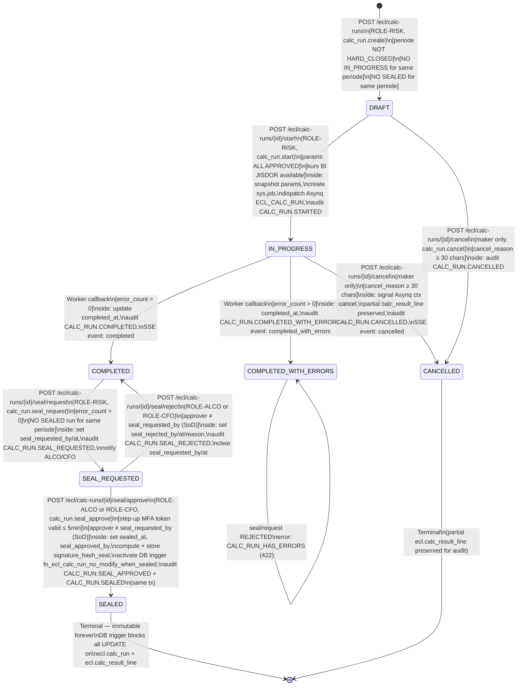

# P4-M8 Calc Run — State Machines, Validation Rules, Hand-off Notes

**Story Set**: APP-C-M8-001..006
**Module**: APP-C — ECL Calc Run Orchestration (Asynq + Seal)
**Author**: system-analyst
**Date**: 2026-06-12
**Branch**: feature/phase-4-m8-calc-run-contracts
**OpenAPI**: `api/openapi/app-c-calc-run.yaml`
**Depends on**: P4-M7 (ECL core engine, ecl.calc_header mig 000029+000030),
                Phase 2 (sys.job mig 000004, /api/v1/jobs/*)

---

## 1. Calc Run Status State Diagram



---

## 2. Transition Table

| From | To | Trigger | Guard (all must pass) | Side-effects |
|---|---|---|---|---|
| `—` | `DRAFT` | `POST /ecl/calc-runs` | periode != HARD_CLOSED; NO IN_PROGRESS for periode; NO SEALED for periode; permission calc_run.create | INSERT ecl.calc_run; audit CALC_RUN.CREATED in-tx |
| `DRAFT` | `IN_PROGRESS` | `POST /ecl/calc-runs/{id}/start` | status = DRAFT; periode != HARD_CLOSED; all ECL params APPROVED; kurs available; permission calc_run.start | Snapshot all params → parameter_snapshot_jsonb; INSERT sys.job; UPDATE status+job_id+started_at; audit CALC_RUN.STARTED; dispatch Asynq ECL_CALC_RUN |
| `DRAFT` | `CANCELLED` | `POST /ecl/calc-runs/{id}/cancel` | status IN (DRAFT); creator = current user; cancel_reason.len ≥ 30; permission calc_run.cancel | UPDATE cancelled_by/at/reason; audit CALC_RUN.CANCELLED in-tx |
| `IN_PROGRESS` | `COMPLETED` | Worker callback (internal) | error_count = 0 | UPDATE status/completed_at/processed_count; UPDATE sys.job status=completed; audit CALC_RUN.COMPLETED in-tx; SSE event `completed` |
| `IN_PROGRESS` | `COMPLETED_WITH_ERRORS` | Worker callback (internal) | error_count > 0 | UPDATE status/completed_at/processed_count/error_count; UPDATE sys.job status=completed; audit CALC_RUN.COMPLETED_WITH_ERRORS; SSE event `completed_with_errors` |
| `IN_PROGRESS` | `CANCELLED` | `POST /ecl/calc-runs/{id}/cancel` | status = IN_PROGRESS; creator = current user; cancel_reason.len ≥ 30 | Signal Asynq ctx cancel; UPDATE cancelled_by/at/reason; partial calc_result_line rows preserved; UPDATE sys.job status=cancelled; audit CALC_RUN.CANCELLED; SSE event `cancelled` |
| `COMPLETED` | `SEAL_REQUESTED` | `POST /ecl/calc-runs/{id}/seal/request` | status = COMPLETED; error_count = 0; NO SEALED run same periode; permission calc_run.seal_request | UPDATE seal_requested_by/at; audit CALC_RUN.SEAL_REQUESTED in-tx; send notification to ALCO/CFO |
| `SEAL_REQUESTED` | `SEALED` | `POST /ecl/calc-runs/{id}/seal/approve` | status = SEAL_REQUESTED; permission calc_run.seal_approve; step-up MFA token valid ≤ 5min; current_user ≠ seal_requested_by (SoD) | UPDATE status=SEALED, sealed_at, seal_approved_by; compute signature_hash_seal = SHA-256(approver_id\|\|calc_run_id\|\|sealed_at\|\|comment); audit CALC_RUN.SEAL_APPROVED + CALC_RUN.SEALED (same tx); DB trigger activated |
| `SEAL_REQUESTED` | `COMPLETED` | `POST /ecl/calc-runs/{id}/seal/reject` | status = SEAL_REQUESTED; permission calc_run.seal_approve; current_user ≠ seal_requested_by (SoD) | UPDATE seal_rejected_by/at/reason; CLEAR seal_requested_by/at (allow re-request); audit CALC_RUN.SEAL_REJECTED in-tx |

**Terminal states:** SEALED, CANCELLED — no further transitions allowed.

**Blocked transitions** (return `CALC_RUN_INVALID_TRANSITION` 422):
- IN_PROGRESS → DRAFT, COMPLETED (any), SEAL_REQUESTED, SEALED
- COMPLETED → DRAFT, IN_PROGRESS, CANCELLED
- COMPLETED_WITH_ERRORS → SEAL_REQUESTED (`CALC_RUN_HAS_ERRORS` 422)
- SEALED → any (`ECL_PARAM_FROZEN` 423)
- CANCELLED → any

---

## 3. Parameter Snapshot Scope

Snapshot diambil **atomically at /start time**, disimpan ke `ecl.calc_run.parameter_snapshot_jsonb`.
Semua tabel di bawah harus memiliki setidaknya satu row aktif dengan `workflow_status = 'APPROVED'`
untuk `periode_id` yang sesuai. Jika ada yang hilang → `CALC_RUN_PARAMETER_SNAPSHOT_INVALID` 422.

| Table | Version Column | Snapshot Content | Fail if Missing |
|---|---|---|---|
| `mst.bobot_skenario` | `workflow_status`, `approved_at` | bobot_good, bobot_normal, bobot_bad, param_id, approved_by, approved_at | YES — blocking |
| `mst.pd_pefindo` | `workflow_status`, `approved_at` | COUNT approved rows, version hash, approved_by | YES — blocking |
| `mst.lgd_basel` | `workflow_status`, `approved_at` | COUNT approved rows per tipe_eksposur, version hash | YES — blocking |
| `mst.impact_pd` | `workflow_status`, `approved_at` | COUNT approved rows, version hash | YES — blocking |
| `mst.impact_mev_pd` | `workflow_status`, `approved_at` | Per skenario (GOOD/NORMAL/BAD): impact_multiplier, param_id | YES — blocking (all 3 scenarios) |
| `mst.lps_coverage` | `workflow_status`, `effective_from`, `effective_to` | coverage_limit_idr, param_id, effective dates | YES — blocking |
| `mst.kurs` | `tanggal`, `workflow_status` | Per currency: rate_to_idr per evaluation_date | YES — blocking (at least IDR base) |

**Schema:** `parameter_snapshot_jsonb` struktur di `api/openapi/app-c-calc-run.yaml` → `ParameterSnapshot`.

**Immutability:** After /start, `parameter_snapshot_jsonb` MUST NOT be updated.
DB trigger `fn_ecl_calc_run_no_modify_when_sealed` prevents any UPDATE when sealed.
Application-layer guard prevents snapshot update after status moves from DRAFT.

---

## 4. Seal Workflow 4-Eyes Detail

```
ROLE-RISK (calc_run creator atau RISK lain dengan permission)
    │
    │  POST /seal/request
    │  [guard: status = COMPLETED, error_count = 0, NO other SEALED per periode]
    │
    ▼
  SEAL_REQUESTED
    │
    ├── POST /seal/approve (ROLE-ALCO or ROLE-CFO)
    │   [guard: step-up MFA ≤ 5min, approver ≠ requester]
    │   [side: signature_hash_seal, DB trigger activated]
    │   ▼
    │  SEALED ──── terminal
    │
    └── POST /seal/reject (ROLE-ALCO or ROLE-CFO)
        [guard: approver ≠ requester]
        [side: seal_rejected_by/at/reason stored, seal_requested_by/at cleared]
        ▼
       COMPLETED ──── can re-request seal
```

**SoD Enforcement (server-side, not UI-only):**
```go
// Service layer — must be enforced BEFORE business logic
if calcRun.SealRequestedBy == currentUser.ID {
    audit.Write(ctx, "CALC_RUN.SOD_VIOLATION_ATTEMPT", ...)
    return ErrCalcRunSealSoDViolation
}
```

**Signature hash computation (seal approve):**
```
input  = approver_id || "|" || calc_run_id || "|" || sealed_at.RFC3339Nano || "|" || comment
hash   = hex(SHA-256(input))
stored = ecl.calc_run.signature_hash_seal
```

**OQ-M8-1 resolution (LOCKED per P4-M8 decisions):**
Seal workflow = **4-eyes** (RISK request → ALCO/CFO approve).
Story file M8-004 documents 6-eyes as original assumption but decision was
superseded by locked decision in P4-M8 tasking.
If ALCO/CFO determine 6-eyes required → RFC must be raised (formal DEC supersede).

---

## 5. Validation Rules

### 5.1 POST /ecl/calc-runs (create)

| Field | Rule | Error Code | Message ID |
|---|---|---|---|
| `periodeId` | required, maxLength 50 | `VALIDATION_FAILED` | `val.periode_id.required` |
| `periodeId` | FK exists in mst.periode_buku | `NOT_FOUND` | `val.periode_id.not_found` |
| `periodeId` | mst.periode_buku.status != HARD_CLOSED | `CALC_RUN_PERIODE_HARD_CLOSED` | `val.periode.hard_closed` |
| `periodeId` | NO calc_run with status = IN_PROGRESS | `CALC_RUN_DUPLICATE_IN_PROGRESS` | `val.calc_run.in_progress_exists` |
| `periodeId` | NO calc_run with status = SEALED | `CALC_RUN_PERIODE_ALREADY_SEALED` | `val.calc_run.sealed_exists` |
| `evaluationDate` | required, format date (YYYY-MM-DD) | `VALIDATION_FAILED` | `val.evaluation_date.format` |
| `evaluationDate` | ≥ periode.start_date AND ≤ periode.end_date | `VALIDATION_FAILED` | `val.evaluation_date.out_of_range` |
| `scope` | enum IN (ALL_ACTIVE) | `VALIDATION_FAILED` | `val.scope.invalid` |
| `comment` | optional, maxLength 500 | `VALIDATION_FAILED` | `val.comment.too_long` |
| `Idempotency-Key` header | required, format UUID v4 | `VALIDATION_FAILED` | `val.idempotency_key.required` |
| JWT permission | calc_run.create | `FORBIDDEN` | `auth.permission.calc_run.create` |

### 5.2 POST /ecl/calc-runs/{id}/start

| Field | Rule | Error Code | Message ID |
|---|---|---|---|
| `id` (path) | UUID format, exists in ecl.calc_run | `CALC_RUN_NOT_FOUND` | `val.calc_run.not_found` |
| calc_run.status | = DRAFT | `CALC_RUN_INVALID_TRANSITION` | `val.calc_run.not_draft` |
| periode.status | != HARD_CLOSED | `CALC_RUN_PERIODE_HARD_CLOSED` | `val.periode.hard_closed` |
| mst.bobot_skenario | EXISTS APPROVED for periode_id | `CALC_RUN_PARAMETER_SNAPSHOT_INVALID` | `val.params.bobot_missing` |
| mst.pd_pefindo | EXISTS APPROVED rows for periode_id | `ECL_PARAM_NOT_FOUND` | `val.params.pd_missing` |
| mst.lgd_basel | EXISTS APPROVED rows | `ECL_PARAM_NOT_FOUND` | `val.params.lgd_missing` |
| mst.impact_pd | EXISTS APPROVED for periode_id | `ECL_PARAM_NOT_FOUND` | `val.params.impact_pd_missing` |
| mst.impact_mev_pd | EXISTS APPROVED for GOOD + NORMAL + BAD | `ECL_PARAM_NOT_FOUND` | `val.params.fl_missing` |
| mst.lps_coverage | EXISTS APPROVED berlaku per evaluation_date | `LPS_COVERAGE_NO_ACTIVE_PARAM` | `val.params.lps_missing` |
| mst.kurs | EXISTS for evaluation_date | `FX_RATE_NOT_FOUND` | `val.params.kurs_missing` |
| JWT permission | calc_run.start | `FORBIDDEN` | `auth.permission.calc_run.start` |
| `Idempotency-Key` header | required, format UUID v4 | `VALIDATION_FAILED` | `val.idempotency_key.required` |

### 5.3 POST /ecl/calc-runs/{id}/cancel

| Field | Rule | Error Code | Message ID |
|---|---|---|---|
| `id` (path) | exists in ecl.calc_run | `CALC_RUN_NOT_FOUND` | `val.calc_run.not_found` |
| calc_run.status | IN (DRAFT, IN_PROGRESS) | `CALC_RUN_INVALID_TRANSITION` | `val.calc_run.cancel_invalid_status` |
| current_user | = calc_run.created_by | `FORBIDDEN` | `auth.calc_run.cancel_not_maker` |
| `cancelReason` | required | `VALIDATION_FAILED` | `val.cancel_reason.required` |
| `cancelReason` | minLength 30 | `CALC_RUN_CANCEL_REASON_TOO_SHORT` | `val.cancel_reason.too_short` |
| `cancelReason` | maxLength 1000 | `VALIDATION_FAILED` | `val.cancel_reason.too_long` |
| JWT permission | calc_run.cancel | `FORBIDDEN` | `auth.permission.calc_run.cancel` |

### 5.4 POST /ecl/calc-runs/{id}/seal/request

| Field | Rule | Error Code | Message ID |
|---|---|---|---|
| `id` (path) | exists in ecl.calc_run | `CALC_RUN_NOT_FOUND` | `val.calc_run.not_found` |
| calc_run.status | = COMPLETED | `CALC_RUN_SEAL_REQUIRES_COMPLETED` | `val.seal.status_not_completed` |
| calc_run.error_count | = 0 | `CALC_RUN_HAS_ERRORS` | `val.seal.has_errors` |
| periodeId | NO other SEALED calc_run | `CALC_RUN_PERIODE_ALREADY_SEALED` | `val.seal.periode_sealed` |
| `comment` | required, minLength 10, maxLength 1000 | `VALIDATION_FAILED` | `val.seal_comment.required` |
| JWT permission | calc_run.seal_request | `FORBIDDEN` | `auth.permission.calc_run.seal_request` |

### 5.5 POST /ecl/calc-runs/{id}/seal/approve

| Field | Rule | Error Code | Message ID |
|---|---|---|---|
| `id` (path) | exists in ecl.calc_run | `CALC_RUN_NOT_FOUND` | `val.calc_run.not_found` |
| calc_run.status | = SEAL_REQUESTED | `CALC_RUN_SEAL_NOT_REQUESTED` | `val.seal.not_requested` |
| current_user | ≠ calc_run.seal_requested_by | `CALC_RUN_SEAL_SOD_VIOLATION` | `auth.seal.sod_violation` |
| `X-Step-Up-Token` | present, valid, ≤ 5 min old | `CALC_RUN_SEAL_STEP_UP_REQUIRED` | `auth.step_up.required` |
| `X-Step-Up-Token` | not expired | `STEP_UP_EXPIRED` | `auth.step_up.expired` |
| `comment` | required, minLength 10, maxLength 1000 | `VALIDATION_FAILED` | `val.seal_comment.required` |
| JWT permission | calc_run.seal_approve | `FORBIDDEN` | `auth.permission.calc_run.seal_approve` |

### 5.6 POST /ecl/calc-runs/{id}/seal/reject

| Field | Rule | Error Code | Message ID |
|---|---|---|---|
| `id` (path) | exists in ecl.calc_run | `CALC_RUN_NOT_FOUND` | `val.calc_run.not_found` |
| calc_run.status | = SEAL_REQUESTED | `CALC_RUN_SEAL_NOT_REQUESTED` | `val.seal.not_requested` |
| current_user | ≠ calc_run.seal_requested_by | `SOD_VIOLATION` | `auth.seal.sod_violation` |
| `rejectReason` | required, minLength 10, maxLength 1000 | `VALIDATION_FAILED` | `val.reject_reason.required` |
| JWT permission | calc_run.seal_approve | `FORBIDDEN` | `auth.permission.calc_run.seal_approve` |

---

## 6. Error Catalog

| Error Code | HTTP | When |
|---|---|---|
| `CALC_RUN_NOT_FOUND` | 404 | calc_run UUID tidak ada di ecl.calc_run |
| `CALC_RUN_INVALID_TRANSITION` | 422 | Transisi status yang diminta tidak valid di state machine |
| `CALC_RUN_DUPLICATE_IN_PROGRESS` | 409 | Sudah ada calc_run IN_PROGRESS untuk periode yang sama |
| `CALC_RUN_PERIODE_ALREADY_SEALED` | 409 | Sudah ada calc_run SEALED untuk periode yang sama |
| `CALC_RUN_PERIODE_HARD_CLOSED` | 422 | Periode buku status HARD_CLOSED saat create atau start |
| `CALC_RUN_PARAMETER_SNAPSHOT_INVALID` | 422 | Satu atau lebih parameter ECL belum APPROVED untuk periode |
| `CALC_RUN_SEAL_REQUIRES_COMPLETED` | 422 | seal/request dipanggil tapi status bukan COMPLETED |
| `CALC_RUN_SEAL_NOT_REQUESTED` | 422 | seal/approve atau seal/reject dipanggil tapi status bukan SEAL_REQUESTED |
| `CALC_RUN_SEAL_SOD_VIOLATION` | 403 | Approver = Requester (4-eyes SoD) |
| `CALC_RUN_SEAL_STEP_UP_REQUIRED` | 403 | seal/approve dipanggil tanpa step-up MFA token valid |
| `CALC_RUN_HAS_ERRORS` | 422 | seal/request dipanggil tapi error_count > 0 (COMPLETED_WITH_ERRORS) |
| `CALC_RUN_CANCEL_REASON_TOO_SHORT` | 422 | cancel_reason < 30 karakter |
| `CALC_RUN_CANCEL_AFTER_COMPLETED` | 422 | cancel dipanggil setelah status COMPLETED/SEALED |
| `ECL_PARAM_NOT_FOUND` | 422 | Parameter ECL tidak ditemukan atau belum APPROVED untuk periode |
| `FX_RATE_NOT_FOUND` | 422 | Kurs BI JISDOR tidak tersedia untuk evaluation_date |

---

## 7. Performance SLA

| Operation | Endpoint | SLA | Notes |
|---|---|---|---|
| Create DRAFT | `POST /ecl/calc-runs` | ≤ 200ms | DB insert + audit write only |
| Start (dispatch) | `POST /ecl/calc-runs/{id}/start` | ≤ 500ms | Snapshot + sys.job insert + Asynq enqueue |
| Seal request | `POST /ecl/calc-runs/{id}/seal/request` | ≤ 200ms | Status update + audit + notify |
| Seal approve | `POST /ecl/calc-runs/{id}/seal/approve` | ≤ 200ms | Status update + signature + trigger |
| Seal reject | `POST /ecl/calc-runs/{id}/seal/reject` | ≤ 200ms | Status update + audit |
| Cancel | `POST /ecl/calc-runs/{id}/cancel` | ≤ 300ms | IN_PROGRESS: Asynq signal + DB update |
| List (DataTable) | `GET /ecl/calc-runs` | ≤ 500ms | Cursor pagination, max 200 rows |
| Get single | `GET /ecl/calc-runs/{id}` | ≤ 200ms | JOIN ke sys.job for progress |
| Parameter snapshot | `GET /ecl/calc-runs/{id}/parameter-snapshot` | ≤ 100ms | Read JSONB from ecl.calc_run |

Bulk compute actual duration: N × per-instrumen time — tracked via SSE + /jobs/{jobId}.
Target: ≤ 10ms per instrument = 1000 instruments in ≤ 10s.

---

## 8. Audit Policy

Every state transition MUST write one or more rows to `aud.audit_log` **in the same database transaction** as the state update. No exceptions.

| Event | Trigger | Key after_jsonb fields |
|---|---|---|
| `CALC_RUN.CREATED` | POST /ecl/calc-runs | id, periode_id, evaluation_date, scope, status |
| `CALC_RUN.STARTED` | POST /start | id, status, job_id, parameter_snapshot_jsonb (summary hash) |
| `CALC_RUN.COMPLETED` | Worker callback | id, status, processed_count, error_count, completed_at |
| `CALC_RUN.COMPLETED_WITH_ERRORS` | Worker callback | id, status, error_count, error_summary[] |
| `CALC_RUN.CANCELLED` | POST /cancel | id, status, cancelled_by, cancel_reason, partial_count |
| `CALC_RUN.SEAL_REQUESTED` | POST /seal/request | id, status, seal_requested_by, seal_requested_at |
| `CALC_RUN.SEAL_APPROVED` | POST /seal/approve | id, seal_approved_by, step_up_method |
| `CALC_RUN.SEALED` | POST /seal/approve (same tx) | id, status=SEALED, sealed_at, signature_hash_seal, full_seal_chain |
| `CALC_RUN.SEAL_REJECTED` | POST /seal/reject | id, status, seal_rejected_by, reject_reason |
| `CALC_RUN.SOD_VIOLATION_ATTEMPT` | POST /seal/approve (guard fail) | id, attempted_by, seal_requested_by, violation_type |

**Signature hash for SEALED audit:**
`aud.audit_log.after_jsonb` MUST include `signature_hash_seal` and the full seal chain:
```json
{
  "sealedAt": "...",
  "sealedBy": "user-alco-01-uuid",
  "sealRequestedBy": "user-risk-01-uuid",
  "sealRequestedAt": "...",
  "signatureHashSeal": "sha256hex...",
  "signatureMethod": "JWT_STEP_UP"
}
```

---

## 9. Hand-off: data-modeler — migration 000031

**Requirement:** `CREATE TABLE ecl.calc_run` sebagai entitas terpisah dari `ecl.calc_header`
(yang adalah per-instrumen). `ecl.calc_run` adalah run-level header.

### New table: `ecl.calc_run`

```sql
-- migration 000031: ecl.calc_run (new run-level header)
-- author: data-modeler
-- requires: 000030 (ecl.calc_header schema fix)

CREATE TABLE ecl.calc_run (
    id                          UUID        PRIMARY KEY DEFAULT gen_random_uuid(),
    periode_id                  TEXT        NOT NULL,  -- FK → mst.periode_buku(id)
    evaluation_date             DATE        NOT NULL,
    scope                       TEXT        NOT NULL DEFAULT 'ALL_ACTIVE',
    status                      TEXT        NOT NULL DEFAULT 'DRAFT',

    -- Asynq job linkage
    job_id                      TEXT REFERENCES sys.job(id) ON DELETE RESTRICT,

    -- Progress counters (updated by worker)
    total_instrumen             INTEGER,
    processed_count             INTEGER     NOT NULL DEFAULT 0,
    error_count                 INTEGER     NOT NULL DEFAULT 0,

    -- Timing
    started_at                  TIMESTAMPTZ,
    completed_at                TIMESTAMPTZ,

    -- Parameter snapshot frozen at /start (full snapshot for audit trail)
    parameter_snapshot_jsonb    JSONB,

    -- Seal workflow (4-eyes: RISK request → ALCO/CFO approve)
    seal_requested_by           UUID REFERENCES sec.user(id),
    seal_requested_at           TIMESTAMPTZ,
    seal_approved_by            UUID REFERENCES sec.user(id),
    seal_approved_at            TIMESTAMPTZ,
    sealed_at                   TIMESTAMPTZ,
    signature_hash_seal         BYTEA,      -- SHA-256 hex of approval payload

    -- Seal reject tracking
    seal_rejected_by            UUID REFERENCES sec.user(id),
    seal_rejected_at            TIMESTAMPTZ,
    reject_reason               TEXT,

    -- Cancel tracking
    cancelled_by                UUID REFERENCES sec.user(id),
    cancelled_at                TIMESTAMPTZ,
    cancel_reason               TEXT,

    -- Superseded tracking (for audit — no auto-supersede logic)
    superseded_by_run_id        UUID REFERENCES ecl.calc_run(id),

    -- Standard audit cols (db-conventions.md)
    created_at                  TIMESTAMPTZ NOT NULL DEFAULT now(),
    created_by                  UUID        NOT NULL,
    updated_at                  TIMESTAMPTZ NOT NULL DEFAULT now(),
    updated_by                  UUID        NOT NULL,
    deleted_at                  TIMESTAMPTZ,
    deleted_by                  UUID,
    row_version                 BIGINT      NOT NULL DEFAULT 1,
    tenant_id                   TEXT        NOT NULL DEFAULT 'TUGURE',

    CONSTRAINT chk_ecl_calc_run_status CHECK (
        status IN ('DRAFT','IN_PROGRESS','COMPLETED','COMPLETED_WITH_ERRORS',
                   'SEAL_REQUESTED','SEALED','CANCELLED')
    ),
    CONSTRAINT chk_ecl_calc_run_cancel_reason CHECK (
        cancelled_at IS NULL OR (cancel_reason IS NOT NULL AND length(cancel_reason) >= 30)
    ),
    -- 4-eyes SoD: requester ≠ approver
    CONSTRAINT chk_ecl_calc_run_sod_seal CHECK (
        seal_requested_by IS DISTINCT FROM seal_approved_by
    ),
    -- Sealed run is immutable: sealed_at set ↔ status = SEALED
    CONSTRAINT chk_ecl_calc_run_sealed_consistency CHECK (
        (status = 'SEALED') = (sealed_at IS NOT NULL)
    )
);

-- Indexes
CREATE INDEX idx_ecl_calc_run_periode_status
    ON ecl.calc_run (periode_id, status)
    WHERE deleted_at IS NULL;
-- Used for "block if SEALED" and "block if IN_PROGRESS" guards.

CREATE INDEX idx_ecl_calc_run_created_at
    ON ecl.calc_run (tenant_id, created_at DESC)
    WHERE deleted_at IS NULL;

CREATE INDEX idx_ecl_calc_run_job_id
    ON ecl.calc_run (job_id)
    WHERE job_id IS NOT NULL;

-- DB trigger: block UPDATE on sealed run
CREATE OR REPLACE FUNCTION fn_ecl_calc_run_no_modify_when_sealed()
RETURNS TRIGGER LANGUAGE plpgsql AS $$
BEGIN
    IF OLD.status = 'SEALED' AND OLD.id = NEW.id THEN
        RAISE EXCEPTION 'ECL_CALC_RUN_SEALED'
            USING HINT = 'Sealed calc_run is immutable. No modifications allowed.';
    END IF;
    RETURN NEW;
END;
$$;

CREATE TRIGGER trg_ecl_calc_run_sealed_guard
    BEFORE UPDATE ON ecl.calc_run
    FOR EACH ROW EXECUTE FUNCTION fn_ecl_calc_run_no_modify_when_sealed();
```

### FK resolution: `ecl.calc_result_line.calc_run_id`

```sql
-- Resolve OQ-M7-2 and OQ-M8-4:
-- calc_result_line.calc_run_id was UUID but had no FK (sys.job PK is TEXT).
-- Now that ecl.calc_run exists with UUID PK, add FK constraint.

ALTER TABLE ecl.calc_result_line
    ADD CONSTRAINT fk_calc_result_line_calc_run
    FOREIGN KEY (calc_run_id) REFERENCES ecl.calc_run(id)
    ON DELETE RESTRICT;

-- sys.job.id TEXT remains unchanged.
-- ecl.calc_run.job_id TEXT FK → sys.job(id) is the bridge.
```

### Required indexes (performance guard):
- `idx_ecl_calc_run_periode_status` — for "NO IN_PROGRESS" and "NO SEALED" guard queries at create time
- `idx_ecl_calc_result_line_calc_run_id` — FK index (PG does not auto-index FKs)

---

## 10. Hand-off: ecl-eir-engineer — Package `backend/internal/ecl/calcrun/`

### New package structure

```
backend/internal/ecl/calcrun/
    service.go          — CalcRunService (CRUD + start + cancel)
    seal_service.go     — SealService (request + approve + reject)
    snapshot_service.go — ParameterSnapshotService
    worker.go           — Asynq handler: HandleECLCalcRun
    types.go            — CalcRun struct, statuses, request/response types
    errors.go           — sentinel errors mapping to HTTP codes
```

### Interface signatures

```go
// CalcRunService — HTTP handler calls these
type CalcRunService interface {
    Create(ctx context.Context, req CreateCalcRunRequest, actorID uuid.UUID) (*CalcRun, error)
    Get(ctx context.Context, id uuid.UUID, actorID uuid.UUID) (*CalcRunDetail, error)
    List(ctx context.Context, q listquery.Query, actorID uuid.UUID) ([]CalcRunSummary, listquery.Pagination, error)
    Start(ctx context.Context, id uuid.UUID, req StartCalcRunRequest, actorID uuid.UUID) (*StartCalcRunResponse, error)
    Cancel(ctx context.Context, id uuid.UUID, req CancelCalcRunRequest, actorID uuid.UUID) (*CalcRun, error)
    GetParameterSnapshot(ctx context.Context, id uuid.UUID, actorID uuid.UUID) (*ParameterSnapshot, error)
}

// SealService — seal workflow steps
type SealService interface {
    Request(ctx context.Context, id uuid.UUID, req SealRequestBody, actorID uuid.UUID) (*CalcRunSealState, error)
    Approve(ctx context.Context, id uuid.UUID, req SealApproveBody, actorID uuid.UUID, stepUpToken string) (*CalcRunSealState, error)
    Reject(ctx context.Context, id uuid.UUID, req SealRejectBody, actorID uuid.UUID) (*CalcRunSealState, error)
}

// ParameterSnapshotService — called by Start()
type ParameterSnapshotService interface {
    // SnapshotAll atomically reads all APPROVED parameters for the periode
    // and returns a JSON-serializable snapshot struct + validation errors.
    // Returns CALC_RUN_PARAMETER_SNAPSHOT_INVALID if any parameter is missing.
    SnapshotAll(ctx context.Context, periodeID string, evaluationDate time.Time) (*ParameterSnapshot, error)
}
```

### Asynq task wiring

```go
// Task type: "ECL_CALC_RUN"
// Payload:
type ECLCalcRunPayload struct {
    CalcRunID      uuid.UUID `json:"calc_run_id"`
    PeriodeID      string    `json:"periode_id"`
    EvaluationDate time.Time `json:"evaluation_date"`
    Scope          string    `json:"scope"`
    JobID          string    `json:"job_id"`
}

// Worker calls M7:
// eclEngine.BulkCompute(ctx, periodeID, evaluationDate, calcRunID, progressFn)
// progressFn(processed, total, currentInstrumen) → updates sys.job + Redis pub/sub
// On completion: callback to CalcRunService.markCompleted(calcRunID, errorCount)
```

### SoD guard pattern (must be in service layer, not only middleware)

```go
func (s *SealService) Approve(ctx context.Context, id uuid.UUID, ..., actorID uuid.UUID, ...) error {
    run, _ := s.repo.GetByID(ctx, id)
    if run.SealRequestedBy == actorID {
        s.audit.Write(ctx, "CALC_RUN.SOD_VIOLATION_ATTEMPT", ...)
        return ErrCalcRunSealSoDViolation  // maps to CALC_RUN_SEAL_SOD_VIOLATION 403
    }
    // ... continue with step-up MFA check + approve logic
}
```

---

## 11. Cross-reference

- OpenAPI contract: `api/openapi/app-c-calc-run.yaml`
- Common schemas: `api/openapi/_common.yaml`
- M7 ECL core contract: `api/openapi/app-c-ecl-core.yaml`
- M7 state machine: `docs/state-machines/p4-m7-ecl-core.md`
- Jobs API: `api/openapi/jobs.yaml`
- DB conventions: `.claude/memory/db-conventions.md`
- Security baseline: `.claude/memory/security-baseline.md`
- UX patterns §3 (progress): `.claude/memory/ux-patterns.md`

---

## 12. Open Questions (pending from M8 story)

| ID | Pertanyaan | Default Used | Needs |
|---|---|---|---|
| OQ-M8-1 | 4-eyes vs 6-eyes | **4-eyes LOCKED** per P4-M8 decision | closed — if ALCO requires 6-eyes: RFC + formal DEC supersede |
| OQ-M8-2 | Block after seal vs ALCO override | **HARD BLOCK** — override deferred to backlog | BRD §9.3 + ALCO policy confirmation |
| OQ-M8-3 | ecl.calc_run as new table vs reuse ecl.calc_header fields | **New table** per this spec | closed — confirmed |
| OQ-M8-4 | FK type unification (calc_result_line.calc_run_id → ecl.calc_run.id) | **UUID FK** — resolved here | data-modeler implements in mig 000031 |
| OQ-M8-5 | Parameter snapshot scope — full vs delta | **Full snapshot** of all APPROVED params at /start | ifrs9-compliance-reviewer sign-off required |

---

_Dibuat oleh `system-analyst` pada 2026-06-12. OQ-M8-5 memerlukan sign-off `ifrs9-compliance-reviewer`
sebelum `ecl-eir-engineer` menulis ParameterSnapshotService._
_OQ-M8-2 (ALCO override untuk re-run setelah seal) DEFERRED ke post-Phase 4 backlog._
