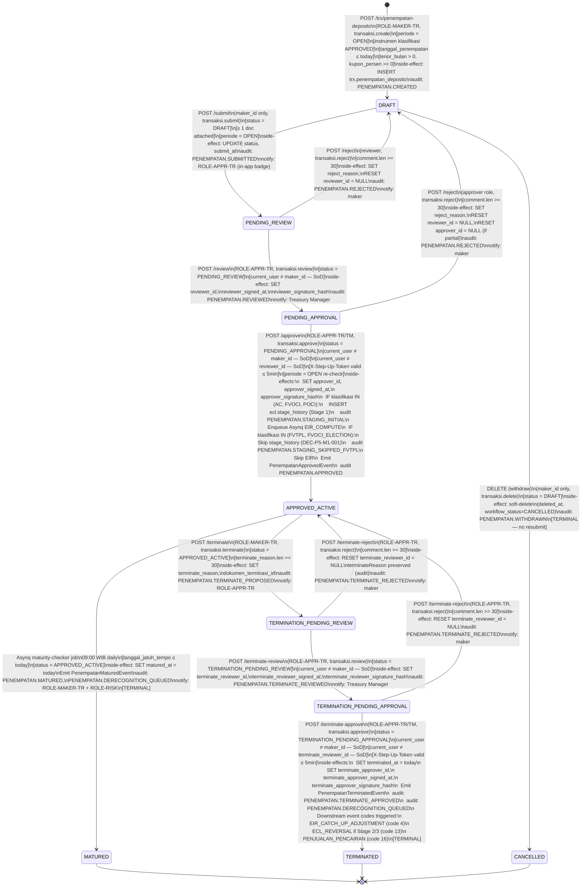

# P5-M1 Penempatan Deposito — State Machine, Validation Rules, Hand-off Notes

**Story Set**: P5-M1 (S1..S6)
**Modul**: APP-B — Transaction Lifecycle
**Author**: system-analyst
**Date**: 2026-06-14
**Branch**: feature/phase-5-m1-penempatan-contracts
**OpenAPI**: `api/openapi/app-b-penempatan-deposito.yaml`

Decisions anchoring this document:
- DEC-P5-M1-001 — FVTPL/FVOCI_ELECTION skip staging + EIR
- DEC-P5-M1-004 — settlement balance informational only (no block)
- DEC-P5-M1-005 — terminate = 4-eyes full workflow
- DEC-013 — EIR Newton-Raphson
- DEC-017 — 4-eyes SoD
- DEC-018 — audit trail immutable
- DEC-021 — Idempotency-Key mandatory
- DEC-022 — cursor pagination

---

## 1. State Diagram



---

## 2. Transition Table

| # | From | To | Trigger | Guards (all must pass) | Permissions | Step-up MFA | SoD | Side-effects & Audit |
|---|---|---|---|---|---|---|---|---|
| T01 | `—` | `DRAFT` | `POST /trx/penempatan-deposito` | instrumen.klasifikasi_psak71 APPROVED; counterparty AKTIF; periode OPEN; tanggal_penempatan ≤ today; tenor_bulan > 0; kupon_persen ≥ 0 | `transaksi.create` | No | — | INSERT trx.penempatan_deposito; auto-gen kode_transaksi PNP-{YYYY}-{#####}; calc tanggal_jatuh_tempo; FCY nominal_idr = nominal_fcy × kurs JISDOR; settlement_balance_hint (informational); audit PENEMPATAN.CREATED in-tx |
| T02 | `DRAFT` | `PENDING_REVIEW` | `POST /submit` | status = DRAFT; current_user = maker_id; ≥ 1 doc attached; periode OPEN | `transaksi.submit` | No | maker_id = submitter (not SoD, expected) | UPDATE status, submit_at; audit PENEMPATAN.SUBMITTED in-tx; notify ROLE-APPR-TR |
| T03 | `DRAFT` | `CANCELLED` | `DELETE` | status = DRAFT; current_user = maker_id | `transaksi.delete` | No | — | soft-delete (deleted_at, deleted_by, status=CANCELLED); audit PENEMPATAN.WITHDRAWN in-tx; TERMINAL |
| T04 | `PENDING_REVIEW` | `PENDING_APPROVAL` | `POST /review` | status = PENDING_REVIEW; current_user ≠ maker_id | `transaksi.review` | No | reviewer ≠ maker | SET reviewer_id, reviewer_signed_at, reviewer_signature_hash = SHA-256(reviewer_id\|\|REVIEW\|\|id\|\|signed_at\|\|comment); audit PENEMPATAN.REVIEWED in-tx; notify TM |
| T05 | `PENDING_REVIEW` | `DRAFT` | `POST /reject` | status = PENDING_REVIEW; comment.len ≥ 30 | `transaksi.reject` | No | — | SET reject_reason; RESET reviewer_id = NULL; audit PENEMPATAN.REJECTED in-tx; notify maker |
| T06 | `PENDING_APPROVAL` | `APPROVED_ACTIVE` | `POST /approve` | status = PENDING_APPROVAL; current_user ≠ maker_id; current_user ≠ reviewer_id; X-Step-Up-Token valid ≤ 5min; periode OPEN | `transaksi.approve` | **YES** | approver ≠ maker; approver ≠ reviewer | SET approver_id, approver_signed_at, approver_signature_hash; FVTPL-guard (see §3); Emit PenempatanApprovedEvent; audit PENEMPATAN.APPROVED + STAGING_INITIAL or STAGING_SKIPPED_FVTPL in-tx; Enqueue Asynq EIR_COMPUTE (async, if AC/FVOCI/POCI) |
| T07 | `PENDING_APPROVAL` | `DRAFT` | `POST /reject` | status = PENDING_APPROVAL; comment.len ≥ 30 | `transaksi.reject` | No | — | SET reject_reason; RESET reviewer_id, approver_id = NULL; audit PENEMPATAN.REJECTED in-tx; notify maker |
| T08 | `APPROVED_ACTIVE` | `MATURED` | Asynq job `maturity-checker` (09:00 WIB daily) | status = APPROVED_ACTIVE; tanggal_jatuh_tempo ≤ today | system (no human) | No | — | SET matured_at = today; Emit PenempatanMaturedEvent; audit PENEMPATAN.MATURED + PENEMPATAN.DERECOGNITION_QUEUED in-tx; notify maker + ROLE-RISK; TERMINAL |
| T09 | `APPROVED_ACTIVE` | `TERMINATION_PENDING_REVIEW` | `POST /terminate` | status = APPROVED_ACTIVE; terminate_reason.len ≥ 30 | `transaksi.terminate` | No | — | SET terminate_reason, dokumen_terminasi_id; audit PENEMPATAN.TERMINATE_PROPOSED in-tx; notify ROLE-APPR-TR |
| T10 | `TERMINATION_PENDING_REVIEW` | `TERMINATION_PENDING_APPROVAL` | `POST /terminate-review` | status = TERMINATION_PENDING_REVIEW; current_user ≠ maker_id | `transaksi.review` | No | terminate_reviewer ≠ maker | SET terminate_reviewer_id, terminate_reviewer_signed_at, terminate_reviewer_signature_hash; audit PENEMPATAN.TERMINATE_REVIEWED in-tx; notify TM |
| T11 | `TERMINATION_PENDING_REVIEW` | `APPROVED_ACTIVE` | `POST /terminate-reject` | status = TERMINATION_PENDING_REVIEW; comment.len ≥ 30 | `transaksi.reject` | No | — | RESET terminate_reviewer_id = NULL; terminate_reason preserved; audit PENEMPATAN.TERMINATE_REJECTED in-tx; notify maker |
| T12 | `TERMINATION_PENDING_APPROVAL` | `TERMINATED` | `POST /terminate-approve` | status = TERMINATION_PENDING_APPROVAL; current_user ≠ maker_id; current_user ≠ terminate_reviewer_id; X-Step-Up-Token valid ≤ 5min | `transaksi.approve` | **YES** | terminate_approver ≠ maker; terminate_approver ≠ terminate_reviewer | SET terminated_at = today, terminate_approver_id, ..._signed_at, ..._signature_hash; Emit PenempatanTerminatedEvent; audit PENEMPATAN.TERMINATE_APPROVED + PENEMPATAN.DERECOGNITION_QUEUED in-tx; downstream event codes 4, 13, 16 (via P5-M2/M9); TERMINAL |
| T13 | `TERMINATION_PENDING_APPROVAL` | `APPROVED_ACTIVE` | `POST /terminate-reject` | status = TERMINATION_PENDING_APPROVAL; comment.len ≥ 30 | `transaksi.reject` | No | — | RESET terminate_reviewer_id = NULL; audit PENEMPATAN.TERMINATE_REJECTED in-tx; notify maker |

**Terminal states**: `MATURED`, `TERMINATED`, `CANCELLED` — no further transitions.

**Blocked transitions** (return `PENEMPATAN_INVALID_TRANSITION` 422):
- PENDING_REVIEW → APPROVED_ACTIVE (must go through PENDING_APPROVAL)
- APPROVED_ACTIVE → DRAFT (no revert after approve)
- MATURED / TERMINATED / CANCELLED → any
- TERMINATION_PENDING_* → MATURED (cannot auto-mature while in termination workflow; maturity job skips these)

---

## 3. FVTPL Guard — DEC-P5-M1-001

Applied **in-transaction at T06 (approve)**:

```
IF instrumen.klasifikasi_psak71 IN ('AC', 'FVOCI', 'POCI'):
    INSERT ecl.stage_history:
        instrumen_id    = penempatan.instrumen_id
        stage_sesudah   = STAGE_1
        trigger_type    = INITIAL_PLACEMENT
        penempatan_id   = penempatan.id
        status_approval = AUTO
        periode_id      = penempatan.periode_id
    Emit audit PENEMPATAN.STAGING_INITIAL (in-tx)
    Enqueue Asynq task EIR_COMPUTE:
        payload: { instrumenId, penempatanId, klasifikasi, nominalIdr, kuponPersen, tenorBulan, biayaTransaksiIdr, tanggalPenempatan }
        queue: default
        retention: 24h

IF instrumen.klasifikasi_psak71 IN ('FVTPL', 'FVOCI_ELECTION'):
    Skip ecl.stage_history INSERT entirely (no NULL-stage marker)
    Skip EIR_COMPUTE enqueue
    Emit audit PENEMPATAN.STAGING_SKIPPED_FVTPL (in-tx)
    Response field: stagingAction = "SKIPPED_FVTPL"
    Response field: eirComputeJobId = null

POCI special path:
    INSERT ecl.stage_history (STAGE_1, INITIAL_PLACEMENT) — same as AC
    Enqueue CA-EIR solver (credit-adjusted EIR — Phase 4.5, DEC-POCI-002)
    Emit audit PENEMPATAN.STAGING_INITIAL (in-tx)
```

**PSAK 71 reference**: §5.5.1, §5.5.15 — FVTPL excluded from ECL scope. Writing stage_history for FVTPL = non-compliant per DEC-P5-M1-001.

---

## 4. SoD Enforcement (server-side, DEC-017)

### Create workflow SoD

```go
// At /review step (T04):
if penempatan.MakerID == currentUser.ID {
    return errors.New("PENEMPATAN_SOD_VIOLATION: reviewer cannot be maker")
}

// At /approve step (T06):
if penempatan.MakerID == currentUser.ID {
    return errors.New("PENEMPATAN_SOD_VIOLATION: approver cannot be maker")
}
if penempatan.ReviewerID == currentUser.ID {
    return errors.New("PENEMPATAN_SOD_VIOLATION: approver cannot be reviewer")
}
```

### Terminate workflow SoD

```go
// At /terminate-review step (T10):
if penempatan.MakerID == currentUser.ID {
    return errors.New("PENEMPATAN_SOD_VIOLATION: terminate reviewer cannot be maker")
}

// At /terminate-approve step (T12):
if penempatan.MakerID == currentUser.ID {
    return errors.New("PENEMPATAN_SOD_VIOLATION: terminate approver cannot be maker")
}
if penempatan.TerminateReviewerID == currentUser.ID {
    return errors.New("PENEMPATAN_SOD_VIOLATION: terminate approver cannot be terminate reviewer")
}
```

Note: Terminate reviewer CAN be the same person as the original create-workflow reviewer or approver — this is not a SoD violation because they are in a different workflow context. Only same-role-in-same-workflow is prohibited.

---

## 5. Validation Rules Table

| Field | Rule | Error Code | HTTP | Message-ID (Bahasa Indonesia) |
|---|---|---|---|---|
| `instrumenId` | required, UUID exists in mst.instrumen (not deleted) | `PENEMPATAN_INSTRUMEN_NOT_FOUND` | 404 | "Instrumen {id} tidak ditemukan atau sudah dihapus." |
| `instrumenId` | mst.instrumen.workflow_status = 'APPROVED' (klasifikasi harus locked) | `PENEMPATAN_INSTRUMEN_INVALID_KLASIFIKASI` | 422 | "Instrumen {kode} belum memiliki klasifikasi PSAK 71 yang di-approve. Selesaikan proses klasifikasi terlebih dahulu." |
| `counterpartyBankId` | required, UUID exists in mst.counterparty (status=AKTIF) | `NOT_FOUND` | 404 | "Counterparty bank tidak ditemukan atau tidak aktif." |
| `periodeId` | required, mst.periode_buku.status_periode = 'OPEN' at create time | `PENEMPATAN_PERIODE_HARD_CLOSED` | 423 | "Periode buku sudah di-close. Penempatan tidak dapat dibuat." |
| `tanggalPenempatan` | required, date-only, ≤ today (server date, timezone WIB) | `PENEMPATAN_TANGGAL_PENEMPATAN_INVALID` | 422 | "Tanggal penempatan tidak boleh lebih dari hari ini." |
| `tanggalPenempatan` | cross-field: periode_id must encompass tanggal_penempatan (must be within periode.bulan) | `VALIDATION_FAILED` | 400 | "Tanggal penempatan tidak masuk dalam rentang periode buku yang dipilih." |
| `mataUangId` | required, UUID exists in mst.mata_uang | `NOT_FOUND` | 404 | "Mata uang tidak ditemukan." |
| `tenorBulan` | required, integer, > 0 | `PENEMPATAN_TENOR_INVALID` | 422 | "Tenor harus lebih dari 0 bulan." |
| `kuponPersen` | required, numeric, ≥ 0, NUMERIC(10,8) precision | `PENEMPATAN_KUPON_INVALID` | 422 | "Kupon tidak boleh negatif." |
| `biayaTransaksiIdr` | required (default 0.0000), numeric, ≥ 0 | `VALIDATION_FAILED` | 400 | "Biaya transaksi tidak boleh negatif." |
| `nominalIdr` | conditional required: wajib jika mataUang = IDR; else computed | `VALIDATION_FAILED` | 400 | "Nominal IDR wajib diisi untuk transaksi IDR." |
| `nominalFcy` | conditional required: wajib jika mataUang ≠ IDR; mst.kurs harus tersedia untuk tanggalPenempatan | `EAD_FX_RATE_MISSING` | 422 | "Kurs BI JISDOR untuk {tanggal} belum tersedia. Hubungi Akuntansi untuk upload kurs manual." |
| `nominalIdr` / `nominalFcy` | > 0 | `VALIDATION_FAILED` | 400 | "Nominal harus lebih dari 0." |
| `kontrakDocId` | FK doc.document.id (nullable at create) | — | — | — |
| `comment` (workflow action) | required, length ≥ 1 | `VALIDATION_FAILED` | 400 | "Komentar wajib diisi." |
| `comment` (reject / terminate-reject) | minLength ≥ 30 | `PENEMPATAN_REASON_TOO_SHORT` | 422 | "Alasan penolakan minimal 30 karakter." |
| `terminateReason` | minLength ≥ 30 | `PENEMPATAN_REASON_TOO_SHORT` | 422 | "Alasan terminasi minimal 30 karakter." |
| `rowVersion` (PATCH) | required, integer, must match DB row_version | `CONFLICT` | 409 | "Data sudah diubah oleh user lain. Muat ulang halaman dan coba lagi." |
| `workflow_status` (edit) | only DRAFT allows PATCH | `PENEMPATAN_EDIT_LOCKED` | 423 | "Penempatan {kode} tidak dapat diedit karena sudah dalam status {status}." |
| `workflow_status` (terminate propose) | only APPROVED_ACTIVE allows /terminate | `PENEMPATAN_TERMINATE_FORBIDDEN_NOT_ACTIVE` | 422 | "Terminasi hanya bisa diajukan dari status APPROVED_ACTIVE. Status saat ini: {status}." |
| `X-Step-Up-Token` (approve) | required, valid, issued ≤ 5min ago | `PENEMPATAN_STEP_UP_REQUIRED` | 403 | "Persetujuan penempatan memerlukan MFA step-up. Silakan lakukan verifikasi MFA terlebih dahulu." |
| `X-Step-Up-Token` (terminate-approve) | required, valid, issued ≤ 5min ago | `PENEMPATAN_STEP_UP_REQUIRED` | 403 | "Persetujuan terminasi memerlukan MFA step-up." |
| Sort column (GET list) | must be in whitelist: kode_transaksi, tanggal_penempatan, nominal_idr, workflow_status, kupon_persen, tanggal_jatuh_tempo, created_at | `INVALID_SORT_COL` | 400 | "Kolom '{col}' tidak diizinkan untuk sort." |
| `periodeId` (approve re-check) | mst.periode_buku.status_periode masih OPEN saat approve | `PERIODE_CLOSED` | 423 | "Periode buku sudah di-close. Penempatan tidak dapat di-approve. Hubungi Finance Controller untuk re-open jika diperlukan." |
| `Idempotency-Key` (mutating) | required header, UUID v4 format | `VALIDATION_FAILED` | 400 | "Idempotency-Key header wajib diisi untuk request ini." |
| `Idempotency-Key` (duplicate, same payload) | | `IDEMPOTENCY_REPLAY` | 200 | (original response returned) |
| `Idempotency-Key` (duplicate, different payload) | | `IDEMPOTENCY_MISMATCH` | 422 | "Idempotency-Key sudah dipakai dengan payload berbeda dari request sebelumnya." |

### EIR Preview specific validations

| Field | Rule | Error Code | HTTP | Message |
|---|---|---|---|---|
| `nominalIdr` | required for EIR compute (must not be null) | `ERR_CALC_2010` | 422 | "EIR tidak dapat dihitung: nominal_idr wajib diisi terlebih dahulu." |
| `kuponPersen` | required for EIR compute | `ERR_CALC_2010` | 422 | "EIR tidak dapat dihitung: kupon_persen wajib diisi." |
| `tenorBulan` | required, > 0 | `ERR_CALC_2010` | 422 | "EIR tidak dapat dihitung: tenor_bulan wajib diisi dan harus > 0." |
| EIR convergence | Newton-Raphson tolerance 1e-10, max 100 iter | `EIR_NON_CONVERGENT` | 422 | "EIR tidak dapat dikonvergensi dalam 100 iterasi. Periksa input cashflow." |
| Klasifikasi FVTPL/FVOCI_ELECTION | Tidak error — return HTTP 200 dengan eirAwal=null dan info message | — | 200 | info: "EIR tidak dihitung untuk instrumen FVTPL. Fair value remeasurement akan di-proses oleh MTM engine (P5-M6)." |

---

## 6. Error Catalog

| Error Code | HTTP | Trigger | Resolution |
|---|---|---|---|
| `PENEMPATAN_INSTRUMEN_NOT_FOUND` | 404 | instrumen_id tidak ada di mst.instrumen atau sudah soft-deleted | Pilih instrumen aktif yang valid |
| `PENEMPATAN_INSTRUMEN_INVALID_KLASIFIKASI` | 422 | Instrumen belum APPROVED klasifikasi (workflow_status ≠ APPROVED di mst.instrumen) | Selesaikan proses klasifikasi PSAK 71 instrumen terlebih dahulu |
| `PENEMPATAN_TANGGAL_PENEMPATAN_INVALID` | 422 | tanggal_penempatan > today (server date WIB) | Gunakan tanggal hari ini atau sebelumnya |
| `PENEMPATAN_TENOR_INVALID` | 422 | tenor_bulan ≤ 0 | Isi tenor lebih dari 0 bulan |
| `PENEMPATAN_KUPON_INVALID` | 422 | kupon_persen < 0 | Kupon tidak boleh negatif |
| `PENEMPATAN_INVALID_TRANSITION` | 422 | Transisi workflow tidak valid untuk state saat ini | Periksa state machine, pastikan step dilakukan berurutan |
| `PENEMPATAN_SOD_VIOLATION` | 403 | maker = reviewer, atau maker/reviewer = approver, atau terminate SoD violation | Gunakan user yang berbeda untuk setiap step workflow |
| `PENEMPATAN_STEP_UP_REQUIRED` | 403 | X-Step-Up-Token missing, expired (> 5 min), atau invalid pada /approve atau /terminate-approve | Lakukan MFA step-up terlebih dahulu via POST /auth/step-up |
| `PENEMPATAN_REASON_TOO_SHORT` | 422 | comment pada reject/terminate-reject < 30 chars, atau terminateReason < 30 chars | Tambah alasan minimal 30 karakter |
| `PENEMPATAN_EDIT_LOCKED` | 423 | PATCH dipanggil pada penempatan yang bukan DRAFT | Minta reviewer reject terlebih dahulu untuk kembali ke DRAFT |
| `PENEMPATAN_PERIODE_HARD_CLOSED` | 423 | Periode buku SOFT_CLOSED atau HARD_CLOSED saat create atau approve | Hubungi Finance Controller untuk re-open periode |
| `PENEMPATAN_TERMINATE_FORBIDDEN_NOT_ACTIVE` | 422 | POST /terminate dipanggil pada penempatan bukan APPROVED_ACTIVE | Terminasi hanya valid untuk penempatan aktif |
| `ERR_CALC_2010` | 422 | EIR preview dipanggil tapi field wajib (nominalIdr/kuponPersen/tenorBulan) null | Isi form dahulu sebelum request EIR preview |

---

## 7. Performance SLA

| Operation | SLA | Notes |
|---|---|---|
| `POST /trx/penempatan-deposito` (create) | ≤ 200 ms | Termasuk kurs lookup + settlement_balance_hint read |
| `PATCH /trx/penempatan-deposito/{id}` (edit) | ≤ 200 ms | Optimistic lock + audit write |
| `POST /submit` | ≤ 200 ms | Simple status update + audit |
| `POST /review` | ≤ 200 ms | Signature hash compute + audit |
| `POST /approve` | ≤ 300 ms | Includes in-tx: stage_history insert + PenempatanApprovedEvent emit + EIR_COMPUTE enqueue (async) |
| `POST /reject` | ≤ 200 ms | Status reset + audit |
| `DELETE` (withdraw) | ≤ 200 ms | Soft-delete + audit |
| `POST /terminate` | ≤ 200 ms | Status update + audit |
| `POST /terminate-review` | ≤ 200 ms | Signature hash + audit |
| `POST /terminate-approve` | ≤ 300 ms | Includes: PenempatanTerminatedEvent emit + downstream event codes queue |
| `POST /terminate-reject` | ≤ 200 ms | Status reset + audit |
| `GET /trx/penempatan-deposito` (list) | ≤ 500 ms | Includes JOIN instrumen + counterparty + periode |
| `GET /trx/penempatan-deposito/{id}` (detail) | ≤ 300 ms | Full detail |
| `GET /eir-preview` | ≤ 500 ms | Newton-Raphson compute (in-process, not async) |
| `GET /audit-timeline` | ≤ 300 ms | aud.audit_log filter by entity_id + JOIN sec.user |

---

## 8. Audit Policy

Every state transition writes to `aud.audit_log` in-transaction (DEC-018). Hash chain maintained.

| Audit Action | Trigger | Actor | Notes |
|---|---|---|---|
| `PENEMPATAN.CREATED` | T01 create DRAFT | ROLE-MAKER-TR | before_jsonb = null |
| `PENEMPATAN.DOCUMENT_ATTACHED` | doc attached at create or update | ROLE-MAKER-TR | after_jsonb includes doc_id |
| `PENEMPATAN.UPDATED` | T01b PATCH edit DRAFT | ROLE-MAKER-TR | before_jsonb + after_jsonb (field diff) |
| `PENEMPATAN.SUBMITTED` | T02 DRAFT → PENDING_REVIEW | ROLE-MAKER-TR | |
| `PENEMPATAN.REVIEWED` | T04 PENDING_REVIEW → PENDING_APPROVAL | ROLE-APPR-TR | after_jsonb includes signature_hash |
| `PENEMPATAN.APPROVED` | T06 PENDING_APPROVAL → APPROVED_ACTIVE | ROLE-APPR-TR | after_jsonb includes approver_signature_hash |
| `PENEMPATAN.REJECTED` | T05, T07 → DRAFT | reviewer or approver | after_jsonb includes reject_reason |
| `PENEMPATAN.WITHDRAWN` | T03 DRAFT → CANCELLED | ROLE-MAKER-TR | soft-delete event |
| `PENEMPATAN.STAGING_INITIAL` | T06 on approve, if klasifikasi IN (AC, FVOCI, POCI) | system (in approve tx) | after_jsonb: { stage: "STAGE_1", trigger: "INITIAL_PLACEMENT" } |
| `PENEMPATAN.STAGING_SKIPPED_FVTPL` | T06 on approve, if klasifikasi IN (FVTPL, FVOCI_ELECTION) | system (in approve tx) | DEC-P5-M1-001 compliance marker |
| `PENEMPATAN.EIR_COMPUTED` | Asynq EIR_COMPUTE job completion | system worker | after_jsonb: { eir_awal, schedule_version } |
| `PENEMPATAN.EIR_PREVIEW` | GET /eir-preview (fire-and-forget) | ROLE-MAKER-TR | Non-blocking; best-effort |
| `PENEMPATAN.MATURED` | T08 Asynq maturity-checker | system worker | after_jsonb: { matured_at } |
| `PENEMPATAN.DERECOGNITION_QUEUED` | T08 (mature) or T12 (terminate) | system worker | after_jsonb: { event_type, downstream: "P5-M9" } |
| `PENEMPATAN.TERMINATE_PROPOSED` | T09 APPROVED_ACTIVE → TERMINATION_PENDING_REVIEW | ROLE-MAKER-TR | after_jsonb: { terminate_reason } |
| `PENEMPATAN.TERMINATE_REVIEWED` | T10 TERMINATION_PENDING_REVIEW → TERMINATION_PENDING_APPROVAL | ROLE-APPR-TR | after_jsonb includes terminate_reviewer_signature_hash |
| `PENEMPATAN.TERMINATE_APPROVED` | T12 TERMINATION_PENDING_APPROVAL → TERMINATED | ROLE-APPR-TR/TM | after_jsonb includes terminate_approver_signature_hash |
| `PENEMPATAN.TERMINATE_REJECTED` | T11, T13 → APPROVED_ACTIVE | reviewer or approver | after_jsonb: { reject_comment } |
| `PENEMPATAN.EXPORT` | GET list dengan ?export=csv|xlsx | any role with transaksi.read | after_jsonb: { format, row_count, active_filters } |

---

## 9. Event Contracts (Downstream — Asynq tasks / in-process events)

### PenempatanApprovedEvent

Emitted in-transaction on T06 (approve). Consumed by P5-M2 (jurnal engine — BLOCKING dependency).

```go
type PenempatanApprovedEvent struct {
    InstrumenID        uuid.UUID       `json:"instrumenId"`
    PenempatanID       uuid.UUID       `json:"penempatanId"`
    KodeTransaksi      string          `json:"kodeTransaksi"`
    KlasifikasiPsak71  string          `json:"klasifikasiPsak71"`  // AC | FVOCI | FVTPL | FVOCI_ELECTION | POCI
    TanggalPenempatan  time.Time       `json:"tanggalPenempatan"`
    TanggalJatuhTempo  time.Time       `json:"tanggalJatuhTempo"`
    NominalIDR         decimal.Decimal `json:"nominalIdr"`         // NUMERIC(20,4)
    NominalFCY         *decimal.Decimal `json:"nominalFcy"`         // nullable
    MataUangKode       string          `json:"mataUangKode"`
    KursPenempatan     *decimal.Decimal `json:"kursPenempatan"`     // nullable (IDR = null)
    KuponPersen        decimal.Decimal `json:"kuponPersen"`         // NUMERIC(10,8)
    TenorBulan         int16           `json:"tenorBulan"`
    BiayaTransaksiIDR  decimal.Decimal `json:"biayaTransaksiIdr"`
    PeriodeID          uuid.UUID       `json:"periodeId"`
    StagingAction      string          `json:"stagingAction"`       // STAGE_1_ASSIGNED | SKIPPED_FVTPL
    EventTime          time.Time       `json:"eventTime"`
    TenantID           string          `json:"tenantId"`
}
```

Event codes triggered (per DEC-P5-M1-002): code 1 PENEMPATAN for all klasifikasi.

### PenempatanMaturedEvent

Emitted by Asynq maturity-checker job on T08. Consumed by P5-M9 (derecognition + jurnal JATUH_TEMPO — BLOCKING dependency).

```go
type PenempatanMaturedEvent struct {
    InstrumenID       uuid.UUID       `json:"instrumenId"`
    PenempatanID      uuid.UUID       `json:"penempatanId"`
    KodeTransaksi     string          `json:"kodeTransaksi"`
    KlasifikasiPsak71 string          `json:"klasifikasiPsak71"`
    TanggalJatuhTempo time.Time       `json:"tanggalJatuhTempo"`
    MaturedAt         time.Time       `json:"maturedAt"`
    NominalIDR        decimal.Decimal `json:"nominalIdr"`
    EirAwal           *decimal.Decimal `json:"eirAwal"`            // nullable (null jika FVTPL)
    PeriodeID         uuid.UUID       `json:"periodeId"`
    EventTime         time.Time       `json:"eventTime"`
    TenantID          string          `json:"tenantId"`
}
```

Event code (DEC-P5-M1-002): code 18 JATUH_TEMPO.

### PenempatanTerminatedEvent

Emitted in-transaction on T12 (terminate-approve). Consumed by P5-M9 (derecognition + realized G/L + jurnal).

```go
type PenempatanTerminatedEvent struct {
    InstrumenID            uuid.UUID       `json:"instrumenId"`
    PenempatanID           uuid.UUID       `json:"penempatanId"`
    KodeTransaksi          string          `json:"kodeTransaksi"`
    KlasifikasiPsak71      string          `json:"klasifikasiPsak71"`
    TerminateDate          time.Time       `json:"terminateDate"`
    TerminateReason        string          `json:"terminateReason"`
    NominalIDR             decimal.Decimal `json:"nominalIdr"`
    EirAwal                *decimal.Decimal `json:"eirAwal"`         // nullable
    CurrentStage           *int            `json:"currentStage"`    // 1|2|3 dari ecl.stage_history, nullable jika FVTPL
    RealizedGainLossIDR    *decimal.Decimal `json:"realizedGainLossIdr"` // computed by P5-M9
    PeriodeID              uuid.UUID       `json:"periodeId"`
    EventTime              time.Time       `json:"eventTime"`
    TenantID               string          `json:"tenantId"`
}
```

Event codes triggered (DEC-P5-M1-002): code 4 EIR_CATCH_UP_ADJUSTMENT, code 13 ECL_REVERSAL (if Stage 2/3), code 16 PENJUALAN_PENCAIRAN.

---

## 10. Hand-off — data-modeler (migration 000028)

### CREATE TABLE trx.penempatan_deposito

```sql
-- migration: 000028 trx.penempatan_deposito
-- author: data-modeler
-- requires: 000027 (mst.periode_buku), 000020 (mst.instrumen), 000012 (mst.counterparty),
--           000005 (doc.document), 000004 (sys.job), 000003 (sec.user)

CREATE TYPE trx.penempatan_workflow_status AS ENUM (
    'DRAFT',
    'PENDING_REVIEW',
    'PENDING_APPROVAL',
    'APPROVED_ACTIVE',
    'TERMINATION_PENDING_REVIEW',
    'TERMINATION_PENDING_APPROVAL',
    'TERMINATED',
    'MATURED',
    'CANCELLED'
);

CREATE TABLE trx.penempatan_deposito (
    -- PK
    id                              UUID PRIMARY KEY DEFAULT gen_random_uuid(),

    -- Business key (auto-generated server-side, format PNP-{YYYY}-{#####})
    kode_transaksi                  TEXT UNIQUE NOT NULL,

    -- Instrument + counterparty references
    instrumen_id                    UUID NOT NULL REFERENCES mst.instrumen(id),
    counterparty_bank_id            UUID NOT NULL REFERENCES mst.counterparty(id),
    periode_id                      UUID NOT NULL REFERENCES mst.periode_buku(id),

    -- Transaction fields
    tanggal_penempatan              DATE NOT NULL,
    tanggal_jatuh_tempo             DATE NOT NULL,  -- computed: tanggal_penempatan + tenor_bulan months
    nominal_idr                     NUMERIC(20,4) NOT NULL,
    nominal_fcy                     NUMERIC(20,4),  -- NULL jika IDR
    mata_uang_id                    UUID NOT NULL REFERENCES mst.mata_uang(id),
    kurs_penempatan                 NUMERIC(20,8),  -- BI JISDOR per tanggal_penempatan
    tenor_bulan                     SMALLINT NOT NULL,
    kupon_persen                    NUMERIC(10,8) NOT NULL,
    biaya_transaksi_idr             NUMERIC(20,4) NOT NULL DEFAULT 0.0000,
    nomor_referensi_bank            TEXT,
    settlement_account              TEXT,           -- rekening settlement Tugure
    catatan                         TEXT,

    -- EIR (populated async post-approve by Asynq EIR_COMPUTE)
    eir_awal                        NUMERIC(10,8),  -- NULL until computed, NULL for FVTPL
    carrying_amount_awal            NUMERIC(20,4),  -- = nominal_idr sebelum amortisasi

    -- Document references
    kontrak_doc_id                  UUID REFERENCES doc.document(id),

    -- Workflow status
    workflow_status                 trx.penempatan_workflow_status NOT NULL DEFAULT 'DRAFT',

    -- Create workflow participants
    maker_id                        UUID NOT NULL REFERENCES sec.user(id),
    reviewer_id                     UUID REFERENCES sec.user(id),        -- NULL until review
    approver_id                     UUID REFERENCES sec.user(id),        -- NULL until approve

    -- Create workflow signatures
    reviewer_signed_at              TIMESTAMPTZ,
    approver_signed_at              TIMESTAMPTZ,
    reviewer_signature_hash         TEXT,           -- SHA-256(reviewer_id||REVIEW||id||signed_at||comment)
    approver_signature_hash         TEXT,           -- SHA-256(approver_id||APPROVE||id||signed_at||comment)

    -- Reject reason (shared for create and terminate reject)
    reject_reason                   TEXT,           -- >= 30 chars enforced at app layer

    -- Terminate workflow fields (DEC-P5-M1-005)
    terminate_reason                TEXT,           -- >= 30 chars enforced at app layer
    terminated_at                   DATE,
    terminate_reviewer_id           UUID REFERENCES sec.user(id),
    terminate_approver_id           UUID REFERENCES sec.user(id),
    terminate_reviewer_signed_at    TIMESTAMPTZ,
    terminate_approver_signed_at    TIMESTAMPTZ,
    terminate_reviewer_signature_hash TEXT,
    terminate_approver_signature_hash TEXT,
    dokumen_terminasi_id            UUID REFERENCES doc.document(id),

    -- Maturity
    matured_at                      DATE,

    -- Audit columns (mandatory per db-conventions.md)
    created_at      TIMESTAMPTZ NOT NULL DEFAULT now(),
    created_by      UUID        NOT NULL REFERENCES sec.user(id),
    updated_at      TIMESTAMPTZ NOT NULL DEFAULT now(),
    updated_by      UUID        NOT NULL REFERENCES sec.user(id),
    deleted_at      TIMESTAMPTZ,
    deleted_by      UUID        REFERENCES sec.user(id),
    row_version     BIGINT      NOT NULL DEFAULT 1,
    tenant_id       TEXT        NOT NULL DEFAULT 'TUGURE',

    -- CHECK constraints
    CONSTRAINT chk_penempatan_tenor_positive CHECK (tenor_bulan > 0),
    CONSTRAINT chk_penempatan_kupon_nonneg   CHECK (kupon_persen >= 0),
    CONSTRAINT chk_penempatan_biaya_nonneg   CHECK (biaya_transaksi_idr >= 0),
    CONSTRAINT chk_penempatan_nominal_pos    CHECK (nominal_idr > 0),
    CONSTRAINT chk_penempatan_jatuh_tempo    CHECK (tanggal_jatuh_tempo > tanggal_penempatan),

    -- SoD constraints (enforce at DB layer in addition to app layer)
    CONSTRAINT chk_penempatan_sod_reviewer   CHECK (reviewer_id IS NULL OR reviewer_id != maker_id),
    CONSTRAINT chk_penempatan_sod_approver   CHECK (approver_id IS NULL OR (approver_id != maker_id AND approver_id != reviewer_id)),
    CONSTRAINT chk_penempatan_sod_term_rev   CHECK (terminate_reviewer_id IS NULL OR terminate_reviewer_id != maker_id),
    CONSTRAINT chk_penempatan_sod_term_appr  CHECK (terminate_approver_id IS NULL OR (terminate_approver_id != maker_id AND terminate_approver_id != terminate_reviewer_id))
);

-- Indexes
CREATE INDEX idx_penempatan_status_created   ON trx.penempatan_deposito (workflow_status, created_at DESC)
    WHERE deleted_at IS NULL;
CREATE INDEX idx_penempatan_instrumen        ON trx.penempatan_deposito (instrumen_id);
CREATE INDEX idx_penempatan_counterparty     ON trx.penempatan_deposito (counterparty_bank_id);
CREATE INDEX idx_penempatan_periode          ON trx.penempatan_deposito (periode_id);
CREATE INDEX idx_penempatan_maker            ON trx.penempatan_deposito (maker_id);
CREATE INDEX idx_penempatan_jatuh_tempo_active ON trx.penempatan_deposito (tanggal_jatuh_tempo)
    WHERE workflow_status = 'APPROVED_ACTIVE' AND deleted_at IS NULL;
    -- Note: Asynq maturity-checker scans this partial index for performance
CREATE INDEX idx_penempatan_tenant_created   ON trx.penempatan_deposito (tenant_id, created_at DESC)
    WHERE deleted_at IS NULL;

-- Triggers
-- trg_set_updated_at BEFORE UPDATE (standard)
-- trg_increment_row_version BEFORE UPDATE (standard)
```

### CREATE TABLE sys.settlement_account_balance (migration 000028a atau inline 000028)

```sql
CREATE TABLE sys.settlement_account_balance (
    settlement_account_id   TEXT PRIMARY KEY,   -- matches trx.penempatan_deposito.settlement_account
    last_known_balance_idr  NUMERIC(20,4) NOT NULL,
    as_of_date              DATE NOT NULL,
    updated_by              UUID NOT NULL REFERENCES sec.user(id),
    updated_at              TIMESTAMPTZ NOT NULL DEFAULT now(),
    tenant_id               TEXT NOT NULL DEFAULT 'TUGURE'
);
```

No `deleted_at` — this is a lookup/override table, not a transactional entity.
Only ROLE-AKUN can INSERT/UPDATE. ROLE-MAKER-TR reads via the balance hint in penempatan response.

---

## 11. Hand-off — ecl-eir-engineer (post-approve hooks)

### EIR_COMPUTE Asynq Task

Triggered by T06 (approve), enqueued async. Worker: `internal/worker/eir_compute_handler.go`.

```go
type EIRComputePayload struct {
    PenempatanID      uuid.UUID       `json:"penempatanId"`
    InstrumenID       uuid.UUID       `json:"instrumenId"`
    KlasifikasiPsak71 string          `json:"klasifikasiPsak71"`
    NominalIDR        decimal.Decimal `json:"nominalIdr"`
    KuponPersen       decimal.Decimal `json:"kuponPersen"`
    TenorBulan        int16           `json:"tenorBulan"`
    BiayaTransaksiIDR decimal.Decimal `json:"biayaTransaksiIdr"`
    TanggalPenempatan time.Time       `json:"tanggalPenempatan"`
    TanggalJatuhTempo time.Time       `json:"tanggalJatuhTempo"`
    PeriodeID         uuid.UUID       `json:"periodeId"`
    TenantID          string          `json:"tenantId"`
}
```

On completion:
1. UPDATE `trx.penempatan_deposito.eir_awal` + `carrying_amount_awal`
2. INSERT `ecl.amortisasi_schedule` (initial version, `effective_from = tanggal_penempatan`)
3. Audit `PENEMPATAN.EIR_COMPUTED` to `aud.audit_log`
4. UPDATE `sys.job.status = COMPLETED`, `result_jsonb = { eir_awal, schedule_version }`
5. SSE event `completed` on `/api/v1/jobs/{jobId}/stream`

On failure (EIR non-convergent):
1. Audit failure to `aud.audit_log` with error_jsonb
2. UPDATE `sys.job.status = FAILED`, `error_jsonb = { code: "EIR_NON_CONVERGENT", ... }`
3. `trx.penempatan_deposito` status remains `APPROVED_ACTIVE` (not rolled back — DEC-013 note in story S2 OQ-M1-2c)
4. Notify ROLE-RISK: "EIR compute gagal untuk {kode}. Retry via /jobs/{jobId}/retry."

POCI path: use CA-EIR solver (Phase 4.5) with PD-adjusted cashflows. Same worker interface.

### ECL Stage 1 INSERT (in-transaction at approve)

```go
// Called directly in PenempatanService.Approve() — not async
stageHistory := ecl.StageHistory{
    InstrumenID:    penempatan.InstrumenID,
    StageSesudah:   "STAGE_1",
    TriggerType:    "INITIAL_PLACEMENT",
    PenempatanID:   &penempatan.ID,
    PeriodeID:      penempatan.PeriodeID,
    StatusApproval: "AUTO",
    CreatedBy:      currentUser.ID,
    TenantID:       penempatan.TenantID,
}
// INSERT in same DB transaction as approve UPDATE
// If insert fails → rollback entire approve transaction
```

---

## 12. Hand-off — backend-engineer-go

### Service interface

```go
type PenempatanService interface {
    Create(ctx context.Context, req CreatePenempatanRequest, actor User) (*PenempatanDeposito, error)
    Update(ctx context.Context, id uuid.UUID, req UpdatePenempatanRequest, actor User) (*PenempatanDeposito, error)
    Withdraw(ctx context.Context, id uuid.UUID, idempotencyKey uuid.UUID, actor User) error
    Submit(ctx context.Context, id uuid.UUID, req WorkflowActionRequest, actor User) (*PenempatanDeposito, error)
    Review(ctx context.Context, id uuid.UUID, req WorkflowActionRequest, actor User) (*PenempatanDeposito, error)
    Approve(ctx context.Context, id uuid.UUID, req WorkflowActionRequest, stepUpToken string, actor User) (*ApproveResult, error)
    Reject(ctx context.Context, id uuid.UUID, req RejectActionRequest, actor User) (*PenempatanDeposito, error)
    TerminateRequest(ctx context.Context, id uuid.UUID, req TerminateRequestBody, actor User) (*PenempatanDeposito, error)
    TerminateReview(ctx context.Context, id uuid.UUID, req WorkflowActionRequest, actor User) (*PenempatanDeposito, error)
    TerminateApprove(ctx context.Context, id uuid.UUID, req WorkflowActionRequest, stepUpToken string, actor User) (*PenempatanDeposito, error)
    TerminateReject(ctx context.Context, id uuid.UUID, req RejectActionRequest, actor User) (*PenempatanDeposito, error)
    GetByID(ctx context.Context, id uuid.UUID, actor User) (*PenempatanDeposito, error)
    List(ctx context.Context, q ListQuery, actor User) ([]PenempatanListItem, Pagination, error)
    EIRPreview(ctx context.Context, id uuid.UUID, actor User) (*EIRPreviewResult, error)
    AuditTimeline(ctx context.Context, id uuid.UUID, q PaginationQuery, actor User) ([]AuditEvent, Pagination, error)
}
```

### Asynq worker: maturity-checker cron

Schedule: `@daily` at 09:00 WIB (Asia/Jakarta). Task type: `"penempatan:maturity_check"`.

```go
// Query for maturity candidates:
// SELECT id FROM trx.penempatan_deposito
// WHERE workflow_status = 'APPROVED_ACTIVE'
//   AND tanggal_jatuh_tempo <= CURRENT_DATE
//   AND deleted_at IS NULL
//   AND tenant_id = ?
// Uses: idx_penempatan_jatuh_tempo_active partial index

// Per-penempatan transaction (not one big tx — partial failure allowed per story S5 AC)
// Progress report via sys.job + Redis pub/sub
// Emit PenempatanMaturedEvent per matured penempatan
```

---

## 13. Hand-off — frontend-engineer-nextjs

### Screens

| Screen | Path | Notes |
|---|---|---|
| List | `/trx/penempatan` | DataTable (UX §1): sort + filter + paging + export; filter chips; URL deep-link state |
| Create | `/trx/penempatan/new` | Form with settlement_balance_hint amber warning (DEC-P5-M1-004); EIR preview on demand |
| Detail + workflow | `/trx/penempatan/{id}` | Status timeline; action buttons per role + state; audit trail tab |
| Audit trail | `/trx/penempatan/{id}/audit-timeline` | Timeline visual (icons + hash chain badge) |

### Key UX requirements

1. Settlement balance hint (DEC-P5-M1-004): amber non-blocking warning di form create jika `nominal_idr > settlement_balance_hint.lastKnownIdr`. Never block submit.
2. EIR preview: `<JobProgressPanel>` not needed (sync compute ≤ 500ms); inline spinner on GET /eir-preview call.
3. MFA step-up gate: before calling `/approve` or `/terminate-approve`, check if `mfa_verified` and `mfa_verified_at` within 5 min. If not, open MFA step-up modal first.
4. Terminate confirmation dialog: destructive confirm dialog before POST /terminate.
5. EIR compute async progress: after approve, if `eirComputeJobId` present, show `<JobProgressPanel>` for that job.
6. Maturity job: progress visible on `/jobs` page via `type=PENEMPATAN_MATURITY_CHECK`.

---

_Dokumen ini adalah source of truth teknis untuk P5-M1. Perubahan scope harus diajukan sebagai delta proposal dan di-review oleh `ifrs9-compliance-reviewer` (jika menyentuh EIR/ECL/staging) atau `security-engineer` (jika menyentuh SoD/audit/MFA)._
