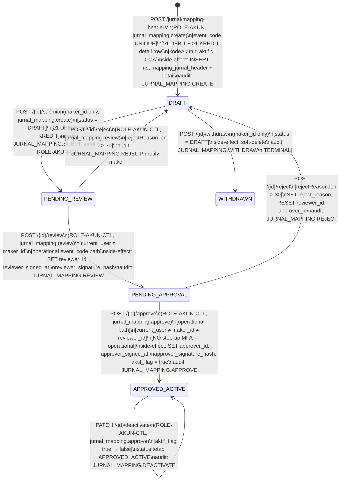
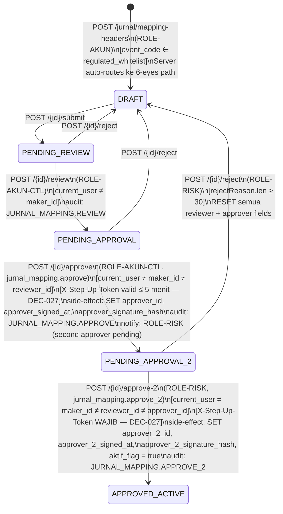
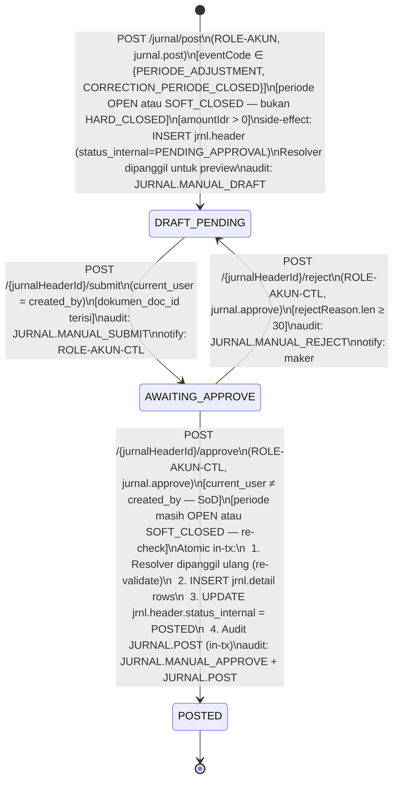
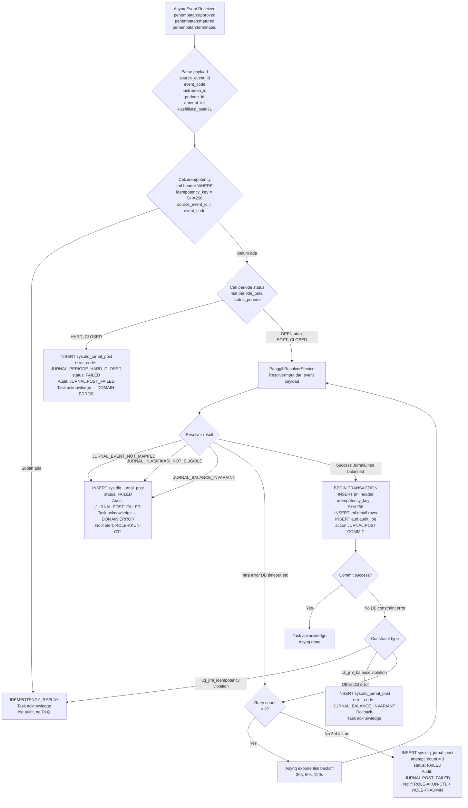
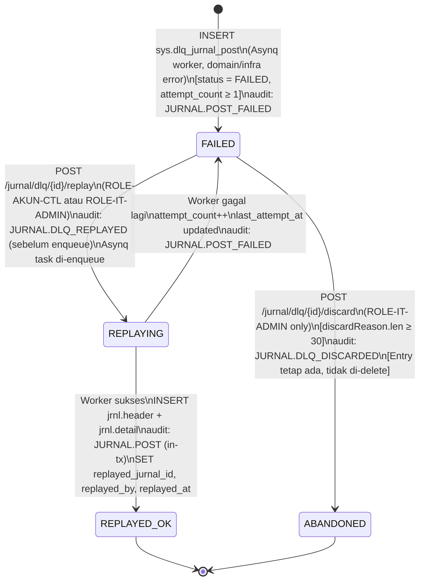

# P5-M2 Jurnal Engine — State Machines, Flows, Validation Rules, Hand-off Notes

**Story Set**: P5-M2 (S1..S6)
**Modul**: APP-D — Periode Buku, FX, Mapping Jurnal & GL Interface
**Author**: system-analyst
**Date**: 2026-06-14
**Branch**: feature/phase-5-m2-jurnal-contracts
**OpenAPI**: `api/openapi/app-d-jurnal-engine.yaml`

Decisions anchoring this document:
- DEC-P5-M1-002 — 27 master event codes, seed migration 000035
- DEC-P5-M1-003 — 6-eyes regulated vs 4-eyes operational classification
- DEC-017 — 4-eyes/6-eyes SoD; maker ≠ reviewer ≠ approver ≠ approver_2
- DEC-018 — audit trail append-only, 10+10 tahun retensi
- DEC-021 — Idempotency-Key mandatory
- DEC-022 — cursor pagination
- DEC-027 — MFA step-up: approve regulated + approve-2
- OQ-M2-1c — step-up MFA pada approve-2 YES
- OQ-M2-3a — domain error → DLQ (no retry); infra error → 3x retry then DLQ
- OQ-M2-6a — ROLE-AKUN-CTL dapat replay DLQ

---

## 1. State Machine — Mapping Jurnal Header CRUD

### 1.1 Diagram (4-eyes Operational)



### 1.2 Diagram (6-eyes Regulated) — ECL/EIR/MTM/Klasifikasi codes



### 1.3 Transition Table — Mapping Jurnal Header

| # | From | To | Endpoint | Guards | Permission | Step-up MFA | SoD Rules | Side-effects & Audit |
|---|---|---|---|---|---|---|---|---|
| M01 | — | DRAFT | POST /mapping-headers | event_code UNIQUE; ≥1 DEBIT+KREDIT; kodeAkunId aktif; struktur valid | jurnal_mapping.create | No | — | INSERT header + detail; auto-detect workflow_path (4-eyes/6-eyes); audit JURNAL_MAPPING.CREATE in-tx |
| M02 | DRAFT | DRAFT | PATCH /{id} | status=DRAFT; current_user=maker_id | jurnal_mapping.create | No | — | UPDATE header + detail rows; audit JURNAL_MAPPING.UPDATE in-tx |
| M03 | DRAFT | PENDING_REVIEW | POST /{id}/submit | status=DRAFT; current_user=maker_id; ≥1 DEBIT+KREDIT | jurnal_mapping.create | No | Submitter = maker (expected, not SoD violation) | SET submit_at; audit JURNAL_MAPPING.SUBMIT; notify ROLE-AKUN-CTL |
| M04 | DRAFT | WITHDRAWN | POST /{id}/withdraw | status=DRAFT; current_user=maker_id | jurnal_mapping.create | No | — | soft-delete (deleted_at, deleted_by); audit JURNAL_MAPPING.WITHDRAW; TERMINAL |
| M05 | PENDING_REVIEW | PENDING_APPROVAL (4-eyes) | POST /{id}/review | status=PENDING_REVIEW; current_user≠maker_id; operational event_code | jurnal_mapping.review | No | reviewer ≠ maker | SET reviewer_id, reviewer_signed_at, reviewer_signature_hash; audit JURNAL_MAPPING.REVIEW |
| M06 | PENDING_REVIEW | PENDING_APPROVAL (6-eyes) | POST /{id}/review | status=PENDING_REVIEW; current_user≠maker_id; regulated event_code | jurnal_mapping.review | No | reviewer ≠ maker | Same as M05 — next state still PENDING_APPROVAL (approve step splits) |
| M07 | PENDING_REVIEW | DRAFT | POST /{id}/reject | status=PENDING_REVIEW; rejectReason.len≥30 | jurnal_mapping.review | No | — | SET reject_reason; RESET reviewer_id=NULL; audit JURNAL_MAPPING.REJECT; notify maker |
| M08 | PENDING_APPROVAL | APPROVED_ACTIVE | POST /{id}/approve | status=PENDING_APPROVAL; operational path; current_user≠maker_id; current_user≠reviewer_id | jurnal_mapping.approve | No | approver ≠ maker; approver ≠ reviewer | SET approver_id, signed_at, hash; aktif_flag=true; audit JURNAL_MAPPING.APPROVE |
| M09 | PENDING_APPROVAL | PENDING_APPROVAL_2 | POST /{id}/approve | status=PENDING_APPROVAL; regulated path; current_user≠maker_id; current_user≠reviewer_id; X-Step-Up-Token valid | jurnal_mapping.approve | **YES** | approver ≠ maker; approver ≠ reviewer | SET approver_id, signed_at, hash; audit JURNAL_MAPPING.APPROVE; notify ROLE-RISK |
| M10 | PENDING_APPROVAL | DRAFT | POST /{id}/reject | status=PENDING_APPROVAL; rejectReason.len≥30 | jurnal_mapping.approve | No | — | SET reject_reason; RESET reviewer_id, approver_id=NULL; audit JURNAL_MAPPING.REJECT |
| M11 | PENDING_APPROVAL_2 | APPROVED_ACTIVE | POST /{id}/approve-2 | status=PENDING_APPROVAL_2; current_user≠maker_id; ≠reviewer_id; ≠approver_id; X-Step-Up-Token valid | jurnal_mapping.approve_2 (ROLE-RISK) | **YES** | approver_2 ≠ all previous | SET approver_2_id, approver_2_signed_at, approver_2_signature_hash; aktif_flag=true; audit JURNAL_MAPPING.APPROVE_2 |
| M12 | PENDING_APPROVAL_2 | DRAFT | POST /{id}/reject | status=PENDING_APPROVAL_2; rejectReason.len≥30 | jurnal_mapping.approve_2 | No | — | SET reject_reason; RESET ALL workflow fields; audit JURNAL_MAPPING.REJECT |
| M13 | APPROVED_ACTIVE | APPROVED_ACTIVE | PATCH /{id}/deactivate | status=APPROVED_ACTIVE; aktif_flag=true | jurnal_mapping.approve | No | — | SET aktif_flag=false; status unchanged; audit JURNAL_MAPPING.DEACTIVATE; resolver tidak akan load mapping ini |

**Terminal states**: WITHDRAWN (soft-deleted). APPROVED_ACTIVE adalah quasi-terminal (bisa deactivate tapi tidak bisa kembali ke workflow).

**Blocked transitions** (return JURNAL_INVALID_TRANSITION 422):
- DRAFT → APPROVED_ACTIVE (harus melalui submit → review → approve)
- PENDING_REVIEW → APPROVED_ACTIVE (harus melalui PENDING_APPROVAL)
- APPROVED_ACTIVE → PENDING_REVIEW (tidak ada re-entry; buat header baru dengan event_code baru atau amend)

---

## 2. State Machine — Manual Jurnal Posting



**Note**: `status_internal` di jrnl.header — internal enum tidak sama dengan workflow state. Mapping:
- DRAFT_PENDING → `status_internal = 'PENDING_APPROVAL'` (pre-submit dan post-submit keduanya)
- POSTED → `status_internal = 'POSTED'`
- REVERSED → `status_internal = 'REVERSED'` (via reversal jurnal, bukan workflow endpoint ini)

---

## 3. Asynq Subscriber Flow — Event-Driven Posting



### 3.1 Event Mapping: Asynq Type → Event Code

| Asynq Event Type | Event Code (DEC-P5-M1-002) | Workflow Path |
|---|---|---|
| `penempatan:approved` | PENEMPATAN | 4-eyes operational |
| `penempatan:matured` | JATUH_TEMPO | 4-eyes operational |
| `penempatan:terminated` | PENJUALAN_PENCAIRAN | 4-eyes operational |
| `penempatan:terminated` (jika ada bunga) | PEMBAYARAN_BUNGA | 4-eyes operational |
| `mtm:computed` (FVTPL) | MTM_FVTPL | **6-eyes regulated** |
| `mtm:computed` (FVOCI) | MTM_FVOCI | **6-eyes regulated** |
| `akrual:computed` | AKRUAL_BUNGA | 4-eyes operational |
| `ecl:charged` | ECL_PEMBENTUKAN | **6-eyes regulated** |
| `ecl:reversed` | ECL_REVERSAL | **6-eyes regulated** |
| `eir:amended` | EIR_CATCH_UP_ADJUSTMENT | **6-eyes regulated** |

Note: Mapping template yang digunakan HARUS sudah APPROVED_ACTIVE dengan aktif_flag=true sebelum event diproduksi. Jika tidak tersedia → JURNAL_EVENT_NOT_MAPPED → DLQ.

---

## 4. DLQ Flow



### 4.1 Auto-Abandon Rule

Setelah `attempt_count ≥ 5` (konfigurabel via `sys.config_param` key `DLQ_MAX_ATTEMPTS`, default 5):
- Status tetap FAILED (tidak otomatis ABANDONED — butuh human decision)
- Alert dikirim ke ROLE-AKUN-CTL + ROLE-IT-ADMIN via in-app notification + email (setelah 1 jam pertama)
- DLQ entry tetap bisa di-replay atau di-discard oleh authorized user

---

## 5. Klasifikasi Routing Matrix

Resolver menggunakan matrix ini untuk menentukan apakah event_code + klasifikasi_psak71 match:

| Event Code | Klasifikasi Berlaku | Catatan |
|---|---|---|
| PENEMPATAN | AC, FVOCI, FVTPL, FVOCI_ELECTION, POCI | Semua klasifikasi |
| AKRUAL_BUNGA | AC, FVOCI, POCI | Tidak untuk FVTPL (tidak ada EIR) |
| ECL_PEMBENTUKAN | AC, FVOCI, POCI | FVTPL tidak punya ECL (PSAK 71 §5.5.15) |
| ECL_REVERSAL | AC, FVOCI, POCI | Sama seperti ECL_PEMBENTUKAN |
| POCI_DELTA_ECL | POCI | Hanya untuk instrumen POCI |
| MTM_FVTPL | FVTPL | Hanya FVTPL |
| MTM_FVOCI | FVOCI | Hanya FVOCI debt (OCI adjustment) |
| MTM_FVOCI_ELECTION | FVOCI_ELECTION | Saham FVOCI election (no P&L recycling) |
| REKLAS_OCI_PL | FVOCI | Recycling OCI ke P&L saat derecognition |
| REKLASIFIKASI_AC_FVOCI | AC, FVOCI | Reklasifikasi antar portfolio |
| REKLASIFIKASI_FVOCI_AC | FVOCI, AC | Reverse reklasifikasi |
| MODIFIKASI_MATERIAL | AC, FVOCI, POCI | Modifikasi kontrak material |
| EIR_CATCH_UP_ADJUSTMENT | AC, FVOCI, POCI | EIR re-estimation on amendment |
| STAGE_MIGRATION | AC, FVOCI, POCI | Stage 1↔2↔3 transitions |
| JATUH_TEMPO | AC, FVOCI, FVTPL, FVOCI_ELECTION, POCI | Semua klasifikasi |
| PENJUALAN_PENCAIRAN | AC, FVOCI, FVTPL, FVOCI_ELECTION, POCI | Semua klasifikasi |
| PEMBAYARAN_BUNGA | AC, FVOCI, POCI | Instrumen yang punya kupon/bunga |
| PEMBAYARAN_POKOK | AC, FVOCI, POCI | Principal repayment |
| RENEWAL_DEPOSITO | AC, FVOCI | Deposito renewal |
| PENERIMAAN_DIVIDEN | FVTPL, FVOCI_ELECTION | Saham saja |
| DISTRIBUSI_REKSADANA | FVTPL | NAB distribution |
| FX_REALIZED | Semua | FX gain/loss realized |
| FX_UNREALIZED | Semua | FX gain/loss unrealized (regulated 6-eyes) |
| AMORTISASI_PREMI_DISKONTO | AC, FVOCI, POCI | EIR amortization |
| PENGHAPUSAN | AC, FVOCI, POCI | Write-off |
| PERIODE_ADJUSTMENT | Semua (NULL) | Global adjustment, instrumen optional |
| CORRECTION_PERIODE_CLOSED | Semua (NULL) | Correction entry, manual only |

**Enforcement**: `klasifikasi_berlaku` column di `mst.mapping_jurnal_header` diisi saat seed migration 000035. Resolver cek `input.klasifikasiPsak71 ∈ header.klasifikasi_berlaku` (atau `klasifikasi_berlaku IS NULL` = all).

**Khusus Stage 3**: Jika AKRUAL_BUNGA untuk instrumen Stage 3, `sumber_amount` harus `net_carrying_idr` (Gross − ECL), bukan `nominal_idr`. Pemanggil (Asynq worker akrual) bertanggung jawab mengirim `metadataJson.ecl_stage = 3` dan `amountIdr = net_carrying_amount`. Resolver tidak menghitung stage — hanya menggunakan nilai yang dikirim.

---

## 6. Validation Rules Table

### 6.1 Mapping Header Create/Edit

| Field | Rule | Error Code | Message-ID |
|---|---|---|---|
| eventCode | required, maxLength(40), pattern([A-Z_]+), UNIQUE di DB | VALIDATION_FAILED | event_code wajib, max 40 karakter, hanya UPPERCASE dan underscore |
| eventCode | UNIQUE di mst.mapping_jurnal_header (soft-delete aware) | CONFLICT | event_code sudah terdaftar |
| namaEvent | required, maxLength(120) | VALIDATION_FAILED | nama_event wajib, max 120 karakter |
| kategoriEvent | required, enum(PENEMPATAN/AKRUAL/ECL/MUTASI_MTM/STAGE_MIGRATION/CLOSURE/REKLASIFIKASI/FX/KOREKSI) | VALIDATION_FAILED | kategori_event harus salah satu nilai yang valid |
| triggerSource | required, enum(USER_INPUT/SYSTEM_JOB) | VALIDATION_FAILED | trigger_source wajib |
| klasifikasiBerlaku | nullable, jika diisi: array item enum(AC/FVOCI/FVTPL/FVOCI_ELECTION/POCI) | VALIDATION_FAILED | item klasifikasi harus nilai PSAK 71 yang valid |
| detailRows | minItems(2) | VALIDATION_FAILED | Minimal 2 baris detail |
| detailRows | minimal 1 DEBIT + 1 KREDIT (cross-field) | JURNAL_BALANCE_INVARIANT | Template harus punya minimal 1 DEBIT dan 1 KREDIT |
| detailRows[].kodeAkunId | required, FK ke mst.chart_of_accounts, aktif_flag=true | VALIDATION_FAILED | Akun tidak ditemukan atau tidak aktif |
| detailRows[].dkIndicator | required, enum(DEBIT/KREDIT) | VALIDATION_FAILED | dk_indicator harus DEBIT atau KREDIT |
| detailRows[].sumberAmount | required, enum(nominal_idr/ecl_amount/mtm_change/accrued_interest/net_carrying_idr/fx_gain_loss/premium_discount_amortization) | VALIDATION_FAILED | sumber_amount harus nilai yang valid |
| detailRows[].multiplier | range[0, 1], default 1.0000 | VALIDATION_FAILED | multiplier harus di antara 0 dan 1 |
| workflow (PATCH) | current state harus DRAFT | MASTER_APPROVED_NO_EDIT | Header sudah APPROVED. Buat versi baru. |

### 6.2 Workflow Transitions — Mapping Header

| Transition | Guard | Error Code | Message-ID |
|---|---|---|---|
| Semua transitions | JWT valid, permission check | UNAUTHORIZED / FORBIDDEN | — |
| submit | current_user = maker_id | FORBIDDEN | Hanya maker yang bisa submit |
| review | current_user ≠ maker_id | JURNAL_SOD_VIOLATION | Reviewer tidak boleh sama dengan maker (DEC-017) |
| approve (operational) | current_user ≠ maker_id AND ≠ reviewer_id | JURNAL_SOD_VIOLATION | SoD violation (DEC-017) |
| approve (regulated) | current_user ≠ maker_id AND ≠ reviewer_id | JURNAL_SOD_VIOLATION | SoD violation |
| approve (regulated) | X-Step-Up-Token valid ≤ 5 menit | JURNAL_STEP_UP_REQUIRED | Step-up MFA diperlukan (DEC-027) |
| approve-2 | current_user ≠ maker_id AND ≠ reviewer_id AND ≠ approver_id | JURNAL_SOD_VIOLATION | approver_2 harus berbeda dari semua actor sebelumnya (DEC-017) |
| approve-2 | X-Step-Up-Token valid ≤ 5 menit | JURNAL_STEP_UP_REQUIRED | Step-up MFA wajib untuk approve-2 (DEC-027) |
| approve-2 | event_code ∈ regulated_whitelist | JURNAL_INVALID_TRANSITION | Event code bukan regulated — tidak ada approve-2 path |
| reject | rejectReason.len ≥ 30 | JURNAL_DLQ_DISCARD_REASON_TOO_SHORT | Alasan penolakan minimal 30 karakter |
| semua | state machine valid transition | JURNAL_INVALID_TRANSITION | Transisi tidak valid dari state saat ini |

### 6.3 Resolver

| Field | Rule | Error Code | Message-ID |
|---|---|---|---|
| eventCode | required, lookup APPROVED + aktif_flag=true | JURNAL_EVENT_NOT_MAPPED | Tidak ada mapping APPROVED untuk event code |
| klasifikasiPsak71 | required, enum(AC/FVOCI/FVTPL/FVOCI_ELECTION/POCI) | VALIDATION_FAILED | klasifikasi_psak71 harus nilai PSAK 71 yang valid |
| klasifikasiPsak71 | ∈ header.klasifikasi_berlaku (atau NULL=all) | JURNAL_KLASIFIKASI_NOT_ELIGIBLE | event_code tidak berlaku untuk klasifikasi ini |
| amountIdr | > 0 | JURNAL_AMOUNT_INVALID | amountIdr harus lebih dari 0 |
| fxRate | > 0 | VALIDATION_FAILED | fxRate harus lebih dari 0 |
| periodeId | required, FK ke mst.periode_buku | VALIDATION_FAILED | periodeId tidak valid |
| sourceEventId | required, UUID | VALIDATION_FAILED | sourceEventId wajib |
| result invariant | SUM(DEBIT) = SUM(KREDIT) setelah compute | JURNAL_BALANCE_INVARIANT | Resolver menghasilkan imbalance — template mapping rusak |

### 6.4 Manual Posting

| Field | Rule | Error Code | Message-ID |
|---|---|---|---|
| eventCode | harus PERIODE_ADJUSTMENT atau CORRECTION_PERIODE_CLOSED | JURNAL_EVENT_NOT_MAPPED | Manual posting hanya untuk event operational ini |
| periodeId | status_periode IN (OPEN, SOFT_CLOSED) — bukan HARD_CLOSED | JURNAL_PERIODE_HARD_CLOSED | Periode HARD_CLOSED, posting tidak bisa dilakukan |
| amountIdr | > 0 | JURNAL_AMOUNT_INVALID | amountIdr harus lebih dari 0 |
| narasi | required, maxLength(500) | VALIDATION_FAILED | narasi wajib |
| dokumenDocId (submit) | required saat submit, nullable saat draft | VALIDATION_FAILED | Dokumen pendukung wajib sebelum submit |
| approve SoD | current_user ≠ created_by (jrnl.header.created_by) | JURNAL_SOD_VIOLATION | Approver tidak boleh sama dengan maker (DEC-017) |
| approve periode re-check | periode masih OPEN atau SOFT_CLOSED saat approve | JURNAL_PERIODE_HARD_CLOSED | Periode sudah HARD_CLOSED saat approval |

### 6.5 DLQ Operations

| Field | Rule | Error Code | Message-ID |
|---|---|---|---|
| dlq/{id}/replay | status IN (FAILED) — bukan REPLAYED_OK | JURNAL_DLQ_ALREADY_REPLAYED | DLQ entry sudah berhasil di-replay |
| dlq/{id}/replay | periode_id target OPEN atau SOFT_CLOSED | JURNAL_DLQ_REPLAY_PERIODE_HARD_CLOSED | Periode target masih HARD_CLOSED |
| dlq/{id}/discard | discardReason.len ≥ 30 | JURNAL_DLQ_DISCARD_REASON_TOO_SHORT | Alasan discard minimal 30 karakter |
| dlq/{id}/discard | status ≠ REPLAYED_OK | JURNAL_DLQ_ALREADY_REPLAYED | DLQ sudah berhasil di-replay, tidak perlu di-discard |

---

## 7. Asynq Retry Policy

| Error Category | Asynq Behavior | DLQ |
|---|---|---|
| JURNAL_EVENT_NOT_MAPPED | Task acknowledge immediately | INSERT DLQ FAILED, status=FAILED |
| JURNAL_KLASIFIKASI_NOT_ELIGIBLE | Task acknowledge immediately | INSERT DLQ FAILED |
| JURNAL_BALANCE_INVARIANT | Task acknowledge immediately | INSERT DLQ FAILED |
| JURNAL_PERIODE_HARD_CLOSED | Task acknowledge immediately | INSERT DLQ FAILED |
| JURNAL_DUPLICATE_POST (idempotency replay) | Task acknowledge, no DLQ | — |
| DB connection error, timeout | Asynq retry 3x (30s, 60s, 120s exponential) | DLQ on 3rd failure |
| Unexpected Go panic | Asynq retry 3x | DLQ on 3rd failure |

Go implementation hint:
```go
// Domain errors — wrapped as non-retryable
if errors.As(err, &DomainError{}) {
    dlq.Insert(ctx, event, err)
    return nil // acknowledge task
}
// Infra errors — retryable (Asynq handles via MaxRetry)
return fmt.Errorf("infra error posting jurnal: %w", err)
```

---

## 8. Audit Policy

| Event Action | Trigger | Table | In-Transaction |
|---|---|---|---|
| JURNAL_MAPPING.CREATE | POST /mapping-headers | aud.audit_log | YES (same tx) |
| JURNAL_MAPPING.UPDATE | PATCH /{id} | aud.audit_log | YES |
| JURNAL_MAPPING.SUBMIT | POST /{id}/submit | aud.audit_log | YES |
| JURNAL_MAPPING.REVIEW | POST /{id}/review | aud.audit_log | YES |
| JURNAL_MAPPING.APPROVE | POST /{id}/approve | aud.audit_log | YES |
| JURNAL_MAPPING.APPROVE_2 | POST /{id}/approve-2 | aud.audit_log | YES |
| JURNAL_MAPPING.REJECT | POST /{id}/reject | aud.audit_log | YES |
| JURNAL_MAPPING.WITHDRAW | POST /{id}/withdraw | aud.audit_log | YES |
| JURNAL_MAPPING.DEACTIVATE | PATCH /{id}/deactivate | aud.audit_log | YES |
| JURNAL_MAPPING.EXPORT | GET /mapping-headers/export | aud.audit_log | YES |
| Resolve preview | POST /jurnal/resolve | — | **TIDAK diaudit** |
| JURNAL.MANUAL_DRAFT | POST /jurnal/post | aud.audit_log | YES |
| JURNAL.MANUAL_SUBMIT | POST /jurnal/{id}/submit | aud.audit_log | YES |
| JURNAL.MANUAL_APPROVE | POST /jurnal/{id}/approve | aud.audit_log | YES |
| JURNAL.MANUAL_REJECT | POST /jurnal/{id}/reject | aud.audit_log | YES |
| JURNAL.POST | INSERT jrnl.header (auto + manual) | aud.audit_log | YES (in same DB tx) |
| JURNAL.POST_FAILED | Worker error → DLQ | aud.audit_log | YES |
| JURNAL.EXPORT | GET /jurnal/export | aud.audit_log | YES |
| JURNAL.DLQ_REPLAYED | POST /dlq/{id}/replay | aud.audit_log | YES (before enqueue) |
| JURNAL.DLQ_DISCARDED | POST /dlq/{id}/discard | aud.audit_log | YES |

**Critical rule**: JURNAL.POST ke `aud.audit_log` WAJIB dalam satu database transaction yang sama dengan `INSERT jrnl.header`. Jika audit gagal → rollback posting.

---

## 9. Performance SLA

| Operation | P99 Target | Notes |
|---|---|---|
| POST /jurnal/resolve | ≤ 100 ms | Read-only, uses indexed COA lookup |
| POST /jurnal/post (manual) | ≤ 300 ms | Includes resolver + INSERT header + audit |
| POST /jurnal/mapping-headers | ≤ 300 ms | Includes detail rows INSERT |
| POST workflow transitions | ≤ 300 ms | UPDATE + audit |
| POST /dlq/{id}/replay | ≤ 500 ms | Enqueue only, tidak menunggu worker |
| Asynq subscriber per event | ≤ 5 s | P5-M1 event processing end-to-end |
| GET list endpoints | ≤ 500 ms | Cursor-paginated, indexed filters |
| GET detail | ≤ 300 ms | WITH detail rows JOIN |

---

## 10. Error Catalog (P5-M2 additions to _common.yaml)

Semua error codes di bawah telah ditambahkan ke `api/openapi/_common.yaml#/components/schemas/ErrorCode`:

| Code | HTTP | When |
|---|---|---|
| `JURNAL_EVENT_NOT_MAPPED` | 422 | Tidak ada mapping APPROVED+aktif untuk event_code |
| `JURNAL_KLASIFIKASI_NOT_ELIGIBLE` | 422 | event_code × klasifikasi_psak71 tidak match |
| `JURNAL_BALANCE_INVARIANT` | 422 | SUM(DEBIT) ≠ SUM(KREDIT) — resolver atau template |
| `JURNAL_PERIODE_HARD_CLOSED` | 423 | Periode HARD_CLOSED, posting tidak bisa |
| `JURNAL_DUPLICATE_POST` | 409 | same (source_event_id, event_code) sudah di jrnl.header |
| `JURNAL_INVALID_TRANSITION` | 422 | State machine reject transition |
| `JURNAL_SOD_VIOLATION` | 403 | SoD violation di jurnal workflow |
| `JURNAL_STEP_UP_REQUIRED` | 403 | approve regulated / approve-2 butuh step-up MFA |
| `JURNAL_AMOUNT_INVALID` | 422 | amountIdr ≤ 0 |
| `JURNAL_INSTRUMEN_NOT_FOUND` | 404 | instrumen_id tidak ada |
| `JURNAL_HEADER_NOT_FOUND` | 404 | mapping header tidak ditemukan |
| `JURNAL_DLQ_NOT_FOUND` | 404 | DLQ entry tidak ditemukan |
| `JURNAL_DLQ_ALREADY_REPLAYED` | 409 | DLQ sudah REPLAYED_OK |
| `JURNAL_DLQ_DISCARD_REASON_TOO_SHORT` | 422 | reason < 30 karakter |
| `JURNAL_DLQ_REPLAY_PERIODE_HARD_CLOSED` | 423 | Periode target masih HARD_CLOSED |
| `JURNAL_MAPPING_WORKFLOW_GATE` | 422 | Regulated code tanpa 6-eyes path |

---

## 11. Hand-off — data-modeler (Migration 000035)

### 11.1 ALTER `mst.mapping_jurnal_header`

```sql
-- Add 6-eyes columns (approver_2 path for regulated codes)
ALTER TABLE mst.mapping_jurnal_header
    ADD COLUMN IF NOT EXISTS approver_2_id              UUID REFERENCES sec.user(id),
    ADD COLUMN IF NOT EXISTS approver_2_signed_at       TIMESTAMPTZ,
    ADD COLUMN IF NOT EXISTS approver_2_signature_hash  TEXT,
    ADD COLUMN IF NOT EXISTS approver_2_comment         TEXT;

-- SoD check constraint: 4 user berbeda untuk 6-eyes
ALTER TABLE mst.mapping_jurnal_header
    ADD CONSTRAINT chk_mapping_sod_4way
        CHECK (
            (approver_2_id IS NULL)  -- 4-eyes: approver_2 tidak diisi
            OR (
                approver_2_id <> maker_id
                AND approver_2_id <> reviewer_id
                AND approver_2_id <> approver_id
            )
        );

-- Workflow status needs PENDING_APPROVAL_2 if not already in enum
-- Verify existing check constraint on workflow_status includes PENDING_APPROVAL_2
```

### 11.2 CREATE TABLE `sys.dlq_jurnal_post`

```sql
CREATE TABLE IF NOT EXISTS sys.dlq_jurnal_post (
    id                  UUID         PRIMARY KEY DEFAULT gen_random_uuid(),
    source_event_id     UUID         NOT NULL,
    source_event_type   VARCHAR(50)  NOT NULL,
    event_code          VARCHAR(40)  NOT NULL,
    instrumen_id        UUID         REFERENCES mst.instrumen(id),
    periode_id          UUID         REFERENCES mst.periode_buku(id),
    payload_jsonb       JSONB        NOT NULL,  -- Full resolver input snapshot
    error_code          VARCHAR(50)  NOT NULL,
    error_message       TEXT         NOT NULL,
    attempt_count       SMALLINT     NOT NULL DEFAULT 1,
    last_attempt_at     TIMESTAMPTZ  NOT NULL  DEFAULT now(),
    status              VARCHAR(20)  NOT NULL DEFAULT 'FAILED'
                            CHECK (status IN ('FAILED', 'REPLAYING', 'REPLAYED_OK', 'ABANDONED')),
    replayed_jurnal_id  UUID         REFERENCES jrnl.header(id),
    replayed_by         UUID         REFERENCES sec.user(id),
    replayed_at         TIMESTAMPTZ,
    abandoned_reason    TEXT,
    -- Standard audit cols (db-conventions.md)
    created_at          TIMESTAMPTZ  NOT NULL DEFAULT now(),
    created_by          UUID         NOT NULL,
    updated_at          TIMESTAMPTZ  NOT NULL DEFAULT now(),
    updated_by          UUID         NOT NULL,
    row_version         BIGINT       NOT NULL DEFAULT 1,
    tenant_id           TEXT         NOT NULL DEFAULT 'TUGURE'
);

-- Idempotency: one FAILED entry per (source_event_id, source_event_type)
-- Replayed entries get new row (different status), so UNIQUE is on FAILED only via partial index
CREATE UNIQUE INDEX uq_dlq_source_event_failed
    ON sys.dlq_jurnal_post (source_event_id, source_event_type)
    WHERE status IN ('FAILED', 'REPLAYING');

-- FK indexes
CREATE INDEX idx_dlq_instrumen  ON sys.dlq_jurnal_post (instrumen_id);
CREATE INDEX idx_dlq_periode    ON sys.dlq_jurnal_post (periode_id);
CREATE INDEX idx_dlq_status_at  ON sys.dlq_jurnal_post (status, last_attempt_at DESC);
CREATE INDEX idx_dlq_event_code ON sys.dlq_jurnal_post (event_code);

-- Audit trigger (same pattern as other tables)
CREATE TRIGGER trg_dlq_jurnal_post_updated_at
    BEFORE UPDATE ON sys.dlq_jurnal_post
    FOR EACH ROW EXECUTE FUNCTION fn_set_updated_at();

CREATE TRIGGER trg_dlq_jurnal_post_row_version
    BEFORE UPDATE ON sys.dlq_jurnal_post
    FOR EACH ROW EXECUTE FUNCTION fn_increment_row_version();
```

### 11.3 Idempotency — `jrnl.header`

```sql
-- Verify existing unique index covers (source_event_id, event_code) via idempotency_key
-- If not, add:
CREATE UNIQUE INDEX IF NOT EXISTS uq_jrnl_idempotency
    ON jrnl.header (idempotency_key);

-- Also unique on (reference_event_id, event_code) to catch pre-computed key conflicts:
CREATE UNIQUE INDEX IF NOT EXISTS uq_jrnl_source_event
    ON jrnl.header (reference_event_id, event_code)
    WHERE reference_event_id IS NOT NULL;
```

### 11.4 Append-only Enforcement — `jrnl.header` + `jrnl.detail`

```sql
-- DDL trigger: reject any UPDATE on jrnl.header (append-only)
CREATE OR REPLACE FUNCTION fn_jrnl_header_no_update()
RETURNS trigger LANGUAGE plpgsql AS $$
BEGIN
    RAISE EXCEPTION 'jrnl.header is append-only. Updates are not permitted. (JURNAL_APPEND_ONLY_VIOLATION)';
END;
$$;

CREATE TRIGGER trg_jrnl_header_no_update
    BEFORE UPDATE ON jrnl.header
    FOR EACH ROW EXECUTE FUNCTION fn_jrnl_header_no_update();

-- Same for jrnl.detail
CREATE OR REPLACE FUNCTION fn_jrnl_detail_no_update()
RETURNS trigger LANGUAGE plpgsql AS $$
BEGIN
    RAISE EXCEPTION 'jrnl.detail is append-only. Updates are not permitted. (JURNAL_APPEND_ONLY_VIOLATION)';
END;
$$;

CREATE TRIGGER trg_jrnl_detail_no_update
    BEFORE UPDATE ON jrnl.detail
    FOR EACH ROW EXECUTE FUNCTION fn_jrnl_detail_no_update();

-- Grant: service role hanya punya INSERT + SELECT, bukan UPDATE/DELETE
REVOKE UPDATE, DELETE ON jrnl.header FROM blips_service_role;
REVOKE UPDATE, DELETE ON jrnl.detail FROM blips_service_role;
```

### 11.5 Seed 27 Event Codes (DRAFT — awaiting Kepala Akuntansi sign-off)

Seed `mst.mapping_jurnal_header` + `mst.mapping_jurnal_detail` untuk 27 event codes sesuai DEC-P5-M1-002. Status seed: DRAFT. Kepala Akuntansi harus melakukan submit → review → approve melalui UI sebelum resolver dapat menggunakan template ini. Seed migration hanya menyediakan data awal; workflow approval tetap via aplikasi.

### 11.6 no_jurnal Sequence

```sql
-- Per-year sequence untuk no_jurnal JRN-{YYYY}-{######}
CREATE SEQUENCE IF NOT EXISTS sys.seq_no_jurnal_2026
    START 1 INCREMENT 1 MAXVALUE 999999 NO CYCLE;

-- Simpan current year di sys.config_param untuk sequence rotation
INSERT INTO sys.config_param (key, value, description)
VALUES ('NO_JURNAL_CURRENT_YEAR', '2026', 'Tahun aktif untuk sequence no_jurnal')
ON CONFLICT (key) DO NOTHING;
```

---

## 12. Hand-off — backend-engineer-go

### Package Structure

```
backend/internal/app-d/jurnal/
├── handler/
│   ├── mapping_header_handler.go   # HTTP handlers untuk CRUD + workflow
│   ├── resolver_handler.go          # POST /jurnal/resolve
│   ├── posting_handler.go           # POST /jurnal/post + workflow
│   ├── query_handler.go             # GET /jurnal + GET /jurnal/{id} + export
│   └── dlq_handler.go               # GET/POST DLQ endpoints
├── service/
│   ├── mapping_service.go           # MappingService — CRUD + workflow 4/6-eyes
│   ├── resolver_service.go          # ResolverService — event → JurnalLines
│   ├── posting_service.go           # PostingService — jrnl.header + jrnl.detail INSERT
│   └── dlq_service.go               # DLQService — inspect + replay + discard
├── worker/
│   └── jurnal_subscriber.go         # Asynq task handlers untuk penempatan events
├── repository/
│   ├── mapping_repo.go
│   ├── jrnl_repo.go                 # Append-only INSERT only, no UPDATE
│   └── dlq_repo.go
└── domain/
    ├── mapping_header.go             # Domain types
    ├── jurnal_line.go
    └── errors.go                     # Domain error types (JURNAL_*)
```

### Key Implementation Notes

1. **ResolverService**: Pure function, no DB writes. Returns `([]JurnalLine, error)`. Called by PostingService AND resolver HTTP handler.

2. **PostingService.Post()**: Single transaction:
   ```go
   func (s *PostingService) Post(ctx context.Context, input ResolverInput) (*jrnl.Header, error) {
       lines, err := s.resolver.Resolve(ctx, input) // domain error → caller handles
       if err != nil { return nil, err }
       // BEGIN TX
       header, err := s.repo.InsertHeader(ctx, tx, ...)
       if err != nil { return nil, err } // unique violation = IDEMPOTENCY_REPLAY
       for _, line := range lines {
           s.repo.InsertDetail(ctx, tx, header.ID, line)
       }
       s.audit.Write(ctx, tx, "JURNAL.POST", header.ID, ...)
       // COMMIT
       return header, nil
   }
   ```

3. **Asynq subscriber registration** (dalam `cmd/worker/main.go`):
   ```go
   mux.HandleFunc("penempatan:approved",  jurnalWorker.HandlePenempatanApproved)
   mux.HandleFunc("penempatan:matured",   jurnalWorker.HandlePenempatanMatured)
   mux.HandleFunc("penempatan:terminated", jurnalWorker.HandlePenempatanTerminated)
   ```

4. **Domain error vs Infra error** (untuk retry policy):
   ```go
   type DomainError struct {
       Code    string
       Message string
   }
   // Domain errors: return nil (acknowledge task) after DLQ insert
   // Infra errors: return error (Asynq retries via MaxRetry=3)
   ```

5. **Regulated whitelist** — server-side constant, tidak dari DB/config:
   ```go
   var regulatedEventCodes = map[string]bool{
       "ECL_PEMBENTUKAN": true, "ECL_REVERSAL": true,
       "EIR_CATCH_UP_ADJUSTMENT": true, "STAGE_MIGRATION": true,
       "POCI_DELTA_ECL": true, "MTM_FVTPL": true, "MTM_FVOCI": true,
       "MTM_FVOCI_ELECTION": true, "REKLAS_OCI_PL": true,
       "MODIFIKASI_MATERIAL": true, "REKLASIFIKASI_AC_FVOCI": true,
       "REKLASIFIKASI_FVOCI_AC": true, "FX_UNREALIZED": true,
   }
   func IsRegulated(eventCode string) bool { return regulatedEventCodes[eventCode] }
   ```

6. **no_jurnal generation**:
   ```go
   func (r *JurnalRepo) NextNoJurnal(ctx context.Context, tx pgx.Tx, year int) (string, error) {
       var seq int
       err := tx.QueryRow(ctx, fmt.Sprintf("SELECT nextval('sys.seq_no_jurnal_%d')", year)).Scan(&seq)
       return fmt.Sprintf("JRN-%d-%06d", year, seq), err
   }
   ```

---

## 13. Hand-off — frontend-engineer-nextjs

Pages to implement (P5-M12, future sprint):

| Page | Route | Features |
|---|---|---|
| Mapping Jurnal List | `/jurnal/mapping` | DataTable: sort+filter+cursor-page+export |
| Mapping Jurnal Create | `/jurnal/mapping/new` | Form with detail rows table |
| Mapping Jurnal Detail | `/jurnal/mapping/{id}` | Detail + workflow timeline + approve/reject buttons |
| Jurnal Header List | `/jurnal` | DataTable: filter periode/event/instrumen/status |
| Jurnal Detail | `/jurnal/{id}` | Drill-down: header + debit/kredit rows + source link |
| Jurnal Manual Post | `/jurnal/post` | Form: event_code (dropdown 2 values), resolver preview panel |
| DLQ List | `/jurnal/dlq` | DataTable: status badges, replay + discard actions |
| DLQ Detail | `/jurnal/dlq/{id}` | Error details + payload preview + replay/discard buttons |

UX requirements (per ux-patterns.md):
- Resolver preview panel: dipanggil on-the-fly saat user mengisi form manual posting (debounced 500ms)
- Approve-2 button: disabled jika user tidak memiliki `jurnal_mapping.approve_2` permission
- Step-up MFA dialog: muncul sebelum approve (regulated) + approve-2
- DLQ badge: global notification badge di top bar jika ada FAILED entries

---

## 14. Hand-off — ifrs9-compliance-reviewer (BLOCKING GATE)

Checklist untuk review sebelum merge ke develop:

- [ ] Balance invariant: `total_debit = total_kredit` di `jrnl.header` CHECK CONSTRAINT — runtime guarantee
- [ ] Klasifikasi routing matrix §5 di dokumen ini: semua 27 event codes + semua klasifikasi ter-covered
- [ ] FVTPL tidak mendapat ECL_PEMBENTUKAN / ECL_REVERSAL (PSAK 71 §5.5.15) — enforced via klasifikasi_berlaku
- [ ] FVOCI_ELECTION (saham): MTM_FVOCI_ELECTION tidak sama dengan MTM_FVOCI (arah OCI berbeda, no P&L recycling)
- [ ] POCI_DELTA_ECL: hanya untuk `klasifikasi_psak71 = 'POCI'`
- [ ] Stage 3 AKRUAL_BUNGA: `sumber_amount = net_carrying_idr` (bukan nominal_idr) — dikonfirmasi via metadataJson.ecl_stage
- [ ] Regulated code whitelist hardcoded server-side, bukan client-configurable
- [ ] Manual posting: hanya PERIODE_ADJUSTMENT + CORRECTION_PERIODE_CLOSED yang diizinkan

---

## 15. Hand-off — security-engineer (BLOCKING GATE)

Checklist untuk review sebelum merge ke develop:

- [ ] `jrnl.header` + `jrnl.detail`: DDL trigger BEFORE UPDATE menolak perubahan — append-only enforcement
- [ ] `JURNAL.POST` ditulis ke `aud.audit_log` dalam transaksi yang sama dengan `INSERT jrnl.header`
- [ ] PERIODE_CLOSED bypass tidak bisa di-skip: server-side check di PostingService, bukan hanya UI
- [ ] `sys.dlq_jurnal_post.payload_jsonb`: validator sebelum INSERT memastikan tidak ada PII (nomor rekening, NPWP, KTP)
- [ ] Unique index `uq_jrnl_idempotency` adalah single guard untuk replay prevention
- [ ] Audit `JURNAL.DLQ_REPLAYED` ditulis SEBELUM Asynq task di-enqueue, in-tx
- [ ] Service role revoke: `REVOKE UPDATE, DELETE ON jrnl.header, jrnl.detail FROM blips_service_role`
- [ ] `sys.dlq_jurnal_post` tidak bisa di-hard-delete dari API (no DELETE endpoint)
- [ ] SoD 4-way (6-eyes): CHECK CONSTRAINT di DB enforces `approver_2_id ≠ approver_id ≠ reviewer_id ≠ maker_id`
