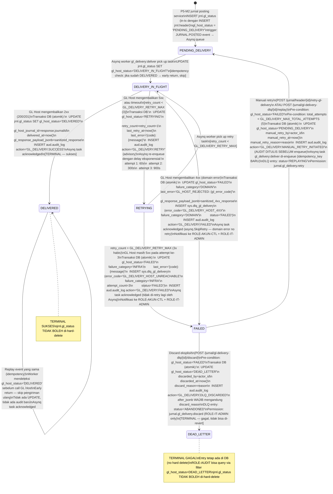
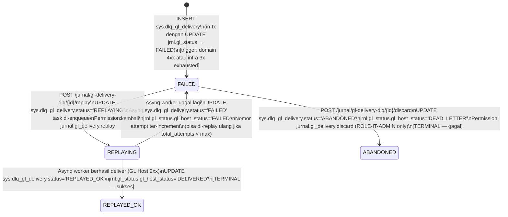

# P5-M3 GL Host Delivery — State Machines, Flows, Validation Rules, Hand-off Notes

**Story Set**: P5-M3 (S1..S5)
**Modul**: APP-D — GL Interface (Phase 5, Module 3)
**Author**: system-analyst
**Date**: 2026-06-15
**Branch**: feature/phase-5-m3-gl-delivery-contracts
**OpenAPI**: `api/openapi/app-d-gl-delivery.yaml`

Decisions anchoring this document:
- DEC-005 — GL Integration Phase 2 REST real-time (aktif P5-M3)
- DEC-007 — Asynq job queue
- DEC-018 — Audit trail append-only, 10+10 tahun retensi
- DEC-021 — Idempotency-Key mandatory
- DEC-022 — Cursor pagination
- DEC-027 — MFA step-up: tidak diperlukan untuk GL delivery routine
- DEC-030 RESOLVED — GL delivery mode = Async REST via Asynq
- DEC-031 PENDING — GL Host vendor (adapter interface pattern)
- OQ-M3-1a — Auth default: API key header X-API-Key
- OQ-M3-1b — Idempotency-Key ke GL Host: "BLIPS-{header.idempotency_key}"
- OQ-M3-1c — Retry delays konfigurabel via sys.config GL_DELIVERY_RETRY_DELAYS_SECONDS
- OQ-M3-1d — Circuit breaker: gobreaker, threshold 5 failures/60s
- OQ-M3-3a — Max total attempts: 5 (konfigurabel GL_DELIVERY_MAX_TOTAL_ATTEMPTS)
- OQ-M3-4b — Rekon duplicate date: UPSERT (overwrite laporan lama)
- OQ-M3-5a — DLQ GL delivery: tabel terpisah sys.dlq_gl_delivery + VIEW dari jrnl.gl_status
- OQ-M3-5b — Retry endpoint S3 + DLQ replay S5 = code path sama (GLDeliveryService.Retry)

---

## 1. State Machine — `jrnl.gl_status.gl_host_status`

Setiap `jrnl.header` memiliki tepat satu row `jrnl.gl_status` yang di-INSERT oleh
P5-M2 posting service **dalam transaksi yang sama** dengan INSERT jrnl.header.

### 1.1 Diagram



### 1.2 Transisi Summary Table

| From | To | Trigger | Actor | Atomicity |
|---|---|---|---|---|
| — | PENDING_DELIVERY | P5-M2 jurnal posting (in-tx INSERT jrnl.header) | SYSTEM_WORKER | in-tx dengan INSERT jrnl.header |
| PENDING_DELIVERY | DELIVERY_IN_FLIGHT | Asynq worker pick up | SYSTEM_WORKER | UPDATE gl_status |
| DELIVERY_IN_FLIGHT | DELIVERED | GL Host 2xx | SYSTEM_WORKER | in-tx dengan aud.audit_log |
| DELIVERY_IN_FLIGHT | RETRYING | GL Host 5xx/timeout, retry < 3 | SYSTEM_WORKER | in-tx dengan aud.audit_log (advisory) |
| DELIVERY_IN_FLIGHT | FAILED | GL Host 4xx (domain) | SYSTEM_WORKER | in-tx dengan dlq INSERT + aud.audit_log |
| RETRYING | DELIVERY_IN_FLIGHT | Asynq retry task pick up | SYSTEM_WORKER | UPDATE gl_status |
| RETRYING | FAILED | Retry ke-3 juga gagal (5xx) | SYSTEM_WORKER | in-tx dengan dlq INSERT + aud.audit_log |
| FAILED | PENDING_DELIVERY | Manual retry (S3/S5) | ROLE-AKUN-CTL / ROLE-IT-ADMIN | in-tx AUDIT FIRST, lalu enqueue |
| FAILED | DEAD_LETTER | Discard (S5) | ROLE-IT-ADMIN only | in-tx dengan aud.audit_log |
| DELIVERED | DELIVERED | Replay idempotency (early return) | SYSTEM_WORKER | no-op |

### 1.3 DEAD_LETTER tidak bisa di-revert

DEAD_LETTER adalah terminal state. Tidak ada transisi keluar. Jika di masa depan jurnal
perlu dikirim ulang setelah DEAD_LETTER:
1. ROLE-IT-ADMIN membuat jurnal correction manual via screen P5-M2 (CORRECTION_PERIODE_CLOSED).
2. Jurnal baru tersebut akan memiliki `jrnl.gl_status` PENDING_DELIVERY tersendiri.

---

## 2. State Machine — `sys.dlq_gl_delivery.status`

DLQ entry di-INSERT bersamaan dengan transisi ke FAILED di jrnl.gl_status.



---

## 3. Asynq Worker Flow — `gl_delivery:deliver`

### 3.1 Happy Path Flow

```
Event: JURNAL.POSTED (Asynq queue, published by P5-M2)
Payload: { "header_id": "<uuid>", "idempotency_key": "<uuid>" }
                ↓
[Worker: gl_delivery:deliver]
                ↓
1. IDEMPOTENCY CHECK:
   SELECT gl_host_status FROM jrnl.gl_status WHERE header_id = $1
   IF gl_host_status = 'DELIVERED' → early return, task acknowledged (idempotency)
   IF gl_host_status = 'DEAD_LETTER' → early return (tidak perlu kirim, discard sudah terminal)
                ↓
2. UPDATE jrnl.gl_status SET gl_host_status='DELIVERY_IN_FLIGHT'
                ↓
3. READ jrnl.header + jrnl.detail WHERE header_id = $1
   VALIDATE: status_internal = 'POSTED', detail rows ≥ 1 DEBIT + 1 KREDIT
                ↓
4. BUILD GL HOST PAYLOAD (PII SANITIZATION):
   - Strip customer_name, account_no, NPWP dari metadata_jsonb
   - Set idempotency_key = "BLIPS-{header.idempotency_key}"
   - Set source_system = "BLIPS"
   - Set event_code, narrative, journal_date, lines[]
                ↓
5. FETCH sys.config_param: GL_HOST_BASE_URL, GL_HOST_API_KEY
   (API key tidak di-log, tidak masuk payload response)
                ↓
6. POST {GL_HOST_BASE_URL}/api/journals
   Headers: X-API-Key: {GL_HOST_API_KEY}
            X-Idempotency-Key: "BLIPS-{header.idempotency_key}"
            Content-Type: application/json
   Timeout: 30 detik (konfigurabel via sys.config GL_DELIVERY_TIMEOUT_SECONDS)
                ↓
       [2xx] ─────────────────────────────────────────────→ DELIVERED path
       [4xx] ─────────────────────────────────────────────→ FAILED path (domain, SkipRetry)
       [5xx/timeout] ──────────────────────────────────────→ RETRYING path (if attempt ≤ 3)
                                                            → FAILED path (if attempt = 3)
```

### 3.2 Success Path (GL Host 2xx)

```
BEGIN TRANSACTION:
  UPDATE jrnl.gl_status SET
    gl_host_status = 'DELIVERED',
    gl_host_journal_id = response.journalId,
    delivered_at = now(),
    gl_response_payload_jsonb = sanitize_pii(response_body),
    payload_sent_at = request_sent_at,
    updated_at = now(),
    updated_by = system_worker_uuid,
    row_version = row_version + 1
  WHERE header_id = $1

  INSERT aud.audit_log (
    action = 'GL_DELIVERY.SUCCESS',
    entity_type = 'jrnl.gl_status',
    entity_id = gl_status.id,
    actor_user_id = system_worker_uuid,
    actor_role = 'SYSTEM_WORKER',
    after_jsonb = { gl_host_status, gl_host_journal_id, delivered_at },
    trace_id = $trace_id
  )
COMMIT

Asynq task: ACKNOWLEDGED
```

### 3.3 Domain Error Path (GL Host 4xx)

```
BEGIN TRANSACTION:
  UPDATE jrnl.gl_status SET
    gl_host_status = 'FAILED',
    failure_category = 'DOMAIN',
    last_error = 'GL_HOST_REJECTED: {gl_error_code} — {gl_error_message}',
    gl_response_payload_jsonb = sanitize_pii(response_body),
    payload_sent_at = request_sent_at,
    updated_at = now(), updated_by = system_worker_uuid,
    row_version = row_version + 1
  WHERE header_id = $1

  INSERT sys.dlq_gl_delivery (
    id = gen_random_uuid(),
    gl_status_id = gl_status.id,
    header_id = $1,
    failure_category = 'DOMAIN',
    error_code = 'GL_DELIVERY_HOST_4XX',
    error_message = '{gl_error_code}: {gl_error_message}',
    payload_snapshot_jsonb = sanitize_pii(request_payload),
    attempt_count = 1,
    status = 'FAILED',
    created_by = system_worker_uuid,
    updated_by = system_worker_uuid,
    tenant_id = 'TUGURE'
  )

  INSERT aud.audit_log (
    action = 'GL_DELIVERY.FAILED',
    entity_type = 'jrnl.gl_status',
    entity_id = gl_status.id,
    actor_role = 'SYSTEM_WORKER',
    after_jsonb = { gl_host_status, failure_category, last_error, dlq_entry_id },
    trace_id = $trace_id
  )
COMMIT

Asynq task: asynq.SkipRetry (domain error — Asynq tidak auto-retry)
Notifikasi: in-app ke ROLE-AKUN-CTL + ROLE-IT-ADMIN
```

### 3.4 Infra Error Path (GL Host 5xx / Timeout) — Retry < Max

```
Attempt N (N < GL_DELIVERY_RETRY_MAX = 3):

BEGIN TRANSACTION:
  UPDATE jrnl.gl_status SET
    gl_host_status = 'RETRYING',
    retry_count = N,
    last_retry_at = now(),
    last_error = 'GL_DELIVERY_TIMEOUT: {detail}' or 'GL_DELIVERY_HOST_UNREACHABLE: 5xx',
    updated_at = now()
  WHERE header_id = $1

  INSERT aud.audit_log (
    action = 'GL_DELIVERY.RETRY',   -- advisory, lightweight
    entity_id = gl_status.id,
    after_jsonb = { attempt: N, error_code, delay_seconds }
  )
COMMIT

Asynq: return error (non-nil) → Asynq auto-retry dengan delay:
  N=1: 60 seconds
  N=2: 300 seconds
  N=3: 900 seconds
  (dari sys.config GL_DELIVERY_RETRY_DELAYS_SECONDS = "60,300,900")
```

### 3.5 Infra Error Path — Retry Exhausted (N = Max)

```
Attempt ke-3 juga gagal:

BEGIN TRANSACTION:
  UPDATE jrnl.gl_status SET
    gl_host_status = 'FAILED',
    failure_category = 'INFRA',
    retry_count = 3,
    last_error = 'GL_DELIVERY_HOST_UNREACHABLE: 503 after 3 retries'
  WHERE header_id = $1

  INSERT sys.dlq_gl_delivery (
    error_code = 'GL_DELIVERY_HOST_UNREACHABLE',
    failure_category = 'INFRA',
    attempt_count = 3,
    status = 'FAILED'
  )

  INSERT aud.audit_log (action = 'GL_DELIVERY.FAILED')
COMMIT

Asynq task: ACKNOWLEDGED (tidak return error — sudah terminal)
Notifikasi: in-app ke ROLE-AKUN-CTL + ROLE-IT-ADMIN
```

---

## 4. Asynq Worker Flow — `gl_delivery:reconcile-daily`

### 4.1 Trigger

- **Auto**: Asynq cron daily 08:00 WIB → task `gl_delivery:reconcile-daily`
  - Payload: `{ "date": "YYYY-MM-DD" }` (D-1 dari saat cron berjalan)
  - Skip jika `date` ada di `sys.calendar_holiday`
- **Manual**: POST /jurnal/reconciliation/run → INSERT sys.job + enqueue same task type

### 4.2 Reconciliation Flow

```
[Worker: gl_delivery:reconcile-daily]
Payload: { "date": "2026-06-14", "job_id": "job_RECON_01HXYZ", "triggered_by": "uuid|CRON" }
                ↓
1. CHECK hari libur:
   SELECT * FROM sys.calendar_holiday WHERE tanggal = $date
   IF found → skip (task acknowledged, log skipped)
                ↓
2. CHECK concurrent run:
   SELECT status FROM sys.gl_reconciliation_report WHERE tanggal_rekonsiliasi = $date
   IF status = 'RUNNING' → return error GL_RECONCILIATION_IN_PROGRESS (409)
                ↓
3. UPSERT sys.gl_reconciliation_report:
   INSERT ... ON CONFLICT (tanggal_rekonsiliasi) DO UPDATE SET status='RUNNING', started_at=now()
   Soft-delete mismatch rows lama:
   UPDATE sys.gl_recon_mismatch SET deleted_at=now() WHERE report_id = old_report.id

   UPDATE sys.job SET status='running', progress=0, current_step='Membaca jurnl.detail...'
                ↓
4. BLIPS SIDE QUERY:
   SELECT d.kode_akun, SUM(d.debit_amount) - SUM(d.kredit_amount) AS blips_net_idr
   FROM jrnl.detail d
   JOIN jrnl.header h ON d.header_id = h.id
   WHERE h.tanggal_posting = $date
     AND h.status_internal = 'POSTED'
     AND h.tenant_id = 'TUGURE'
   GROUP BY d.kode_akun

   UPDATE sys.job SET progress=30, current_step='Fetching GL Host summary...'
                ↓
5. GL HOST SIDE FETCH:
   GET {GL_HOST_BASE_URL}/api/gl/daily-summary?date=$date
   Headers: X-API-Key: {GL_HOST_API_KEY}
   Timeout: 60 detik

   IF error (5xx, timeout, network):
     UPDATE sys.gl_reconciliation_report SET status='FAILED',
       summary_jsonb={'error': 'GL Host unreachable: {detail}'}
     UPDATE sys.job SET status='failed'
     INSERT aud.audit_log action='GL_RECONCILIATION.FAILED'
     Notifikasi ke ROLE-AKUN-CTL + ROLE-IT-ADMIN
     return

   UPDATE sys.job SET progress=60, current_step='Membandingkan data...'
                ↓
6. COMPARISON LOGIC:
   all_accounts = UNION(blips_accounts, gl_accounts)
   FOR each account IN all_accounts:
     delta = blips_net_idr - gl_host_net_idr
     IF ABS(delta) > GL_RECON_TOLERANCE_IDR (default 1.0000):
       mismatch_type = determine_type(blips_net, gl_net)
         BLIPS_ONLY: gl_net = 0 AND blips_net > 0
         GL_ONLY:    blips_net = 0 AND gl_net > 0
         AMOUNT_DIFF: keduanya ada tapi ABS(delta) > tolerance

   UPDATE sys.job SET progress=80, current_step='Menyimpan hasil...'
                ↓
7. PERSIST RESULTS (BEGIN TRANSACTION):
   UPDATE sys.gl_reconciliation_report SET
     status = IF(mismatch_count > 0, 'COMPLETED_WITH_MISMATCH', 'COMPLETED'),
     total_akun_checked = count,
     total_mismatch_count = mismatch_count,
     total_mismatch_amount_idr = SUM(|delta|),
     blips_total_idr = SUM(blips_net),
     gl_host_total_idr = SUM(gl_net),
     delta_idr = blips_total - gl_host_total,
     gl_host_snapshot_jsonb = sanitize_pii(gl_host_response),
     completed_at = now()

   FOR each mismatch:
     INSERT sys.gl_recon_mismatch (
       report_id, kode_akun, nama_akun, blips_amount_idr, gl_host_amount_idr,
       delta_idr, mismatch_type, jurnal_header_ids
     )

   INSERT aud.audit_log (
     action = 'GL_RECONCILIATION.COMPLETED',
     after_jsonb = { status, total_akun_checked, total_mismatch_count,
                     total_mismatch_amount_idr, report_id }
   )
   COMMIT

   UPDATE sys.job SET status='completed', progress=100
                ↓
8. NOTIFICATIONS:
   IF mismatch_count = 0:
     Notifikasi ROLE-AKUN-CTL: "Rekonsiliasi GL {date} selesai — tidak ada mismatch."
   ELSE:
     ALERT ke ROLE-AKUN-CTL + ROLE-CFO:
     "MISMATCH GL Rekonsiliasi {date}: {mismatch_count} akun, total selisih IDR {amount}."
```

---

## 5. Validation Rules

### 5.1 POST /jurnal/header/{id}/retry-gl-delivery

| Field / Rule | Validation | Error Code | Message-id / Note |
|---|---|---|---|
| `id` (path) | UUID format, exists in jrnl.header | GL_DELIVERY_JURNAL_NOT_FOUND | 404 |
| `jrnl.gl_status.gl_host_status` | MUST = 'FAILED' | GL_DELIVERY_INVALID_TRANSITION | "Status DEAD_LETTER/DELIVERED tidak bisa di-retry." |
| Total attempts check | (retry_count + manual_retry_count) < GL_DELIVERY_MAX_TOTAL_ATTEMPTS | GL_DELIVERY_MAX_ATTEMPTS_EXCEEDED | "Total percobaan mencapai batas maksimum." |
| `body.reason` | required, minLength=30, maxLength=1000 | GL_DELIVERY_REASON_TOO_SHORT | "Alasan retry wajib minimal 30 karakter." |
| `body.reason` | tidak mengandung pola credential/secret (server sanitize) | VALIDATION_FAILED | "Reason mengandung data sensitif yang tidak diizinkan." |
| `Idempotency-Key` | required, UUID v4 format | VALIDATION_FAILED | "Idempotency-Key wajib UUID v4." |
| Permission | actor.permissions contains 'jurnal.gl_delivery.retry' | GL_DELIVERY_PERMISSION_DENIED | 403 |
| `jrnl.header.status_internal` | MUST = 'POSTED' | GL_DELIVERY_JURNAL_NOT_FOUND | "Jurnal header tidak dalam status POSTED." |

### 5.2 POST /jurnal/reconciliation/run

| Field / Rule | Validation | Error Code | Message-id / Note |
|---|---|---|---|
| `body.date` | required, format YYYY-MM-DD, not future | GL_RECONCILIATION_DATE_INVALID | "Tanggal tidak valid." |
| `body.date` | bukan hari libur (check sys.calendar_holiday) | GL_RECONCILIATION_DATE_INVALID | "Tanggal {date} adalah hari libur." |
| `body.date` | tidak ada rekonsiliasi RUNNING untuk tanggal ini | GL_RECONCILIATION_IN_PROGRESS | "Rekonsiliasi sedang berjalan." |
| Permission | actor.permissions contains 'jurnal.reconciliation.run' | FORBIDDEN | 403 |
| `Idempotency-Key` | required, UUID v4 | VALIDATION_FAILED | 400 |

### 5.3 POST /jurnal/gl-delivery-dlq/{id}/replay

| Field / Rule | Validation | Error Code | Message-id / Note |
|---|---|---|---|
| `id` (path) | UUID format, exists in sys.dlq_gl_delivery | GL_DELIVERY_JURNAL_NOT_FOUND | 404 |
| `sys.dlq_gl_delivery.status` | MUST = 'FAILED' | GL_DLQ_REPLAY_INVALID_STATE | "Status {status} tidak valid untuk replay." |
| `body.reason` | required, minLength=30, maxLength=1000 | GL_DELIVERY_REASON_TOO_SHORT | "Alasan replay wajib minimal 30 karakter." |
| Total attempts check | total_attempts < GL_DELIVERY_MAX_TOTAL_ATTEMPTS | GL_DELIVERY_MAX_ATTEMPTS_EXCEEDED | 422 |
| Permission | actor.permissions contains 'jurnal.gl_delivery.replay' | GL_DELIVERY_PERMISSION_DENIED | 403 |
| `Idempotency-Key` | required, UUID v4 | VALIDATION_FAILED | 400 |

### 5.4 POST /jurnal/gl-delivery-dlq/{id}/discard

| Field / Rule | Validation | Error Code | Message-id / Note |
|---|---|---|---|
| `id` (path) | UUID format, exists in sys.dlq_gl_delivery | GL_DELIVERY_JURNAL_NOT_FOUND | 404 |
| `sys.dlq_gl_delivery.status` | MUST = 'FAILED' | GL_DLQ_REPLAY_INVALID_STATE | "Entry berstatus {status}, bukan FAILED." |
| `body.reason` | required, minLength=30, maxLength=1000 | GL_DELIVERY_REASON_TOO_SHORT | "Alasan discard wajib minimal 30 karakter." |
| Permission | actor.permissions contains 'jurnal.gl_delivery.discard' | GL_DELIVERY_PERMISSION_DENIED | 403 — ROLE-IT-ADMIN only |
| `Idempotency-Key` | required, UUID v4 | VALIDATION_FAILED | 400 |

### 5.5 Worker Asynq `gl_delivery:deliver` — pre-delivery checks

| Check | Rule | Action jika gagal |
|---|---|---|
| jrnl.gl_status exists | header_id ada di jrnl.gl_status | Panic log + task FAILED (DLQ Asynq) |
| Idempotency | gl_host_status = 'DELIVERED' | Early return, task acknowledged |
| Terminal skip | gl_host_status = 'DEAD_LETTER' | Early return (log info) |
| jrnl.detail balance | SUM(debit) = SUM(kredit) | GL_DELIVERY_PAYLOAD_BUILD_FAILED |
| jrnl.detail non-empty | ≥ 1 DEBIT row + ≥ 1 KREDIT row | GL_DELIVERY_PAYLOAD_BUILD_FAILED |
| sys.config | GL_HOST_BASE_URL, GL_HOST_API_KEY ada | GL_DELIVERY_HOST_UNREACHABLE (config issue) |
| PII sanitization | Strip customer_name, account_no, NPWP sebelum build payload | Fail-safe: if sanitizer error → abort delivery, DLQ |

---

## 6. Error Catalog (P5-M3 specific)

15 error codes stable string — tidak pernah berubah antar minor version.

| Error Code | HTTP Status | Kategori | Deskripsi |
|---|---|---|---|
| `GL_DELIVERY_HOST_UNREACHABLE` | 502 | INFRA | GL Host tidak bisa di-reach (timeout, 5xx, network error) |
| `GL_DELIVERY_INVALID_RESPONSE` | 502 | DOMAIN | Response GL Host tidak sesuai kontrak (unparseable, missing journalId) |
| `GL_DELIVERY_HOST_4XX` | 422 | DOMAIN | GL Host menolak payload (4xx domain error, mis. invalid account code) |
| `GL_DELIVERY_AUTH_FAILED` | 401 | CONFIG | GL Host mengembalikan 401/403 — API key tidak valid atau expired |
| `GL_DELIVERY_TIMEOUT` | 504 | INFRA | HTTP request ke GL Host timeout (> GL_DELIVERY_TIMEOUT_SECONDS) |
| `GL_DELIVERY_JURNAL_NOT_FOUND` | 404 | VALIDATION | jurnal_header_id tidak ditemukan, atau DLQ entry tidak ada |
| `GL_DELIVERY_INVALID_TRANSITION` | 422 | WORKFLOW | Retry dari status bukan FAILED (mis. DEAD_LETTER, DELIVERED) |
| `GL_DELIVERY_REASON_TOO_SHORT` | 422 | VALIDATION | reason field < 30 karakter (retry atau discard) |
| `GL_DELIVERY_PERMISSION_DENIED` | 403 | AUTH | Permission jurnal.gl_delivery.* tidak terpenuhi |
| `GL_DELIVERY_PAYLOAD_BUILD_FAILED` | 500 | INTERNAL | Gagal membangun payload (balance invariant, detail kosong, PII sanitizer error) |
| `GL_DELIVERY_MAX_ATTEMPTS_EXCEEDED` | 422 | BUSINESS | Total percobaan (auto + manual) >= GL_DELIVERY_MAX_TOTAL_ATTEMPTS |
| `GL_RECONCILIATION_REPORT_NOT_FOUND` | 404 | VALIDATION | Belum ada laporan rekonsiliasi untuk tanggal tersebut |
| `GL_RECONCILIATION_DATE_INVALID` | 422 | VALIDATION | Tanggal bukan hari kerja, format salah, atau future date |
| `GL_RECONCILIATION_HOST_FETCH_FAILED` | 502 | INFRA | GL Host tidak bisa di-reach saat fetch daily-summary |
| `GL_RECONCILIATION_IN_PROGRESS` | 409 | CONFLICT | Rekonsiliasi untuk tanggal ini sedang berjalan (concurrent run protection) |
| `GL_DLQ_REPLAY_INVALID_STATE` | 422 | WORKFLOW | DLQ entry status bukan FAILED (replay dari ABANDONED, REPLAYED_OK, dll) |

**Note**: Error codes `GL_DELIVERY_HOST_UNREACHABLE`, `GL_DELIVERY_HOST_4XX`, dan
`GL_DELIVERY_INVALID_RESPONSE` di-persist di `sys.dlq_gl_delivery.error_code`
sebagai reference konstan. Tidak boleh di-rename.

---

## 7. Performance SLA

| Operasi | Target | Scope |
|---|---|---|
| POST /jurnal/header/{id}/retry-gl-delivery | ≤ 200 ms | enqueue only, no GL Host call |
| POST /jurnal/reconciliation/run | ≤ 200 ms | enqueue only |
| GET /jurnal/header/{id}/gl-delivery-status | ≤ 500 ms | JOIN jrnl.gl_status 1 row |
| GET /jurnal/reconciliation/daily | ≤ 500 ms | 1 report + mismatch lines |
| GET /jurnal/gl-delivery-dlq list | ≤ 500 ms | cursor paginated, indexed |
| Asynq gl_delivery:deliver per event | ≤ 5 s | P99, termasuk GL Host call |
| Daily reconciliation cron full run | ≤ 60 s | 10k jurnal entries |
| GL Host HTTP call timeout | 30 s | dari sys.config GL_DELIVERY_TIMEOUT_SECONDS |

**Index requirements (untuk data-modeler migration 000037):**
- `jrnl.gl_status (gl_host_status, updated_at DESC)` — DLQ query performance
- `jrnl.gl_status (header_id)` — UNIQUE (sudah ada, konfirmasi)
- `sys.dlq_gl_delivery (status, created_at DESC)` — DLQ list query
- `sys.dlq_gl_delivery (gl_status_id)` — UNIQUE FK
- `sys.gl_reconciliation_report (tanggal_rekonsiliasi)` — UNIQUE (1 per hari)
- `sys.gl_recon_mismatch (report_id)` — FK index

---

## 8. Audit Policy

Semua event audit ditulis **in-transaction** dengan state change yang di-trigger.
Tidak ada audit event yang ditulis async setelah transaksi commit.

| Audit Action | Trigger | Actor | Entity Type | in-tx | Notes |
|---|---|---|---|---|---|
| GL_DELIVERY.SUCCESS | Worker: DELIVERED | SYSTEM_WORKER | jrnl.gl_status | YES | atomik dengan UPDATE gl_status |
| GL_DELIVERY.FAILED | Worker: FAILED (4xx atau 3x infra) | SYSTEM_WORKER | jrnl.gl_status | YES | atomik dengan UPDATE + dlq INSERT |
| GL_DELIVERY.RETRY | Worker: per infra retry attempt | SYSTEM_WORKER | jrnl.gl_status | YES | advisory; setiap attempt |
| GL_DELIVERY.MANUAL_RETRY_INITIATED | POST retry-gl-delivery | ROLE-AKUN-CTL / ROLE-IT-ADMIN | jrnl.gl_status | YES | **DITULIS SEBELUM** Asynq enqueue |
| GL_DELIVERY.DLQ_REPLAY_INITIATED | POST dlq/{id}/replay | ROLE-AKUN-CTL / ROLE-IT-ADMIN | sys.dlq_gl_delivery | YES | **DITULIS SEBELUM** Asynq enqueue |
| GL_DELIVERY.DLQ_DISCARDED | POST dlq/{id}/discard | ROLE-IT-ADMIN | sys.dlq_gl_delivery | YES | after_jsonb WAJIB mengandung discard_reason |
| GL_DELIVERY.DLQ_EXPORT | GET dlq?export=csv/xlsx | ROLE-AKUN-CTL / ROLE-IT-ADMIN | bulk | YES | entity_id = UUID.Nil (bulk) |
| GL_RECONCILIATION.STARTED | Cron start / manual trigger | SYSTEM_WORKER / ROLE-AKUN-CTL | sys.gl_reconciliation_report | YES | |
| GL_RECONCILIATION.COMPLETED | Rekon selesai (dengan/tanpa mismatch) | SYSTEM_WORKER | sys.gl_reconciliation_report | YES | after_jsonb: status + mismatch summary |
| GL_RECONCILIATION.FAILED | Rekon gagal (GL Host unreachable) | SYSTEM_WORKER | sys.gl_reconciliation_report | YES | |

### PII Sanitization Rules (wajib sebelum persist ke JSONB)

Fields yang WAJIB di-strip sebelum masuk `gl_response_payload_jsonb`,
`payload_snapshot_jsonb`, dan `summary_jsonb`:

| PII Field | Lokasi sumber | Cara sanitize |
|---|---|---|
| `customer_name` | metadata_jsonb instrumen | Replace dengan `[REDACTED]` |
| `account_no` / `nomor_rekening` | counterparty atau metadata | Replace dengan `[REDACTED]` |
| `npwp` | counterparty | Replace dengan `[REDACTED]` |
| `GL_HOST_API_KEY` | HTTP header / sys.config | TIDAK BOLEH masuk ke log atau response JSONB apapun |

---

## 9. Security Checklist (untuk `security-engineer` — BLOCKING gate)

- [ ] `GL_DELIVERY.SUCCESS` dan `GL_DELIVERY.FAILED` ditulis ke `aud.audit_log` **in-transaction** dengan UPDATE `jrnl.gl_status`
- [ ] `GL_DELIVERY.MANUAL_RETRY_INITIATED` ditulis **SEBELUM** Asynq task di-enqueue (jika enqueue gagal, audit tetap ada)
- [ ] `sys.gl_reconciliation_report` + `sys.gl_recon_mismatch` tidak bisa di-hard-delete (append-only trigger)
- [ ] `jrnl.gl_status` tidak bisa di-hard-delete (existing trigger dari migration 000005 dikonfirmasi)
- [ ] `gl_response_payload_jsonb` dan `payload_snapshot_jsonb` wajib di-sanitize PII sebelum INSERT
- [ ] `GL_HOST_API_KEY` tidak di-log, tidak di-return via API, tidak masuk payload response
- [ ] `GL_DELIVERY.DLQ_DISCARDED` after_jsonb WAJIB mengandung `discard_reason` sebagai evidence
- [ ] Endpoint retry + DLQ replay/discard cek permission server-side — UI disable bukan pengganti
- [ ] `body.reason` di semua endpoint di-sanitize dari credential/secret pattern
- [ ] ROLE-AKUN-CTL tidak bisa akses `jurnal.gl_delivery.discard` (hanya ROLE-IT-ADMIN)
- [ ] `gl_response_payload_jsonb` (raw GL Host response) hanya dikembalikan ke ROLE-IT-ADMIN
- [ ] Rate limit 10 req/min untuk retry + replay + discard + reconciliation/run endpoints
- [ ] Circuit breaker status tidak exposed via API (internal monitoring saja)

---

## 10. Hand-off Notes

### 10.1 data-modeler — migration 000037

**STOP: konfirmasi ke data-modeler sebelum backend mulai implementasi.**

Perubahan schema yang diperlukan:

**ALTER `jrnl.gl_status` ADD COLUMNS:**
```sql
failure_category         VARCHAR(20)  -- 'DOMAIN' | 'INFRA'
gl_response_payload_jsonb JSONB       -- sanitized GL Host response
manual_retry_by          UUID FK → sec.user(id)
manual_retry_at          TIMESTAMPTZ
manual_retry_reason      TEXT         -- ≥ 30 chars constraint
discarded_by             UUID FK → sec.user(id)
discarded_at             TIMESTAMPTZ
discard_reason           TEXT         -- ≥ 30 chars constraint
payload_sent_at          TIMESTAMPTZ  -- waktu terakhir payload dikirim
delivery_response_id     TEXT         -- alias gl_host_journal_id (atau unify)
```

**Enum extension** untuk `gl_host_status` (jika menggunakan enum type):
- Tambah: `DELIVERY_IN_FLIGHT` (transient state baru di P5-M3)

**CREATE TABLE `sys.dlq_gl_delivery`:**
```sql
id                          UUID PK DEFAULT gen_random_uuid()
gl_status_id                UUID FK UNIQUE → jrnl.gl_status(id)
header_id                   UUID FK → jrnl.header(id)  -- denormalisasi
failure_category            VARCHAR(20) NOT NULL  CHECK IN ('DOMAIN','INFRA')
error_code                  TEXT NOT NULL
error_message               TEXT
payload_snapshot_jsonb      JSONB      -- sanitized, no PII
attempt_count               INT NOT NULL DEFAULT 1
status                      VARCHAR(20) NOT NULL CHECK IN ('FAILED','REPLAYING','REPLAYED_OK','ABANDONED')
replayed_at                 TIMESTAMPTZ
replayed_by                 UUID FK → sec.user(id)
discarded_reason            TEXT
-- audit cols standard
created_at, created_by, updated_at, updated_by, row_version, tenant_id
```

**CREATE TABLE `sys.gl_reconciliation_report`:**
```sql
id                          UUID PK DEFAULT gen_random_uuid()
tanggal_rekonsiliasi        DATE NOT NULL UNIQUE  -- 1 per hari
job_id                      TEXT   -- → sys.job.id
triggered_by                UUID   -- user_id atau NULL jika cron
status                      VARCHAR(30) NOT NULL CHECK IN ('PENDING','RUNNING','COMPLETED','COMPLETED_WITH_MISMATCH','FAILED')
started_at                  TIMESTAMPTZ
completed_at                TIMESTAMPTZ
total_akun_checked          INT DEFAULT 0
total_mismatch_count        INT DEFAULT 0
total_mismatch_amount_idr   NUMERIC(20,4) DEFAULT 0
blips_total_idr             NUMERIC(20,4)
gl_host_total_idr           NUMERIC(20,4)
delta_idr                   NUMERIC(20,4)
tolerance_idr               NUMERIC(20,4) NOT NULL DEFAULT 1.0000  -- snapshot dari sys.config saat run
summary_jsonb               JSONB  -- per-akun breakdown (optional pre-compute)
gl_host_snapshot_jsonb      JSONB  -- sanitized raw GL Host response
-- audit cols + tidak boleh hard-delete (trigger)
```

**CREATE TABLE `sys.gl_recon_mismatch`:**
```sql
id                   UUID PK DEFAULT gen_random_uuid()
report_id            UUID FK → sys.gl_reconciliation_report(id) NOT NULL
kode_akun            TEXT NOT NULL
nama_akun            TEXT
blips_amount_idr     NUMERIC(20,4) NOT NULL
gl_host_amount_idr   NUMERIC(20,4) NOT NULL DEFAULT 0
delta_idr            NUMERIC(20,4) NOT NULL
mismatch_type        VARCHAR(20) NOT NULL CHECK IN ('BLIPS_ONLY','GL_ONLY','AMOUNT_DIFF')
jurnal_header_ids    UUID[]
-- audit cols + tidak boleh hard-delete (trigger wajib)
```

**sys.config seed values:**
```
GL_HOST_URL                            → encrypted TEXT (GL Host base URL)
GL_HOST_AUTH_TYPE                      → 'API_KEY' (default; atau 'OAUTH2_CLIENT_CREDENTIALS')
GL_HOST_API_KEY                        → encrypted TEXT (column-level AES-256-GCM)
GL_DELIVERY_RETRY_MAX                  → '3'
GL_DELIVERY_RETRY_DELAYS_SECONDS       → '60,300,900'
GL_DELIVERY_MAX_TOTAL_ATTEMPTS         → '5'
GL_DELIVERY_TIMEOUT_SECONDS            → '30'
GL_RECON_TOLERANCE_IDR                 → '1.0000'
GL_RECON_CRON_TIME                     → '08:00 Asia/Jakarta'
```

**Indexes:**
```sql
CREATE INDEX idx_gl_status_host_status_updated
  ON jrnl.gl_status (gl_host_status, updated_at DESC)
  WHERE deleted_at IS NULL;

CREATE UNIQUE INDEX uq_dlq_gl_delivery_gl_status
  ON sys.dlq_gl_delivery (gl_status_id);

CREATE INDEX idx_dlq_gl_delivery_status_created
  ON sys.dlq_gl_delivery (status, created_at DESC)
  WHERE deleted_at IS NULL;

CREATE UNIQUE INDEX uq_gl_recon_report_tanggal
  ON sys.gl_reconciliation_report (tanggal_rekonsiliasi);

CREATE INDEX idx_gl_recon_mismatch_report
  ON sys.gl_recon_mismatch (report_id);
```

### 10.2 integration-engineer

- Implement `GLHostAdapter` interface di `backend/internal/jrnl/gldelivery/adapter.go`:
  ```go
  type GLHostAdapter interface {
      Post(ctx context.Context, payload GLHostPayload) (GLHostDeliveryResponse, error)
      GetDailySummary(ctx context.Context, date time.Time) ([]AkunDailySummary, error)
  }
  ```
- Concrete implementation: `RestGLHostAdapter` (configurable URL + auth dari sys.config)
- Mock/stub: `StubGLHostAdapter` untuk local dev + unit test (bisa return 2xx, 4xx, 5xx berdasarkan config)
- HTTP client: Go `net/http` dengan timeout + `gobreaker` circuit breaker
  - threshold: 5 failures dalam 60 detik → OPEN
  - half-open window: 30 detik
- PII sanitization layer: func `SanitizePII(payload map[string]any) map[string]any` di package `gldelivery`
- OQ-M3-1a: auth default API key header `X-API-Key`. Konfirmasi vendor (DEC-031) sebelum Sprint 2.
- OQ-M3-4a: GL Host daily summary API contract TBD. Konfirmasi format JSON response dengan vendor.

### 10.3 backend-engineer-go

Package baru: `backend/internal/jrnl/gldelivery/`

- `DeliveryService` — worker logic (gl_delivery:deliver handler)
  - Subscribe ke JURNAL.POSTED Asynq event (from P5-M2)
  - Idempotency check, PII sanitize, GL Host call, state transition, audit
- `ReconciliationService` — daily recon cron + manual trigger
  - Register cron: `gl_delivery:reconcile-daily` 08:00 WIB
  - BLIPS side query + GL Host fetch + comparison + persist
- `DLQService` — DLQ list + replay + discard
  - Shared logic dengan DeliveryService.Retry()
- HTTP handlers untuk 6 endpoints:
  - GET /jurnal/header/{id}/gl-delivery-status
  - POST /jurnal/header/{id}/retry-gl-delivery
  - GET /jurnal/reconciliation/daily
  - POST /jurnal/reconciliation/run
  - GET /jurnal/reconciliation/history
  - GET /jurnal/gl-delivery-dlq
  - GET /jurnal/gl-delivery-dlq/{id}
  - POST /jurnal/gl-delivery-dlq/{id}/replay
  - POST /jurnal/gl-delivery-dlq/{id}/discard

### 10.4 frontend-engineer-nextjs

Screen baru (parallel dengan backend):
- `/jurnal/header/{id}` — extend P5-M2 detail screen dengan `<GlDeliveryStatusPanel>` component
  - Badge status GL (DELIVERED=hijau, FAILED=merah, PENDING=abu-abu, RETRYING=amber)
  - Tombol "Retry Pengiriman" jika `can_retry=true`
- `/jurnal/gl-delivery-dlq` — DLQ console (DataTable pattern §1)
  - Filter chips: status, failure_category, error_code
  - Tombol "Replay" per row (jurnal.gl_delivery.replay)
  - Tombol "Discard" per row (jurnal.gl_delivery.discard — hanya ROLE-IT-ADMIN)
  - Badge DOMAIN=merah, INFRA=amber
- `/jurnal/reconciliation` — Rekonsiliasi harian
  - Date picker → GET /jurnal/reconciliation/daily?date=...
  - Tombol "Rerun Manual" → POST /jurnal/reconciliation/run (§3 UX: JobProgressPanel)
  - `/jurnal/reconciliation/history` — DataTable riwayat laporan
  - Mismatch table: kode_akun, blips_amount, gl_host_amount, delta, mismatch_type, link ke jurnal headers

### 10.5 qa-engineer

Test scenarios yang wajib dicakup:
- S1 happy path: DELIVERED (2xx) — in-tx audit verify
- S1 domain error: 4xx → DLQ immediate, no retry
- S1 infra error: 3x 5xx → FAILED, DLQ
- S1 idempotency: replay event yang sama, early return
- S3: retry dari FAILED → PENDING_DELIVERY, audit ditulis sebelum enqueue
- S3: retry dari DEAD_LETTER → 422 GL_DELIVERY_INVALID_TRANSITION
- S3: reason < 30 chars → 400 GL_DELIVERY_REASON_TOO_SHORT
- S3: ROLE-AKUN (tanpa permission) → 403
- S4: recon COMPLETED (no mismatch)
- S4: recon COMPLETED_WITH_MISMATCH (2 akun)
- S4: GL Host down saat recon → status FAILED
- S4: double trigger (concurrent) → 409 GL_RECONCILIATION_IN_PROGRESS
- S5: discard oleh ROLE-AKUN-CTL → 403 FORBIDDEN
- S5: discard oleh ROLE-IT-ADMIN → DEAD_LETTER terminal
- S5: SoD: tidak ada SoD check (GL delivery tidak melibatkan maker/reviewer/approver entity)
- Performance: retry endpoint ≤ 200ms, delivery worker ≤ 5s
