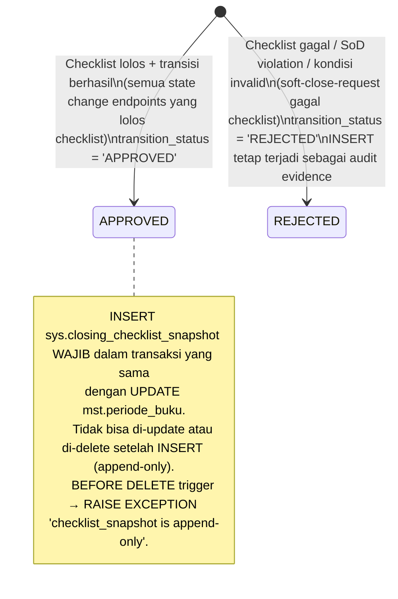

# P5-M4 Periode Buku Close Workflow — State Machines, Flows, Validation Rules, Hand-off Notes

**Story Set**: P5-M4 (S1..S5)
**Modul**: APP-D — Periode Buku (Phase 5, Module 4)
**Author**: system-analyst
**Date**: 2026-06-17
**Branch**: feature/phase-5-m3-gl-delivery-engine
**OpenAPI**: `api/openapi/app-d-periode-close.yaml`

Decisions anchoring this document:
- DEC-017 — 4-eyes SoD; CFO sole approver untuk hard-close; SoD `approver_id ≠ requester_id`
- DEC-018 — Audit trail append-only, 10+10 tahun retensi
- DEC-021 — Idempotency-Key mandatory di setiap mutating endpoint
- DEC-022 — Cursor pagination
- DEC-026 — MFA mandatory: ROLE-CFO, ROLE-AKUN-CTL (Treasury Manager saja), ROLE-KOMITE, ROLE-ALCO
- DEC-027 — Step-up MFA: hard-close approve + reopen CLOSED→SOFT_CLOSED
- DEC-036 RESOLVED — Cure evaluation boleh berjalan di SOFT_CLOSED via CORRECTION_PERIODE_CLOSED
- OQ-M4-1a RESOLVED — Client wajib kirim row_version di body; server enforce single-pending-request
- OQ-M4-1b RESOLVED — RECON_PASS strict COMPLETED (COMPLETED_WITH_MISMATCH = FAIL)
- OQ-M4-1c RESOLVED — Checklist stale threshold = 24 jam (SOFT_CLOSE_CHECKLIST_STALE_HOURS, konfigurabel)
- OQ-M4-3a RESOLVED — CFO bisa reject hard-close request (HARD_CLOSE_PENDING → SOFT_CLOSED), tanpa step-up MFA
- OQ-M4-3b RESOLVED — Grace window default 48 jam global (HARD_CLOSE_GRACE_WINDOW_HOURS), tidak per-periode
- OQ-M4-3c RESOLVED — MV refresh async; hard-close response tidak menunggu MV selesai

---

## 1. State Machine — `mst.periode_buku.status_periode`

### 1.1 Diagram

```mermaid
stateDiagram-v2
    [*] --> OPEN : CREATE periode buku\n(migration 000001 seed atau manual via admin)\nstatus_periode = 'OPEN'

    OPEN --> OPEN : soft-close-request diterima\n[Checklist lolos]\nINSERT sys.closing_checklist_snapshot (SOFT_CLOSE_REQUEST)\nUPDATE soft_close_requested_by, soft_close_requested_at, row_version++\nINSERT aud.audit_log action=PERIODE.SOFT_CLOSE_REQUESTED\n→ Status belum berubah (masih OPEN, pending approval)\nActor: ROLE-AKUN-CTL (Maker)\nPermission: periode.softclose.request

    OPEN --> OPEN : soft-close-request DITOLAK (checklist gagal)\n[Checklist gagal: CLOSING_CHECKLIST_FAILED]\nINSERT sys.closing_checklist_snapshot (SOFT_CLOSE_REQUEST, REJECTED)\nINSERT aud.audit_log action=PERIODE.SOFT_CLOSE_REQUEST_REJECTED (advisory)\n→ Status tetap OPEN\nActor: ROLE-AKUN-CTL

    OPEN --> SOFT_CLOSED : soft-close-approve\n[Checklist lolos (fresh atau re-run) + SoD pass]\nAtomik:\n  UPDATE status_periode='SOFT_CLOSED'\n         tanggal_soft_close=now()\n         soft_close_approved_by=actor_id\n         soft_close_approved_at=now()\n         row_version++\n  INSERT sys.closing_checklist_snapshot (SOFT_CLOSE_APPROVE)\n  INSERT aud.audit_log action=PERIODE.SOFT_CLOSED\nNotifikasi ke ROLE-CFO + ROLE-RISK\nAktivasi PeriodeLockMiddleware: SOFT_CLOSED lock\nActor: ROLE-AKUN-CTL (Approver, SoD: ≠ requester_id)\nPermission: periode.softclose.approve

    SOFT_CLOSED --> OPEN : reopen-approve (SOFT_CLOSED→OPEN)\n[Tidak ada batasan waktu; step-up MFA TIDAK diperlukan]\nAtomik:\n  UPDATE status_periode='OPEN'\n         reopened_flag=TRUE\n         reopened_at=now(), reopened_by=actor_id\n         reopened_approved_by=actor_id\n         row_version++\n  INSERT sys.closing_checklist_snapshot (REOPEN_APPROVE)\n  INSERT aud.audit_log action=PERIODE.REOPENED\n    after_jsonb: {previous_status: SOFT_CLOSED, new_status: OPEN, mfa_method: null}\nNotifikasi ke ROLE-AKUN-CTL + ROLE-RISK + ROLE-AKUN\nRelease PeriodeLockMiddleware: mutasi diizinkan penuh\nActor: ROLE-CFO\nPermission: periode.reopen.approve

    SOFT_CLOSED --> HARD_CLOSE_PENDING : hard-close-request\n[Checklist di-run ulang; lolos]\nAtomik:\n  UPDATE status_periode='HARD_CLOSE_PENDING'\n         hard_close_requested_by=actor_id\n         hard_close_requested_at=now()\n         row_version++\n  INSERT sys.closing_checklist_snapshot (HARD_CLOSE_REQUEST)\n  INSERT aud.audit_log action=PERIODE.HARD_CLOSE_REQUESTED\nNotifikasi ke ROLE-CFO: "Request hard-close, step-up MFA diperlukan"\nActor: ROLE-AKUN-CTL\nPermission: periode.hardclose.request

    HARD_CLOSE_PENDING --> CLOSED : hard-close-approve\n[X-Step-Up-Token valid, fresh < 5 menit, scope=hard_close]\nAtomik:\n  UPDATE status_periode='CLOSED'\n         tanggal_hard_close=now()\n         hard_close_approved_by=actor_id\n         hard_close_approved_at=now()\n         hard_close_grace_expires_at=now()+48h\n         step_up_token_ref=hash(token)\n         row_version++\n  UPDATE mst.kurs SET locked_flag=TRUE WHERE periode_id={id}\n  INSERT sys.closing_checklist_snapshot (HARD_CLOSE_APPROVE)\n  INSERT aud.audit_log action=PERIODE.HARDCLOSED\n    after_jsonb: {tanggal_hard_close, grace_expires_at, step_up_token_ref, mfa_method}\nAsync: Asynq job reporting:mv_refresh di-enqueue (P5-M13)\nNotifikasi ke ROLE-AKUN-CTL + ROLE-RISK + ROLE-AUDIT\nAktivasi PeriodeLockMiddleware: CLOSED lock (semua mutasi blokir)\nActor: ROLE-CFO (step-up MFA, DEC-027)\nPermission: periode.hardclose.approve

    HARD_CLOSE_PENDING --> SOFT_CLOSED : hard-close-reject\n[Tidak butuh step-up MFA (OQ-M4-3a)]\nAtomik:\n  UPDATE status_periode='SOFT_CLOSED'\n         hard_close_requested_by=NULL\n         hard_close_requested_at=NULL\n         row_version++\n  INSERT aud.audit_log action=PERIODE.HARD_CLOSE_REJECTED\nNotifikasi ke ROLE-AKUN-CTL: "Hard-close request ditolak oleh CFO"\nActor: ROLE-CFO\nPermission: periode.hardclose.approve (same scope)

    CLOSED --> SOFT_CLOSED : reopen-approve (CLOSED→SOFT_CLOSED)\n[Dalam grace window: now() < hard_close_grace_expires_at]\n[X-Step-Up-Token WAJIB (DEC-027)]\nAtomik:\n  UPDATE status_periode='SOFT_CLOSED'\n         reopened_flag=TRUE\n         reopened_at=now(), reopened_by=actor_id\n         reopened_approved_by=actor_id\n         step_up_token_ref=hash(token)\n         row_version++\n  UPDATE mst.kurs SET locked_flag=FALSE WHERE periode_id={id}\n  INSERT sys.closing_checklist_snapshot (REOPEN_APPROVE)\n  INSERT aud.audit_log action=PERIODE.REOPENED\n    after_jsonb: {previous_status: CLOSED, new_status: SOFT_CLOSED, mfa_method: TOTP/WEBAUTHN}\nNotifikasi ke ROLE-AKUN-CTL + ROLE-RISK + ROLE-AKUN\nDowngrade PeriodeLockMiddleware: CLOSED → SOFT_CLOSED\n  (mutasi hanya CORRECTION_PERIODE_CLOSED, GL delivery retry)\nActor: ROLE-CFO (step-up MFA)\nPermission: periode.reopen.approve

    note right of CLOSED
      GRACE WINDOW (default 48 jam):
      Reopen ke SOFT_CLOSED masih dimungkinkan
      (CLOSED → SOFT_CLOSED, step-up MFA CFO)

      SETELAH GRACE WINDOW:
      PERIODE_GRACE_EXPIRED 423
      Eskalasi manual via RFC ke Direksi (BRD §3)

      TERMINAL TERKONDISI:
      Setelah grace window, semua mutasi:
      423 PERIODE_CLOSED
      Tidak bisa di-reopen via API biasa
    end note

    note right of SOFT_CLOSED
      MUTATION LOCK SOFT_CLOSED:
      Semua mutasi → 423 PERIODE_SOFT_CLOSED
      KECUALI:
      - GL delivery retry (/jurnal/header/{id}/retry-gl-delivery)
      - Event code CORRECTION_PERIODE_CLOSED (DEC-036, ROLE-RISK)

      CURE EVALUATION (DEC-036):
      ROLE-RISK dapat memicu cure evaluation manual
      Jurnal via CORRECTION_PERIODE_CLOSED event code
      Tidak mengubah ECL calc run yang sudah sealed
    end note
```

### 1.2 Transisi Summary Table

| From | To | Action | Actor | Required Headers | Side Effects | AC Refs |
|---|---|---|---|---|---|---|
| — | OPEN | CREATE periode buku | SYSTEM/ADMIN | — | — | — |
| OPEN | OPEN (pending) | soft-close-request ✓ | ROLE-AKUN-CTL | Idempotency-Key | INSERT snapshot(SOFT_CLOSE_REQUEST), UPDATE soft_close_requested_*, aud SOFT_CLOSE_REQUESTED | S1-AC1 |
| OPEN | OPEN (rejected) | soft-close-request ✗ | ROLE-AKUN-CTL | Idempotency-Key | INSERT snapshot(REJECTED), aud SOFT_CLOSE_REQUEST_REJECTED (advisory) | S1-AC2 |
| OPEN | SOFT_CLOSED | soft-close-approve | ROLE-AKUN-CTL (Approver, SoD) | Idempotency-Key | UPDATE status=SOFT_CLOSED, INSERT snapshot(SOFT_CLOSE_APPROVE), aud SOFT_CLOSED, lock cascade | S2-AC1 |
| SOFT_CLOSED | OPEN | reopen-request + reopen-approve | ROLE-CFO | Idempotency-Key (each step) | UPDATE status=OPEN, INSERT snapshot(REOPEN_REQUEST+REOPEN_APPROVE), aud REOPEN_REQUESTED+REOPENED, release lock | S4-AC1 |
| SOFT_CLOSED | HARD_CLOSE_PENDING | hard-close-request | ROLE-AKUN-CTL | Idempotency-Key | UPDATE status=HARD_CLOSE_PENDING, INSERT snapshot(HARD_CLOSE_REQUEST), aud HARD_CLOSE_REQUESTED | S3-AC1 step 1 |
| HARD_CLOSE_PENDING | CLOSED | hard-close-approve | ROLE-CFO | Idempotency-Key + X-Step-Up-Token | UPDATE status=CLOSED, UPDATE kurs locked=TRUE, INSERT snapshot(HARD_CLOSE_APPROVE), aud HARDCLOSED, Asynq MV refresh | S3-AC1 step 2 |
| HARD_CLOSE_PENDING | SOFT_CLOSED | hard-close-reject | ROLE-CFO | Idempotency-Key | UPDATE status=SOFT_CLOSED, reset hard_close_requested_*, aud HARD_CLOSE_REJECTED | OQ-M4-3a |
| CLOSED | SOFT_CLOSED | reopen-request + reopen-approve | ROLE-CFO | Idempotency-Key + X-Step-Up-Token (approve) | UPDATE status=SOFT_CLOSED, UPDATE kurs locked=FALSE, INSERT snapshot, aud REOPENED, downgrade lock | S4-AC2 |

---

## 2. State Machine — `sys.closing_checklist_snapshot.transition_status`

Tabel ini append-only. Setiap transisi state mst.periode_buku menghasilkan INSERT baru.
Tidak ada UPDATE atau DELETE.



### 2.1 Snapshot per Transisi

| transition | Dibuat oleh endpoint | transition_status nilai valid |
|---|---|---|
| SOFT_CLOSE_REQUEST | /soft-close-request | APPROVED (lolos), REJECTED (gagal) |
| SOFT_CLOSE_APPROVE | /soft-close-approve | APPROVED (lolos), REJECTED (checklist stale/re-run gagal) |
| HARD_CLOSE_REQUEST | /hard-close-request | APPROVED |
| HARD_CLOSE_APPROVE | /hard-close-approve | APPROVED |
| REOPEN_REQUEST | /reopen-request | APPROVED |
| REOPEN_APPROVE | /reopen-approve | APPROVED |

---

## 3. 4-Item Closing Checklist — Detail Evaluasi

### 3.1 Item Definitions

| Key | Query | Threshold | Source | GL_DELIVERED note |
|---|---|---|---|---|
| `PENDING_APPROVAL_ZERO` | `COUNT(*) WHERE workflow_status IN ('PENDING_REVIEW','PENDING_APPROVAL','PENDING_APPROVAL_2') AND periode_id = {id}` across `trx.*` + `jrnl.header` | = 0 | Multiple tables | — |
| `JURNAL_BALANCED` | `SELECT ABS(total_debit - total_kredit) FROM jrnl.header WHERE periode_id = {id}` | MAX ≤ IDR 0.01 per header | `jrnl.header` | — |
| `GL_DELIVERED` | `COUNT(*) FROM jrnl.gl_status gs JOIN jrnl.header jh ON gs.header_id = jh.id WHERE jh.periode_id = {id} AND gs.gl_host_status = 'FAILED'` | = 0 | `jrnl.gl_status` | DEAD_LETTER dikecualikan (sudah discarded eksplisit) |
| `RECON_PASS` | `SELECT status FROM sys.gl_reconciliation_report WHERE ... ORDER BY tanggal_rekonsiliasi DESC LIMIT 1 per periode` | status = 'COMPLETED' strict | `sys.gl_reconciliation_report` | COMPLETED_WITH_MISMATCH = FAIL (OQ-M4-1b) |

### 3.2 Stale Checklist Logic (Soft-Close Approve only)

```
Di /soft-close-approve:

STALE_HOURS = sys.config_param SOFT_CLOSE_CHECKLIST_STALE_HOURS (default 24)

IF (now() - sys.closing_checklist_snapshot.created_at WHERE transition='SOFT_CLOSE_REQUEST') > STALE_HOURS:
  → RE-RUN 4-item checklist real-time
  IF re-run gagal:
    → INSERT snapshot baru (SOFT_CLOSE_APPROVE, REJECTED) sebagai audit evidence
    → Return 422 CLOSING_CHECKLIST_FAILED
    → Notifikasi ke requester: "Approve gagal — checklist stale + kondisi berubah"
  ELSE:
    → Lanjut approval dengan snapshot baru (fresh re-run)
ELSE:
  → Gunakan snapshot original (masih fresh)
  → Tetap lanjut approval
```

---

## 4. Cross-Cutting Enforcement: PeriodeLockMiddleware

### 4.1 Lock Cascade Matrix

| status_periode | HTTP Code | Error Code | Izin Mutasi |
|---|---|---|---|
| OPEN | — (normal) | — | Semua mutasi diizinkan |
| SOFT_CLOSED | 423 | `PERIODE_SOFT_CLOSED` | Hanya: GL delivery retry + CORRECTION_PERIODE_CLOSED event |
| HARD_CLOSE_PENDING | 423 | `PERIODE_SOFT_CLOSED` | Sama dengan SOFT_CLOSED (tidak ada mutasi domain baru) |
| CLOSED (dalam grace) | 423 | `PERIODE_CLOSED` | Semua mutasi diblokir |
| CLOSED (setelah grace) | 423 | `PERIODE_CLOSED` | Semua mutasi diblokir; reopen via API tidak mungkin |

### 4.2 Middleware Implementation Note (backend-engineer-go)

```
PeriodeLockMiddleware:
  1. Baca periode_id dari request context (request body atau path param)
  2. Jika tidak ada periode_id → skip (endpoint tidak periode-aware)
  3. SELECT status_periode FROM mst.periode_buku WHERE id = $periode_id
     AND deleted_at IS NULL AND tenant_id = $tenant_id
     FOR SHARE (bukan FOR UPDATE — read lock cukup)
  4. Jika tidak ditemukan → 404
  5. Switch status_periode:
     SOFT_CLOSED | HARD_CLOSE_PENDING:
       IF endpoint IN allowlist (retry-gl-delivery, CORRECTION posting) → NEXT
       ELSE → 423 PERIODE_SOFT_CLOSED
     CLOSED:
       → 423 PERIODE_CLOSED (semua mutasi)
     OPEN:
       → NEXT

PENTING:
  - Query dari DB setiap request (bukan dari JWT/session cache → hindari stale bypass)
  - Allowlist SOFT_CLOSED dikontrol via sys.config PERIODE_SOFT_CLOSED_MUTATION_ALLOWLIST
    (default: "JURNAL_RETRY_GL_DELIVERY,CORRECTION_PERIODE_CLOSED")
```

---

## 5. Validation Rules per Transition

### 5.1 POST /periode-buku/{id}/soft-close-request

| Field / Rule | Validation | Error Code | HTTP | AC Ref |
|---|---|---|---|---|
| `id` (path) | UUID atau periode_kode string; exists in mst.periode_buku | NOT_FOUND | 404 | — |
| `status_periode` | MUST = 'OPEN' | WORKFLOW_INVALID_TRANSITION | 422 | S1-AC3 |
| `soft_close_requested_by` | MUST = NULL (tidak ada pending request) | SOFT_CLOSE_PENDING_EXISTS | 409 | — |
| `body.rowVersion` | required, integer ≥ 1 | VALIDATION_FAILED | 400 | S1-AC4 |
| `body.rowVersion` | MUST = mst.periode_buku.row_version (optimistic lock) | CONFLICT | 409 | S1-AC4 |
| `body.catatan` | maxLength 1000 (opsional) | VALIDATION_FAILED | 400 | — |
| `Idempotency-Key` | required, UUID v4 format | VALIDATION_FAILED | 400 | DEC-021 |
| permission | actor.permissions contains 'periode.softclose.request' | FORBIDDEN | 403 | — |
| 4-item checklist | ALL 4 items passed | CLOSING_CHECKLIST_FAILED (422) + details[] per item gagal | 422 | S1-AC2 |
| `tenant_id` | actor.tenant_id = 'TUGURE' di WHERE clause | FORBIDDEN | 403 | DEC-023 |

### 5.2 POST /periode-buku/{id}/soft-close-approve

| Field / Rule | Validation | Error Code | HTTP | AC Ref |
|---|---|---|---|---|
| `status_periode` | MUST = 'OPEN' | WORKFLOW_INVALID_TRANSITION | 422 | S2-AC4 |
| `soft_close_requested_by` | MUST NOT NULL (ada pending request) | WORKFLOW_INVALID_TRANSITION | 422 | S2-AC4 |
| SoD | actor.id ≠ soft_close_requested_by | SOD_VIOLATION | 403 | S2-AC2 (DEC-017) |
| stale check | IF (now() - snapshot.created_at) > STALE_HOURS → re-run checklist | (internal logic) | — | OQ-M4-1c |
| checklist (re-run) | ALL 4 items passed setelah re-run (jika stale) | CLOSING_CHECKLIST_FAILED | 422 | S2-AC3 |
| `body.signatureMethod` | required, enum [JWT_STEP_UP, JWT_STANDARD] | VALIDATION_FAILED | 400 | — |
| `Idempotency-Key` | required, UUID v4 | VALIDATION_FAILED | 400 | DEC-021 |
| permission | actor.permissions contains 'periode.softclose.approve' | FORBIDDEN | 403 | — |

### 5.3 POST /periode-buku/{id}/hard-close-request

| Field / Rule | Validation | Error Code | HTTP | AC Ref |
|---|---|---|---|---|
| `status_periode` | MUST = 'SOFT_CLOSED' | WORKFLOW_INVALID_TRANSITION | 422 | S3-AC1 |
| `body.rowVersion` | required; MUST = mst.periode_buku.row_version | CONFLICT | 409 | — |
| 4-item checklist | ALL 4 items passed (re-run fresh) | CLOSING_CHECKLIST_FAILED | 422 | S3-AC1 |
| `Idempotency-Key` | required, UUID v4 | VALIDATION_FAILED | 400 | DEC-021 |
| permission | actor.permissions contains 'periode.hardclose.request' | FORBIDDEN | 403 | — |

### 5.4 POST /periode-buku/{id}/hard-close-approve

| Field / Rule | Validation | Error Code | HTTP | AC Ref |
|---|---|---|---|---|
| `status_periode` | MUST = 'HARD_CLOSE_PENDING' | WORKFLOW_INVALID_TRANSITION | 422 | — |
| `X-Step-Up-Token` | MUST present | MFA_STEP_UP_REQUIRED | 401 | S3-AC2 (DEC-027) |
| `X-Step-Up-Token` | MUST fresh: (now() - issued_at) < 5 menit | MFA_STEP_UP_EXPIRED | 401 | S3-AC3 |
| `X-Step-Up-Token` | scope MUST = 'hard_close' | MFA_STEP_UP_REQUIRED | 401 | DEC-027 |
| `body.signatureMethod` | required, enum [JWT_STEP_UP, JWT_STANDARD] | VALIDATION_FAILED | 400 | — |
| `Idempotency-Key` | required, UUID v4 | VALIDATION_FAILED | 400 | DEC-021 |
| permission | actor.permissions contains 'periode.hardclose.approve' (ROLE-CFO) | FORBIDDEN | 403 | — |
| `mfa_verified` claim | JWT claim mfa_verified = true (DEC-026) | MFA_REQUIRED | 403 | DEC-026 |

### 5.5 POST /periode-buku/{id}/hard-close-reject

| Field / Rule | Validation | Error Code | HTTP | AC Ref |
|---|---|---|---|---|
| `status_periode` | MUST = 'HARD_CLOSE_PENDING' | WORKFLOW_INVALID_TRANSITION | 422 | OQ-M4-3a |
| `body.reason` | required, minLength 30, maxLength 1000 | VALIDATION_FAILED | 400 | — |
| `Idempotency-Key` | required, UUID v4 | VALIDATION_FAILED | 400 | DEC-021 |
| permission | actor.permissions contains 'periode.hardclose.approve' (ROLE-CFO) | FORBIDDEN | 403 | — |

### 5.6 POST /periode-buku/{id}/reopen-request

| Field / Rule | Validation | Error Code | HTTP | AC Ref |
|---|---|---|---|---|
| `status_periode` | MUST IN [SOFT_CLOSED, CLOSED] | WORKFLOW_INVALID_TRANSITION | 422 | — |
| `body.targetStatus` | 'OPEN' hanya jika status=SOFT_CLOSED; 'SOFT_CLOSED' hanya jika status=CLOSED | WORKFLOW_INVALID_TRANSITION | 422 | S4 — CLOSED→OPEN tidak izin |
| `body.reason` | required, minLength 30, maxLength 2000 | VALIDATION_FAILED | 400 | S4-AC3 |
| `body.rowVersion` | required; MUST = mst.periode_buku.row_version | CONFLICT | 409 | — |
| grace window (CLOSED) | now() < hard_close_grace_expires_at | PERIODE_GRACE_EXPIRED | 423 | S4-AC4 |
| `Idempotency-Key` | required, UUID v4 | VALIDATION_FAILED | 400 | DEC-021 |
| permission | actor.permissions contains 'periode.reopen.request' (ROLE-CFO) | FORBIDDEN | 403 | — |

### 5.7 POST /periode-buku/{id}/reopen-approve

| Field / Rule | Validation | Error Code | HTTP | AC Ref |
|---|---|---|---|---|
| pending reopen request | `reopened_reason` IS NOT NULL (request sudah diterima) | WORKFLOW_INVALID_TRANSITION | 422 | — |
| `X-Step-Up-Token` (jika target=SOFT_CLOSED) | MUST present + fresh + scope='reopen_closed' | MFA_STEP_UP_REQUIRED | 401 | S4-AC2 (DEC-027) |
| `X-Step-Up-Token` (jika target=OPEN) | tidak diperlukan | — | — | S4-AC1 |
| grace window re-check (target=SOFT_CLOSED) | now() < hard_close_grace_expires_at (cek ulang saat approve) | PERIODE_GRACE_EXPIRED | 423 | — |
| `Idempotency-Key` | required, UUID v4 | VALIDATION_FAILED | 400 | DEC-021 |
| permission | actor.permissions contains 'periode.reopen.approve' (ROLE-CFO) | FORBIDDEN | 403 | — |

### 5.8 GET /periode-buku/{id}/closing-checklist

| Field / Rule | Validation | Error Code | HTTP | AC Ref |
|---|---|---|---|---|
| `id` | exists in mst.periode_buku | NOT_FOUND | 404 | — |
| permission | actor.permissions contains 'periode.read' | FORBIDDEN | 403 | S5-AC2 |
| Real-time eval | Hanya untuk OPEN, SOFT_CLOSED, HARD_CLOSE_PENDING | — | — | S5-AC4 |
| Last snapshot | Untuk CLOSED: return last snapshot (tidak re-run) | — | — | OQ-M4-5b |

### 5.9 GET /reports/status-periode

| Field / Rule | Validation | Error Code | HTTP | AC Ref |
|---|---|---|---|---|
| permission | actor.permissions contains 'periode.read' | FORBIDDEN | 403 | S5-AC2 |
| sort columns | MUST IN [tanggal_akhir, tanggal_mulai, tanggal_soft_close, tanggal_hard_close, status_periode, tahun_buku] | INVALID_SORT_COL | 400 | UX §1 |
| filter[tahun_buku] | integer 2020-2099 jika present | VALIDATION_FAILED | 400 | — |
| filter[bulan] | integer 1-12 jika present | VALIDATION_FAILED | 400 | — |
| export permission | actor.permissions contains 'periode.export' | FORBIDDEN | 403 | S5-AC3 |
| limit | 1-200, default 50 (DEC-022) | VALIDATION_FAILED | 400 | — |

---

## 6. Error Catalog (P5-M4 new codes — 7 total)

Kode baru yang ditambahkan ke `api/openapi/_common.yaml` ErrorCode enum.
Tidak pernah berubah antar minor version.

| Error Code | HTTP Status | Kategori | Deskripsi | AC Ref |
|---|---|---|---|---|
| `CLOSING_CHECKLIST_FAILED` | 422 | BUSINESS | Pre-condition closing checklist gagal: ≥ 1 item tidak lolos. `details[]` berisi item mana yang gagal + alasan spesifik. | S1-AC2, S2-AC3, S3-AC1 |
| `CLOSING_CHECKLIST_STALE` | 422 | BUSINESS | Checklist sudah melebihi SOFT_CLOSE_CHECKLIST_STALE_HOURS sejak request; kondisi berubah saat approve. Server melakukan re-run checklist sebelum memberikan respons ini. | S2-AC3 |
| `PERIODE_SOFT_CLOSED` | 423 | BUSINESS | Mutasi ditolak karena periode dalam status SOFT_CLOSED atau HARD_CLOSE_PENDING. Lebih informatif dari PERIODE_CLOSED. Izin khusus: GL delivery retry + CORRECTION_PERIODE_CLOSED. | S2-AC1 (post-approve) |
| `MFA_STEP_UP_REQUIRED` | 401 | AUTH | Action memerlukan step-up MFA yang tidak disertakan atau tidak valid. Header X-Step-Up-Token hilang. Sertakan petunjuk endpoint step-up di message. | S3-AC2, S4-AC2 (DEC-027) |
| `MFA_STEP_UP_EXPIRED` | 401 | AUTH | X-Step-Up-Token sudah expired (> 5 menit sejak issued_at). User harus melakukan step-up challenge ulang. | S3-AC3 |
| `PERIODE_GRACE_EXPIRED` | 423 | BUSINESS | Grace window untuk reopen periode CLOSED telah berakhir. Reopen tidak dapat dilakukan via API. Eskalasi manual via RFC ke Direksi (RACI BRD §3). | S4-AC4 |
| `SOFT_CLOSE_PENDING_EXISTS` | 409 | CONFLICT | Sudah ada soft-close request yang menunggu approval untuk periode ini. Satu pending request per periode diizinkan. Batalkan request yang ada atau tunggu approval. | — |

**Note**: `PERIODE_CLOSED` (HTTP 423) dan `SOD_VIOLATION` (HTTP 403) sudah ada di
`api/openapi/_common.yaml` — tidak ditambahkan ulang. `CONFLICT` sudah ada — dipakai untuk
optimistic lock (row_version mismatch).

---

## 7. Audit Events — Policy & Format

Semua event audit ditulis **in-transaction** kecuali yang ditandai advisory.
Advisory events ditulis dalam transaksi terpisah (tx yang di-abort karena error tidak membawa audit).

| Audit Action | Trigger | Actor | Entity Type | In-Tx | after_jsonb wajib berisi | AC Ref |
|---|---|---|---|---|---|---|
| `PERIODE.SOFT_CLOSE_REQUESTED` | soft-close-request lolos | ROLE-AKUN-CTL | mst.periode_buku | YES | `{checklist_snapshot_id, soft_close_requested_by, soft_close_requested_at}` | S1-AC1 |
| `PERIODE.SOFT_CLOSE_REQUEST_REJECTED` | soft-close-request gagal checklist | ROLE-AKUN-CTL | mst.periode_buku | NO (advisory, outer tx abort) | `{failed_items[], checklist_snapshot_id}` | S1-AC2 |
| `PERIODE.SOFT_CLOSED` | soft-close-approve sukses | ROLE-AKUN-CTL (Approver) | mst.periode_buku | YES | `{status_periode: SOFT_CLOSED, soft_close_approved_by, tanggal_soft_close, checklist_snapshot_id}` | S2-AC1 |
| `PERIODE.SOFT_CLOSE_APPROVE_REJECTED` | SoD violation saat approve | ROLE-AKUN-CTL | mst.periode_buku | NO (advisory) | `{violated_rule: SOD_VIOLATION, actor_id, requester_id}` | S2-AC2 |
| `PERIODE.HARD_CLOSE_REQUESTED` | hard-close-request lolos | ROLE-AKUN-CTL | mst.periode_buku | YES | `{status_periode: HARD_CLOSE_PENDING, hard_close_requested_by, checklist_snapshot_id}` | S3-AC1 step 1 |
| `PERIODE.HARDCLOSED` | hard-close-approve sukses | ROLE-CFO | mst.periode_buku | YES | `{status_periode: CLOSED, tanggal_hard_close, grace_expires_at, step_up_token_ref, mfa_method, mv_refresh_job_id}` | S3-AC1 step 2 (DEC-027) |
| `PERIODE.HARD_CLOSE_APPROVE_REJECTED_NO_MFA` | hard-close-approve tanpa/invalid X-Step-Up-Token | ROLE-CFO | mst.periode_buku | NO (advisory) | `{reason: MFA_STEP_UP_REQUIRED \| MFA_STEP_UP_EXPIRED, actor_id}` | S3-AC2, S3-AC3 |
| `PERIODE.HARD_CLOSE_REJECTED` | CFO reject hard-close request | ROLE-CFO | mst.periode_buku | YES | `{previous_status: HARD_CLOSE_PENDING, new_status: SOFT_CLOSED, reason}` | OQ-M4-3a |
| `PERIODE.REOPEN_REQUESTED` | reopen-request diterima | ROLE-CFO | mst.periode_buku | YES | `{current_status, target_status, reason, reopened_reason}` | S4-AC1, S4-AC2 |
| `PERIODE.REOPENED` | reopen-approve sukses | ROLE-CFO | mst.periode_buku | YES | `{previous_status, new_status, reason, mfa_method (jika CLOSED→SOFT_CLOSED)}` | S4-AC1, S4-AC2 |
| `PERIODE.REOPEN_REJECTED_GRACE_EXPIRED` | reopen request ditolak grace expired | ROLE-CFO | mst.periode_buku | NO (advisory) | `{grace_expires_at, requested_at: now()}` | S4-AC4 |
| `PERIODE.CHECKLIST.READ` | GET /closing-checklist dipanggil | Actor | mst.periode_buku | YES | `{status_periode, is_real_time_eval, all_passed}` | S5-AC1 |
| `PERIODE.EXPORT` | Export status-periode report | Actor | bulk (mst.periode_buku) | YES | `{format, row_count, filters}` | S5-AC3 |

---

## 8. Performance SLA

| Operasi | Target | Keterangan |
|---|---|---|
| POST /soft-close-request | ≤ 500 ms | 4-query checklist + snapshot INSERT + audit |
| POST /soft-close-approve | ≤ 500 ms | Re-run checklist jika stale (4 query) + state update + audit |
| POST /hard-close-request | ≤ 500 ms | 4-query checklist + state update + audit |
| POST /hard-close-approve | ≤ 300 ms | State update + kurs lock + audit; MV refresh async |
| POST /hard-close-reject | ≤ 200 ms | State revert + audit |
| POST /reopen-request | ≤ 300 ms | Grace window check + snapshot + audit |
| POST /reopen-approve | ≤ 300 ms | Grace window re-check + state update + kurs unlock + audit |
| GET /closing-checklist (OPEN/SOFT_CLOSED) | ≤ 300 ms | 4 real-time queries |
| GET /closing-checklist (CLOSED) | ≤ 100 ms | Read last snapshot only |
| GET /reports/status-periode (list) | ≤ 500 ms | Cursor paginated, indexed |
| GET /reports/status-periode/export (inline) | ≤ 3 s | ≤ 10k row, stream direct |
| GET /reports/status-periode/export (async) | ≤ 200 ms | Enqueue only; file async ke MinIO |

**Index requirements (migration 000038):**
```sql
-- sys.closing_checklist_snapshot
CREATE INDEX idx_checklist_snap_periode_transition_created
  ON sys.closing_checklist_snapshot (periode_id, transition, created_at DESC);

-- mst.periode_buku (verify existing atau tambah)
CREATE INDEX idx_periode_buku_status_tahun_bulan
  ON mst.periode_buku (status_periode, tahun_buku, bulan)
  WHERE deleted_at IS NULL;

-- mst.periode_buku (untuk grace window check)
CREATE INDEX idx_periode_buku_grace_expires
  ON mst.periode_buku (hard_close_grace_expires_at)
  WHERE status_periode = 'CLOSED' AND deleted_at IS NULL;
```

---

## 9. Security Checklist (untuk `security-engineer` — BLOCKING gate)

- [ ] `X-Step-Up-Token` validation di middleware sebelum `/hard-close-approve` dan `/reopen-approve` (CLOSED→SOFT_CLOSED): missing → 401 MFA_STEP_UP_REQUIRED; expired (> 5 menit) → 401 MFA_STEP_UP_EXPIRED. Scope check: "hard_close" vs "reopen_closed".
- [ ] `PERIODE.HARDCLOSED` audit row ditulis **in-transaction** dengan UPDATE mst.periode_buku — tidak boleh async atau eventual-consistent.
- [ ] `sys.closing_checklist_snapshot` BEFORE DELETE trigger → RAISE EXCEPTION 'append-only constraint'. Identik dengan aud.audit_log protection.
- [ ] SoD enforcement `/soft-close-approve`: service layer check `actor.id ≠ mst.periode_buku.soft_close_requested_by` **sebelum** processing. Bukan hanya UI disable.
- [ ] `step_up_token_ref` di mst.periode_buku — simpan hash SHA-256 dari token ID (bukan plaintext MFA code atau raw token).
- [ ] `PERIODE.SOFT_CLOSE_APPROVE_REJECTED` dan `PERIODE.HARD_CLOSE_APPROVE_REJECTED_NO_MFA` ditulis ke aud.audit_log sebagai advisory (dalam transaksi terpisah karena main transaction di-abort). Tidak boleh hilang.
- [ ] PeriodeLockMiddleware wajib query DB langsung (SELECT FOR SHARE) bukan dari JWT claim atau session cache → hindari stale data bypass.
- [ ] Reopen request endpoint: `body.reason` WAJIB ada di `after_jsonb` audit log. Tidak boleh null atau truncated.
- [ ] `/hard-close-approve` rate limit: 5 req/min per user (lebih ketat dari default 10 req/min untuk endpoint sensitif).
- [ ] Advisory audit events (outside main tx) harus menggunakan context yang sudah di-cancel dengan `context.Background()` child → tidak ikut rollback.

---

## 10. Hand-off Notes

### 10.1 data-modeler — migration 000038 STOP FIRST

**STOP: konfirmasi ke data-modeler sebelum backend mulai implementasi.**

**ALTER `mst.periode_buku` ADD COLUMNS:**
```sql
-- Close workflow tracking (12 kolom baru)
soft_close_requested_by    UUID REFERENCES sec.user(id),
soft_close_requested_at    TIMESTAMPTZ,
soft_close_approved_by     UUID REFERENCES sec.user(id),
soft_close_approved_at     TIMESTAMPTZ,
hard_close_requested_by    UUID REFERENCES sec.user(id),
hard_close_requested_at    TIMESTAMPTZ,
hard_close_approved_by     UUID REFERENCES sec.user(id),
hard_close_approved_at     TIMESTAMPTZ,
hard_close_grace_expires_at TIMESTAMPTZ,
reopen_reason              TEXT,              -- min 30 chars (app-enforced)
step_up_token_ref          VARCHAR(100),      -- SHA-256 hash dari step-up token ID
-- reopened_reason (existing field, verify: mst.periode_buku.reopened_reason)
```

**UPGRADE CHECK CONSTRAINT:**
```sql
ALTER TABLE mst.periode_buku
  DROP CONSTRAINT ck_periode_status,
  ADD CONSTRAINT ck_periode_status
    CHECK (status_periode IN ('OPEN','SOFT_CLOSED','HARD_CLOSE_PENDING','CLOSED'));
```

**CREATE TABLE `sys.closing_checklist_snapshot`:**
```sql
CREATE TABLE sys.closing_checklist_snapshot (
    id                UUID PRIMARY KEY DEFAULT gen_random_uuid(),
    periode_id        UUID NOT NULL REFERENCES mst.periode_buku(id),
    transition        VARCHAR(30) NOT NULL
                      CHECK (transition IN (
                        'SOFT_CLOSE_REQUEST','SOFT_CLOSE_APPROVE',
                        'HARD_CLOSE_REQUEST','HARD_CLOSE_APPROVE',
                        'REOPEN_REQUEST','REOPEN_APPROVE'
                      )),
    actor_user_id     UUID NOT NULL,
    actor_role        TEXT NOT NULL,
    checklist_jsonb   JSONB NOT NULL,   -- format: { evaluated_at, items: [...4 items...] }
    all_passed        BOOLEAN NOT NULL,
    transition_status VARCHAR(20) NOT NULL CHECK (transition_status IN ('APPROVED','REJECTED')),
    created_at        TIMESTAMPTZ NOT NULL DEFAULT now(),
    tenant_id         TEXT NOT NULL DEFAULT 'TUGURE'
);

-- Append-only protection
CREATE OR REPLACE FUNCTION sys.fn_checklist_snapshot_no_delete()
RETURNS TRIGGER LANGUAGE plpgsql AS $$
BEGIN
    RAISE EXCEPTION 'sys.closing_checklist_snapshot is append-only. DELETE not permitted.';
END;
$$;

CREATE TRIGGER trg_checklist_snapshot_no_delete
  BEFORE DELETE ON sys.closing_checklist_snapshot
  FOR EACH ROW EXECUTE FUNCTION sys.fn_checklist_snapshot_no_delete();

-- Indexes
CREATE INDEX idx_checklist_snap_periode_transition_created
  ON sys.closing_checklist_snapshot (periode_id, transition, created_at DESC);

CREATE INDEX idx_checklist_snap_periode_all_passed
  ON sys.closing_checklist_snapshot (periode_id, all_passed, created_at DESC);
```

**sys.config seed values (new for P5-M4):**
```
SOFT_CLOSE_CHECKLIST_STALE_HOURS   → '24'   (jam; stale threshold sebelum re-run)
HARD_CLOSE_GRACE_WINDOW_HOURS      → '48'   (jam; window reopen CLOSED→SOFT_CLOSED)
PERIODE_SOFT_CLOSED_MUTATION_ALLOWLIST → 'JURNAL_RETRY_GL_DELIVERY,CORRECTION_PERIODE_CLOSED'
```

**Verify existing:**
- `mst.kurs.locked_flag BOOLEAN DEFAULT FALSE` — konfirmasi sudah ada atau tambah di migration P5-M5
- `mst.periode_buku.reopened_reason TEXT` — existing field, verify tidak perlu rename
- `mst.periode_buku.row_version BIGINT` — sudah ada per migration 000009

### 10.2 backend-engineer-go

Package baru: `backend/internal/periode/closeflow/`

- `SoftCloseService` — request + approve logic
  - `Request(ctx, periodeID, actorID, body) (SoftCloseRequestResponse, error)`
  - `Approve(ctx, periodeID, actorID, body) (SoftCloseApproveResponse, error)`
  - Checklist runner: `RunClosingChecklist(ctx, periodeID) (ChecklistResult, error)`
  - Stale check: `IsChecklistStale(ctx, periodeID, staleHours int) (bool, error)`

- `HardCloseService`
  - `Request(ctx, periodeID, actorID, body) (HardCloseRequestResponse, error)`
  - `Approve(ctx, periodeID, actorID, stepUpToken string, body) (HardCloseApproveResponse, error)`
  - `Reject(ctx, periodeID, actorID, reason string) (PeriodeStateTransitionResponse, error)`
  - Step-up MFA validation: `ValidateStepUpToken(ctx, token string, scope string) error`

- `ReopenService`
  - `Request(ctx, periodeID, actorID, body) (ReopenRequestResponse, error)`
  - `Approve(ctx, periodeID, actorID, stepUpToken string, body) (ReopenApproveResponse, error)`
  - Grace window check: `IsGraceWindowExpired(ctx, periodeID) (bool, error)`

- `ChecklistService` (shared dependency)
  - `EvaluateRealTime(ctx, periodeID) (ChecklistResult, error)` — 4 parallel queries
  - `PersistSnapshot(ctx, tx *sqlx.Tx, periodeID, transition, actorID, actorRole string, result ChecklistResult, status string) error`

- `PeriodeLockMiddleware` — Gin middleware
  - `New(repo PeriodeRepo, config Config) gin.HandlerFunc`
  - Extract `periode_id` dari request context (query param, path, body per content-type)
  - SELECT FOR SHARE dari DB (tidak dari cache)

- HTTP handlers untuk 8 endpoints (lihat OpenAPI)

**SoD enforcement pattern:**
```go
func (s *SoftCloseService) Approve(ctx context.Context, periodeID uuid.UUID, actorID uuid.UUID, body ApproveBody) (SoftCloseApproveResponse, error) {
    periode, err := s.repo.GetForUpdate(ctx, periodeID)
    if err != nil { return SoftCloseApproveResponse{}, err }

    if periode.StatusPeriode != "OPEN" {
        return SoftCloseApproveResponse{}, ErrWorkflowInvalidTransition("Periode bukan OPEN")
    }
    if periode.SoftCloseRequestedBy == nil {
        return SoftCloseApproveResponse{}, ErrWorkflowInvalidTransition("Tidak ada pending request")
    }
    if *periode.SoftCloseRequestedBy == actorID {
        return SoftCloseApproveResponse{}, ErrSoDViolation("approver_id ≠ requester_id (DEC-017)")
    }
    // ... checklist + approve logic
}
```

### 10.3 frontend-engineer-nextjs

Screens baru (parallel dengan backend, story set P5-M17):
- `/periode-buku/{id}` — extend detail screen dengan:
  - `<ClosingChecklistPanel>` — polling GET /closing-checklist setiap 30 detik (bukan SSE, data tidak real-time kritis)
  - Badge status: OPEN (biru), SOFT_CLOSED (amber), HARD_CLOSE_PENDING (oranye), CLOSED (hijau tua)
  - Tombol "Ajukan Soft Close" (disable jika all_passed=false, atau sudah ada pending)
  - Tombol "Approve Soft Close" (tampil hanya jika ada pending request + user punya permission)
  - Tombol "Ajukan Hard Close" (hanya SOFT_CLOSED + ROLE-AKUN-CTL)
  - Tombol "Approve Hard Close (MFA)" (hanya HARD_CLOSE_PENDING + ROLE-CFO → trigger step-up MFA challenge dulu)
  - Tombol "Reopen" (hanya ROLE-CFO; step-up MFA jika CLOSED)
  - Tombol "Tolak Hard Close" (hanya HARD_CLOSE_PENDING + ROLE-CFO)
- `/periode-buku/{id}/closing-checklist` — halaman dedicated dengan refresh button
  - Setiap ChecklistItem: badge hijau/merah + detail teks + "Tindak Lanjut →" link (action_url) jika gagal
- `/reports/status-periode` — DataTable pattern §1
  - Filter: status_periode, tahun_buku, bulan, tipe_periode
  - Sort: tanggal_akhir, tanggal_hard_close, status_periode
  - Export CSV/XLSX (confirm dialog jika > 10k: async export modal)
- Step-up MFA flow: `<StepUpMfaModal>` → POST /auth/step-up → return token → include di subsequent request header
  - Implement `DestructiveActionDialog` dengan `requireMFA={true}` untuk hard-close + reopen CLOSED

**UI notifications (UX §2):**
- Hard-close approve sukses: toast hijau persistent 8 detik: "Periode PRD-2026-06 berhasil HARD CLOSED pada [timestamp]. MV refresh dijadwalkan."
- SoD violation: toast merah persistent: "Anda tidak bisa meng-approve request soft-close yang Anda ajukan sendiri. SoD violation (DEC-017)."
- MFA_STEP_UP_REQUIRED: toast amber: "Hard-close memerlukan step-up MFA. Klik untuk memulai challenge." + link ke MFA modal.

### 10.4 qa-engineer

Test scenarios wajib (20 AC dari 5 stories):

**S1 Soft-Close Request:**
- S1-AC1: Happy path — semua 4 checklist lolos → 202 + snapshot INSERT + audit
- S1-AC2: GL_DELIVERED gagal → 422 CLOSING_CHECKLIST_FAILED + detail 3 UUIDs
- S1-AC3: Periode bukan OPEN → 422 WORKFLOW_INVALID_TRANSITION
- S1-AC4: row_version mismatch → 409 CONFLICT (concurrent request scenario)

**S2 Soft-Close Approve:**
- S2-AC1: Happy path — 4-eyes approve → 200 + status SOFT_CLOSED + notifikasi CFO + lock verify
- S2-AC2: Maker mencoba approve sendiri → 403 SOD_VIOLATION (via API langsung, bukan UI)
- S2-AC3: Checklist stale (> 24 jam) + kondisi berubah → 422 CLOSING_CHECKLIST_FAILED (re-run)
- S2-AC4: Approve tanpa ada pending request → 422 WORKFLOW_INVALID_TRANSITION

**S3 Hard-Close:**
- S3-AC1: End-to-end request + MFA approve → 202 + 200 + CLOSED + kurs locked + MV job enqueued
- S3-AC2: Approve tanpa X-Step-Up-Token → 401 MFA_STEP_UP_REQUIRED
- S3-AC3: Approve dengan expired token (> 5 menit) → 401 MFA_STEP_UP_EXPIRED
- S3-AC4: Mutasi instrumen setelah CLOSED → 423 PERIODE_CLOSED (middleware test via curl)

**S4 Reopen:**
- S4-AC1: SOFT_CLOSED → OPEN (tanpa step-up MFA) + lock release verify
- S4-AC2: CLOSED → SOFT_CLOSED dalam grace window (step-up MFA wajib) + kurs unlock verify
- S4-AC3: reason < 30 karakter → 400 VALIDATION_FAILED
- S4-AC4: Reopen CLOSED setelah grace window → 423 PERIODE_GRACE_EXPIRED

**S5 Checklist + Report:**
- S5-AC1: Checklist real-time OPEN + 1 item gagal → all_passed=false + action_url present
- S5-AC2: Status periode report — filter tahun_buku=2026 → 12 entries, ROLE-MAKER-TR → 403
- S5-AC3: Export CSV → Content-Disposition + audit PERIODE.EXPORT
- S5-AC4: Checklist untuk CLOSED → isRealTimeEval=false + last snapshot + mvRefresh info

**Additional security scenarios:**
- Maker mencoba approve hard-close (non-CFO) → 403 FORBIDDEN
- ROLE-MAKER-TR mencoba soft-close request → 403 FORBIDDEN
- Idempotency replay: same key + same payload → 200 (original response)
- Idempotency mismatch: same key + beda payload → 422 IDEMPOTENCY_MISMATCH
- PeriodeLockMiddleware: SOFT_CLOSED → GL delivery retry DIIZINKAN (allowlist check)
- PeriodeLockMiddleware: SOFT_CLOSED → POST transaksi penempatan → 423 PERIODE_SOFT_CLOSED
- Stale checklist re-run dengan RECON_PASS berubah (COMPLETED → COMPLETED_WITH_MISMATCH) → gagal

### 10.5 ifrs9-compliance-reviewer (BLOCKING gate)

Items yang memerlukan konfirmasi sebelum UAT:
- [ ] JURNAL_BALANCED threshold IDR 0.01 — apakah sesuai FSD-APP-D §toleransi jurnal?
- [ ] GL_DELIVERED: DEAD_LETTER dikecualikan dari check — apakah sesuai PSAK 71 completeness? (Asumsi: DEAD_LETTER = jurnal sudah diinput manual di GL Host, tidak perlu delivery ulang)
- [ ] RECON_PASS strict COMPLETED — threshold ini wajib konfirmasi ke Kepala Akuntansi Tugure
- [ ] Cure evaluation di SOFT_CLOSED (DEC-036): jurnal CORRECTION_PERIODE_CLOSED tidak boleh mengubah ECL calc run yang sudah sealed — verify constraint di jurnal engine (P5-M2)
- [ ] MV refresh async: jika gagal setelah hard-close, apakah reporting bisa salah (stale data di rpt.mv_*)? Recommend: alert ke ROLE-AKUN-CTL + retry manual via /jobs/{id}/retry

---

_Document ini siap dihandoff ke `data-modeler` (migration 000038), `backend-engineer-go`, `frontend-engineer-nextjs` (P5-M17 screens), dan `qa-engineer`. Security-engineer BLOCKING gate sebelum implementasi hard-close approve. ifrs9-compliance-reviewer BLOCKING gate sebelum UAT._
