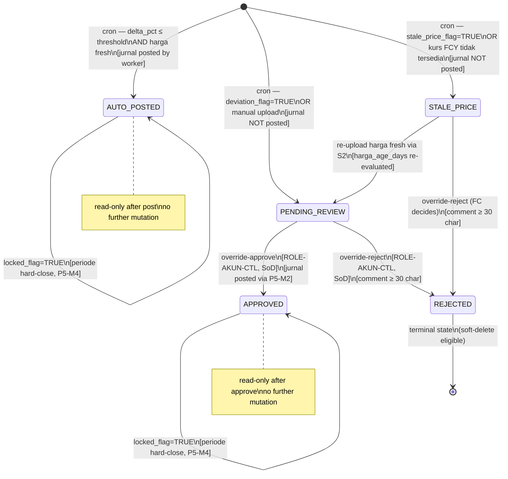

# P5-M6 MTM Daily — State Machine + Integration Contract

> Scope: `trx.mtm.status` workflow + MTM cron (Asynq) + price-deviation + STALE_PRICE + override SoD + jurnal routing.
> Companion to `api/openapi/app-b-mtm.yaml` and `docs/stories/phase-5/P5-M6-mtm-daily.md`.

---

## 1. Entities

### 1.1 `trx.mtm` columns relevant to state machine

| Col | Type | Notes |
|---|---|---|
| `status` | TEXT CHECK | AUTO_POSTED / PENDING_REVIEW / APPROVED / REJECTED / STALE_PRICE |
| `stale_price_flag` | BOOLEAN | TRUE when harga_age_days > MTM_PRICE_STALE_DAYS |
| `deviation_flag` | BOOLEAN | TRUE when ABS(delta_pct) > MTM_PRICE_DEVIATION_THRESHOLD_PCT |
| `locked_flag` | BOOLEAN | TRUE when periode hard-closed; mutations refused |
| `uploader_id` | UUID | NULL for cron auto; user UUID for manual upload |
| `override_approver_id` | UUID | NULL until override-approve or override-reject |
| `override_comment` | TEXT | Wajib ≥ 30 char when status=REJECTED (DB constraint) |
| `override_at` | TIMESTAMPTZ | Set when override-approve or override-reject |
| `jurnal_entry_id` | UUID | FK jrnl.jurnal_entry; NULL until posted |
| `jurnal_event_code` | VARCHAR(50) | Last event code posted (primary; FVOCI_DEBT FCY has two — serialised array in after_jsonb) |
| `upload_batch_id` | UUID | FK sys.upload_batch; NULL for cron auto rows |
| `cron_job_id` | TEXT | Asynq job ID of cron run that generated this row |

---

## 2. State machine — `trx.mtm.status`



### 2.1 Transition table

| From | Trigger / Action | To | Actor | Pre-conditions | Side effects (in-transaction) |
|---|---|---|---|---|---|
| — | Cron: delta_pct ≤ threshold AND harga fresh AND status_periode=OPEN | AUTO_POSTED | System (Asynq worker) | holiday check pass; kurs APPROVED for FCY | INSERT trx.mtm; POST P5-M2 jurnal; audit MTM.AUTO_POSTED |
| — | Cron: ABS(delta_pct) > threshold | PENDING_REVIEW | System (Asynq worker) | Same cron pre-cond | INSERT trx.mtm deviation_flag=TRUE; audit MTM.PENDING_REVIEW; notify ROLE-AKUN-CTL |
| — | Cron: harga_age_days > MTM_PRICE_STALE_DAYS OR kurs FCY unavailable | STALE_PRICE | System (Asynq worker) | Same cron pre-cond | INSERT trx.mtm stale_price_flag=TRUE; audit MTM.STALE_PRICE_ALERT; notify ROLE-AKUN-CTL |
| — | Manual upload (POST /trx/mtm/upload/batch) | PENDING_REVIEW | ROLE-AKUN (Maker) | Idempotency-Key; periode OPEN; instrumen ACTIVE non-AC; kurs APPROVED for FCY | INSERT trx.mtm; INSERT sys.upload_batch; audit MTM.UPLOADED; notify ROLE-AKUN-CTL |
| PENDING_REVIEW | override-approve (POST /trx/mtm/{id}/override-approve) | APPROVED | ROLE-AKUN-CTL | SoD: override_approver_id ≠ uploader_id; locked_flag=FALSE; Idempotency-Key | UPDATE status=APPROVED; POST P5-M2 jurnal; audit MTM.OVERRIDE_APPROVED; notify uploader |
| STALE_PRICE | override-approve (only after re-upload provides fresh harga) | APPROVED | ROLE-AKUN-CTL | Row must be re-uploaded first → status becomes PENDING_REVIEW; then approve | Same as PENDING_REVIEW → APPROVED |
| PENDING_REVIEW | override-reject (POST /trx/mtm/{id}/override-reject) | REJECTED | ROLE-AKUN-CTL | SoD; comment ≥ 30 char; locked_flag=FALSE | UPDATE status=REJECTED; audit MTM.OVERRIDE_REJECTED; notify uploader |
| STALE_PRICE | override-reject | REJECTED | ROLE-AKUN-CTL | SoD; comment ≥ 30 char; locked_flag=FALSE | Same as PENDING_REVIEW → REJECTED |
| AUTO_POSTED or APPROVED | Periode hard-close fires (P5-M4 hook) | same status + locked_flag=TRUE | System (P5-M4 closeflow) | periode tanggal_akhir covers tanggal_mtm | UPDATE locked_flag=TRUE; audit MTM.LOCKED_BY_PERIODE_CLOSE (from P5-M4 tx) |
| locked state | Periode reopen fires (P5-M4 hook) | same status + locked_flag=FALSE | System (P5-M4 closeflow) | reopen approved | UPDATE locked_flag=FALSE; audit MTM.UNLOCKED_BY_PERIODE_REOPEN |

### 2.2 Invariants

- Only ONE AUTO_POSTED or APPROVED row per `(instrumen_id, tanggal_mtm)` per DB partial unique index.
- REJECTED rows are terminal; new INSERT for same (instrumen_id, tanggal_mtm, harga_sumber) allowed if previous status=REJECTED.
- `locked_flag=TRUE` → UPDATE/DELETE refused → 423 MTM_PERIODE_LOCKED (app layer) + `tg_mtm_locked_check` trigger (DB layer defence-in-depth).
- `status=REJECTED` → `override_comment IS NOT NULL AND length(override_comment) >= 30` (DB constraint `chk_mtm_override_comment`).
- `override_approver_id ≠ uploader_id` enforced at app service layer (primary) and `chk_mtm_sod` DB constraint (secondary). Advisory audit `MTM.OVERRIDE_REJECTED_SOD` on violation.
- AC instrumen (`klasifikasi_psak71='AC'`) → NEVER inserted into trx.mtm. `resolveJurnalEventCode` returns `ErrMTMInstrumenACSkip`.

---

## 3. MTM Daily Cron Worker (Asynq)

### 3.1 Schedule

- Cron: `"0 11 * * 1-5"` (18:00 WIB = 11:00 UTC, Senin–Jumat)
- Skip if `tanggal_hari_ini ∈ sys.holiday_calendar` (ISODOW check + holiday_calendar lookup)
- Cache `sys.holiday_calendar` per year in Redis TTL 24 jam (mirror P5-M5 pattern)
- Task name: `trx:mtm_daily_run`
- Manual trigger: `POST /trx/mtm/cron/trigger` (ROLE-IT-ADMIN only)

### 3.2 Worker flow

```
1. Read sys.config_param: MTM_PRICE_DEVIATION_THRESHOLD_PCT (default 5.0), MTM_PRICE_STALE_DAYS (default 5)
2. Check sys.holiday_calendar for today → if holiday: log MTM.HOLIDAY_SKIP (advisory), exit 0
3. SELECT mst.instrumen WHERE status='ACTIVE' AND klasifikasi_psak71 IN ('FVOCI_DEBT','FVTPL','FVOCI_ELECTION','POCI') AND deleted_at IS NULL
4. Publish job progress Phase 1 via sys.job + Redis pub/sub (SSE)

For each instrument (per-instrument transaction, NOT one giant tx):

  a. Idempotency check: SELECT id FROM trx.mtm WHERE instrumen_id=? AND tanggal_mtm=today AND harga_sumber=expected_sumber AND status != 'REJECTED' → SKIP if exists

  b. Fetch price from feed staging:
     IBPA (bond)     → SELECT FROM sys.ibpa_feed_staging WHERE instrumen_id=? ORDER BY tanggal_harga DESC LIMIT 1
     BEI  (equity)   → SELECT FROM sys.bei_feed_staging  WHERE instrumen_id=? ORDER BY tanggal_harga DESC LIMIT 1
     KSEI (reksadana)→ SELECT FROM sys.ksei_feed_staging WHERE instrumen_id=? ORDER BY tanggal_harga DESC LIMIT 1

  c. If price not found: harga_age_days = 999 → stale_price_flag=TRUE → status=STALE_PRICE → stalePriceReason=HARGA_TIDAK_TERSEDIA

  d. Compute harga_age_days = tanggal_mtm − harga_tanggal
     If harga_age_days > MTM_PRICE_STALE_DAYS → stale_price_flag=TRUE

  e. FCY instrument: harga_pasar_idr = harga_pasar_fcy × kurs_tengah (mst.kurs APPROVED tanggal_mtm)
     If kurs NOT available → stale_price_flag=TRUE → stalePriceReason=KURS_FCY_TIDAK_TERSEDIA
     Call P5-M5 GET /master/kurs/treatment/{instrumen_id} for FX routing (cached per run)

  f. delta_idr = harga_pasar_idr − harga_buku_idr
     delta_pct  = (delta_idr / harga_buku_idr) × 100
     NOTE: harga_buku_idr for Stage 3 FVTPL instruments = Net Carrying (Gross − ECL), not Gross.
           ecl-eir-engineer must confirm trx.penempatan.saldo_buku reflects ECL deduction.

  g. Decision tree:
     stale_price_flag=TRUE     → status=STALE_PRICE, jurnal=nil
     ABS(delta_pct) > threshold → deviation_flag=TRUE, status=PENDING_REVIEW, jurnal=nil
     else                      → status=AUTO_POSTED

  h. INSERT trx.mtm (in separate per-instrument transaction)

  i. If status=AUTO_POSTED:
       event_codes = resolveJurnalEventCode(instrument, kurs_available)
       For each event_code: POST P5-M2 /api/v1/jurnal/post-entry
       UPDATE trx.mtm SET jurnal_entry_id, jurnal_event_code

  j. INSERT aud.audit_log (action per status) — in same per-instrument transaction

  k. Publish progress Phase 2 update

  l. On per-instrument error: log error, continue to next (partial run acceptable)
     Increment error_count

5. After loop:
   If error_count > 0:
     INSERT sys.dead_letter_queue (job_type='mtm_daily_run', tanggal=today, error_count, instrument_errors[])
     INSERT aud.audit_log action=MTM.CRON_FAILED (advisory)
     Alert ROLE-IT-ADMIN + ROLE-AKUN-CTL

6. Notify ROLE-AKUN-CTL summary: "{auto_posted} auto-posted, {pending_review} pending review, {stale} stale, {ac_skip} AC skipped."
7. Complete job: sys.job status=completed
```

### 3.3 Holiday calendar

- Table: `sys.holiday_calendar` (migration 000039, P5-M5)
- Worker: `ISODOW check (6=Sat, 7=Sun) || EXISTS (SELECT 1 FROM sys.holiday_calendar WHERE tanggal = today)`
- Advisory log `MTM.HOLIDAY_SKIP` when skipped
- ROLE-IT-ADMIN can override via `POST /trx/mtm/cron/trigger` with `tanggalTarget` (forced run on holiday not recommended)

### 3.4 Retry and DLQ

- Per-instrument errors: continue loop, log to error_count. After loop → single DLQ entry.
- Catastrophic failure (DB down, all fetch fail): Asynq retry 3× interval 15 menit.
- After 3 retry exhausted: INSERT `sys.dead_letter_queue` + alert ROLE-IT-ADMIN + ROLE-AKUN-CTL.
- DLQ payload: `{job_type: "mtm_daily_run", tanggal: date, instrument_errors: [{instrumen_id, error}], error_count: N}`.

### 3.5 Progress reporting (UX §3)

- `sys.job` persisted (not Redis-only). Redis pub/sub for SSE live stream.
- Phases:
  - 0%: "Membaca konfigurasi threshold dan daftar instrumen aktif non-AC..."
  - 5%: "Ditemukan {N} instrumen untuk diproses. Mulai perhitungan MTM..."
  - 5-90%: "Menghitung MTM instrumen {i} dari {N}: {kode_instrumen}" (update setiap 1% atau setiap 10 instrumen)
  - 90%: "Posting jurnal AUTO_POSTED ({X} transaksi via P5-M2)..."
  - 100% complete: "{auto_posted} auto-posted, {pending} pending review, {stale} stale price, {ac_skip} AC skipped."
- On failure: `status=failed`, error_jsonb persisted in sys.job.

### 3.6 Performance SLA

| Operation | Target | Notes |
|---|---|---|
| Full MTM cron (1000 instrumen) | Wall-clock ≤ 5 menit | Per-instrument tx, parallel if goroutine pool |
| Per-instrument compute | ≤ 300ms | Feed staging lookup + kurs lookup + insert + audit |
| Jurnal engine call per AUTO_POSTED | ≤ 200ms | P5-M2 POST /jurnal/post-entry |
| Manual trigger enqueue | ≤ 200ms | Enqueue only, worker async |

---

## 4. Price validation rules

### 4.1 Deviation threshold (sys.config_param MTM_PRICE_DEVIATION_THRESHOLD_PCT)

| Parameter | Default | Type | Range |
|---|---|---|---|
| `MTM_PRICE_DEVIATION_THRESHOLD_PCT` | 5.0 | DECIMAL | [0.01, 100.0] |

- If `ABS(delta_pct) > MTM_PRICE_DEVIATION_THRESHOLD_PCT` → `deviation_flag=TRUE`, `status=PENDING_REVIEW`
- Configurable via ROLE-IT-ADMIN `PATCH /sys/config/MTM_PRICE_DEVIATION_THRESHOLD_PCT` (S3-AC4 pattern)
- Change takes effect on next MTM cron run (no restart required — config read per run)
- Audit: `SYS_CONFIG.UPDATED` in-transaction when config changed

### 4.2 Stale price threshold (sys.config_param MTM_PRICE_STALE_DAYS)

| Parameter | Default | Type | Range |
|---|---|---|---|
| `MTM_PRICE_STALE_DAYS` | 5 | INTEGER | [1, 30] |
| `MTM_STALE_ESCALATION_DAYS` | 7 | INTEGER | [MTM_PRICE_STALE_DAYS+1, 60] |

- If `harga_age_days > MTM_PRICE_STALE_DAYS` → `stale_price_flag=TRUE`, `status=STALE_PRICE`
- If `harga_age_days > MTM_STALE_ESCALATION_DAYS` → additional notify to ROLE-RISK (escalation)
- If kurs FCY not APPROVED for tanggal_mtm → `stale_price_flag=TRUE`, `stalePriceReason=KURS_FCY_TIDAK_TERSEDIA`

### 4.3 Manual upload validation rules table

| Field | Rule | Error Code | Message |
|---|---|---|---|
| `kode_instrumen` | required, exists in mst.instrumen ACTIVE | `VALIDATION_FAILED` | "kode_instrumen tidak ditemukan atau tidak aktif" |
| `kode_instrumen` | klasifikasi_psak71 NOT IN ('AC') | `MTM_INSTRUMEN_AC_SKIP` | "{kode} berklasifikasi AC — tidak ada MTM untuk AC per PSAK 71" |
| `tanggal_mtm` | required, DATE format YYYY-MM-DD | `VALIDATION_FAILED` | "tanggal_mtm wajib format YYYY-MM-DD" |
| `tanggal_mtm` | within periode_buku OPEN | `MTM_PERIODE_LOCKED` | "Periode {kode} sudah hard-closed" |
| `harga_pasar` | required, > 0, max 8 decimal places | `VALIDATION_FAILED` | "harga_pasar harus > 0" |
| `harga_sumber` | IN ('IBPA','BEI','KSEI','MANUAL','IBPA_MANUAL','BEI_MANUAL') | `VALIDATION_FAILED` | "harga_sumber tidak valid" |
| `(instrumen_id, tanggal_mtm, harga_sumber)` | unique (status NOT IN ('REJECTED')) | `CONFLICT` | "Sudah ada MTM dengan status {status} untuk kombinasi ini" |
| kurs FCY | kurs APPROVED tanggal_mtm tersedia jika instrumen FCY | `MTM_PRICE_STALE` | "Kurs {currency} {tanggal} belum APPROVED. Upload via P5-M5 terlebih dahulu" |

---

## 5. Jurnal routing per klasifikasi PSAK 71 (S5 — ifrs9-compliance-reviewer BLOCKING)

### 5.1 `resolveJurnalEventCode(instrument, kurs_available)` — Go signature

```go
// internal/trx/mtm/routing.go
// BLOCKING: setiap perubahan logic routing WAJIB ifrs9-compliance-reviewer GATE.
func resolveJurnalEventCode(inst mst.Instrumen, kursAvailable bool) ([]string, error) {
    if inst.KlasifikasiPSAK71 == "AC" {
        return nil, ErrMTMInstrumenACSkip  // 422 MTM_INSTRUMEN_AC_SKIP
    }
    var codes []string
    switch inst.KlasifikasiPSAK71 {
    case "FVOCI_DEBT":
        codes = append(codes, "MTM_FVOCI")
        if inst.MataUang != "IDR" && kursAvailable {
            codes = append(codes, "MTM_FX_OCI_RESERVE")  // §B5.7.2A — terpisah dari MTM delta
        }
    case "FVOCI_ELECTION":
        codes = append(codes, "MTM_FVOCI_ELECTION")
        // No P&L recycling on disposal — irrevocable per PSAK 71 §5.7.5
    case "FVTPL":
        codes = append(codes, "MTM_FVTPL")
    case "POCI":
        codes = append(codes, "MTM_FVTPL_POCI")
        // Credit-adjusted EIR; no Stage escalation from MTM row
    default:
        return nil, ErrUnknownKlasifikasi
    }
    return codes, nil
}
```

### 5.2 Routing matrix

| Klasifikasi PSAK 71 | Mata Uang | Event Code(s) | Akun Target | PSAK 71 Ref | Notes |
|---|---|---|---|---|---|
| `FVOCI_DEBT` | IDR | `MTM_FVOCI` | Aset Investasi FVOCI → OCI Perubahan Nilai Wajar | §5.7.10 | Single jurnal |
| `FVOCI_DEBT` | FCY | `MTM_FVOCI` + `MTM_FX_OCI_RESERVE` | Idem + OCI FX Reserve → Selisih Kurs OCI | §5.7.10 + §B5.7.2A | Dua jurnal TERPISAH — MTM delta (ex-FX) ke OCI + FX component ke OCI FX Reserve |
| `FVOCI_ELECTION` | IDR/FCY | `MTM_FVOCI_ELECTION` | Aset FVOCI Ekuitas → OCI Ekuitas | §5.7.5 | Tidak ada P&L recycling on disposal (irrevocable) |
| `FVTPL` | IDR/FCY | `MTM_FVTPL` | Aset Investasi FVTPL → P&L Keuntungan/Kerugian Fair Value | §5.7.7 | Semua perubahan fair value ke P&L |
| `AC` | Any | **SKIP** (ErrMTMInstrumenACSkip) | — | — | Amortised cost — tidak ada MTM |
| `POCI` | IDR/FCY | `MTM_FVTPL_POCI` | Aset POCI → P&L POCI Fair Value | — | Credit-adjusted; Stage tidak berlaku; ECL dari APP-C independent |

### 5.3 FX treatment (P5-M5 routing consumed by S5)

Call `GET /api/v1/master/kurs/treatment/{instrumen_id}` before posting FX component.
Result cached per instrumen per cron run (avoid N+1 calls).

| Klasifikasi | Mata Uang | FX Treatment (from P5-M5) | Jurnal Event |
|---|---|---|---|
| FVOCI_DEBT | FCY | OCI_FOREIGN_EXCHANGE_RESERVE | MTM_FX_OCI_RESERVE |
| FVOCI_ELECTION | FCY | OCI_FOREIGN_EXCHANGE_RESERVE_NO_RECYCLING | Included in MTM_FVOCI_ELECTION |
| FVTPL | FCY | P&L_FOREIGN_EXCHANGE | Included in MTM_FVTPL |
| POCI | FCY | P&L_FOREIGN_EXCHANGE | Included in MTM_FVTPL_POCI |
| Any | IDR | NO_FX_TREATMENT | — |

### 5.4 Compliance checklist (for ifrs9-compliance-reviewer)

- [ ] `FVOCI_DEBT IDR` → `MTM_FVOCI` only (OCI). No FX entry because IDR.
- [ ] `FVOCI_DEBT FCY` → `MTM_FVOCI` + `MTM_FX_OCI_RESERVE` — TWO separate journal entries per §B5.7.2A: MTM delta (pure fair value change ex-FX) to OCI; FX component to OCI FX Reserve (NOT P&L).
- [ ] `FVOCI_ELECTION` → `MTM_FVOCI_ELECTION` only (OCI equity). No P&L. No recycling on disposal (§5.7.5 irrevocable). Any FCY component also goes to OCI (no separate FX P&L for FVOCI_ELECTION).
- [ ] `FVTPL` → `MTM_FVTPL` (P&L — all changes including FX in P&L per §5.7.7).
- [ ] `AC` → SKIP — no MTM. Fair value changes not recognized under amortised cost.
- [ ] `POCI` → `MTM_FVTPL_POCI` (P&L). Credit-adjusted EIR already reflects PD adjustment. MTM fair value change recognized separately from ECL movement (APP-C). No Stage escalation from MTM row.
- [ ] All 5 event codes must exist in P5-M2 mst.mapping_jurnal with APPROVED status BEFORE cron runs.
- [ ] OQ-M6-2 confirmed: FVOCI_DEBT FCY → two SEPARATE journal entries (not one combined entry).
- [ ] OQ-M6-1 confirmed: POCI MTM and ECL from APP-C are INDEPENDENT (no double-count).
- [ ] OQ-M6-4: override-approve for STALE_PRICE row requires re-upload first to make it PENDING_REVIEW with fresh harga_pasar. Cannot approve STALE_PRICE directly.

---

## 6. Periode lock cascade (P5-M4 → P5-M6 contract)

### 6.1 On hard-close approve (`PERIODE.HARD_CLOSED`)

- P5-M4 `ApproveHardClose` calls `closeflow → mtm.LockMtmForPeriode(ctx, tx, periode_id)` in SAME transaction
- `mtm.LockMtmForPeriode` executes:
  ```sql
  UPDATE trx.mtm
  SET locked_flag = TRUE, updated_at = now(), updated_by = actor_id
  WHERE instrumen_id IN (SELECT id FROM mst.instrumen WHERE tenant_id = $tenant)
    AND tanggal_mtm BETWEEN periode.tanggal_mulai AND periode.tanggal_akhir
    AND tenant_id = $tenant
    AND deleted_at IS NULL
  ```
- Writes audit `MTM.LOCKED_BY_PERIODE_CLOSE` (single bulk row with count) in same tx

### 6.2 On reopen approve (CLOSED → SOFT_CLOSED)

- Symmetric `mtm.UnlockMtmForPeriode` in same P5-M4 tx
- Audit `MTM.UNLOCKED_BY_PERIODE_REOPEN`

### 6.3 Enforcement

- App-layer: `MtmLockMiddleware` checks `locked_flag` before any mutation endpoint; raises `ErrMtmPeriodeLocked` (423 MTM_PERIODE_LOCKED)
- DB-layer: trigger `tg_mtm_locked_check BEFORE UPDATE OR DELETE ON trx.mtm` (migration 000040) → RAISE EXCEPTION if `OLD.locked_flag = TRUE`

---

## 7. Error catalog (6 new codes)

| Code | HTTP | Trigger | AC traceability |
|---|---|---|---|
| `MTM_PRICE_STALE` | 422 | `stale_price_flag=TRUE`; jurnal tidak bisa diposting otomatis; feed harga atau kurs FCY tidak tersedia | S1-AC3, S3-AC3, S2 validation |
| `MTM_PRICE_DEVIATION_REJECTED` | 422 | Informational code — digunakan dalam notifikasi uploader saat override-reject baris dengan `deviation_flag=TRUE`; bukan HTTP response dari reject endpoint (yang return 200) | S4-AC2 notif |
| `MTM_BATCH_NOT_FOUND` | 404 | `upload_batch_id` tidak ditemukan di sys.upload_batch scope MTM_UPLOAD | S2 GET /batch/{id} |
| `MTM_OVERRIDE_SOD_VIOLATION` | 403 | `override_approver_id = uploader_id` — SoD violation saat override-approve/reject; `details` berisi `uploader_id` untuk tracing | S4-AC3 |
| `MTM_INSTRUMEN_AC_SKIP` | 422 | Instrumen berklasifikasi AC dimasukkan ke manual upload MTM | S2-AC2, S5-AC3 |
| `MTM_PERIODE_LOCKED` | 423 | Mutasi `trx.mtm` untuk periode yang sudah hard-closed (`locked_flag=TRUE`); mirror `FX_RATE_LOCKED` pattern P5-M5 | S2-AC3, S4 locked |

---

## 8. Audit events

| Event | Action string | When | In-tx? | after_jsonb key fields |
|---|---|---|---|---|
| Cron auto-post | `MTM.AUTO_POSTED` | Row status=AUTO_POSTED + jurnal posted | YES | instrumen_id, tanggal_mtm, delta_idr, delta_pct, jurnal_entry_id, event_codes |
| Cron deviation | `MTM.PENDING_REVIEW` | Row status=PENDING_REVIEW (deviation) | YES | instrumen_id, delta_pct, threshold_pct |
| Cron stale | `MTM.STALE_PRICE_ALERT` | Row status=STALE_PRICE | YES | instrumen_id, harga_tanggal, harga_age_days, threshold_days, reason |
| Manual upload | `MTM.UPLOADED` | POST /trx/mtm/upload/batch per valid row | YES | instrumen_id, tanggal_mtm, harga_pasar, harga_sumber, upload_batch_id, deviation_flag |
| Override approve | `MTM.OVERRIDE_APPROVED` | POST /trx/mtm/{id}/override-approve | YES | instrumen_id, override_approver_id, jurnal_entry_id, event_codes, comment |
| Override reject | `MTM.OVERRIDE_REJECTED` | POST /trx/mtm/{id}/override-reject | YES | instrumen_id, override_approver_id, comment |
| SoD advisory | `MTM.OVERRIDE_REJECTED_SOD` | SoD violation attempt | advisory | actor_id, uploader_id, mtm_id |
| AC skip | `MTM.INSTRUMEN_AC_SKIP` | Cron skips AC instruments | advisory (batch per run, NOT per instrumen) | count_ac_skipped, run_date |
| Holiday skip | `MTM.HOLIDAY_SKIP` | Cron skips holiday | advisory | tanggal, nama_libur |
| Cron failed | `MTM.CRON_FAILED` | DLQ after 3 retry | advisory + DLQ | error_count, dlq_id |
| Export | `MTM.EXPORT` | GET /trx/mtm?export= | YES | format, row_count, filters, filename |
| Locked | `MTM.LOCKED_BY_PERIODE_CLOSE` | P5-M4 hard-close hook | YES (in P5-M4 tx) | count_locked, periode_id |
| Unlocked | `MTM.UNLOCKED_BY_PERIODE_REOPEN` | P5-M4 reopen hook | YES (in P5-M4 tx) | count_unlocked, periode_id |

All in-tx audit writes use `aud.audit_log` with hash chain (DEC-018). Advisory events use best-effort write (separate tx, not blocking).

---

## 9. Hand-off notes

### data-modeler (migration 000040 + 000041)

**000040 `trx.mtm`:**
- CREATE TABLE `trx.mtm` (partition RANGE by tanggal_mtm monthly, mirror trx.transaction pattern)
- Columns per §Schema P5-M6 in stories doc + `locked_flag BOOLEAN NOT NULL DEFAULT FALSE`
- CHECK constraints:
  - `chk_mtm_status CHECK (status IN ('AUTO_POSTED','PENDING_REVIEW','APPROVED','REJECTED','STALE_PRICE'))`
  - `chk_mtm_override_comment CHECK (status != 'REJECTED' OR (override_comment IS NOT NULL AND length(override_comment) >= 30))`
  - `chk_mtm_sod CHECK (override_approver_id IS NULL OR override_approver_id != uploader_id)`
  - `chk_mtm_harga_sumber CHECK (harga_sumber IN ('IBPA','BEI','KSEI','MANUAL','IBPA_MANUAL','BEI_MANUAL'))`
- Partial UNIQUE index: `(instrumen_id, tanggal_mtm, harga_sumber) WHERE status IN ('AUTO_POSTED','APPROVED') AND deleted_at IS NULL`
- Indexes: `idx_mtm_instrumen_tanggal`, `idx_mtm_status`, `idx_mtm_stale_flag`, `idx_mtm_deviation_flag`, `idx_mtm_periode`, `idx_mtm_upload_batch_id`, `idx_mtm_locked_flag`
- FK: `instrumen_id → mst.instrumen(id)`, `upload_batch_id → sys.upload_batch(id)`, `override_approver_id → sec.user(id)`, `uploader_id → sec.user(id)`, `kurs_id → mst.kurs(id)`
- DB trigger: `tg_mtm_locked_check` (mirror `fn_kurs_locked_check` from migration 000039)
- DB trigger: `trg_set_updated_at`, `trg_increment_row_version` (standard audit triggers)
- Seed `sys.config_param`: `MTM_PRICE_DEVIATION_THRESHOLD_PCT=5.0`, `MTM_PRICE_STALE_DAYS=5`, `MTM_CRON_SCHEDULE=0 11 * * 1-5`, `MTM_STALE_ESCALATION_DAYS=7`

**000041 `sys.upload_batch` alignment + mst.mapping_jurnal seed:**
- `sys.upload_batch` already exists (migration 000001). `sys.upload_batch_row` also exists.
- **CONFLICT NOTE**: migration 000001 `ck_batch_type` CHECK includes `'MTM_UPLOAD'` (not `'MTM'`). Stories doc mentions `'MTM'`. **Resolution: Use `'MTM_UPLOAD'` (existing value) for `batch_type` in trx.mtm upload flow.** `upload_batch_id` FK to `sys.upload_batch(id)` can be added in 000040 since table already exists.
- Migration 000041 adds FK constraint `fk_mtm_upload_batch` if not added in 000040 (prefer adding in 000040).
- Seed `mst.mapping_jurnal` event codes (5 placeholder rows, akun debit/kredit NULL — to be filled via P5-M2 workflow):
  - `MTM_FVOCI`, `MTM_FVTPL`, `MTM_FVOCI_ELECTION`, `MTM_FX_OCI_RESERVE`, `MTM_FVTPL_POCI`
  - Use `INSERT ... ON CONFLICT (event_code) DO NOTHING` for idempotency
  - Status: `'DRAFT'` (pending P5-M2 review for account codes)

### backend-engineer-go

- Package: `backend/internal/trx/mtm/` — service, repo, handler, routes, worker
- Worker: `trx:mtm_daily_run` (Asynq cron) + Goroutine pool for parallel per-instrument compute (pool size configurable via sys.config)
- Service methods: `RunDailyMtm`, `UploadBatch`, `OverrideApprove`, `OverrideReject`, `LockMtmForPeriode`, `UnlockMtmForPeriode`, `GetList`, `GetDetail`, `GetUploadBatch`, `TriggerCron`, `GetStalePriceAlerts`
- `LockMtmForPeriode` / `UnlockMtmForPeriode` exported for P5-M4 closeflow (accept `*sql.Tx`)
- `resolveJurnalEventCode` in `routing.go` — isolated, unit-tested to 100%, **MUST NOT be changed without ifrs9-compliance-reviewer approval**
- Permission keys: `mtm.read`, `mtm.create`, `mtm.override`, `mtm.trigger`, `mtm.export`
- SoD: `override_approver_id ≠ uploader_id` checked at service layer BEFORE DB write
- MtmLockMiddleware: checks `locked_flag` from DB; reject 423 MTM_PERIODE_LOCKED
- Cron TZ: verify Docker/K8s env `TZ=Asia/Jakarta` for `"0 11 * * 1-5"` = 18:00 WIB
- Coverage target ≥ 85%; routing.go ≥ 100%

### ecl-eir-engineer (cross-check advisory)

- Confirm `harga_buku_idr` for Stage 3 FVTPL instruments = Net Carrying (Gross − ECL provisioned)
- Confirm `MTM_FVTPL_POCI` does NOT double-count ECL movement from APP-C
  (ECL movement via `ecl.ecl_calc_result_line` is separate from MTM fair value via `trx.mtm`)
- Provide column name in `trx.penempatan` for current book value (OQ-M6-6: `saldo_unit × harga_buku_per_unit` or similar — confirm exact field)

### integration-engineer

- IBPA/BEI/KSEI real feed adapters: DEFERRED (Phase 5 M3+ scope). MTM cron reads from staging tables `sys.ibpa_feed_staging`, `sys.bei_feed_staging`, `sys.ksei_feed_staging` which are populated by M3 feed jobs.
- Verify staging table schemas include: `instrumen_id UUID`, `harga_pasar NUMERIC(20,8)`, `harga_tanggal DATE`, `mata_uang CHAR(3)` per M3 contract.

### frontend-engineer-nextjs

- Routes: `/trx/mtm` (list DataTable), `/trx/mtm/{id}` (detail), `/trx/mtm/upload` (form), `/trx/mtm/alerts/stale-price` (monitoring dashboard)
- Components:
  - `MtmStatusBadge` (5-state: AUTO_POSTED/PENDING_REVIEW/APPROVED/REJECTED/STALE_PRICE + icons)
  - `MtmDeviationBadge` (warning amber jika deviation_flag=TRUE)
  - `MtmStaleBadge` (warning amber + escalation merah jika eskalasiFlag=TRUE)
  - `MtmUploadDropzone` (XLSX/CSV multipart form, preview parse result)
  - `MtmOverrideApproveDialog` (comment input ≥ 30 char, signature method)
  - `MtmOverrideRejectDialog` (comment input ≥ 30 char, destructive confirm)
  - `MtmCronTriggerButton` (ROLE-IT-ADMIN only, JobProgressPanel wrapper)
  - `MtmStalePriceAlertPanel` (GET /alerts/stale-price DataTable + badge per eskalasiFlag)
- Notif copy (Bahasa Indonesia, per UX §2):
  - Override approve sukses: "Override MTM {kode} {tanggal} disetujui. Jurnal {event_codes} berhasil diposting."
  - Override reject sukses: "Override MTM {kode} {tanggal} ditolak. ROLE-AKUN telah dinotifikasi."
  - Upload sukses: "{N} MTM berhasil di-upload untuk {tanggal}. Status: Menunggu approval Finance Controller."
  - SoD violation: "Anda tidak dapat meng-approve MTM yang Anda upload sendiri. SoD: approver ≠ uploader."

### qa-engineer

- E2E scenarios for all 20 AC IDs
- SoD test: Maker ROLE-AKUN attempts override-approve via API directly (bypass UI)
- Idempotency test: replay same Idempotency-Key → 200 IDEMPOTENCY_REPLAY
- Cron integration test: mock feed staging tables; verify per-instrument tx isolation (one fail does not rollback others)
- Perf benchmark: 1000-instrument cron run wall-clock ≤ 5 minutes
- Compliance smoke: verify resolveJurnalEventCode returns correct codes for each AC in S5
- UAT script: Bahasa Indonesia Given/When/Then + SQL verification queries

### ifrs9-compliance-reviewer (BLOCKING gate — S5)

Review routing matrix before backend implementation of `routing.go`. See checklist §5.4 above.
Verify OQ-M6-2 (two separate journals for FVOCI_DEBT FCY) and OQ-M6-1 (POCI no double-count).
Sign off on AC skip logic (no edge case where AC has recognizable fair value change per PSAK 71).
